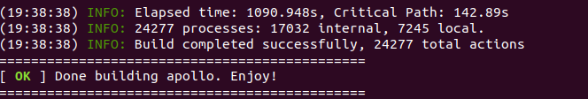

# 基础知识介绍和驱动配置

## 0 Apollo系统的基础介绍

### 0.1 Apollo 的容器建立、进入和编译

*该部分是使用Apollo docker系统的简单介绍，如果熟悉docker的读者可以直接跳过。*

Apollo docker的使用和建立都相对复杂，但是官方已经为我们生成了便捷的脚本文件，因此这里主要来介绍：如何使用脚本，根据已经下载好的Apollo镜像创建一个新的容器；以及，如何进入容器中，并对Apollo系统进行编译。

为了便于表达，我们默认一般指令都在docker内部执行，所有docker外部执行（本地shell执行）的指令都会额外使用**粗体字**进行加粗提示。

#### 0.1.1 使用Apollo镜像建立一个容器

+ **Docker 镜像**：Docker 镜像就是一个模板，可以用来创建 Docker 容器。Apollo官方将所有环境和依赖集成到了这个镜像中，使其不必在本地环境中对库做任何形式的修改。

+ **Docker 容器**：Docker利用容器来运行应用。容器是从镜像创建的运行实例。它可以被启动、开始、停止、删除。每个容器都是相互隔离的，保证安全的平台。镜像是唯一的，但是容器可以有多个。

+ 在apollo目录下，使用下述命令**在本地shell**可以建立一个名为`apollo_dev_{用户名}`的容器：

  ```bash
  bash docker/scripts/dev_start.sh -l
  ```

  当指令后有`-l`参数时，表示启动本地镜像对容器进行构建；当不带`-l`参数时，系统将对镜像进行更新检查（需要联网），然后创建新的容器。由于后者时间较长，因此一般带参数`-l`。

  新生成的容器一般通过tag进行区分（即容器名：`apollo_dev_{用户名}`），如果新容器与旧容器相同，那么新容器将不带任何警告的对旧容器进行覆盖。

#### 0.1.2 进入容器的两种方法

创建容器后，每次开关机将默认关闭。因此需要首先开启容器。容器开启有两种方式：

1. 直接生成一个纯净的新容器，避免之前的操作对系统进行污染，**本地shell**的操作指令为：

   ```bash
   bash docker/scripts/dev_start.sh -l # 从本地镜像生成一个新的容器对原先容器进行覆盖
   bash docker/scripts/dev_into.sh # 进入容器
   ```

2. 继承上次启动的容器。**本地shell**的操作指令为：

   ```bash
   docker start apollo_dev_{用户名} # 继承上次使用的容器
   bash docker/scripts/dev_into.sh # 进入容器
   ```

   此外，如果初学者对docker镜像、容器管理并不熟悉，也可以使用对应的docker 管理工具，如`Portainer`进行可视化的查看分析。

下图是进入apollo容器的展示：


#### 0.1.3 编译Apollo系统的几种方式

Apollo系统具有多种编译方式，如下：

```bash
# apollo docker内部
bash apollo.sh build
bash apollo.sh build_cpu
bash apollo.sh build_opt
bash apollo.sh build_gpu
```

考虑到运行效率，将优先推荐使用`build_opt`操作，在部分程序中，优化方式进行编译比非优化方式进行编译运行速度相差十几倍。

此外，如果对单个模块进行修改，不必要对所有代码进行编译，只需要对带个模块进行修改即可，如下：

```bash
bash apollo.sh build_opt localization
```

下图为编译成功的情况展示：



当编译因为某些原因进行重新处理时，可以删除隐藏文件夹`.cache`；如果不想重新下载库文件，则可以只删除`.cache/build`文件夹。

### 0.2 各个模块的启动顺序

本文档将以record数据包及线下课程实际传感器输出作为测试数据，指导对各个模块的启动。**各个模块的启动存在依赖关系**，启动顺序应当为：

1. **启动各个传感器部件和控制模块**：包括`Transform`、`lidar`、`GPS`、`camera`、`canbus`等。**注意，播放cyber包时可以跳过该步骤**。
2. **启动定位模块**：包括三种算法（基于RTK的定位，基于NDT的定位，基于MSF的定位），启动后两种需要额外制作地图。，主要功能是实现车辆在地图中的定位。
3. **启动感知模块**：分为给予视觉感知、激光感知、雷达感知和融合感知多个部分，取决于传感器输入。主要功能是获得视野范围内目标物的各种运动和属性信息。
4. **启动预测模块**：依赖与定位模块、感知模块，主要功能是对行人、车辆的运动轨迹进行预测。
5. **启动Routing、Planning模块**：依赖于定位、感知和预测模块、虚拟车道线或者地图。主要功能是设置一个目标点，并规划一条到达目标点和合适路径。
6. **启动Control模块**：和底盘进行通讯，并控制车辆运动。执行该模块需要对车辆进行放权（进入自动驾驶模式）。

### 0.3 DreamView的快捷启动方式

DreamView是Apollo系统中用于可视化和交互界面模块。


由于依靠`Dreamview`的可视化界面上通过点击按钮的方式进行各个传感器启动时，报错和警告信息并不能直观的打印出来，以方便输出调试。因此，下面的各个章节均采用launch或者dag直接启动的方式进行。


同时，为了后续调试的方便，下面也将给出如何设置这些按键的提示。

Apollo系统具有如下机制：

1. 每次启动dreamview并选择车型后，系统自动将`calibration/data/<对应车型名称>`中的参数文件覆盖掉模块中的相对应的文件，如：`/home/chen/apollo/modules/calibration/data/dev_kit_pix_hooke/gnss_conf/gnss_conf.pb.txt`会覆盖位于`/home/chen/apollo/modules/drivers/gnss/conf/gnss_conf.pb.txt`的文件。因此，推荐在`calibration/data`进行参数的修改。**课程中将会提供对应车辆底盘的相关数据**。

2. 每次启动dreamview并选择调试模式后，系统自动将按键与对应的dag相关联，其设置可以在`/apollo/modules/dreamview/conf/hmi_modes/xxxx.pb.txt`中进行修改。其中`xxxx`对应不同的debug模式，在本课程中推荐使用`dev_kit_debug.pb.txt`，`key`对应按键的名称，`dag_files`表示对应的启动文件。

   

   3. 上述文件被修改后需要重启dreamview：`bash scripts/bootstrap.sh restart`

### 0.4 Apollo的调试与Python脚本

#### 0.4.1 日志系统

Apollo的日志系统基于glog进行二次封装，封装目录位于`apollo/cyber/common/log.h`中，包含INFO、WARN、ERROR和FATAL四个等级。程序中通过如下的形式进行输出：

```c++
AINFO << "INFO!";
AWARN << "WARN!";
AERROR << "ERROR!";
AFATAL << "FATAL!";
```

当设置输出时，Log会记录所处的模块名称，所在文件的行数，输出内容等，以供测试者进行调试。

Log输出的目录位于`apollo\data\log`，命名为`<模块名称>.log.INFO.<日期-时间>`，为了便于寻找，最近一次目录将会以`<模块名称>.INFO`为名称形成链接，可以快速查询。

更多使用技巧和方式和glog相差不大，因此可以直接参考glog使用：[Github-glog](https://github.com/google/glog)

#### 0.4.2 参数配置系统

Apollo参数系统基于`gflags`和`yaml-cpp`两种依赖库进行设置，其中，gflags配置大多数参数，而yaml仅仅在内外参数等少数领域被使用。大部分参数可以通过访问对应模块的`xxx.pt.txt`文件或者`.conf`文件进行修改，并且修改过后无需再次编译。

+ gflags使用指导：[gflags官方指南](https://gflags.github.io/gflags/#intro)

+ yaml-cpp使用指导：[Github-yaml](https://github.com/jbeder/yaml-cpp)

#### 0.4.3 Python脚本的使用

为了保持风格统一，在高版本的apollo系统中，Python脚本也被bazel进行统一管理。因此，仅仅使用`python <文件名>`的简单操作无法使用python脚本。我们将一个例子演示在apollo高版本中如何使用python脚本：

Example：执行`modules/tools/vehicle_calibration/data_collector.py`

```bash
./bazel-bin/modules/tools/vehicle_calibration/data_collector
```

此时，修改python文件不需要进行额外的编译操作。

### 0.5 车型校正文件

如0.3节所述，每次启动dreamview并选择车型后，系统自动将`calibration/data/<对应车型名称>`中的参数文件覆盖掉模块中的相对应的文件。因此，需要在每次修改配置文件时同步的修改校正文件，以便于后续快速初始化（为了避免行文繁琐 ，后文该提示并不会多次出现，请读者自行注意）。

校正文件夹下的文件种类包括：`*.conf`，`*.pt.txt`，`*.yaml`，`*.dag`，`*.launch`等。这些文件一般会随着不同车辆的不同而发生变化，并且无需编译。

课程提供实际车辆的校正样例，存放于`补充代码`文件夹中，请将该文件放置于`modules/calibration/data/`下。

### 0.6 传感器硬件连接

请在**助教指导下完成传感器连接并检查**，硬件连接的示意图如下所示：


## 1 传感器连接与驱动配置

该模块将展示Canbus，Transform，速腾16线雷达、工业相机、组合导航模块等多个驱动模块的运行方式。**请务必安装顺序完成**。

在使用驱动之前，请需要完成以下任务：

+ 行车安全教育和用电安全教育
+ 能够使用遥控器控制车辆行进
+ 传感器硬件连接和Apollo软件学习

### 1.0 启动 canbus

该部分在地下车库中完成，完成后将车辆开出至空旷室外场地进行下一步操作。

#### 1.0.1 canbus驱动配置

1. *物理连线*

   分别连接工控机与can线（连接can0口），车底盘接口与can线。**不能够将车辆底盘直接与工控机can口相互连接！**

   

2. *启动can卡*。

   在**本地shell**的操作指令为：

   ```bash
   cd /home/EMUC_B202_SocketCAN_driver_v3.2_utility_v3.1_20210302/
   sudo ./start.sh
   ```

3. *对can通讯进行测试*

   在**本地shell**输入`candump can0`，观察结果：

   + 如果出现如下现象（只有`10x`的返回值），则证明can没有成功连接，请再次检查

     

   + 如果出现如下现象（有`10x`和`50x`的返回值），则证明can通讯正常。

     

#### 1.0.2 （实车相关）控制与连接测试

1. 将车辆的四个轮子使用千斤顶抬起，**使车轮悬空**，便于观察控制情形；

   

2. 将遥控器的手柄切换至**自动驾驶模式**；

   

3. 进入Apollo系统，执行：

   ```bash
   bash scripts/canbus.sh  # 启动canbus模块
   bash scripts/canbus_teleop.sh # 启动键盘控制界面
   ```

   出现如下界面：

   

4. 对应的指令如下，注意此时轻按，**避免一次性加太多**：

   ```yaml
   m+0: 重启
   m+1: 启动
   g+1: 挂前进当 
   a: 车轮左转 # 按几次a，看看车轮是否转动
   d: 车轮右转 # 按几次d，看看车轮是否转动
   w: 油门增加一档 # 按几次w，看车辆是否前进
   s: 刹车增加一档 # 按几次s，看车辆是否停下来
   ```

   + **注意**：在低速模式下，各车轮转速并不相同，这属于正常现象。

#### 1.0.3 Apollo驱动启动

1. Apollo启动并检查通讯：

   + 执行命令：`bash /apollo/scripts/canbus.sh`
   + 启动`cyber_monitor`
   + 检查`cyber_monitor`中以下两个通道输出是否正常：
     + `/apollo/canbus/chassis`
     + `/apollo/canbus/chassis_detail `

2. 注意事项：

   + `/apollo/canbus/chassis`通道中`driving_mode`表示车辆状态，当处于`EMERGENCY_MODE`时需要检查是否存在故障等问题，修复问题后重新`canbus`即可。

     

   + 完成Canbus驱动调试后，将车辆驾驶出车库，至空阔室外场地进行接下来的操作。

### 1.1 启动TF（Transform）模块

#### 1.1.1 配置文件的修改

TF模块以`/tf_static`话题进行发布，维系着整个系统的TF树（参考ros）。启动该模块之前，需要明确：

+ lidar对应的坐标系名称，如`lidar16`；
+ camera对应的坐标系名称，如`front_6mm`；
+ gnss对应的坐标系名称，如`novatel`；

以及多个外参文件的位置，包括：

+ `lidar16_novatel_extrinsics.yaml`
+ `novatel_localization_extrinsics.yaml`
+ `front_6mm_extrinsics.yaml`

上述文件的修改在`modules/transform/conf/static_transform_conf.pb.txt`中。为了方便起见，也可以直接创建/修改`modules/calibration/data/dev_kit_pix_hooke/`中对应的数据。以下是样例的示范：

```yaml
extrinsic_file {
    frame_id: "novatel"
    child_frame_id: "lidar16"
    file_path: "/apollo/modules/calibration/data/dev_kit_pix_hooke/lidar_params/lidar16_novatel_extrinsics.yaml"
    enable: true
}

extrinsic_file {
    frame_id: "localization"
    child_frame_id: "novatel"
    file_path: "/apollo/modules/localization/msf/params/novatel_localization_extrinsics.yaml"
    enable: true
}

extrinsic_file {
    frame_id: "lidar16"
    child_frame_id: "front_6mm"
    file_path: "/apollo/modules/perception/data/params/front_6mm_extrinsics.yaml"
    enable: true
}

extrinsic_file {
    frame_id: "lidar16"
    child_frame_id: "front_12mm"
    file_path: "/apollo/modules/perception/data/params/front_12mm_extrinsics.yaml"
    enable: true
}


extrinsic_file {
    frame_id: "lidar16"
    child_frame_id: "radar_front"
    file_path: "/apollo/modules/perception/data/params/radar_front_extrinsics.yaml"
    enable: true
}
```

> 注：pdf格式直接复制到文本文件中会有格式错误，需要每一行去检查一遍

#### 1.1.2 启动Transform模块

直接启动launch文件即可：

```bash
cyber_launch start modules/transform/launch/static_transform.launch
```

### 1.2 启动速腾16线激光传感器 (robosense16, rs16)

#### 1.2.1 驱动配置

1. *组合并连线*。

   电气接口详见材料: [速腾16线说明书](../../传感器说明书/手册_速腾16线.pdf)。**注意**：其中 GPS-激光授时部分详见`启动华测组合导航CGI-410`部分。

   

2. *修改本地IP和端口*。

   + 修改本地静态 IP 为`192.168.1.102`，修改完毕后**开关网络**使其生效。修改IP的目的是本机和传感设备保持在同一个IP段下

     

   + 检查：查看 IP 修改是否生效时，可以新建终端，输入`ipconfig -a`，查看当前 IP 是否变化。

   

3. 【进阶】*Lidar的同步线制作与固件刷新*

   为了和组合惯导进行时间同步，需要对雷达固件进行一定的调整，这部分详见：`同步线制作.pdf`

#### 1.2.2 Apollo驱动启动

雷达选型不同导致最终的文件有一定差异，这里仅以给出速腾16线激光雷达为例。

1. *创建/修改配置文档*：

   + 激光驱动配置文档：`modules/drivers/lidar/conf/rs16.pb.txt`。注意，这里**是否启动雷达自身时钟**与时间同步问题有关，将会在后面详细说明。

     ```yaml
     model: "RS16"         # 16线激光雷达模型 
     frame_id: "lidar16"   # lidar所发出的frame_id
     ip: "192.168.1.200"   # 雷达默认的ip
     msop_port: 6699       # 雷达默认的两个端口号1
     difop_port: 7788      # 雷达默认的两个端口号2
     echo_mode: 1
     start_angle: 0
     end_angle: 360
     min_distance: 0
     max_distance: 200
     cut_angle: 0
     pointcloud_channel: "/apollo/sensor/lidar16/PointCloud2" # 点云通道名称
     scan_channel: "/apollo/sensor/lidar16/Scan"              # 点云通道名称
     use_lidar_clock: false                                   # 是否使用雷达自身的时钟
     ```

   + 补偿点云配置文档：`modules/drivers/lidar/conf/rs16_compensator.pb.txt`

     ```yaml
     world_frame_id: "world"                                          # tf树查询名称
     transform_query_timeout: 0.02                                    # 查询容许延时
     output_channel: "/apollo/sensor/lidar16/compensator/PointCloud2" # 输入点云名称
     ```

2. *启动雷达驱动命令*：

   + 创建/修改dag文件：`modules/drivers/lidar/dag/lidar.dag`。需要注意`config_file_path`路径和名称是否和自身环境一致。

     ```yaml
     module_config {
         module_library : "/apollo/bazel-bin/modules/drivers/lidar/robosense/librobosense_driver_component.so"
         components {
             class_name : "RobosenseComponent"
             config {
               name : "RS16_Driver"
               config_file_path : "/apollo/modules/drivers/lidar/conf/rs16.pb.txt"
             }
         }
     }
     
     module_config {
         module_library : "/apollo/bazel-bin/modules/drivers/lidar/velodyne/compensator/libvelodyne_compensator_component.so"
         components {
           class_name : "CompensatorComponent"
           config {
             name : "RS16_Compensator"
             config_file_path : "/apollo/modules/drivers/lidar/conf/rs16_compensator.pb.txt"
             readers {channel: "/apollo/sensor/lidar16/PointCloud2"}
           }
         }
     }
     ```

   + 创建/修改launch文件：`modules/drivers/lidar/launch/driver.launch`

     将`velodyne_lidar.dag`修改为`lidar.dag`

     ```xml
     <cyber>
         <module>
             <name>lidar_driver</name>
            <dag_conf>/apollo/modules/drivers/lidar/dag/lidar.dag</dag_conf>
             <process_name>lidar_driver</process_name>
         </module>
     </cyber>
     ```

   + 启动launch文件：

     ```bash
     cyber_launch start modules/drivers/lidar/launch/driver.launch
     # 实际上启动的是 lidar.dag，因此也可以写成：
     # mainboard -d modules/drivers/lidar/dag/lidar.dag
     ```

     如果出现以下情况：`/apollo/sensor/lidar16/PointCloud2
     `与`/apollo/sensor/lidar16/Scan`                             能正常输出，但是补偿点云未能够输出。这是由于未启动GPS或者GPS启动错误导致的，可在启动并正确配置惯导后再次检查该通道是否有输出。

     

3. *验证雷达驱动是否成功*

   + 终端输入：`cyber_monitor`，查看是否存在以下三个通道：

     ```
     /apollo/sensor/lidar16/PointCloud2                      10.00
     /apollo/sensor/lidar16/Scan                             10.00
     /apollo/sensor/lidar16/compensator/PointCloud2          10.00 
     ```

     各通道的含义如下：

     + `Scan`：对应ROS中的`sensor_msgs/LaserScan`类型，表示扫描点到雷达中心的距离，Apollo系统中不使用该通道。
     + `PointCloud2`：对应ROS中的`std_msgs/PointCloud2`类型，表示采集后未经过任何处理的点云信息，一般也不会被直接当做系统输入。
     + `compensator/PointCloud2`：原始数据经过**运动去畸变**后矫正的点云数据，一般Apollo使用该通道作为输入。关于补偿点云的原理讲解可以参考：[知乎补充讲解](https://zhuanlan.zhihu.com/p/109379384?from_voters_page=true)。该点云的发布依赖gnss或者定位的tf树信息（提供运动信息），因此如果仅启动雷达时该通道没有输出属于正常现象。

   + 终端输入：`cyber_visualizer`，订阅`/apollo/sensor/lidar16/compensator/PointCloud2`话题，点击`Play`按钮后窗口出现点云成像。

     

### 1.3 启动工业相机`LI-USB3.0-AR023ZWDR CS-6mm`

#### 1.3.0 安装所需要的依赖（Apollo外部）

```bash
sudo apt update
sudo apt install v4l-utils
```

#### 1.3.1 驱动配置（Apollo外部）

1. *记录相机接入端口*

   当相机接入我们的电脑中，在`/dev`这个目录下会显示我们接入的相机设备，作为我们访问外部设备的端口。首先确定外接相机对应的端口：

   ```bash
   v4l2-ctl --list-devices
   ```

   通过`v4l2-ctl`指令能罗列出所有camera设备。出现如下界面时正确：（其中`AR023ZWDR`为自带相机，多余的相机可以忽略）

   

2. *建立软连接*

   界面显示`AR023ZWDR`相机设备端口为`/dev/video0`和`/dev/video1`。 apollo 在程序中的设定相机的端口名称为`/dev/camera/6mm`，因此需要通过建立规则文件配置的方法将这两者建立软连接，方法如下：

   + 查看摄像头所连接的USB端口对应的端口号：

     ```bash
     ll /sys/class/video4linux/video* 
     ```

     

     记录相机的端口号【诸如`2-3:1.0`的字段】。注意：后续操作每次要插入相同的USB口才能保持生效。

   + 编辑相机规则文件：

     ```bash
     sudo vim /etc/udev/rules.d/99-webcam.rules 
     ```

     在文件中添加以下内容：（注意`KERNELS`对应上一个步骤的字段）

     ```bash
     SUBSYSTEM=="video4linux", SUBSYSTEMS=="usb", KERNELS=="2-3:1.0", ATTR{index}=="0", MODE="0666", SYMLINK+="camera/front_6mm", OWNER="apollo", GROUP="apollo"
     ```

   + 执行如下命令，使配置的规则文件在本地系统生效：

     ```bash
     bash ~/apollo/docker/setup_host/setup_host.sh  # 根据apollo位置确定对应的目录及文件
     sudo reboot  # 重启工控机
     ```

   + 开机后检查规则文件是否生效：

     ```
      ls /dev/camera*
     ```

     出现`front_6mm`，我们已经将`/dev/camera/front_6mm`链接到`/dev/video0`下了。

#### 1.3.2 Apollo驱动启动（Apollo内部）

Apollo支持针孔、鱼眼相机等相机模型，支持多相机进行搭配。相机配置文件位于`modules/drivers/camera/conf/camera_front_6mm.pb.txt`中，包含对相机自动曝光，自动对焦、白平衡等一系列参数。由于我们使用的相机和官方配置一致，因此不需要做过多的修改。

1. *启动camera驱动*

   ```bash
   # camera.dag
   cyber_launch start modules/drivers/camera/launch/camera.launch
   ```

   **注意**：仅使用一个相机时会出现`Cannot identify '/dev/camera/front_12mm': 2, No such file or directory`的错误，但是不影响正常使用。

2. *对Apollo输出通道进行检查*

   + 启动`cyber_visualizer`，点击`Add Image`并订阅相关话题，观测效果图像或者数据信息

   

   + 启动`cyber_monitor`：查看是否存在以下两个个通道：

     ```
     /apollo/sensor/camera/front_6mm/image                   15.00
     /apollo/sensor/camera/front_6mm/image/compressed        15.00
     ```

### 1.4 启动华测组合导航CGI-410 

#### 1.4.1 组合导航系统的组成

由于篇幅限制，这里仅仅介绍关键组件，更多详细部分参考华测组合导航CGI-410[说明书](../传感器说明书/手册_CGI-410 用户手册(网口版).pdf)。

1. **蘑菇头天线及天线转接线**：分为主天线（又称为*定位天线*，由`GNSS1`接出）、第二天线（又称*定向天线*，由`GNSS2`接出）。*定位天线位于车辆后方，定向天线位于车辆的前方*。
2. **4G信号天线**：用于接受、发布4G信号；
3. **组合惯导处理主机**：接收RTK或者GNSS信号，并与IMU数据进行融合与矫正。
4. **19Pin航空接插线**：包括网口线x1（与上位机进行通讯的），2A电源线x1，RS232串口线x3（时间同步、轮速计输入、串口调试使用）， PPS授时线（时间同步）等。

#### 1.4.2 驱动配置

1. *拼装组合并连线*。

   + 航空接插线中（与COM口相连）连线时必要连接为：**电源线**【12V，2A，与车载相连接】、网口线【与工控机相连接】和**授时线**【可选，与激光相连接】；其余相关线为串口调试使用，可以不连接。
   + 组合惯导处理主机需要放置SIM卡，便于和基站进行通讯。
   + 安装时需要注意：GNSS1引出的定位天线位于车辆后方，GNSS2引出的定向天线位于车辆的前方，否则不能正确定位。

   

2. *配置组合导航系统相关参数*

   1. 修改本地静态 IP 为`192.168.1.103`，**修改完毕后开关网络使其生效**。

   2. 登录配置网页：

      + 打开电脑 WiFi， 搜索名为 `GNSS-XXXXXXX`的无线网络。其中 XXXXXXX 代表你的接收器的 SN 号。SN 号位于处理主机标签上，**在多辆车同时存在的情况下一定要多加核查**，以免产生干扰。
      + 建立WiFi连接，默认密码是`12345678`。
      +  打开浏览器，在地址栏输入 `192.168.200.1`， 弹出登陆界面， 账号： `admin`， 密码：` password`；

   3. **配置IO输出**：IO设置决定着组合惯导对外输出的信息、格式及通讯协议。

      + 组合惯导信息：在`TCP Serve/NTRIP Caster4`配置输出 Novatel 协议数据， 端口`9904`；具体细节详见下图：

      

      + RTK信息：当前订阅的RTK服务使用精度为亚米级，课程中给出账户和密码供大家测试。

        <!--TODO：后续加上截图-->

      + 时间同步信息：在`串口A`配置中设置波特率为9600 bps，输出协议为GPRMC，输出频率为1 Hz，RTK转发为自动。这是为了后续便于时间同步所使用的。

        <!--TODO：后续加上截图-->

   4. **设置输出IP**：由于我们计划把本地对应的IP字段修改为了`192.168.1.103`，因此，为了保证数据收发位于同一频段内，需要调整组合惯导所在的IP。在CGI-410的`网络设置`-`有线网络`中把组合导航 IP 地址静态更改为 `192.168.1.110`。

      

   5. **开启移动网络**：点击`模块设置 -> WIFI 设置`， 可以开启Internet， 连接接收机 WiFi 的载体就可以使用接收机的网络进行上网， 可以关闭 Internet 以免流量用超；

      

   6. **修改组合输出中心**：在`惯导 -> 惯导配置 -> 融合数据设置`中，将输出参考点位从下图中的*天线相位中心*调整为*IMU中心*。这里表示以IMU本身的位置作为惯导数据输出的参考点。

      

   7. **设置杆臂值**：杆臂值表示定位天线到IMU的距离。以惯导主机为坐标系原点（右前上），使用直尺测量定位天线与惯导主机的距离$[x,y,z]$并填入`惯导到GNSS定位天线的杆臂`这一项。修改为`使用天线数`为双天线，`差分`为RTK，`工作模式`为低速车辆。点击保存对修改进行记录。

      

   8. **重启接收机**：上述操作步骤后，需要重启接受机。在`接收机配置-重启接收机`中确定

      

3. *组合惯导的初始化*

   进行参数配置之后，需要进行初始化操作。首先需要检查`惯导-惯导状态`中的数据状态：可能出现如下情况，此时组合信息和INS中没有出现IMU系统，GNSS中也没有出现定位、定向信息。

   

   启动车辆，控制其绕8字运动，并加入加速、减速进行激励。观察此时IMU被激励成功，进入初始化模式：

   

   再控制小车绕圈5-10分钟左右，初始化完毕，INS模式调整为组合导航，此时初始化完毕。

   

4. *【可选】激光授时线连接*

   详见附录A：[时序同步](./附录.md)

#### 1.4.3 Apollo驱动启动

1. *修改gnss配置*

   配置文件为：`modules/drivers/gnss/gnss_conf.pb.txt`。当选择车型为`dev_kit_pix_hooke`时，还需要修改`modules/calibration/data/dev_kit_pix_hooke/gnss_conf/gnss_conf.pb.txt`，以保证每次启动后都会生效。

   ```yaml
   data {
       format: NOVATEL_BINARY		 # gnss 协议类型
       tcp {
           address: "192.168.1.110" # gnss ip
           port: 9904               # gnss 端口号
       }
   }
   
   rtk_solution_type: RTK_RECEIVER_SOLUTION  # 接受RTK求解或者软件求解RTK
   imu_type: CPT_XW5651	   		# IMU型号，支持类型见novatel_messages.h
   proj4_text: "+proj=utm +zone=50 +ellps=WGS84 +towgs84=0,0,0,0,0,0,0 +units=m +no_defs" 						 # proj4库相关字符串
   
   tf {
       frame_id: "world"
       child_frame_id: "novatel"
   }                     			# gnss所发布的tf树
   
   
   # If given, the driver will send velocity info into novatel one time per second
   wheel_parameters: "SETWHEELPARAMETERS 100 1 1\r\n"
   
   gpsbin_folder: "/apollo/data/gpsbin"
   ```

   关于文件地理坐标系的解析详见附录B：Apollo中的各个坐标系。

2. *启动与监控*

   + 启动`cyber_monitor`。启动`GPS`模块：

     ```shell
     cyber_launch start modules/drivers/gnss/launch/gnss.launch
     ```

   + 检查如下`channel`：

     ```c++
     // 原始IMU，IMU直接输出
     /apollo/sensor/gnss/raw_imu    100.00
     // gnss的纯卫导信息
     /apollo/sensor/gnss/best_pose         5.00
     // 矫正IMU，组合惯导输出，是IMU去除重力因素和bias后的值
     /apollo/sensor/gnss/corrected_imu    100.00 
     // gnss里程计，组合惯导输出，表示东北天坐标系下IMU坐标系（右前上）的位姿和速度
     /apollo/sensor/gnss/odometry         100.00
     // 组合惯导状态
     /apollo/sensor/gnss/ins_status        5.00
     /apollo/sensor/gnss/ins_stat          10.00
     ```

   

3. *验证gnss质量*：

   + `/apollo/sensor/gnss/ins_stat` 中 `pos_type：56` ，表示组合导航结果
   + `/apollo/sensor/gnss/ins_status`中 `type: GOOD`，表示组合导航结果
   + `/apollo/sensor/gnss/best_pose`中`sol_type: NARROW_INT`，表示GPS定位结果

#### 1.3.4 GNSS系统时间说明

1. 关于`header.timestamp`与`measurement_time`：

   `measurement_time`表示gps测量的时间，`header.timestamp`表示gps信息达到系统的时间。可以看出测量时间的打头为`13xxxx`，但是系统时间却是`16xxxxx`打头，这是因为测量时间是采用了gps时间，系统时间采用了北京当地的`UTC`时间。

   

2. 关于`/apollo/sensor/gnss/odometry`的时间戳：

   尽管该通道下的`header.timestamp`也是`16xxxxx`开头，但是该时间戳实际上是由gps测量时间转换到北京当地`UTC`时间后得到的，因此每次运行时需要检查该时间是否与系统时间存在差异。当存在差异时，则可能是系统时间没有矫正，或者gnss未完成同步。
