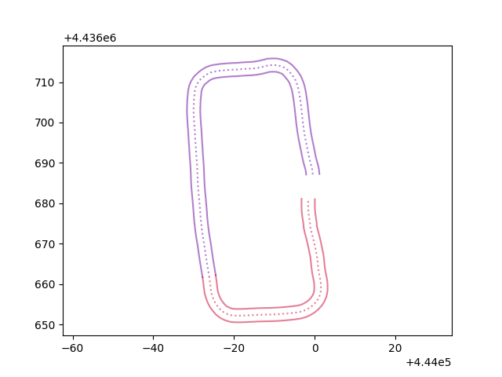
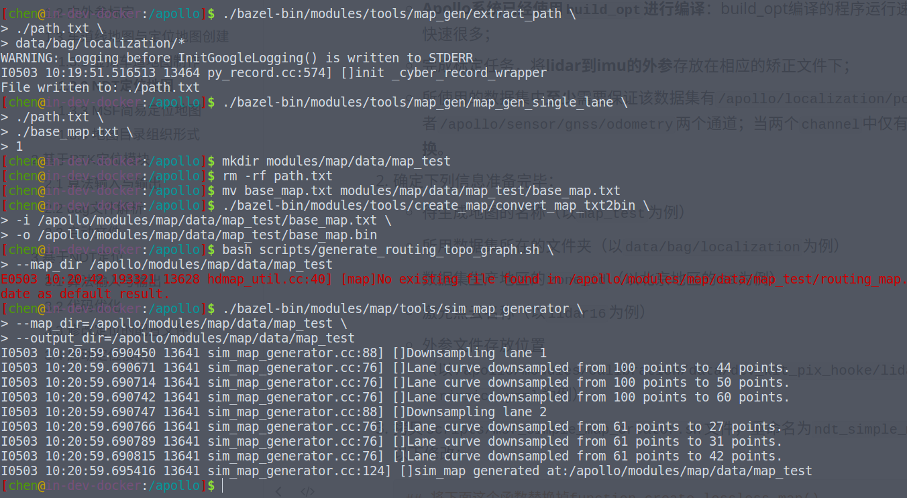
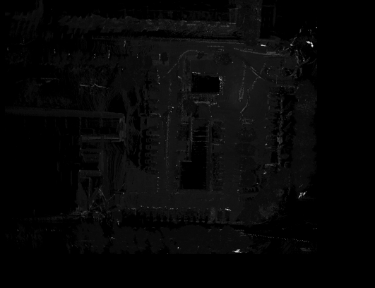
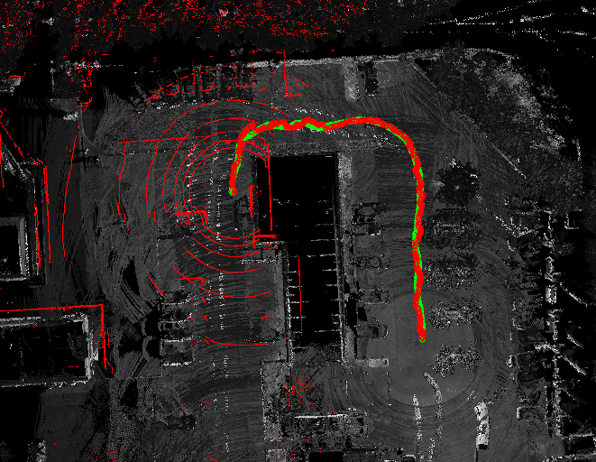
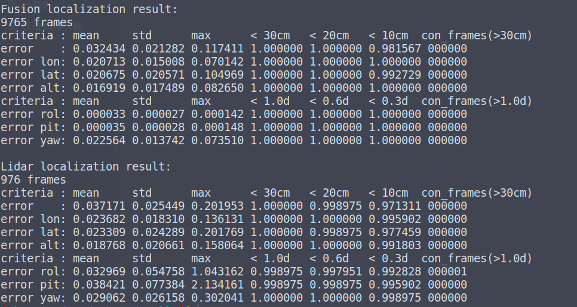

# 定位模块操作实践

[TOC]

## 0 Apollo中的地图总结

### 0.1 地图类型介绍

1. **base_map**：`base_map`是最**完整的地图**，包含所有道路和车道几何形状和标识。其他版本的地图均基于`base_map`生成。
2. **routing_map**：`routing_map`包含`base_map`中**车道的拓扑结构**
3. **sim_map**：`sim_map`是一个适用于`Dreamview`**视觉可视化**，基于`base_map`的轻量版本。减少了数据密度，以获得更好的运行时性能。
4. **ndt map**：`ndt_map`在使用**NDT定位**时才会被使用的地图，可通过工具生成ndt地图。
5. **local map**：`local map`是进行**定位可视化**以及**MSF定位**时使用的地图，可以通过工具本地生成。
6. **HD map**：`HD map`即常说的**高精度地图**。格式采用（`XML`）文件格式的数据组织方式，是基于国际通用的`OpenDrive`规范，并根据百度自动驾驶业务需求拓展修改而成。百度Apollo中的map模块没有提供高精度地图的制作功能，而是作为一种商业产品进行出售，因此这里并不做过多介绍。
   + 参考阅读：[apollo高精地图标准与opendrive标准的差异](https://zhuanlan.zhihu.com/p/60734196)，[Apollo的map模块介绍](https://zhuanlan.zhihu.com/p/58491204)

### 0.2 地图格式介绍 

一般而言，地图具有`.xml`，`.bin`，`.txt`等格式，加载顺序依次为：`.xml`->`.bin`->`.txt`。

```bash
x.xml  # An OpenDrive formatted map.
x.bin  # A binary pb map.
x.txt  # A text pb map.
```

对于ndt和msf地图，Apollo采用二进制文件进行存储，其制作步骤见后续章节。

## 1 测试数据集与地图创建

### 1.1 现场录制数据集

根据 *基础知识介绍和驱动配置* 中所述，开启`Transform`，`Lidar`，`GPS`，`Localization`模块，并使用`cyber_monitor`监控各个信息通道，确保所有模块开启正常。

在遥控器控制模式下，开启`cyber_recorder`记录数据，并驱动车辆绕较大的0字或者8字轨迹。开启记录的命令如下：

```shell
cyber_recorder record -a -i 600 -o loc.record
```

结束记录后，会在apollo仓库根目录下生成一个`loc.record.00000`的文件。将该文件移动至指定目录。该目录不存在则创建，如果存在且有数据则需要提前清除：

```bash
cd /apollo
mkdir -p data/bag/localization -v
rm -rf data/bag/localization/*
mv loc.record.00000 data/bag/localization/
```

+ 如果有`loc.record.00001`等其他后缀的文件，为了保证所有数据处于同一个数据包中，其他数据包直接删除即可。

### 1.2 内外参标定

完成该模块之前，需要预先完成Lidar-IMU的标定（详见实车标定章节），并将校正文件存入`calibration/data/dev_kit_pix_hooke`目录下，具体位置为：

+ `modules/calibration/data/dev_kit_pix_hooke/lidar_params/lidar16_novatel_extrinsics.yaml`

### 1.3 车道线地图与定位地图创建

#### 1.3.1 虚拟车道地图制作

由于正规车道线地图制作的原理较为复杂，因此我们采用虚拟车道线的方式进行车道线的制作。虚拟车道线的核心思想非常简单，即记录车辆行驶的轨迹，以此为中心向左右各扩展若干距离。制作过程如下：

1. 从CyberRT包中提取位置路径文件：

   ```bash
   ./bazel-bin/modules/tools/map_gen/extract_path \
   	./path.txt \
   	data/bag/localization/*
   ```

2. 生成地图文件(`base_map.txt`)，其中1表示冗余区域大小为1

   ```bash
   ./bazel-bin/modules/tools/map_gen/map_gen_single_lane \
   	./path.txt \
   	./base_map.txt \
   	1
   ```

   + 调节车道线宽度：**修正`map_gen_single_lane.py`脚本中的`LANE_WIDTH`参数可以调整车道线宽度**。本次实践中，推荐设置宽度为5。

3. 【可选】为该文件增加header(可视化使用)，举例如下：

   ```yaml
   header {
     version: "0326"
     date: "20220326"
     projection {
       proj: "+proj=tmerc +lat_0={39.52} +lon_0={116.28} +k={-48.9} +ellps=WGS84 +no_defs"
     }
   }
   ```

4. 建立地图文件夹（如`map_test`，可以修改为自己地图名称），并生成.bin文件

   ```bash
   mkdir modules/map/data/map_test
   rm -rf path.txt
   mv base_map.txt modules/map/data/map_test/base_map.txt
   
   # base_map.bin
   ./bazel-bin/modules/tools/create_map/convert_map_txt2bin \
   	-i /apollo/modules/map/data/map_test/base_map.txt \
   	-o /apollo/modules/map/data/map_test/base_map.bin
   ```

5. 建立`routing_map`

   ```bash
   bash scripts/generate_routing_topo_graph.sh \
   	--map_dir /apollo/modules/map/data/map_test
   ```

   + 第一次运行可能会提示报错：

     ```css
     E0406 15:11:07.321321 10341 hdmap_util.cc:40] [map]No existing file found in /apollo/modules/map/data/map_test/routing_map.bin|routing_map.txt. Fallback to first candidate as default result
     ```

     属于正常现象，继续即可。

6. 建立`sim_map`

   ```
   ./bazel-bin/modules/map/tools/sim_map_generator \
   	--map_dir=/apollo/modules/map/data/map_test \
   	--output_dir=/apollo/modules/map/data/map_test
   ```

7. 【可选】可视化车道线：

   + 修复软件源：

     ```bash
     sudo vim /etc/apt/sources.list
     ```

     在文件中修改：（将`https`修改为`http`）

     ```bash
     deb http://mirrors.tuna.tsinghua.edu.cn/ubuntu/ bionic main restricted universe multiverse
     # deb-src https://mirrors.tuna.tsinghua.edu.cn/ubuntu/ bionic main restricted universe multiverse
     deb http://mirrors.tuna.tsinghua.edu.cn/ubuntu/ bionic-updates main restricted universe multiverse
     # deb-src https://mirrors.tuna.tsinghua.edu.cn/ubuntu/ bionic-updates main restricted universe multiverse
     deb http://mirrors.tuna.tsinghua.edu.cn/ubuntu/ bionic-backports main restricted universe multiverse
     # deb-src https://mirrors.tuna.tsinghua.edu.cn/ubuntu/ bionic-backports main restricted universe multiverse
     deb http://mirrors.tuna.tsinghua.edu.cn/ubuntu/ bionic-security main restricted universe multiverse
     # deb-src https://mirrors.tuna.tsinghua.edu.cn/ubuntu/ bionic-security main restricted universe multiverse
     ```

   + 更新并安装缺少的依赖库

     ```bash
     sudo apt update
     sudo apt-get install tcl-dev tk-dev python3-tk
     ```

     **注意**：上述修改涉及Apollo系统，因此使用`dev_start.sh`时会重建一个`docker`容器，此时对系统的修改会全部失效，需要重新换源操作；但是`docker start + 容器id/tag`的方式并不会重建容器，而是会继续使用之前容器，因此可以不用重新换源。

   + Python可视化

     ```bash
      ./bazel-bin/modules/tools/mapshow/mapshow \
      	-m /apollo/modules/map/data/map_test/base_map.txt
     ```

     

     dreamview中地图显示（需要重启dreamview）：

     
   
8. 过程截图显示（仅供参考）：

   

#### 1.3.2 MSF简易定位地图

1. 进行定位地图前需要准备以下工作：

   + **Apollo系统已经使用`build_opt`进行编译**：build_opt编译的程序运行速度比使用build进行编译的程序要快速很多；
   + 完成标定任务，将**lidar到imu的外参**存放在相应的矫正文件下；
   + 所使用的数据集中**至少**需要保证该数据集有`/apollo/localization/pose` 或者`/apollo/sensor/gnss/odometry`两个通道；当两个`channel`中仅有一个存在时，**两者可以相互替换**。

2. 确定下列信息准备完毕：

   + 待生成地图的名称（以`map_test`为例）
   + 所用数据集所在的文件夹（以`data/bag/localization`为例）
   + 数据集生产地区的`zone_id`（以北京地区的`50`为例）
   + 激光点云名称（以`lidar16`为例）
   + 外参文件存放位置（以`/apollo/modules/calibration/data/dev_kit_pix_hooke/lidar_params/lidar16_novatel_extrinsics.yaml`为例）

3. 修改`scripts/msf_simple_map_creator.sh`文件如下：

   ```shell
   ## 注释掉删除解析文件和lossless_map部分
   # rm -rf $OUT_MAP_FOLDER/lossless_map
   # rm -rf $OUT_MAP_FOLDER/parsed_data
   ```

   + 注意：对于msf算法而言，**选择分辨率默认分辨率，即分辨率为0.125是一个比较好的选择**。

4. 运行代码生成：新的地图将在`modules/map/data/map_test`下存储

   ```bash
   bash /apollo/scripts/msf_simple_map_creator.sh \
       data/bag/localization \
   /apollo/modules/calibration/data/dev_kit_pix_hooke/lidar_params/lidar16_novatel_extrinsics.yaml \
       50 \
       /apollo/modules/map/data/map_test \
       lidar16
   ```

5. 代码分析：核心思路包括以下几个步骤

   + 数据包解压生成pcd文件以及对应的位姿（`cyber_record_parser`）
   + 位姿插值（`poses_interpolator`）
   + 创建`msf mapping `（`create_lossless_map`）
   + 创建`lossy_map`（`lossless_map_to_lossy_map`）

6. 验证：查看`/modules/map/data/map_test/lossless_map/image`中的图像

   


+ Tips：为了方便使用，我们提供了一键建图脚本，方便测试与对比。有兴趣的同学可以尝试自己构建一个这样的脚本。

#### 1.3.3 NDT定位地图

1. 进行定位地图前需要准备以下工作：

   + **Apollo系统已经使用`build_opt`进行编译**：build_opt编译的程序运行速度比使用build进行编译的程序要快速很多；
   + 完成标定任务，将**lidar到imu的外参**存放在相应的矫正文件下；
   + 所使用的数据集中**至少**需要保证该数据集有`/apollo/localization/pose` 或者`/apollo/sensor/gnss/odometry`两个通道；当两个`channel`中仅有一个存在时，**两者可以相互替换**。

2. 确定下列信息准备完毕：

   + 待生成地图的名称（以`map_test`为例）
   + 所用数据集所在的文件夹（以`data/bag/localization`为例）
   + 数据集生产地区的`zone_id`（以北京地区的`50`为例）
   + 激光点云名称（以`lidar16`为例）
   + 外参文件存放位置（以`/apollo/modules/calibration/data/dev_kit_pix_hooke/lidar_params/lidar16_novatel_extrinsics.yaml`为例）

3. 拷贝`scripts/msf_simple_map_creator.sh`文件，重命名为`ndt_simple_map_creator.sh`

   ```shell
   cd /apollo
   cp scripts/msf_simple_map_creator.sh scripts/ndt_simple_map_creator.sh
   ```

   并对文件做出以下修改：

   ```shell
   ## lin25 ： 修改OUT_MAP_FOLDER
   OUT_MAP_FOLDER="$4/local_map/ndt_map"
   ## 将下面这个函数替换掉function create_lossless_map()
   function create_ndt_map() {
     /apollo/bazel-bin/modules/localization/ndt/map_creation/ndt_map_creator \
       --pcd_folders $1 \
       --pose_files $2 \
       --resolution_type single \
       --resolution 1 \
       --resolution_z 1 \
       --map_folder $OUT_MAP_FOLDER \
       --zone_id $ZONE_ID
   }
   
   ## 将create_lossless_map替换为create_ndt_map
   # create_lossless_map "${DIR_NAME}/pcd" "${DIR_NAME}/pcd/corrected_poses.txt"
   create_ndt_map  "${DIR_NAME}/pcd" "${DIR_NAME}/pcd/corrected_poses.txt"
   
   ## 注释掉lossy_map
   # create_lossy_map
   ```

   + 注意：resolution表示地图分辨率。对于ndt算法而言，并不需要过于精细的分辨率，一般而言，**选择分辨率为1是一个相对比较好的选择**。

4. 运行代码生成：新的地图将在`modules/map/data/map_test`下存储

   ```bash
   bash /apollo/scripts/ndt_simple_map_creator.sh \
       data/bag/localization \
       /apollo/modules/calibration/data/dev_kit_pix_hooke/lidar_params/lidar16_novatel_extrinsics.yaml \
       50 \
       /apollo/modules/map/data/map_test \
       lidar16
   ```

5. 代码分析：核心思路包括以下几个步骤

   + 数据包解压生成pcd文件以及对应的位姿（`cyber_record_parser`）
   + 位姿插值（`poses_interpolator`）
   + 创建`ndt mapping `（`ndt_map_creator`）

## 2 基于RTK定位模块

### 2.1 算法输入与输出

RTK算法原理较为简单，仅仅是将组合惯导的数据做一些处理后进行封装，其中，输入包含以下几个通道：

+ `/apollo/sensor/gnss/corrected_imu`：校正IMU，即原始IMU数据去除了重力和bias；
+ `/apollo/sensor/gnss/ins_stat`：组合惯导的定位状态，决定最终定位的状态；
+ `/apollo/sensor/gnss/odometry`：组合惯导的位姿和线速度；

输出包含：

+ `/apollo/localization/pose`：最终定位的结果。包含utm坐标系下的位置，朝向（四元数形式），线速度，线加速度，角速度，heading角，载体坐标系下的线加速度、角速度、欧拉角。
+ `/apollo/localization/msf_status`：最终的定位状态；
+ `/tf`：增加了基坐标为`world`，子坐标为`localization`的坐标变换。

### 2.2 dag文件解析

文件地址为：`modules/localization/dag/dag_streaming_rtk_localization.dag`

```yaml
# Define all coms in DAG streaming.
module_config {
    module_library : "/apollo/bazel-bin/modules/localization/rtk/librtk_localization_component.so"
    components {
      class_name : "RTKLocalizationComponent"
      config {
        name : "rtk_localization"
        config_file_path : "/apollo/modules/localization/conf/rtk_localization.pb.txt"
        readers: [
          {
            channel: "/apollo/sensor/gnss/odometry"
            qos_profile: {
              depth : 10
            }
            pending_queue_size: 50
          }
        ]
      }
    }
}
```

+ `module_library`：启动文件对应的动态链接库
+ `components.class_name`：实例所属的类名（class name）
+ `components.config.name`：配置的名称定义
+ `components.config.config_file_path`：对应的参数配置文件，以`gflags`形式进行处理
+ `components.config.readers.channel`：组件读取的channel名称。`RTKLocalizationComponent`类会继承`cyber::Component<localization::Gps>`（即通道所读取的channel对应的类别）。每次通道中有数据传入时，会调用一次`Proc`函数。
+ `components.config.readers.qos_profile`：处理后的消息被保留的数量
+ `components.config.readers.pending_queue_size`：未及时处理消息的缓存队列长度

### 2.3 启动文件

```yaml
cyber_launch start modules/localization/launch/rtk_localization.launch
```

+ **注意**：受限于法律法规等相关问题，部分数据包**不提供`/apollo/sensor/gnss/odometry`、`/apollo/sensor/gnss/ins_stat`这两个`channel`**，而直接提供`/apollo/localization/pose`数据。此时需要借助`/apollo/modules/tools/sensor_calibration/`下的两个脚本工具（本质上时py脚本，但是在Apollo 6.0后也被统一编译成了可执行文件）。

  开启两个不同终端进入docker后在/apollo根目录下分别执行：

  ```bash
  ./bazel-bin/modules/tools/sensor_calibration/ins_stat_publisher
  ./bazel-bin/modules/tools/sensor_calibration/odom_publisher
  ```

  这两个脚本便可以产生 `/apollo/sensor/gnss/ins_stat`、`/apollo/sensor/gnss/odometry`这两个`channel`，之后用`cyber_recorder`工具重新生成一个数据包。如果上述任一脚本找不到，请执行`./apollo.sh build_opt tools`来生成它们。

## 3 基于NDT定位

### 3.1 算法输入与输出

NDT算法依赖NDT地图，将组合惯导的数据和激光雷达数据进行平滑滤波后输出，其中，输入包含以下通道：

+ `/apollo/sensor/lidar16/compensator/PointCloud2`：去畸变后的补偿点云；
+ `/apollo/sensor/gnss/ins_stat`：组合惯导的定位状态；
+ `/apollo/sensor/gnss/odometry`：组合惯导的位姿和线速度；

输出包含：

+ `/apollo/localization/pose`：融合定位的结果。包含utm坐标系下的位置，朝向（四元数形式），线速度，heading角；
+ `/apollo/localization/ndt_lidar`：激光里程计定位的结果；
+ `/apollo/localization/msf_status`：最终的定位状态；
+ `/tf`：增加了基坐标为`world`，子坐标为`localization`的坐标变换。

**注意，NDT算法由于没有加入IMU，因此没有加速度信息，无法应用于后续控制和规划算法。**

### 3.2 代码优化

修改源码中因为Eigen内存没对齐导致的相关错误，

位置：文件`/apollo/modules/localization/ndt/ndt_localization.h`第136行

```c++
# std::list<TimeStampPose> odometry_buffer_;
std::list<TimeStampPose,Eigen::aligned_allocator<TimeStampPose>> odometry_buffer_;
```

并重新编译文件：

```bash
bash apollo.sh build_opt localization
```

### 3.3 修改定位的配置文件

修改配置文件：`modules/localization/conf/localization.conf`

```bash
# 5行
--map_dir=/apollo/modules/map/data/map_test # 指定地图位置
# 115行
--local_utm_zone_id=50 # zone id，北京地区为50
# 130行
--lidar_topic=/apollo/sensor/lidar16/compensator/PointCloud2 # 点云话题的名称
# 135行
--lidar_extrinsics_file=/apollo/modules/calibration/data/dev_kit_pix_hooke/lidar_params/lidar16_novatel_extrinsics.yaml # 外参文件，确保已经完成外参校正
```

### 3.4 启动定位模块

1. 启动程序：

   ```bash
   cyber_launch start modules/localization/launch/ndt_localization.launch
   ```

2. 检查`dag_streaming_msf_visualizer.dag`的`channel`，保证lidar名称正确：

   ```yaml
   # Define all coms in DAG streaming.
   module_config {
       module_library : "/apollo/bazel-bin/modules/localization/msf/local_tool/local_visualization/online_visual/online_visualizer_compenont.so"
       components {
         class_name : "OnlineVisualizerComponent"
         config {
           name : "msf_visualizer"
           flag_file_path : "/apollo/modules/localization/conf/localization.conf"
           readers: [
             {
               channel: "/apollo/sensor/lidar16/compensator/PointCloud2"
             }
           ]
         }
       }
   }
   ```

3. 启动可视化程序：

   ```bash
   cyber_launch start modules/localization/launch/msf_visualizer.launch
   ```

   可视化结果展示。此时，按c键可以在Lidar和Fusion定位中进行切换

   

4. 启动`cyber_monitor`，当出现`/apollo/localization/ndt_lidar`时认为ndt启动成功：

   观察可视化界面，分析雷达里程计轨迹和融合轨迹是否一致，并观察点云与地图匹配程度，当点云和实际匹配较差时，认为定位失败：

   

5. 定量评价定位效果：

   + 与之前一样，这里的Apollo代码没有针对Eigen进行内存对齐，导致我们运行出错，因此需要首先修正代码。在 `modules/localization/msf/local_tool/data_extraction/compare_poses.cc`中：

     ```c++
     // 第58行：std::map<unsigned int, Eigen::Affine3d> *out_poses,
     std::map<unsigned int, Eigen::Affine3d, std::less<unsigned int>, Eigen::aligned_allocator<std::pair<unsigned int, Eigen::Affine3d>>> *out_poses,
     
     // 第171行：std::map<unsigned int, Eigen::Affine3d> out_poses_a;
     std::map<unsigned int, Eigen::Affine3d, std::less<unsigned int>, Eigen::aligned_allocator<std::pair<unsigned int, Eigen::Affine3d>>> out_poses_a;
     
     // 第173行：std::map<unsigned int, Eigen::Affine3d> out_poses_b;
     std::map<unsigned int, Eigen::Affine3d, std::less<unsigned int>, Eigen::aligned_allocator<std::pair<unsigned int, Eigen::Affine3d>>> out_poses_b;
     ```

   + 修改脚本文件 `scripts/msf_local_evaluation.sh`

     ```bash
     # 第22行：LIDAR_LOC_TOPIC="/apollo/localization/msf_lidar"
     LIDAR_LOC_TOPIC="/apollo/localization/ndt_lidar"
     
     # 第25行：CLOUD_TOPIC="/apollo/sensor/velodyne64/compensator/PointCloud2"
     CLOUD_TOPIC="/apollo/sensor/lidar16/compensator/PointCloud2"
     
     # 第47-25行：注释掉
       #$APOLLO_BIN_PREFIX/modules/localization/msf/local_tool/data_extraction/compare_poses \
       #   --in_folder $IN_FOLDER \
       #   --loc_file_a $GNSS_LOC_FILE \
       #   --loc_file_b $ODOMETRY_LOC_FILE \
       #   --imu_to_ant_offset_file "$ANT_IMU_FILE" \
       #   --compare_file "compare_gnss_odometry.txt"
     ```

   + 编译 `Localization` 模块：

     ```bash
     bash apollo.sh build_opt localization
     ```

   + 录制使用 NDT 算法进行定位的 record 包（可放置于 `data/bag/ndt` 文件夹下），并运行脚本文件：

     ```bash
     bash scripts/msf_local_evaluation.sh data/bag/ndt
     ```

     结果如下：

     

     定位结果分为横向精度与纵向精度，可以用 10 cm 位置精度来衡量。同时，在自动驾驶中一般认为 30 cm 为最大允许误差，因此小于 30 cm 精度的占比用于衡量定位算法的鲁棒性。

6. 注意事项：

   + 尽管可视化程序在名称上归属于msf，但是它在所有定位方式中均可以使用。使用时需要确认：

      1. 定位方式的地图依赖于msf地图，**需要预先建立msf的`local map`地图**；
      2. 定位策略依赖于`localization.conf`文件的配置，特别是地图所在位置，需要仔细审查。

   + 注意：当地图不可显示并且monitor显示定位正常时，删除缓存文件：`rm -rf cyber/data/map_visual`后重新启动。下图为不正常显示的一个例子

      

   + Tips：

      1. 由于 NDT 定位没有用到点云强度信息，同时也是为了便于观察，可以在建图时候提高点云的强度。具体为修改 `modules/localization/msf/local_tool/data_extraction/pcd_exporter.cc` 第81行左右：

         ```C++
         cloud.points[i].intensity = static_cast<unsigned char(msg.point(i).intensity()) *10;
         ```

      2. 在进行 NDT 定位时，有时会出现gnss时间戳落后与点云时间戳，造成无法定位的情形。此时可以采用外插法或者等待若干时间，可修改 `modules/localization/ndt/ndt_localization.cc` 实现。具体内容在这里不再展开，感兴趣的可以自行尝试修改代码。

      3. 在utm区域边界建图（如湖州地区位于 zone id 50 与 zone id 51 交界处）时，有可能出现拉取地图过小，导致建图时出现非法节点。报错为：

         ```bash
         MapNodeIndex::get_map_node_index illegal n: xxx
         ```

         应修改文件 `modules/localization/msf/local_pyramid_map/base_map/base_map_config.cc` 中第 35 行左右：

         ```c++
         // map_range_ = Rect2D<double>(0, 0, 1000448.0, 10000384.0);  // in meters
         map_range_ = Rect2D<double>(0, 0, 9000448.0, 90000384.0);  // in meters
         ```

         

  
