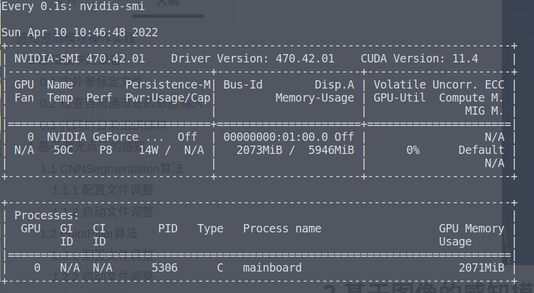
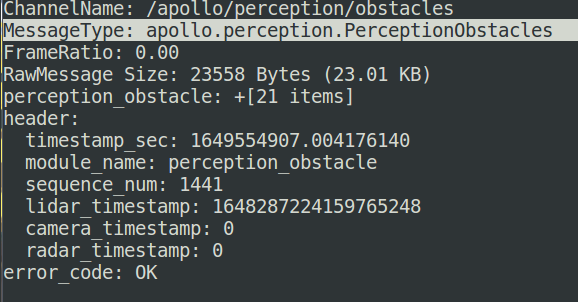
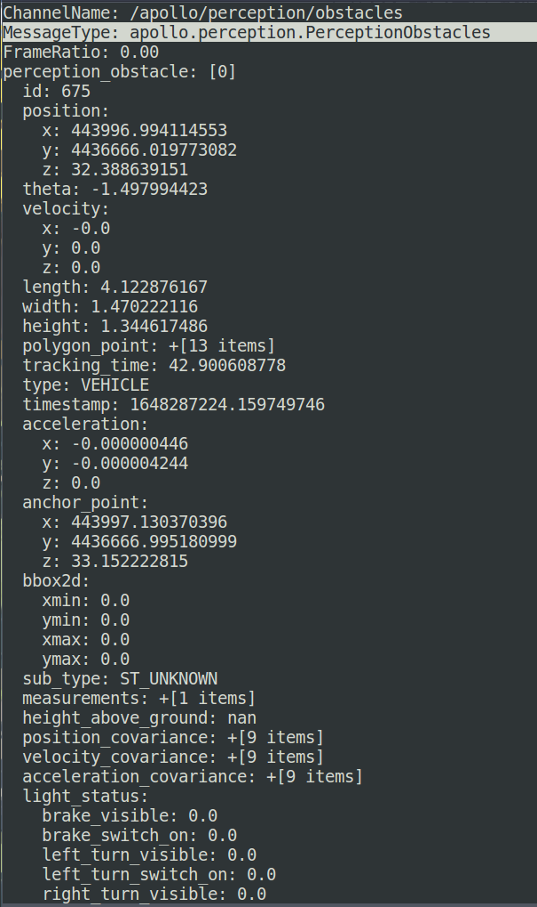
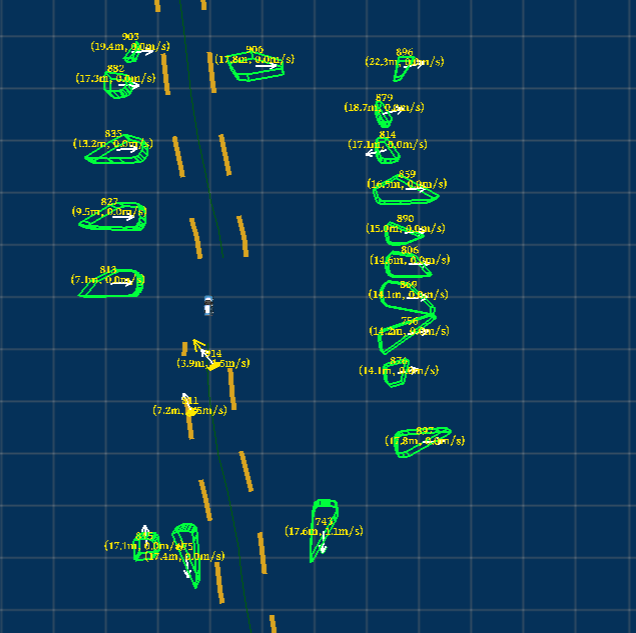
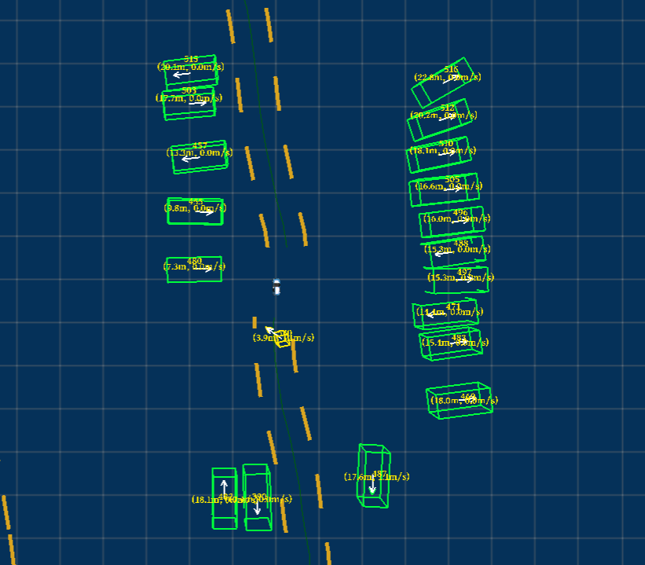
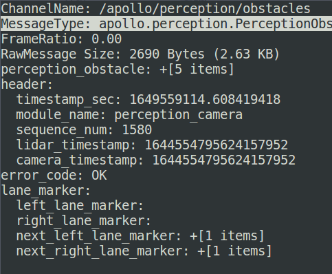
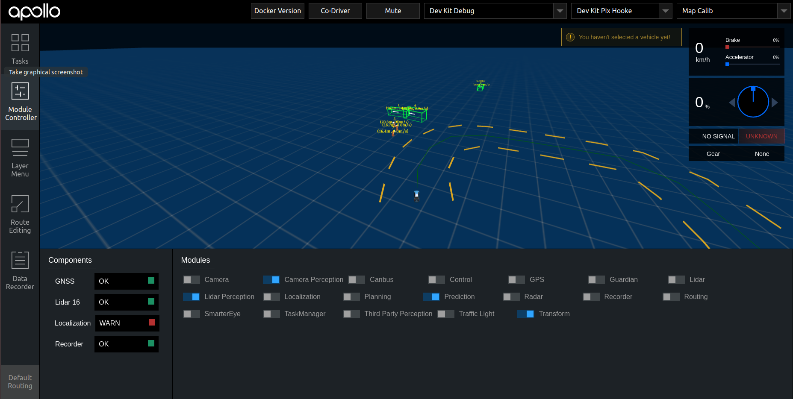
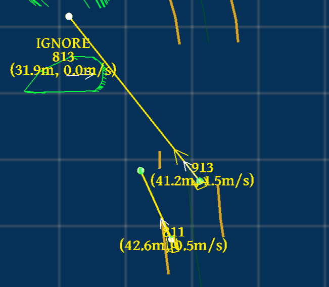
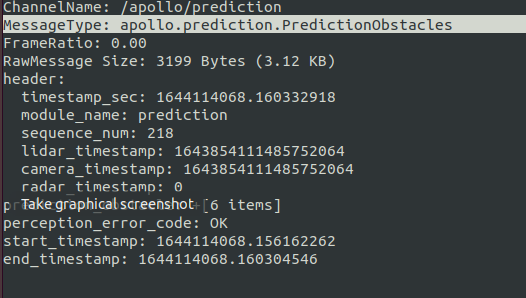

# 感知预测模块操作实践

Apollo支持三种感知方式：基于激光点云的感知模型、基于相机的感知模型、基于融合感知的模型。支持多相机、多激光、毫米波雷达感知等多种传感设备。由于场地、设备等条件限制，这里仅仅对单相机感知，单激光感知，相机-激光融合感知算法进行测试实践。

[TOC]

## 0 感知模块的准备

### 0.1 内外参标定文件

在完成感知任务之前，首先必须完成相机内参标定、Lidar和相机外参标定，并将校正数据存放在下述文件夹中：

+ 相机内参文件：

  `modules/calibration/data/dev_kit_pix_hooke/camera_params/front_6mm_intrinsics.yaml`

+ Lidar-Camera外参文件：

  `modules/calibration/data/dev_kit_pix_hooke/camera_params/front_6mm_extrinsics.yaml`

### 0.2 检查当前通道是的数据输入

+ `/apollo/sensor/lidar16/compensator/PointCloud2`：激光感知和融合感知中必备
+ `/apollo/sensor/camera/front_6mm/image`：视觉感知和融合感知中必备
+ `/apollo/localization/pose`：需要提供定位
+ `/tf`及`/tf_static`：需要提供传感器外参和TF树

### 0.3 代码的目录组织结构

感知模块的目录组织结构如下：

```
.
├── BUILD
├── README.md
├── base           // 基础类
├── camera         // 相机相关            --- 子模块流程
├── common         // 公共目录
├── data           // 相机的内参和外参
├── fusion         // 传感器融合
├── inference      // 深度学习推理模块
├── lib            // 一些基础的库，包括线程、时间等
├── lidar          // 激光雷达相关         --- 子模块流程
├── map            // 地图
├── model          // 深度学习模型
├── onboard        // 各个子模块的入口     --- 子模块入口
├── production     // 感知模块入口（深度学习模型也存放在这里）--- 通过cyber启动子模块
├── proto          // 数据格式，protobuf
├── radar          // 毫米波               --- 子模块流程
├── testdata       // 上述几个模块的测试数据
└── tool           // 离线测试工具
```

其中：

- production：感知模块的入口在production目录，通过lanuch加载对应的dag，启动感知模块。
- onboard： 定义了多个子模块，分别用来处理不同的传感器信息（Lidar，Radar，Camera）。各个子模块的入口在onboard目录中，每个传感器的流程大概相似，可以分为预处理，物体识别，感兴趣区域过滤以及追踪。
- inference： 深度学习推理模块。部署的过程会对模型做加速，实现了`caffe`，`TensorRT`、 `libtorch`、`onnx` 等多种模型部署。训练好的深度模型放在`modules\perception\production\data`目录中，然后通过推理模块进行加载部署和在线计算。
- camera：主要实现车道线识别，红绿灯检测，以及障碍物识别和追踪。
- radar ：主要实现障碍物识别和追踪（由于毫米波雷达上报的就是障碍物信息，这里主要是对障碍物做追踪）。
- lidar：主要实现障碍物识别和追踪（对点云做分割，分类，识别等）。
- fusion：对上述传感器的感知结果做融合。

## 1 基于激光点云的感知

### 1.1 CNNSegmentation算法

CNNSegmentation算法（以下简称cnnseg）是由百度研发、尚未开源的语义分割算法（而非传统上基于bbox的方法）。它分为`center offset`，`objectness`，`positiveness`，`object height`，`class probability`五个层级，由于鲁棒性和检测效果较好，后续如不额外声明，均以该方法作为基础。

cnnseg的模型权重文件位于：`modules/perception/production/data/perception/lidar/models/cnnseg/velodyne16/deploy.caffemodel`

#### 1.1.1 配置文件调整

创建/修改参数配置文件：

+ `modules/perception/production/conf/perception/lidar/velodyne16_segmentation_conf.pb.txt`：

  ```yaml
  sensor_name: "velodyne16"
  enable_hdmap: true
  lidar_query_tf_offset: 0
  lidar2novatel_tf2_child_frame_id: "lidar16"
  output_channel_name: "/perception/inner/SegmentationObjects"
  ```

+ `modules/perception/production/conf/perception/lidar/recognition_conf.pb.txt`：

  ```yaml
  main_sensor_name: "velodyne16"
  output_channel_name: "/perception/inner/PrefusedObjects"
  ```

+ `modules/perception/production/data/perception/lidar/models/multi_lidar_fusion/mlf_engine.conf`：

  ```yaml
  main_sensor: "velodyne16"
  use_histogram_for_match: true
  histogram_bin_size: 10
  output_predict_objects: false
  reserved_invisible_time: 0.3
  use_frame_timestamp: true
  ```

+ `modules/perception/production/conf/perception/fusion/fusion_component_conf.pb.txt`:

  ```yaml
  fusion_method: "ProbabilisticFusion"
  fusion_main_sensors: "velodyne16"
  object_in_roi_check: true
  radius_for_roi_object_check: 120
  output_obstacles_channel_name: "/apollo/perception/obstacles"
  output_viz_fused_content_channel_name: "/perception/inner/visualization/FusedObjects"
  ```

#### 1.1.2 启动文件调整

创建/修改dag启动文件 ：`/apollo/modules/perception/production/dag/`文件夹的 `dag_streaming_perception_dev_kit_lidar.dag`  ：

```yaml
module_config {
  module_library : "/apollo/bazel-bin/modules/perception/onboard/component/libperception_component_lidar.so"

 components {
    class_name : "SegmentationComponent"
    config {
      name: "Velodyne16Segmentation"
      config_file_path: "/apollo/modules/perception/production/conf/perception/lidar/velodyne16_segmentation_conf.pb.txt"
      flag_file_path: "/apollo/modules/perception/production/conf/perception/perception_common.flag"
      readers {
          channel: "/apollo/sensor/lidar16/compensator/PointCloud2"
        }
    }
  }

  components {
    class_name : "RecognitionComponent"
    config {
      name: "RecognitionComponent"
      config_file_path: "/apollo/modules/perception/production/conf/perception/lidar/recognition_conf.pb.txt"
      readers {
          channel: "/perception/inner/SegmentationObjects"
        }
    }
  }


  components {
    class_name: "FusionComponent"
    config {
      name: "SensorFusion"
      config_file_path: "/apollo/modules/perception/production/conf/perception/fusion/fusion_component_conf.pb.txt"
      readers {
          channel: "/perception/inner/PrefusedObjects"
        }
    }
  }

}
```

+ 为了提高效率，同一个模块内的部分数据通道，如`/perception/inner/SegmentationObjects`或者`/perception/inner/PrefusedObjects`并不会在`cyber_monitor`中显示，但是它们依然存在并有效传递着数据。

### 1.2 PointPillar算法

PointPillar是基于激光点云进行目标检测的经典开源算法，在apollo和autoware上均有其实现。训练模型权重详见文件：`modules/perception/production/data/perception/lidar/models/detection/point_pillars`。

#### 1.2.1 配置文件调整

创建/修改参数配置文件：

+ `modules/perception/production/conf/perception/lidar/velodyne16_detection_conf.pb.txt`：

  ```yaml
  sensor_name: "velodyne16"
  enable_hdmap: true
  lidar_query_tf_offset: 0
  lidar2novatel_tf2_child_frame_id: "lidar16"
  output_channel_name: "/perception/inner/DetectionObjects"
  ```

+ `modules/perception/production/conf/perception/lidar/recognition_conf.pb.txt`：

  ```yaml
  main_sensor_name: "velodyne16"
  output_channel_name: "/perception/inner/PrefusedObjects"
  ```

+ `modules/perception/production/data/perception/lidar/models/multi_lidar_fusion/mlf_engine.conf`：

  ```yaml
  main_sensor: "velodyne16"
  use_histogram_for_match: true
  histogram_bin_size: 10
  output_predict_objects: false
  reserved_invisible_time: 0.3
  use_frame_timestamp: true
  ```

+ `modules/perception/production/conf/perception/fusion/fusion_component_conf.pb.txt`:

  ```yaml
  fusion_method: "ProbabilisticFusion"
  fusion_main_sensors: "velodyne16"
  object_in_roi_check: true
  radius_for_roi_object_check: 120
  output_obstacles_channel_name: "/apollo/perception/obstacles"
  output_viz_fused_content_channel_name: "/perception/inner/visualization/FusedObjects"
  ```

#### 1.2.2 启动文件调整

创建/修改dag启动文件 ：`/apollo/modules/perception/production/dag/`文件夹的 `dag_streaming_perception_lidar.dag`  ：

```yaml
module_config {
  module_library : "/apollo/bazel-bin/modules/perception/onboard/component/libperception_component_lidar.so"

  components {
    class_name : "DetectionComponent"
    config {
      name: "Velodyne16Detection"
      config_file_path: "/apollo/modules/perception/production/conf/perception/lidar/velodyne16_detection_conf.pb.txt"
      flag_file_path: "/apollo/modules/perception/production/conf/perception/perception_common.flag"
      readers {
        channel: "/apollo/sensor/lidar16/compensator/PointCloud2"
      }
    }
  }

  components {
    class_name : "RecognitionComponent"
    config {
      name: "RecognitionComponent"
      config_file_path: "/apollo/modules/perception/production/conf/perception/lidar/recognition_conf.pb.txt"
      readers {
        channel: "/perception/inner/DetectionObjects"
      }
    }
  }

  components {
    class_name: "FusionComponent"
    config {
      name: "SensorFusion"
      config_file_path: "/apollo/modules/perception/production/conf/perception/fusion/fusion_component_conf.pb.txt"
      readers {
        channel: "/perception/inner/PrefusedObjects"
      }
    }
  }
}
```

+ 为了提高效率，同一个模块内的部分数据通道，如`/perception/inner/SegmentationObjects`或者`/perception/inner/PrefusedObjects`并不会在`cyber_monitor`中显示，但是它们依然存在并有效传递着数据。

### 1.3 启动激光点云感知模块

1. 启动感知模块，等待待显存稳定（一般在1-2分钟左右）

   ```shell
   # cnn_seg
   mainboard -d modules/perception/production/dag/dag_streaming_perception_dev_kit_lidar.dag
   # or pointpillar
   # mainboard -d modules/perception/production/dag/dag_streaming_perception_lidar.dag
   ```

 2. 待显存稳定后启动数据集

    ```shell
    cyber_recorder play -f data/bag/20220203/20220203100813.record.0000*
    ```

    + 显存是否稳定可以通过指令：`watch -n 0.1 nvidia-smi`查询。该命令表示每间隔0.1 s执行一次`nvidia-smi`指令

    + 显存稳定：

      

 3. 查看`/apollo/perception/obstacles`中是否由数据输出（cnnseg检测输出为多边形，PointPillar检测输出为矩形框）

    ```
    cyber_monitor
    ```

    对于每时刻的检测结果，有如下障碍物检测序列：

    

    对于每一个障碍物检测结果，包含：

    + 检测目标的id，类别，位置，朝向（仅包括yaw），速度，加速度
    + 长宽高，多边形点（cnnseg，PointPillar），bbox2d（camera），archor
    + 位置、速度、加速度协方差
    + 追踪时间：数据关联成功时长
    + light_status：仅在图像障碍物检测中出现

    

 4. 在`dreamviewer`最终效果如下(第一个为cnnseg，第二个为PointPillar)：可以看出，雷达视野**覆盖360度**，但是感知距离相对较近。

    

    

## 2 基于图像的感知模块

图像感知模块基于单目yolo 3D障碍物感知算法进行测试，检测种类包括：`CAR`，`VAN`，`BUS`，`TRUCK`，`CYCLIST`，`TRICYCLIST`，`PEDESTRIAN`，`TRAFFICCONE`。其模型权重位于：`modules/perception/production/data/perception/camera/models/yolo_obstacle_detector`

### 2.1 配置文件调整

创建/修改配置文件，确保检测到的障碍物信息向指定channel输出：

+ 修改文件位置为：`modules/perception/production/conf/perception/camera/fusion_camera_detection_component.pb.txt`

+ 修改文件内容为：

  ```yaml
  output_final_obstacles : true
  output_obstacles_channel_name : "/apollo/perception/obstacles"
  ```

### 2.2 启动文件调整

创建/调整启动文件：`modules/perception/production/dag/dag_streaming_perception_dev_kit_camera.dag`：

```yaml
module_config {
  module_library : "/apollo/bazel-bin/modules/perception/onboard/component/libperception_component_camera.so"
  components {
    class_name : "FusionCameraDetectionComponent"
    config {
      name: "FusionCameraComponent"
      config_file_path: "/apollo/modules/perception/production/conf/perception/camera/fusion_camera_detection_component.pb.txt"
      flag_file_path: "/apollo/modules/perception/production/conf/perception/perception_common.flag"
    }
  }
}
```

### 2.3 启动图像感知模块

1. 启动图像模块，等待待显存稳定（一般在1-2分钟左右）。

   ```bash
   mainboard -d /apollo/modules/perception/production/dag/dag_streaming_perception_dev_kit_camera.dag
   ```

2. 待显存稳定后启动数据集：

   ```bash
   cyber_recorder play -f data/bag/20220203/20220203100813.record.0000*
   ```

   + 显存是否稳定可以通过指令：`watch -n 0.1 nvidia-smi`查询。该命令表示每间隔0.1 s执行一次`nvidia-smi`指令

   + 显存稳定：

     

3. 查看输出结果：（camera检测输出为三维目标框）

   ```bash
   cyber_monitor
   ```

   观察到`/apollo/perception/obstacles`中有数据输出：

   + 障碍物序列为：

     

     与激光雷达检测相比，多了车道线等信息，但是由于该模块尚未开启，因此没有数据。

   + 单个障碍物信息（`perception_obstacle[i]`）的数据类型解析详见激光点云的检测说明。与激光相比，基于视觉的输出多了`bbox2d`和`light_status`，其余变化不大。

 4. 在`dreamviewer`最终效果如下：可以看出，**相机的视野较远**，还能有效的检测到**小物体**，但是**视野受限**。

    

## 3 基于相机和激光融合的感知模块

### 3.1 配置文件调整

与单传感器感知不同，融合感知需要将点云、相机的感知结果进行后融合。为了保证输出通道不被占用，首先需要将相机感知的通道做一定调整，将结果传给位于点云感知的融合模块：

+ 创建/修改文件：`modules/perception/production/conf/perception/camera/fusion_camera_detection_component.pb.txt`

  ```yaml
  output_final_obstacles : true
  output_obstacles_channel_name : "/perception/obstacles"
  ```

选择需要融合的主传感器，并设置输出通道：

+ 创建/修改文件：`modules/perception/production/conf/perception/fusion/fusion_component_conf.pb.txt`

  ```yaml
  fusion_method: "ProbabilisticFusion"
  fusion_main_sensors: "velodyne16"
  fusion_main_sensors: "front_6mm"
  object_in_roi_check: true
  radius_for_roi_object_check: 120
  output_obstacles_channel_name: "/apollo/perception/obstacles"
  output_viz_fused_content_channel_name: "/perception/inner/visualization/FusedObjects"
  ```

### 3.2 启动文件调整

创建/修改启动文件：`modules/perception/production/dag/dag_streaming_perception.dag`，内容如下：

```yaml
module_config {
  module_library : "/apollo/bazel-bin/modules/perception/onboard/component/libperception_component_camera.so"
  components {
    class_name : "FusionCameraDetectionComponent"
    config {
      name: "FusionCameraComponent"
      config_file_path: "/apollo/modules/perception/production/conf/perception/camera/fusion_camera_detection_component.pb.txt"
      flag_file_path: "/apollo/modules/perception/production/conf/perception/perception_common.flag"
    }
  }
}


module_config {
  module_library : "/apollo/bazel-bin/modules/perception/onboard/component/libperception_component_lidar.so"

 components {
    class_name : "SegmentationComponent"
    config {
      name: "Velodyne16Segmentation"
      config_file_path: "/apollo/modules/perception/production/conf/perception/lidar/velodyne16_segmentation_conf.pb.txt"
      flag_file_path: "/apollo/modules/perception/production/conf/perception/perception_common.flag"
      readers {
          channel: "/apollo/sensor/lidar16/compensator/PointCloud2"
        }
    }
  }

  components {
    class_name : "RecognitionComponent"
    config {
      name: "RecognitionComponent"
      config_file_path: "/apollo/modules/perception/production/conf/perception/lidar/recognition_conf.pb.txt"
      readers {
          channel: "/perception/inner/SegmentationObjects"
        }
    }
  }


  components {
    class_name: "FusionComponent"
    config {
      name: "SensorFusion"
      config_file_path: "/apollo/modules/perception/production/conf/perception/fusion/fusion_component_conf.pb.txt"
      readers {
          channel: "/perception/inner/PrefusedObjects"
        }
    }
  }

}
```

### 3.3 启动融合感知模块

1. 启动融合感知模块，等待待显存稳定（一般在1-2分钟左右）。

   ```shell
   mainboard -d /apollo/modules/perception/production/dag/dag_streaming_perception.dag
   ```

2. 待显存稳定后启动数据集：

   ```bash
   cyber_recorder play -f data/bag/20220203/20220203100813.record.0000*
   ```

   + 显存是否稳定可以通过指令：`watch -n 0.1 nvidia-smi`查询。该命令表示每间隔0.1 s执行一次`nvidia-smi`指令

   + 显存稳定：

     

3. 查看输出结果：（三维目标框和多边形框）

   ```bash
   cyber_monitor
   ```

   观察到`/apollo/perception/obstacles`中有数据输出，输出数据类型与之前类似。

 4. 在`dreamviewer`最终效果如下：可以看出，**近处时为点云检测为主的多边形目标，远处时为相机检测到的矩形框**，兼具了两者的优势。

    ==TODO: picture path!==

## 4 启动预测模块

### 4.1 输入输出解析

预测模块输入消息类型为：

- `perception::PerceptionObstacles` ：感知模块输出的障碍物信息，对应`/apollo/perception/obstacles`
- `planning::ADCTrajectory`：规划模块输出的行驶路径，对应`/apollo/planning `
- `localization::LocalizationEstimate` ：车辆当前的位置，对应`/apollo/localization/pose`

预测模块输出消息类型为：

- `prediction::PredictionObstacles`： 预测模块输出的障碍物信息，对应`/apollo/prediction`

### 4.2 预测模块启动

<!--换一个更好看的图-->

1. 启动`cyber_launch start modules/prediction/launch/prediction.launch`

   

2. 观测`cyber_monitor`的`/apollo/prediction`通道是否正常工作输出

   

