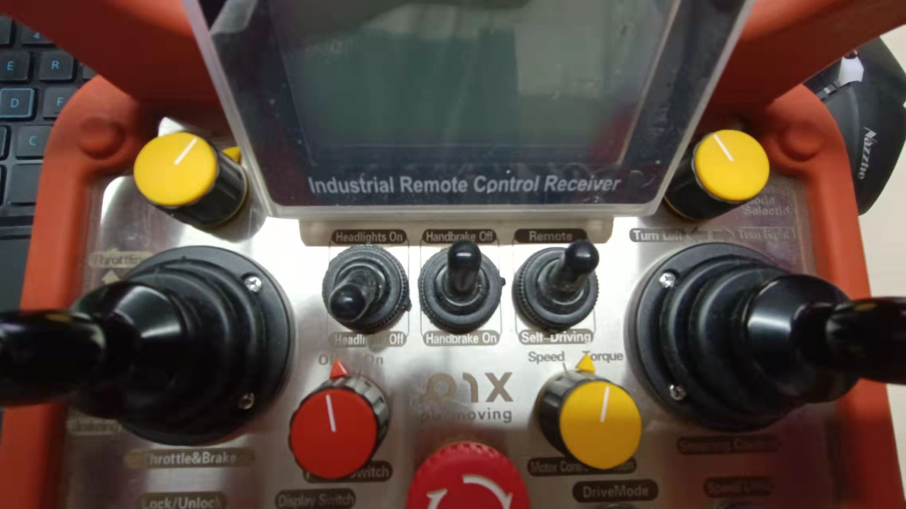

# 控制模块控制器标定实践

## 0 横纵向控制器参数表

### 0.1 纵向控制器参数表

```
lon_controller_conf {
  ts: 0.01			# 控制模块的运行周期
  brake_minimum_action: 0.0  # 百分数, 后续通过取max(brake_minimum_action, vehicle_param_.brake_deadzone()) 确定刹车动作的下边界 
  throttle_minimum_action: 0.0 # 百分数, 后续通过取max(vehicle_param_.throttle_deadzone, throttle_minimum_action)确定油门动作的下边界
  speed_controller_input_limit: 0.8		# 速度控制器的最大输入(m/s)
  station_error_limit: 2.0			# 位置控制器的最大输入(m), 纵向位置误差的最大值
  preview_window: 20.0		# preview_time(预览时间)=preview_window*采样时间ts
  standstill_acceleration: -0.3	# 在倒挡时确定当前汽车的减加速度, max(acceleration_cmd,-lon_controller_conf.standstill_acceleration())
  enable_reverse_leadlag_compensation: false	# 是否允许使用超前/滞后补偿控制器
  station_pid_conf {	# 位置PID控制器参数配置
    integrator_enable: false	# 是否允许打开积分控制器，这里是false,　因此默认位置控制器是P控制器
    integrator_saturation_level: 0.3
    kp: 0.2
    ki: 0.0
    kd: 0.0
  }
  low_speed_pid_conf {	# 低速PID控制器配置
    integrator_enable: true  
    integrator_saturation_level: 0.3  # 积分饱和上限
    kp: 2.0
    ki: 0.3
    kd: 0.0
  }
  high_speed_pid_conf {	# 高速PID控制器配置
    integrator_enable: true
    integrator_saturation_level: 0.3
    kp: 1.0
    ki: 0.3
    kd: 0.0
  }
  switch_speed: 3.0		# 控制算法根据当前的行驶速度来决定选择低速或是高速PID
  switch_speed_window: 1.0	# 没有用到
  reverse_station_pid_conf {	# 倒车档的位置PID配置
    integrator_enable: true
    integrator_saturation_level: 0.5
    kp: 0.4
    ki: 0.1
    kd: 0.0
  }
  reverse_speed_pid_conf {		# 倒车档的速度PID配置
    integrator_enable: true
    integrator_saturation_level: 0.5	# 内部饱和状态界限(上下界)
    kp: 0.8
    ki: 0.3
    kd: 0.0
  }
  reverse_station_leadlag_conf {	# 倒车档的位置超前/滞后补偿器配置
    innerstate_saturation_level: 1000	
    alpha: 1.0	# 滞后系数
    beta: 1.0 # 超前系数
    tau: 0.0 # 时间系数
  }
  reverse_speed_leadlag_conf {		# 倒车档的速度超前/滞后补偿器配置
    innerstate_saturation_level: 1000
    alpha: 1.0
    beta: 1.0
    tau: 0.0
  }
  pitch_angle_filter_conf {		# 数字滤波器的配置
    cutoff_freq: 5	# 截止频率
  }
  calibration_table {	#　油门刹车标定表的配置
    calibration {
      speed: 0.0	# 速度
      acceleration: -1.43 # 加速度
      command: -35.0  # 控制指令
    }
  	...
 }
```

### 0.2 横向控制器参数表

```
lat_controller_conf {
  ts: 0.01			# 控制器运行周期
  preview_window: 0	# preview_time(预览时间)=preview_window*采样时间ts
  cf: 155494.663	#  前轮侧偏刚度，左右轮之和
  cr: 155494.663	#  后轮侧偏刚度，左右轮之和
  mass_fl: 520		#  左前悬的质量
  mass_fr: 520		#  右前悬的质量
  mass_rl: 520		#  左后悬的质量
  mass_rr: 520		#  右后悬的质量
  eps: 0.01			#  LQR迭代求解精度
  matrix_q: 0.05	#  Q矩阵是LQR中目标函数中各个状态量(X=[e1 e1' e2 e2'])平方和的权重系数
  matrix_q: 0.0
  matrix_q: 1.0
  matrix_q: 0.0
  reverse_matrix_q: 0.05	# 倒车档时,目标函数中各个状态量(X=[e1 e1' e2 e2'])平方和的权重系数
  reverse_matrix_q: 0.0
  reverse_matrix_q: 1.0
  reverse_matrix_q: 0.0
  cutoff_freq: 10		# 截止频率, 用于后续计算得到滤波器的传递函数分子和分母
  mean_filter_window_size: 10	# 均值滤波窗口大小
  max_iteration: 150		# LQR问题求解的最大迭代次数
  max_lateral_acceleration: 5.0		# 最大允许的横向加速度
  enable_reverse_leadlag_compensation: true  # 使能横向控制中的超前滞后控制器, 用于改善闭环反馈系统的响应速度
  enable_steer_mrac_control: false	# 使能mrac模型参考自适应控制
  enable_look_ahead_back_control: true # 使能前进倒车时的预瞄控制
  lookahead_station: 1.4224	# 前进档时汽车控制的预瞄距离
  lookback_station: 2.8448	#　倒车档时汽车控制的预瞄距离
  lookahead_station_high_speed: 1.4224	  #  高速前进预瞄距离，针对非R档
  lookback_station_high_speed: 2.8448	  #  高速前进预瞄距离，针对R档
  lat_err_gain_scheduler {	# 横向误差增益调度表, 在不同速度下, 在不同的速度下为测定的横向误差乘上一个比例系数
    scheduler {
      speed: 4.0	# 速度
      ratio: 1.0	# 比例系数
    }
    scheduler {
      speed: 8.0
      ratio: 0.6
    }
    scheduler {
      speed: 12.0
      ratio: 0.2
    }
    scheduler {
      speed: 20.0
      ratio: 0.1
    }
    scheduler {
      speed: 25.0
      ratio: 0.05
    }
  }
  heading_err_gain_scheduler {	# 朝向误差增益调度表, 在不同速度下, 在不同的速度下为测定的朝向误差乘上一个比例系数
    scheduler {
      speed: 4.0
      ratio: 1.0
    }
    scheduler {
      speed: 8.0
      ratio: 0.6
    }
    scheduler {
      speed: 12.0
      ratio: 0.4
    }
    scheduler {
      speed: 20.0
      ratio: 0.2
    }
    scheduler {
      speed: 25.0
      ratio: 0.1
    }
  }
  reverse_leadlag_conf {	# 倒车档的leg/lag补偿器配置
    innerstate_saturation_level: 3000  # 内部饱和状态界限(上下界)
    alpha: 1.0
    beta: 1.0
    tau: 0.0
  }
  steer_mrac_conf {  		# flase 跳过
    mrac_model_order: 1
    reference_time_constant: 0.09
    reference_natural_frequency: 10
    reference_damping_ratio: 0.9
    adaption_state_gain: 0.0001
    adaption_desired_gain: 0.0001
    adaption_nonlinear_gain: 0.0001
    adaption_matrix_p: 1.0
    mrac_saturation_level: 1.0
    anti_windup_compensation_gain: 0.0001
    clamping_time_constant: 0.08
  }
}
```

## 1. PID控制器参数调节标定

### 流程概括

一般是基于速度控制器->站控制器的顺序, 在汽车纵向的运动过程中, 如果速度控制器能够较为良好的响应, 那么一般情况下位置控制器的响应效果也不会太差

#### 1.1 速度控制器的调谐

速度控制器一般是 $KI$ 控制器(比例积分控制器)

```
speed_pid_conf {
  integrator_enable: true
  integrator_saturation_level: 0.3
  kp: 1.0
  ki: 0.3
  kd: 0.0
}
```

1. 首先将 $kp$ , $ki$ 和 $kd$ 的值设为0.
2. 先增加 $kp$ 的值, $ki$ 和 $kd$ 的值不变，直到输出的速度曲线出现了震荡即可.
3. 将 $kp$ 的值变为原先的 $1/2$ ,再慢慢调节 $ki$ 的值, 减少速度曲线的稳态误差.

最终得到的速度pid控制曲线应该是一条单调上升的曲线.

#### 1.2 站控制器的调谐

```
station_pid_conf {
  integrator_enable: true
  integrator_saturation_level: 0.3
  kp: 0.5
  ki: 0.3
  kd: 0.0
}
```

站控制器一般是 $K$ 控制器(比例控制器)

1. 首先将 $kp$ , $ki$ 和 $kd$ 的值设为0.
2. 逐渐增加 $kp$ 的值，找到震荡曲线和单调曲线之间的临节点.
3. 如果稳态误差太大且无法消除, 则可适当增加 $ki$的值. 

最终得到的位置pid控制曲线也应该是一条单调上升的曲线.


## 2. LQR控制器参数调节标定

### 流程概括

1. 首先更新车辆相关的物理参数，如下面的示例所示。然后，按照上面列出的基本$LQR$控制器调整步骤*横向控制器调谐*和定义矩阵$Q$参数

   ```
   lat_controller_conf {
     cf: 155494.663
     cr: 155494.663
     wheelbase: 2.85
     mass_fl: 520
     mass_fr: 520
     mass_rl: 520
     mass_rr: 520
     eps: 0.01
     steer_transmission_ratio: 16
     steer_single_direction_max_degree: 470
   }
   ```

2.  将`matrix_q` 中所有元素设置为零.

3.  增加`matrix_q`中的第三个元素，它定义了航向误差加权，以最小化航向误差.

4. 增加`matrix_q`的第一个元素，它定义横向误差加权以最小化横向误差.


## 3. 实车标定流程

### 流程概括

1. 基本模块操作

```
// 启动canbus驱动
cd /home/EMUC_B202_SocketCAN_driver_v3.2_utility_v3.1_20210302/
sudo ./start.sh

// 进入apollo空间和dreamviewer
docker start apollo_dev_t
cd apollo
bash docker/scripts/dev_into.sh
bash scripts/dreamviewer.sh
```

2. 在dreamviewer界面中选择对应的车辆和地图,并启动Transform, lidar, GPS, Canbus, Control模块.

.png)

3. 手动挂挡

```
bash scripts/canbus_teleop.sh
```

​	.png)

​	启动手动挂挡的程序后，分别按次序按下,m0, m1, g1,然后在该终端下按下ctrl+c, 暂停该程序的运行(这一步非常重要!!),防止后续我们输入的油门刹车指令和该程	序冲突。

 4. 录制轨迹

    将遥控器的remote<---->self-driving档位切换为remote

    

```
bash scripts/rtk_recorder.sh setup	// 启动RTK轨迹录制所需要的所有模块
bash scripts/rtk_recorder.sh start	// 输入该命令后，遥控汽车向前移动一段距离后停止，然后按ctrl-c终止录制路径
```

5. 启动RTK循迹

   将遥控器的remote<---->self-driving档位切换为self-driving


```
bash scripts/rtk_player.sh setup	// 启动RTK循迹所需要的所有模块
bash scripts/rtk_player.sh start	// 输入该命令后，汽车自动跟随轨迹
// 轨迹完成后 Ctrl+c 退出程序后 
bash scripts/rtk_player.sh stop    // 运行模块rtk_player停止功能 
```

 6. 调节对应的控制参数

    PID参数调节:

    将dreamviewer界面切换到Task->PNC显示界面，选择cotrol模块查看速度曲线的变化规律，使得我们实际的速度曲线能够在跟随过程中尽可能贴合录制轨迹的曲线

    PNC模块：点击PNC Monitor即可

    

    
    
    纵向误差调节(主要调节速度误差)
    
    .png)
    
    横向误差调节(通过调节lateral_err和heading_err)

.png)
