# 0. 附录

[TOC]

## 0.1. 时序同步

### 0.1.1. 时序同步与时间矫正的意义

时序同步：

+ **统一时钟源**，并保证采用同一种计时标准。
+ **保证各传感器成像的时间不一致**。这导致了成像结果之间无法有效对齐，无法进行有效的融合。

时间矫正：

+ **消除时间延时误差**。传感器会输出一个时间戳 $ts$，但是由于时钟不同步的原因，传到本地系统时无法匹配，因此会将 $ts$ 修正为系统接受时刻的时间戳 $ts^{'}$。这中间的差距就是相机的时间延迟误差，通常在几ms到几十ms之间。高速情景下，存在1 ms延时时就能对系统造成明显的影响。

### 0.1.2. 常见的时间标准及转换

1. 常见的时间标准及时间戳表示

   + **GMT**，即格林尼治标准时间，也就是世界时。GMT的正午是指当太阳横穿格林尼治子午线（本初子午线）时的时间。但由于地球自转不均匀不规则，导致GMT不精确，**现在已经不再作为世界标准时间使用。**
   + **UTC**，即协调世界时。UTC是以原子时秒长为基础，在时刻上尽量接近于GMT的一种时间计量系统。为确保UTC与GMT相差不会超过0.9秒，在有需要的情况下会在UTC内加上正或负闰秒（**leap second**）。**UTC现在作为世界标准时间使用。**
   + **TAI**，即**国际原子时钟**。1967年第13届国际度量衡会议上通过一项决议，定义 1s 为铯-133原子基态两个超精细能级间跃迁辐射9,192,631,770周所持续的时间，这是利用铯原子振荡周期极为规律的特性。
   + **LT**，即本地时间。东区是加相应的时区差，西区是减时区差。如北京是东八区，则北京时间=UTC+8。
   + **Unix timestamp**：计算机记录UTC时间以Unix timestamp形式存储。定义为从格林威治时间1970年01月01日00时00分00秒起至现在的总秒数，**不考虑闰秒**。
   + **GPS timestamp**：即GPS原子时。它的时间基准是1980年1月6日0点与世界协调时刻相一致，以后按原子时秒长累积计时（**考虑闰秒**）。

2. **GPS timestamp 与 Unix timestamp 的相互转换**：

   + 不考虑闰秒情况下，两者的时间差异为：

     + 以世界时间计算：$315964800 = 315993600 - 28800$
     + 以北京时间计算：$315993600$

   + 闰秒插入时间表：

     ```
      Current TAI - UTC  = 37. (mean that: 2017 - 1970/01/01 = 37 seconds)
      Current GPS - UNIX = 18. (mean that: 2017 - 1980/01/06 = 18 seconds)
      +======+========+========+======+========+========+
      | Year | Jun 30 | Dec 31 | Year | Jun 30 | Dec 31 |
      +======+========+========+======+========+========+
      | 1980 | (already +19)   | 1994 | +1     | 0      |
      +------+--------+--------+------+--------+--------+
      | 1981 | +1     | 0      | 1995 | 0      | +1     |
      +------+--------+--------+------+--------+--------+
      | 1982 | +1     | 0      | 1997 | +1     | 0      |
      +------+--------+--------+------+--------+--------+
      | 1983 | +1     | 0      | 1998 | 0      | +1     |
      +------+--------+--------+------+--------+--------+
      | 1985 | +1     | 0      | 2005 | 0      | +1     |
      +------+--------+--------+------+--------+--------+
      | 1987 | 0      | +1     | 2008 | 0      | +1     |
      +------+--------+--------+------+--------+--------+
      | 1989 | 0      | +1     | 2012 | +1     | 0      |
      +------+--------+--------+------+--------+--------+
      | 1990 | 0      | +1     | 2015 | +1     | 0      |
      +------+--------+--------+------+--------+--------+
      | 1992 | +1     | 0      | 2016 | 0      | +1     |
      +------+--------+--------+------+--------+--------+
      | 1993 | +1     | 0      | 2017 | 0      | 0      |
      +------+--------+--------+------+--------+--------+
     ```

   + 代码展示：详见`modules/drivers/gnss/util/time_conversion.h`

### 0.1.3. 各传感器输出信息时间戳

+ lidar点云信息（`/apollo/sensor/lidar16/PointCloud2`）

  ```yaml
  header:
  	timestamp: 1645954490.276059151
  measurement_time: 1645925689.300303936
  point: [0]
    x: 5.998190
    y: -0.836586
    z: -1.611391
    intensity: 27
    timestamp: 1645925689201644032
  ```

  + 该点云信息在与gnss时钟同步后，Apollo驱动中开启了使用激光时钟选项。可以看出`measurement_time`与`header.timestamp`相差了至少8小时，即28800。这是由于后者采用了北京时间而前者采用了UTC标准时间。

  + 其中，`header.timestamp`表示系统到达的时间，代码为`cyber::Time().Now().ToSecond()` 

    `measurement_time` 表示点云的测量时间，取点云序列中最后一个点的时间戳（严格来说是点云最后一个点的测量时间除以1e9）作为整体的测量时间。

  + 由于激光为慢速测量设备，因此需要记录**每个点的时间戳**，便于后续的运动畸变矫正。

+ 相机信息：

  ```yaml
  header:
  	timestamp: 1644554764.430842638
  measurement_time: 1644554764.399139166
  ```

  + 相机情况需要分类讨论：对于**卷帘门相机**而言，实际曝光是一行一行进行的，每一行CMOS曝光后将信息传给行寄存器，再由行寄存器进行输出。最终时间戳会确定在**图像中间进行曝光时**；而对于**全局相机**而言，每个CMOS都有一个对应的寄存器，因此可以同时进行曝光，**时间戳位于同时曝光时**。但是全局相机价格高昂，同时工艺复杂，由于寄存器位置的限制，也很难做出大底的相机，因此卷帘门相机更加实用。
  + 非定制相机模组**不支持时钟同步**，定制相机可选择支持。以卷帘门相机为例，需要和厂家进行沟通，在输出相机图像时把每一行的时间戳也发送出来，根据相应的算法进行补偿处理。

### 0.1.4. 时间同步方法

**1. Apollo内部时间同步机制**：

   + *系统同步*：

     采用**NTP网络同步**。以1s为周期，根据时钟偏差调整client时钟，可将时钟误差稳定控制在微秒级别。

     + 执行命令：

       ```bash
       bash docker/scripts/dev_into.sh
       sudo apt-get -y update && sudo apt-get -y install ntpdate
       bash scripts/time_sync.sh cn
       ```

   + *LiDAR设备同步*：

     + LiDAR设备**支持两种时钟同步**方式：

       + IEEE 1588-2008(PTPv2)：**以太网接口同步**；
       + **PPS脉冲信号+NMEA消息**（GPS），由于设备原因，采用第二种方式进行时钟同步；

     + PPS脉冲信号+NMEA消息（GPS）配置演示

       + **GPS配置**。打开CGI-410 配置界面（网页输入：`192.168.200.1`， 账号： `admin`， 密码： `password`）在` io 设置`内的`串口A`配置中设置波特率为9600 bps，输出协议为GPRMC，输出频率为1 Hz（最大）。

       + **同步模式**：速腾16线雷达支持3种PPS同步模式，本车采用`Mode 2`：取最后一个GPRMC，Lidar端PPS下降沿触发同步，对应PPS上升沿。注意：如果采用`Mode 0`，则可能会出现1秒左右的延迟，此时需要下载上位机软件，**更改同步模式后刷新固件**。

       + **物理连接**。RS-LiDAR-16 电源盒上面的 GPS_REC 接口规格为` SH1.0-6P `母座, 引脚定义如图所示：

         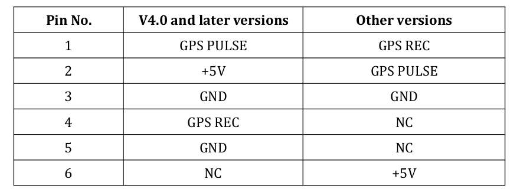

         该接口支持采用`RS232`协议进行通讯与GPS端相连接。**由于没有固定连接线，因此需要手动制作**。其中：`GND`和`TXD`由CGI-410中的`A_RS232`口提供（详见DB9口定义），分别对应激光的`GND`和`GPS REC`，CGI-410中的PPS授时线连接激光的`GPS PULSE`接口，其余部分悬空即可。

         同步线的制作详见附录C。

         | Pin口 | CGI-410端      | Lidar端   |
         | ----- | -------------- | --------- |
         | 1     | PPS授时端口    | GPS PULSE |
         | 2     | 悬空           | 悬空      |
         | 3     | A_RS232中的GND | GND       |
         | 4     | A_RS232中的TXD | GPS REC   |
         | 5     | 悬空           | 悬空      |
         | 6     | 悬空           | 悬空      |

       + **同步模式选择**：

         由于速腾激光雷达默认同步模式无法与华测惯导配合，因此需要对激光雷达的固件进行刷写。（该部分实际操作详见附录C）

         速腾Lidar的时钟同步具有三种授时模式：**这里我们将采用Mode2的方式进行同步**。

         【 Mode 0】：取 PPS 脉冲前一个 GPRMC， LiDAR 端 PPS 上升沿触发同步（对应源 PPS 下降沿）， 需要保证源 PPS 下降沿的稳定性——周期波动满足 1s±100us。 最终同步后的时间满足： RS + 1s + PPS 脉宽 = V（新固件之前的时间同
         步机制）

         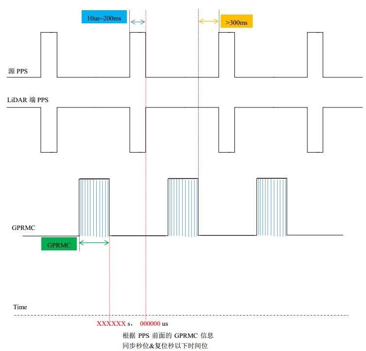

         【 Mode 1】： 取 PPS 脉冲前一个 GPRMC， LiDAR 端 PPS 下降沿触发同步（对应源 PPS 上升沿）， 需要保证源 PPS 上升沿稳定性——周期波动满足 1s±100us。 最终同步后的时间满足： RS + 1s = V。同时此模式下 V4.0 以上 16 线/V2.0以上 32 线表现的同步效果和 V3.3 以下 16 线/V1.7 以下 32 线保持一致。

         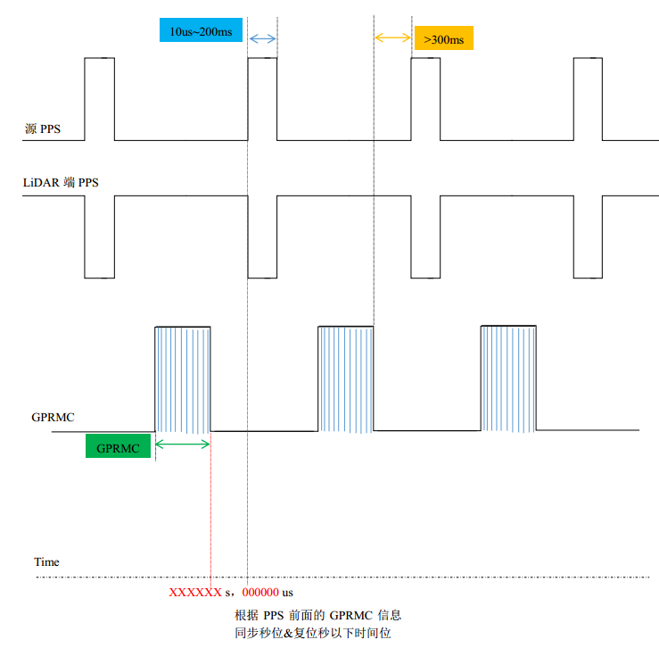

         【 Mode 2】： 取后一个 GPRMC， LiDAR 端 PPS 下降沿触发同步（对应源 PPS 上升沿）， 需要保证源 PPS 上升沿稳定性——周期波动满足 1s±100us。 最终同步后的时间满足： RS = V。

         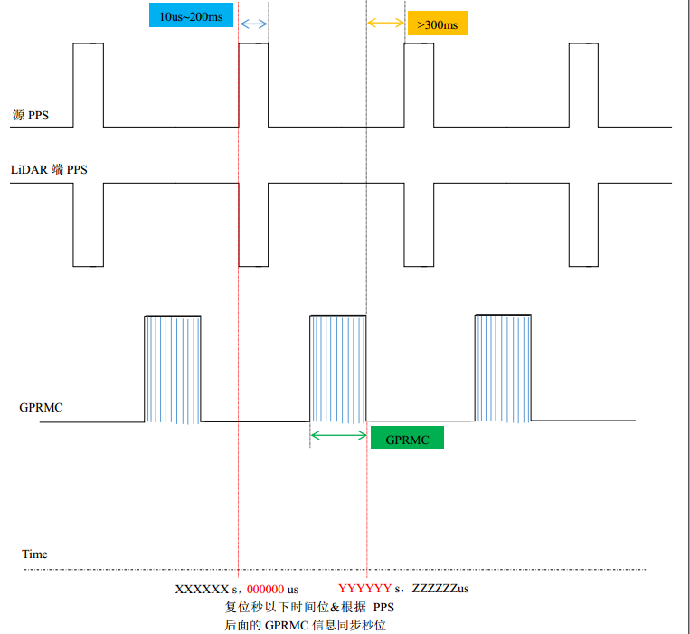

**2. 工业级别的同步方式：硬件同步**

   自动驾驶系统中，几乎每个测量设备都有一个自己的时钟源，因此必须统一时钟源，以保证各个设备的时间戳是对齐的。考虑到原子钟的精确性，系统一般选择GNSS作为主时钟源，并对其他设备进行时间同步。注意，这里的时间同步并不是说仅仅同步一次就好，因为钟漂的存在，时间戳必须不断进行矫正。

   考虑到在部分信号不好的地段，如隧道等场景下，GNSS信号会丢失进而无法矫正时间，自动驾驶系统会指定一个晶振频率最高的设备（一般是专门的设备，如果imu或者lidar晶振很高也可能被选择）作为主时钟源，然后根据主时钟进行推断。

   利用硬件同步方案，可以构造一个**触发装置**，在指定的时刻，发送触发信号，让所有的传感器触发成像，减少成像时刻误差。

   + 连接GPS信号和NTP server，确保时钟实现微秒级同步；

   + 设置触发逻辑（如LiDAR正前方的成像相位），同时触发LiDAR和Camera成像；

   + 支持多LiDAR和多Camera，暂不支持Radar和超声波雷达

   + 系统精度更高，可将系统**同步精度控制在5 ms以内**；缺点是丢失一些系统的灵活度和高频数据，camera成像频率原本可以更高的。

     

**3. Camera设备的同步**：

   + 与IMU的同步，常见于VIO系统中：
     + imu、相机使用同一个时钟晶振：这样做的好处是不用考虑太多额外的因素，但是要求IMU和相机距离足够接近（这在自动驾驶场景下是不现实的），没有其他干扰，也不需要其他设备进行同步。
     + 常见的硬件同步解决方案：以IMU时钟触发Camera曝光
     + 软同步方法：具体内容详见`VIO的第八讲`
   
   + 与点云进行同步：
     + 常见的硬件同步解决方案：触发装置同时触发成像和曝光。
     + 常见的软件同步解决方案：由于lidar有成熟的硬件同步机制，可以将lidar与系统进行硬件同步，并将lidar点云逐步投影到相机中来，当某一帧能够对齐时候完成补偿。之后，分别在驱动中减去时间戳补偿，可以将这种时间误差补偿到10 ms以下。（详见`多传感器融合感知第一章节`）

## 0.2. Apollo中的各个坐标系

在惯性导航中，一般将坐标系分为两类：**惯性坐标系**、**非惯性坐标系**。惯性坐标系包括：日心惯性系、地心惯性系。非惯性坐标系包括：地球坐标系、地理坐标系等。

### 0.2.1. 地心惯性坐标系（i 系， ECI）

惯性坐标系是指坐标轴指向保持不变的坐标系，例如地心惯性坐标系。它具有以下特征：

+ 常用$o_ix_iy_iz_i$表示，原点为地球中心。$o_ix_i$和$o_iy_i$在地球赤道平面内，其中前者指向春分点。$o_iz_i$轴为地球自转轴，指向北极，$o_iy_i$轴沿右手规则确定。（ x，y 轴指向两颗恒星）

+ IMU测量得到的加速度，角速度都是相对于这个坐标系的。

### 0.2.2. 地球坐标系（e系，地心地固坐标系，ECEF）

+ 表示形式为：$o_ex_ey_ez_e$，角标常用*e(earth)*表示。

+ 地球中心为坐标原点*o*，*oz*轴沿地球自转轴方向，*ox*轴是赤道平面和本初子午面的交线（注意本初子午面只有一个），*oy*轴沿右手规则确定。

+ 地球坐标系是和地球固连的，它与地球一起相对惯性坐标系以地球的自转角速度进行转动。

### 0.2.3. 全球地理坐标系统（g系，大地坐标系）

**WGS84坐标系**

Apollo采用的是WGS84（World Geodetic System 1984）作为标准坐标系来表示物体的纬度，经度和高度（LLT）。

+ 表示形式：通过使用该标准坐标系统，我们可以使用2个数字：x坐标和y坐标来唯一的确定地球表面上除北极点之外的所有点，**其中x坐标表示经度（longitude），y坐标表示纬度（latitude）**。

+ WGS84坐标系的坐标原点位于地球的质心，Z轴指向BIHl984.0定义的协议地球极方向[ 指向格林威治子午线（本初子午线）]，X轴指向BIHl984.0的起始子午面和赤道的交点, 在**地球赤道平面内**相互垂直。

+ 经度0.00001度（十万分之一度,0°0'0.036'）,在赤道上对应的地球表面距离约为1米稍多,但在南北极极点上,则是0米.纬度0.00001度在地球表面任意地方对应的地球表面距离都是大约1米稍多。**WGS84椭球体**也经常在转换中被使用。

  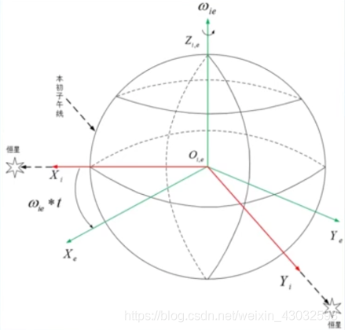

**UTM坐标系**

+ 将**球面经纬度坐标经过投影算法转换成的平面坐标**，即通常所说的XY坐标，单位为**米制**。UTM相当于是**把世界分成了若干个ENU坐标系，每个zone对应一个ENU**。

+ 表示形式：坐标$(x,y)$加上投影带号就能表示地球上的一点。例如，`11U 358657mE 5885532mN`：

  + `11U` 表示位于经度11区，位于纬度U区
  + `358657mE` 表示东向位置为358657 m
  + `5885532mN` 表示北向位置为5885532 m

+ UTM投影坐标使用”等角横轴切割圆柱“模型划分，基于网格的方法进行表示：

  +  经度分区：编号1-60，其中58个区的东西跨度为 6°
  +  纬度分区：编号C-X (不含I,O,共20个区)，每个区的南北跨度为 8°
  +  A，B，Y，Z覆盖南极和北极区
  +  N为第一个北纬带，N之后的字母均为北纬带，N之前的字母均为南纬带

+ 坐标系方向：UTM坐标系原点跟id有关。一个id对应一个原点。以正东方向为x轴正方向（UTM Easting），正北方向为y轴正方向（UTM Northing）。

+ **“WGS84”坐标系的墨卡托投影分度带（UTM ZONE）选择方法**:

  + UTM是由美国制定，因此起始分带并不在本初子午线，而是在180度，因而所有美国本土都处于0－30带内。北京地区位于50带内；
  + 北半球地区，选择最后字母为“N”的带； 
  + 可根据公式计算，`带数=（经度整数位/6）的整数部分+31` 如：江西省南昌新建县某调查单元经度范围`115°35′20″—115°36′00″`， 带数为`115/6+31=50`，选`50N`，即`WGS84 UTM ZONE 50N`。

  

### 0.2.4. 局部地理坐标系统（导航坐标系统，N系）

局部地理坐标系通常使用的有 “东北天”坐标系和“北东地”坐标系。在Apollo系统中，局部坐标系的定义为：东北天坐标系（East-North-Up， ENU）。在惯导和组合导航中，导航坐标系通常选用地理坐标系，两者保持一致。

**1. “东北天”坐标系：**

z轴 – 指向上方（和重力线成一条直线）；y轴 – 指向北面；x轴 – 指向东面。在该坐标系下，标准重力表示为：$[0, 0, -9.81]$，静止的物体表示为$[0,0,9.81]$。ENU一般采用三维直角坐标系来描述地球表面，实际应用较为困难，因此一般使用**简化后的二维投影坐标系来描述**（即UTM坐标系）。

   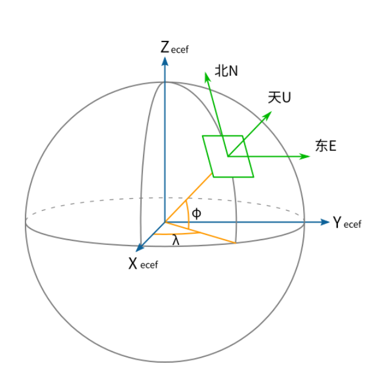

**2. 使用`Proj.4`库完成坐标转换：**

   + `Proj.4`库介绍：Proj.4 是开源 GIS 最著名的地图投影库，功能主要有经纬度坐标与地理坐标的转换，坐标系的转换，包括基准变换等。百度Apollo系统中采用了该库作为转换工具。

   + `Proj.4`库常用的几种参数：

     ```c++
     +proj      投影名
     +zone      UTM区域
     +ellps     椭球体名
     +towgs84   3或7参数基准面转换
     +units     m(米)，us-ft（美国测量英尺）
     +no_defs   不要使用/usr/share/proj/proj_def.dat缺省文件
     
     +datum     基准面名
     +lat_0     维度起点
     +lon_0     中央经线
     +k_0       比例因子
     +south     表示南半球UTM区域
     ```

   + 常用`proj-strings`：

     ```c++
     const char *UTM_TEXT = 
     	"+proj=utm +zone=50 +ellps=WGS84 +towgs84=0,0,0,0,0,0,0 +units=m +no_defs";
     const char *WGS84_TEXT = "+proj=latlong +ellps=WGS84";
     ```

     + `+proj=latlong`：表示在WGS84坐标系下
     + `+proj=utm`：表示在utm坐标系下
     + `+ellps=WGS84`：地球模型采用WGS84椭球体
     + `+towgs84=0,0,0,0,0,0,0`：基准面变换可以使用3参数空间变换(地心空间直角坐标系)，或7参数变换(平移 + 旋转 + 缩放)。WGS84与UTM基准一致，无需没有额外变换。
     + `+no_defs`：基准网格转换文件`/usr/local/share/proj/ntv1_can.dat`不会被加载

   + 完成从WGS84到UTM坐标系的转换

     ```c++
     #define ACCEPT_USE_OF_DEPRECATED_PROJ_API_H
     #include <proj_api.h>
     constexpr double DEG_TO_RAD_LOCAL = M_PI / 180.0;
     
     projPJ wgs84pj_source_ = pj_init_plus(WGS84_TEXT);
     projPJ utm_target_ = pj_init_plus(UTM_TEXT);
     double x = ins->position().lon();
     double y = ins->position().lat();
     x *= DEG_TO_RAD_LOCAL;
     y *= DEG_TO_RAD_LOCAL;
     pj_transform(wgs84pj_source_, utm_target_, 1, 1, &x, &y, NULL);
     pj_free(wgs84pj_source_);
     pj_free(utm_target_);
     ```

### 0.2.5. 载体坐标系统

**1. 车辆坐标系（B系）：** 
**右-前-上**（Right-Forward-Up **RFU**）。车辆坐标系的原点在车辆**后轮轴的中心**。z轴 – 通过车顶垂直于地面指向上方；y轴 – 在行驶的方向上指向车辆前方；x轴 – 面向前方时，指向车辆右侧。

   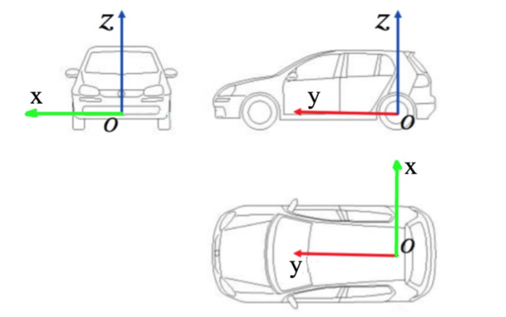

**2. IMU坐标系：** 
Apollo中，imu坐标系和载体坐标系一致。和载体固定连在一起，和n系有一个旋转关系。IMU坐标系也是各个传感器的父坐标系。

   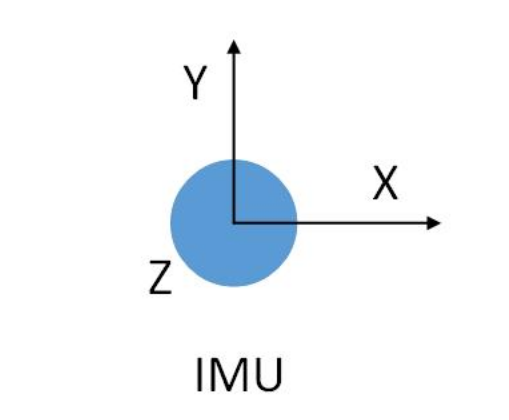

**3. 激光坐标系：**
Apollo中采用**前-左-上**坐标系（**FLU**）

   

### 0.2.6. 内外参文件的解析

以`lidar16_novatel_extrinsics.yaml`为例：

```yaml
header:
  stamp:
    secs: 1570694831
    nsecs: 0
  seq: 0
  frame_id: novatel
child_frame_id: lidar16
transform:
  rotation:
    x: 0.0
    y: 0.0
    z: 0.7071
    w: 0.7071
  translation:
    x: 0.0
    y: 0.414
    z: 0.897
```

这里的`header.frame_id`类似于ROS系统中的`parent frame` ，`child_frame_id`中类似于ROS系统中`child frame`，他们的关系如下：

+ 从坐标系变换的角度：parent是原坐标系，child是变换后的坐标系，因此存在一个变换矩阵$T^{\text{parent}}_{\text{child}}$。
+ 从坐标系的角度：可以看做child坐标系在parent坐标系下的描述。

## 0.3. 同步线制作与固件刷机

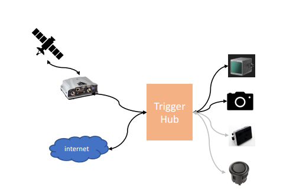

**1. 时钟同步方法：**

   组合惯导通过串口A_RS232发布GPRMC数据为Lidar传输GPS时间，串口波特率对应为9600. 

**2. PPS脉冲信号+NMEA消息**: 

   PPS信号以1hz的频率向Lidar发送整秒触发信号，一旦接收到GPS发来的PPS信号，则会对Lidar的时间整秒以下的时间进行清零，整秒及以上则是通过串口A发来的包含时间的GPRMC数据进行幅值来完成对Lidar的授时操作。

**3. 制作材料准备：**

   PPS信号线×1，DB9单公头串口线×1, SH1.0-6P接线端子，电烙铁，热缩管，剥线钳，绝缘胶带

**4. 接线端口定义：** 

   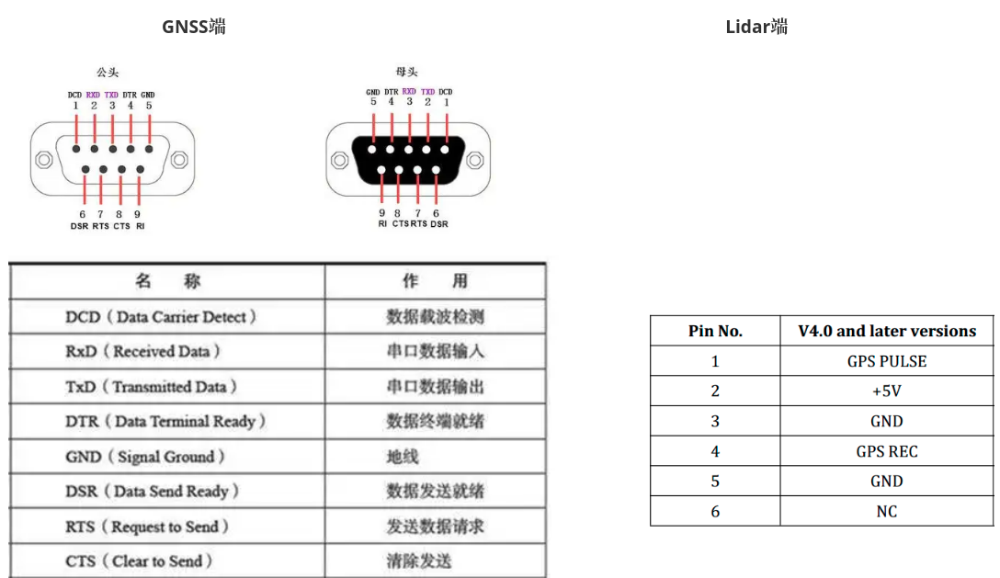

**5. 接线操作：**

   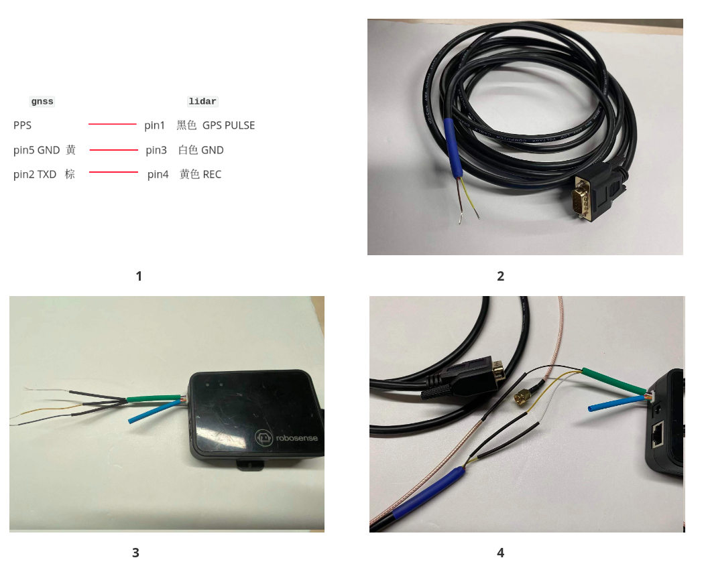

**6. Lidar固件刷机**

     通过固件信息配置的方法，对Lidar的同步模式进行设定，根据速腾雷达的说明手册**`时间同步模式说明`**，需要将Lidar的同步模式设定为模式2,具体操作参考传感器说明书**`手册_速腾16线 ` 附录C**进行对同步模式进行配置。

     

## 0.4. DreamView用法介绍

DreamView是一个web应用程序，提供如下的功能：
1. 可视化显示当前自动驾驶车辆模块的输出信息，例如规划路径、车辆定位、车架信息等。
2. 为使用者提供人机交互接口以监测车辆硬件状态，对模块进行开关操作，启动自动驾驶车辆等。
3. 提供调试工具，例如PnC监视器可以高效的跟踪模块输出的问题

### 0.4.1. 界面布局和工具

该应用程序的界面被划分为多个区域：标题、侧边栏、主视图和工具视图。

**1. 标题**
标题包含4个下拉列表，可以像下述图片所示进行操作：
 

附注：导航模块是在Apollo 2.5版本引入的满足低成本测试的特性。在该模式下，Baidu或Google地图展现的是车辆的绝对位置，而主视图中展现的是车辆的相对位置。

**2. 侧边栏和工具视图**
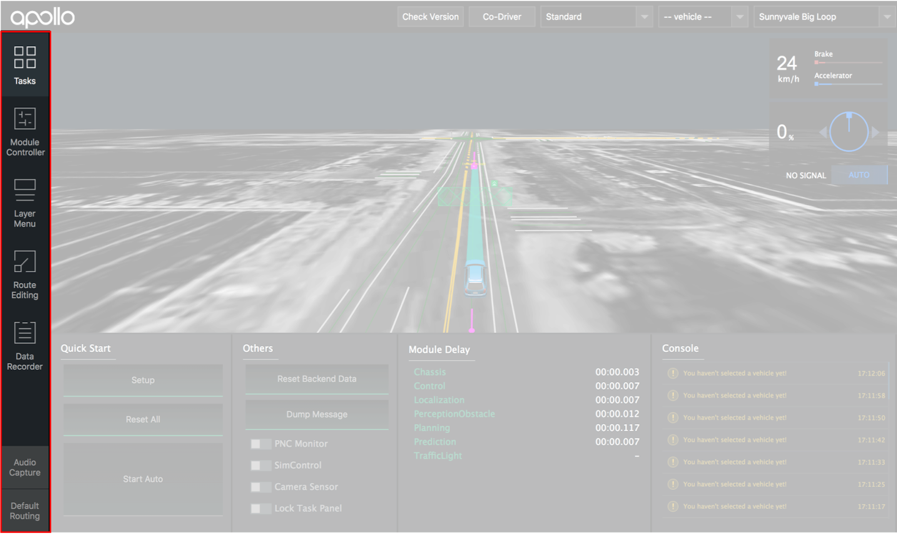 
侧边栏控制着显示在工具视图中的模块

**3. Tasks**
在DreamView中使用者可以操作的tasks有：


* **Quick Start**: 当前选择的模式支持的指令。通常情况下，

    **setup**: 开启所有模块

    **reset all**: 关闭所有模块

    **start auto**: 开始车辆的自动驾驶
* **Others**: 工具经常使用的开关和按钮
* **Module Delay**: 从模块中输出的两次事件的时间延迟
* **Console**: 从Apollo平台输出的监视器信息

**4. Module Controller**
监视硬件状态和对模块进行开关操作
 

**5. Layer Menu**
显式控制各个元素是否显示的开关
 

**6. Route Editing**
在向Routing模块发送寻路信息请求前可以编辑路径信息的可视化工具
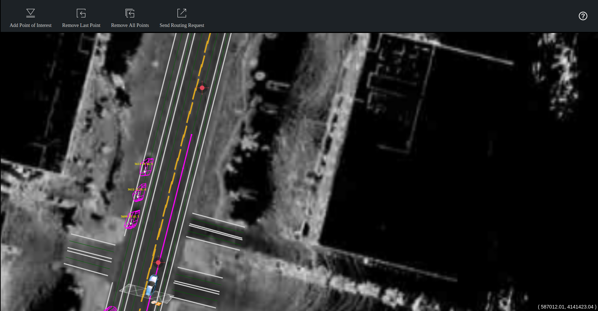

**7. Data Recorder**
将问题报告给rosbag中的drive event的界面
  

**8. Default Routing**
预先定义的路径或者路径点，该路径点称为兴趣点（POI）。

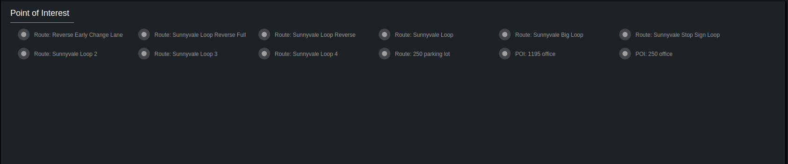 

如果打开了路径编辑模式，路径点可被显式的在地图上添加。

如果关闭了路径编辑模式，点击一个期望的POI会向服务器发送一次寻路请求。如果只选择了一个点，则寻路请求的起点是自动驾驶车辆的当前点。否则寻路请求的起点是选择路径点中的第一个点。

查看Map目录下的[default_end_way_point.txt](../../modules/map/data/demo/default_end_way_point.txt)文件可以编译POI信息。例如，如果选择的地图模式为“Demo”，则在`modules/map/data/demo`目录下可以查看对应的 [default_end_way_point.txt](../../modules/map/data/demo/default_end_way_point.txt) 文件。

### 0.4.2. 主视图元素
主视图在web页面中以动画的方式展示3D计算机图形

 

**1. 主视图中部分元素：**

| Visual Element                           | Depiction Explanation                    |
| ---------------------------------------- | ---------------------------------------- |
|  | <ul><li>自动驾驶车辆    </li></ul>                  |
|  | <ul><li>车轮转动的比率</li> <li>左右转向灯的状态</li></ul> |
|  | <ul><li>交通信号灯状态</li></ul>          |
|  |<ul><li>  驾驶状态（AUTO/DISENGAGED/MANUAL等） </li></ul>  |
|  | <ul><li>行驶速度 km/h</li> <li>加速速率/刹车速率</li></ul> |
| 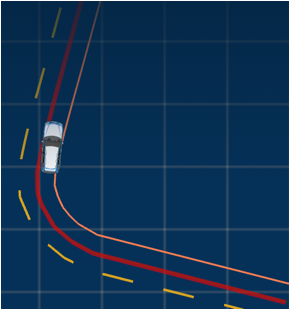 | <ul><li> 红色粗线条表示建议的寻路路径</li></ul>  |
|  |<ul><li>  轻微移动物体决策—橙色表示应该避开的区域 </li></ul> |
|  |<ul><li>  绿色的粗曲线条带表示规划的轨迹 </li></ul> |

**2. 障碍物**

| Visual Element                           | Depiction Explanation                    |
| ---------------------------------------- | ---------------------------------------- |
|  | <ul><li>车辆障碍物   </li></ul>                     |
|  | <ul><li>行人障碍物    </li></ul>                 |
|  | <ul><li>自行车障碍物      </li></ul>                |
|  | <ul><li>未知障碍物 </li></ul>                        |
|  | <ul><li>速度方向显示了移动物体的方向，长度随速度按照比率变化</li></ul>  |
|  | <ul><li>白色箭头显示了障碍物的移动方向</li></ul>  |
|  | 黄色文字表示: <ul><li>障碍物的跟踪ID</li><li>自动驾驶车辆和障碍物的距离及障碍物速度</li></ul> |
|  | <ul><li>线条显示了障碍物的预测移动轨迹，线条标记为和障碍物同一个颜色</li></ul>  |

**3. 决策栅栏区**

决策栅栏区显示了Planning模块对车辆障碍物做出的决策。每种类型的决策会表示为不同的颜色和图标，如下图所示：

| Visual Element                           | Depiction Explanation                    |
| ---------------------------------------- | ---------------------------------------- |
|  | <ul><li>**停止** 表示物体主要的停止原因</li></ul>  |
|  | <ul><li>**停止** 表示物体的停止原因n</li></ul>  |
|  | <ul><li>**跟车** 物体</li></ul>                        |
|  | <ul><li>**让行** 物体决策—点状的线条连接了各个物体</li></ul>  |
| 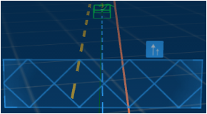 | <ul><li>**超车** 物体决策—点状的线条连接了各个物体</li></ul>  |

线路变更是一个特殊的决策，因此不显示决策栅栏区，而是将路线变更的图标显示在车辆上。

| Visual Element                           | Depiction Explanation                    |
| ---------------------------------------- | ---------------------------------------- |
|  | <ul><li>变更到**左**车道 </li></ul>|
|  | <ul><li>变更到**右**车道 </li></ul>|

在优先通行的规则下，当在交叉路口的停车标志处做出让行决策时，被让行的物体在头顶会显示让行图标

| Visual Element                                       | Depiction Explanation          |
| ---------------------------------------------------- | ------------------------------ |
|  | 停止标志处的让行物体 |

**4. 决策停止原因**

如果显示了停止决策栅栏区，则停止原因展示在停止图标的右侧。可能的停止原因和对应的图标为：

| Visual Element                           | Depiction Explanation                    |
| ---------------------------------------- | ---------------------------------------- |
|  | <ul><li>**前方道路侧边区域** </li></ul>|
|  | <ul><li>**前方人行道** </li></ul>|
|  | <ul><li>**到达目的地** </li></ul>|
|  | <ul><li>**紧急停车**  </li></ul>       |
|  | <ul><li> **自动驾驶模式未准备好** </li></ul>|
|  | <ul><li>**障碍物阻塞道路**</li></ul> |
|  | <ul><li> **前方行人穿越** </li></ul> |
|  | <ul><li>**黄/红信号灯** </li></ul>|
|  | <ul><li> **前方有车辆** </li></ul> |
|  | <ul><li> **前方停止标志** </li></ul>|
|  | <ul><li>**前方让行标志** </li></ul> |

**5. 视图模式**
可以在主视图中展示多种从**Layer Menu**选择的视图模式：

| Visual Element                           | Point of View                            |
| ---------------------------------------- | ---------------------------------------- |
|  | <ul><li>**默认视图**      </li></ul> |       |
| 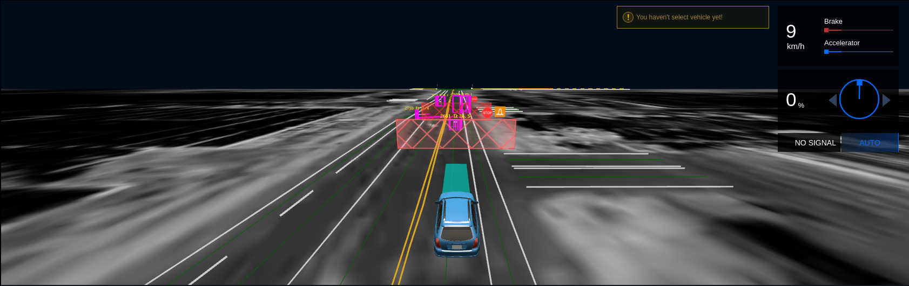 | <ul><li>**近距离视图**   </li></ul> |             |
|  | <ul><li>**俯瞰视图**    </li></ul> |        |
| 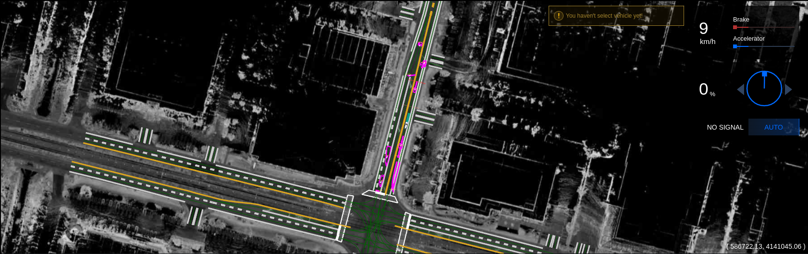 | **地图** <ul><li> 放大/缩小：滚动鼠标滚轮或使用两根手指滑动 </li><li> 移动：按下右键并拖拽或或使用三根手指滑动</li></ul> |
