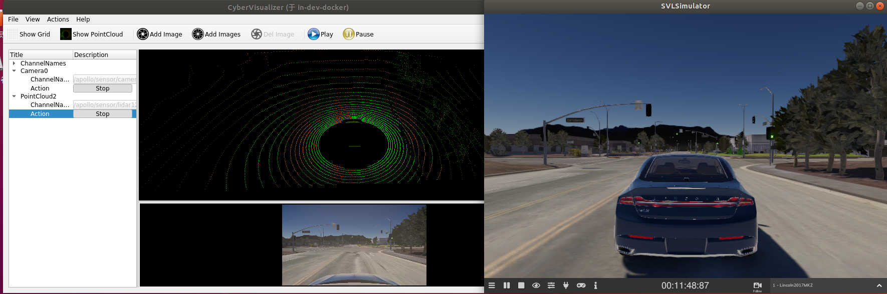
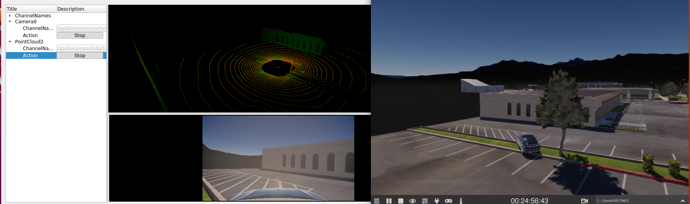
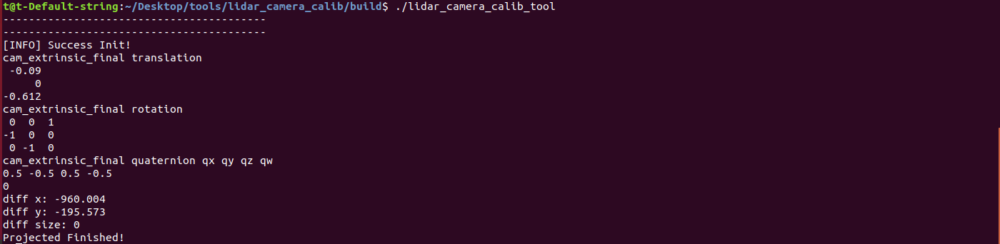

# 2. Apollo&SVL联合仿真:标定

## 目录
[toc]
  
## 2.1. 简介

在实车中，由于安装误差以及传感器各自的参数不同导致这些传感器参数均需要我们进行标定来获取，构建出一个符合汽车自身的TF树。相机的内参标定包含畸变系数以及焦距大小，以深蓝学院的小车为例，传感器之间的外参包含Lidar-Imu,Camera到Lidar之间的变换。

## 2.2. Camera内参标定

在SVL仿真中，由于无法进行标定，这里以真实环境中采集的数据为例对camera内参标定工具的使用进行介绍，标定板采用的是7×6_50×50大小的棋盘格，采集包含各种远近不等的旋转图像。
### 2.2.1. 使用ROS进行相机标定

#### 2.2.1.1. 运行标定程序

开启摄像机：

```bash
roslaunch usb_cam usb_cam-test.launch
```
启动有warning例如提示校准配置文件`head_camera.yaml not found`，这个是正常的，我们标定完后才会生成这个配置文件。

根据你的棋盘格修改参数

- 一个是size参数为棋盘格角点数量比如8x9=72个格子的棋盘格，角点个数为7x8=63个，size参数就要写7x8
- 另外一个参数为square，传入的参数为棋盘格一个小格子的宽度（注意单位为m）
- `image:=/usb_cam/image_raw` 标定当前订阅图像来源自名为/usb_cam/image_raw的topic
- `camera:=/usb_cam` 为摄像机名

```bash
rosrun camera_calibration cameracalibrator.py --size 7x6 --square 0.05 image:=/usb_cam/image_raw camera:=/usb_cam
```

#### 2.2.1.2. 图像采集

采集人员分为两组，一组使用ROS程序进行采集；另一组手持棋盘格，在图像视野范围内进行操作和移动。
示例使用的标定板为7×6_50×50大小的标准棋盘格进行。


1. 手持棋盘格要求：

   + 每次采集尽量保持稳定，最终成像光线适中，图像清晰；
   + 手持棋盘格时不能对棋盘格进行遮挡，不能离开相机视野范围内；
   + 采集图像类型需要丰富多样，包含：近距离图像、中距离图像、远距离图像、左右倾斜图像、上下倾斜图像、轻微旋转图像、较大旋转图像、相机靠近左视野边缘图像、相机靠近右视野边缘图像等；
   + 采集有效图像的数量在15-35张左右；
2. 界面中的 `X`,`Y`,`size`,`skew`的含义：

    `X`：表示标定板在视野中的左右位置。

    `Y`：表示标定板在视野中的上下位置。

    `size`：标定板在占视野的尺寸大小，也可以理解为标定板离摄像头的远近。

    `skew`：标定板在视野中的倾斜位置

3. 标定实操技巧：在相机视野范围内且能识别棋盘格的前提下，左右、上下和前后移动范围尽可能大一些，将有助于更快地满足`X`,`Y`,`Size`的要求；边移动边扭转标定板，可以更快完成`Skew`。当X、Y、Size、Skew四个都变成绿色，然后就可以看到CALIBRATE这个按钮变成青色，表明已经采到足够多的图片数据可供标定了。 

#### 2.2.1.3. 生成标定文件

点击CALCULATE进行标定会稍微有点卡顿，不要担心后台正在进行标定，标定完成后观察当前的相机界面，
如果相机成像完全正常了，则说明标定成功了，点击界面右下面的SAVE和COMMIT按钮， 
可保存标定完成后的文件到路径 `/home/USERNAME/.ros/camera_info/head_camera.yaml`。
另外**在原来的terminal界面也会有对应的参数**`D K R P`。

参数说明 *

distortion_model指定了畸变模型

D：distortion_coefficients指定畸变模型的系数

K：camera_matrix规定了摄像头的内部参数矩阵

R：rectification_matrix为矫正矩阵，一般为单位阵

P：projection_matrix为外部世界坐标到像平面的投影矩阵


### 2.2.2. 更改apollo中的配置文件

**在原来的terminal中**找到标定获得的内参数`D K R P`，用其替换
`modules/calibration/data/dev_kit_pix_hooke/camera_params/front_camera_intrinsics.yaml`对应参数并保存，即完成相机内参标定。
*注意参数后面是接冒号 `:`  示例如下*

```yaml
header:
    seq: 0
    stamp:
        secs: 0
        nsecs: 0
    frame_id: white_mkz_onsemi_obstacle
height: 1080
width: 1920
distortion_model: plumb_bob
D: [-0.54336, 0.26653, -0.00099, -0.00170, 0.00000]
K: [2033.39968, 0.0, 929.01881, 0.0, 2046.55356, 572.81049, 0.0, 0.0, 1.0]
R: [1.0, 0.0, 0.0, 0.0, 1.0, 0.0, 0.0, 0.0, 1.0]
P: [1729.4515380859375, 0.0, 997.0791139046996, 0.0, 0.0, 1926.0577392578125, 571.4609883012963, 0.0, 0.0, 0.0, 1.0, 0.0]
binning_x: 0
binning_y: 0
roi:
  x_offset: 0
  y_offset: 0
  height: 0
  width: 0
  do_rectify: False
```

## 2.3. Lidar-Gnss标定

Lidar到Ins的标定，同样可以理解为点云拼接的过程，我们将代码写在`/apollo/modules/localization/msf/local_tool/map_creation/`目录下，大约200行的一个程序`lidar_camera_calib.cc`

### 2.3.1. 传感器数据收集

- 参照文档（一）启动apollo和svl_simulator在cyber_visualizer下检查数据接受是否正常

- 寻找标定场地，将汽车开至有墙角的建筑物附近来进行标定

- 绕建筑物墙体周围转一圈，进行数据采集

 

  ```bash
  cyber_recorder record -a -k /apollo/sensor/camera/front_12mm/image/compressed /apollo/sensor/camera/front_6mm/image/compressed -i 600
  ```

### 2.3.2. 数据解析

- 在`/apollo/data/bag/`目录下下新建`lidar_ins_calibration`文件夹，将录制的数据包粘贴进去。

- 采用lidar数据解析的脚本文件进行数据解析来获取点云的pcd文件已经通过插值来获得对应的位姿。

```bash
bash scripts/lidar_parse.sh /apollo/data/bag/calibration /apollo/data/bag/lidar_ins_calibration lidar128
```

### 2.3.3. Lidar-Ins标定

- 执行标定文件：

这里需要用到interactive slam包，可以让我们手动对齐点云。

   ```bash
   # 以下命令均在docker外执行
   # 安装依赖，若已安装请跳过
   sudo apt-get install libglm-dev libglfw3-dev
   
   sudo apt-get install ros-melodic-geodesy ros-melodic-pcl-ros ros-melodic-nmea-msgs ros-melodic-libg2o

   # interactive slam包已经下载好在 /apollo/catkin_ws
   cd /apollo/catkin_ws

   catkin_make -j4

   roscore

   # 新建一个终端
   cd /apollo/catkin_ws

   source devel/setup.bash

   rosrun interactive_slam odometry2graph
   ```


> note：这里有用到IMU进行插值，IMU发过来的measurement_time存在延迟的情况，不过还好，在进行插值的时候采用的是odometry的时间戳，他的时间戳没有问题，大家放心使用

在标定过程中，建议大家最好是绕着一堵墙进行旋转，目的就是在进行标定过程中，将墙体作为参照物，尽可能的将墙体的点云拼的越薄越好，成一条线。在实车测试中我们可以通过尺子进行测量来他们之间的平移变换，在标定工具中来对旋转进行标定，主要是yaw角。

 

标定完成后，结果会在终端进行显示。


## 2.4. Lidar-Camera标定

### 2.4.1. 传感器数据收集

- 参照文档(1)启动apollo和svl_simulator在cyber_visualizer下检查数据接受是否正常



- 寻找标定场地，将汽车开至有墙角的建筑物附近来进行标定，如下图所示



- 录制数据包，录制几秒钟后`Ctrl+C`结束，`*. record.*`文件将保存在`apollo`根目录下

  ```
  cyber_recorder record -a
  ```

  在`\apollo\data\bag`目录下新建`calibration`文件夹，将录制好的bag包文件粘贴进来。

### 2.4.2. 数据解析

#### 2.4.2.1. 图像数据解析

数据解析用到了`apollo`自带的解析程序，将我们的录制包中的`image`保存成`jpeg`格式的图片

- 修改数据解析的参数配置文件，在`/apollo/modules/tools/record_parse_save`文件目录下，打开`parser_params.yaml`文件
  - `filepath:` 改为我们存放数据包的文件夹`/apollo/data/bag/calbration`
  - `parse:` 选为`camera`
  - `camera`的`channel_name`: 选为我们实际压缩图像的`topic`名，如`/apollo/sensor/camera/front_6mm/image/compressed`


- 执行数据解析程序 

  ```
  ./bazel-bin/modules/tools/record_parse_save/record_parse_save
  ```

  解析完成后，会将图像保存在我们数据包的上一级目录下文件夹下`data_camera_6mm_front`。

#### 2.4.2.2. Lidar数据解析

lidar的数据解析需要借助MSF下的数据解析程序，由于仿真数据发过来的数据跟其消息的大小不一致，我们需要对apollo内部程序稍作更改即可

- 打开`/apollo/modules/localization/msf/local_tool/data_extraction/pcd_exporter.cc`,在程序的第61行`void PCDExporter::WritePcdFile(const std::string &filename, const drivers::PointCloud &msg) `函数内，将`    cloud.width，cloud.height `做如下改写。

  ```c++
    bool bsimulator = true;
    if(bsimulator == true)
    {
      std::cout << "msg.size: "<< msg.point_size() << "msg.width() "<< msg.width()<< " msg.height() "<<msg.height()<< std::endl;
      cloud.width = msg.point_size();
      cloud.height = 1;
    }
    else{
      cloud.width = msg.width();
      cloud.height = msg.height();
    }
  ```

  重新编译apollo程序

  ```bash
  ./apollo.sh build_opt localization
  ```

- 添加数据解析脚本

  在/apollo/sripts文件夹下新建`lidar_parse.sh`脚本文件，copy以下程序

  ```bash
  #! /bin/bash
  if [ $# -lt 3 ]; then
    echo "Usage: msf_simple_map_creator.sh [records folder][output folder]  [extrinsic_file] [lidar_type]"
    exit 1
  fi
  
  DIR="$(cd "$(dirname "${BASH_SOURCE[0]}")" && pwd)"
  cd "${DIR}/.."
  
  source "${DIR}/apollo_base.sh"
  
  GNSS_LOC_TOPIC="/apollo/localization/msf_gnss"
  LIDAR_LOC_TOPIC="/apollo/localization/msf_lidar"
  FUSION_LOC_TOPIC="/apollo/localization/pose"
  ODOMETRY_LOC_TOPIC="/apollo/sensor/gnss/odometry"
  
  GNSS_LOC_FILE="gnss_loc.txt"
  LIDAR_LOC_FILE="lidar_loc.txt"
  FUSION_LOC_FILE="fusion_loc.txt"
  ODOMETRY_LOC_FILE="odometry_loc.txt"
  
  IN_FOLDER=$1
  OUT_MAP_FOLDER=$2
  EXTRINSIC_FILE=$3
  LIDAR_TYPE=${4:-lidar128}
  
  PARSED_DATA_FOLDER="$OUT_MAP_FOLDER/parsed_data"
  CLOUD_TOPIC="/apollo/sensor/lidar128/compensator/PointCloud2"
  
  function data_exporter() {
    local BAG_FILE=$1
    local OUT_FOLDER=$2
    /apollo/bazel-bin/modules/localization/msf/local_tool/data_extraction/cyber_record_parser \
      --bag_file $BAG_FILE \
      --out_folder $OUT_FOLDER \
      --cloud_topic $CLOUD_TOPIC \
      --gnss_loc_topic $GNSS_LOC_TOPIC \
      --lidar_loc_topic $LIDAR_LOC_TOPIC \
      --fusion_loc_topic $FUSION_LOC_TOPIC \
      --odometry_loc_topic $ODOMETRY_LOC_TOPIC
  }
  function poses_interpolation() {
    local INPUT_POSES_PATH=$1
    local REF_TIMESTAMPS_PATH=$2
    local EXTRINSIC_PATH=$3
    local OUTPUT_POSES_PATH=$4
    /apollo/bazel-bin/modules/localization/msf/local_tool/map_creation/poses_interpolator \
      --input_poses_path $INPUT_POSES_PATH \
      --ref_timestamps_path $REF_TIMESTAMPS_PATH \
      --extrinsic_path $EXTRINSIC_PATH \
      --output_poses_path $OUTPUT_POSES_PATH
  }
  
  cd $IN_FOLDER
  mkdir -p $OUT_MAP_FOLDER
  mkdir -p $PARSED_DATA_FOLDER
  for item in $(ls -l *.record* | awk '{print $9}'); do
    SEGMENTS=$(echo $item | awk -F'.' '{print NF}')
    DIR_NAME=$(echo $item | cut -d . -f ${SEGMENTS})
    DIR_NAME="${PARSED_DATA_FOLDER}/${DIR_NAME}"
    mkdir -p ${DIR_NAME}
  
    data_exporter "${item}" "${DIR_NAME}"
    poses_interpolation "${DIR_NAME}/pcd/${ODOMETRY_LOC_FILE}" "${DIR_NAME}/pcd/pcd_timestamp.txt" "${EXTRINSIC_FILE}" "${DIR_NAME}/pcd/corrected_poses.txt"
  
  done
  
  echo "Done."
  ```

- 运行数据解析脚本文件

  ```bash
  bash scripts/lidar_parse.sh /apollo/data/bag/calibration /apollo/data/bag/calibration /apollo/modules/calibration/data/Lincoln2017MKZ/velodyne_params/velodyne128_novatel_extrinsics_example.yaml  lidar128
  ```
  

 在`calibration`文件夹下会生成`parsed_data`，里面存放了Lidar 点云的pcd文件，用于进行标定。


在apollo的docker容器内运行pcl_viewer对点云数据进行查看

```bash
  pcl_viewer data/bag/calibration/parsed_data/00000/pcd/1.pcd
```


#### 2.4.2.3. lidar-camera标定

由于数据采集过程中，我们是对着墙角静止采集，故我们从解析的`image`和`lidar_pointcloud`中任选一帧用于标定，标定工具深蓝学院开源的标定工具进行标定，其基本原理为将Lidar采集的点云通过Lidar->Imu之间的外参进行变换后，经camera的内参变换投影至图像上，观察点云与图像之间的匹配度。

- 任选一帧采集数据，拷贝至标定工具下的`test`文件夹下，并重命名为`1.jpeg`和`1.pcd`

- 将`/apollo/modules/calibration/data/Lincoln2017MKZ/camera_params/`下的相机参数拷贝之`test`文件夹下

- 在`/apollo/lidar_camera_calib/build`文件下运行：

   ```bash
   ./lidar_camera_calib_tool
   ```

  通过点击`explorer`确定lidar和image的相关文件地址后，点击start!
  

  如图所示，Lidar的点云强度到墙的边为止，我们可以拿墙的边界和窗户在作为他们之间的参考，来进行对选旋转的`yaw、pitch、row`以及平移`x、y、z`进行调节，最纵标定结果会在终端进行打印。

  

## 2.5. 油门标定

车辆在某一速度基础上，需要通过车辆的油门和刹车来获得期望加速度。汽车在不同的行驶速度下，想要获取相同的加速度，则其油门和刹车的大小也会不同。我们需要获取汽车速度和加速度之间的关系来更好的实现对车辆的控制，本节内容利用apollo的标定工具来实现汽车的油门刹车标定表。

#### 2.5.0.4. 油门数据采集

1. 启动SVL， 建立仿真车辆同apollo的通信，在cyber_monitor中查看汽车发来的数据

2. 在docker容器中，启动apollo系统 

   ```
   bash bash scripts/bootstrap_lgsvl.sh
   ```

   在`dreamview`下运行 选择 车型`MkzExample`,模式·`Mkz Standard Debug`,地图`Borregas Ave`,打开`Transform`、`Localization`单元,DreamView会加载出车辆及高精地图。

3. 选择标定场地，手动控制汽车至具有一段较长的公路上

4. apollo的容器中缺少我们运行标定工具所需的依赖环境吗，需要运行我们的脚本文件对其进行安装

   ```bash
   bash supplement/update_docker.sh
   ```

5. 数据收集

   > note1：在进行油门标定的过程中我们需要获采集车身的速度以及加速度`corrected_imu`, 在SVL仿真器中存在一个bug，汽车发出来的`corrected_imu`内的消息一直为0,导致无法完成标定。故我们通过采集`imu_raw`和`odometry`信息，通过处理我们自己来发布出一个正确的`corrected_imu`供汽车的油门刹车标定。

   > note2: 通过查阅SVL源码，发现SVL发布的消息`/apollo/sensor/gnss/imu`中IMU的坐标系为前左上，`/apollo/sensor/gnss/odometry`发布的消息中GPS的坐标系为右前上且为`右乘`，基于此我们开始编程生成我们所需要的`corrected_imu`
   >

   ```bash
   ./bazel-bin/modules/tools/vehicle_calibration/data_collector
   ```

   根据提示，x,y,z分别为油门、速度、 刹车。我们通过多次尝试来决定汽车的油门死区，在此基础上不断更改这三个变量值。 

   | x    | y    | z    | x    | y    | z    |
   | ---- | ---- | ---- | ---- | ---- | ---- |
   | 6    | 1    | -10  | 10   | 2    | -15  |
   | 6    | 1.5  | -12  | 10   | 3    | -10  |
   | 8    | 1    | -10  | 15   | 3    | -20  |
   | 8    | 1.5  | -10  | 20   | 4    | -19  |
   | 15   | 8    | -30  | 80   | 4    | -30  |
   | 20   | 7    | -60  | 80   | 5    | -80  |
   

这些采集的数据均保存在`apollo`的根目录下，如`“t6b-10r0_recorded.csv”`,讲这些数据打包，移动至新建文件夹“vehicle_calibration_data”

```bash
   mkdir vehicle_calibration_data && mv *csv ./vehicle_calibration_data
```

6. 数据处理

   ```bash
   bash modules/tools/vehicle_calibration/process_data.sh vehicle_calibration_data
   ```

   在apollo的根目录下，会生成文件`result.csv`

7. 查看标定结果

   ```bash
    ./bazel-bin/modules/tools/vehicle_calibration/plot_results result.csv
   ```
   
   
   
8.  生成protobuf标定文件

     ```
     bash modules/tools/vehicle_calibration/result2pb.sh result.csv 
     ```

    在执行终端的目录下会生成`control_conf.pb.txt` 的控制器相关的配置文件，包括横纵向控制器参数及油门刹车标定表，将该文件拷贝至车辆文件中`/apollo/modules/calibration/data/Lincoln2017MKZ`，在`dreamview`中每次重新选择车辆时，会自动将该文件加载至`/apollo/modules/control/conf`文件夹下。

#### 2.5.0.5. 注意
1. ./baz间戳问题，目前IMU时间戳明显落后，查询gnss时间戳	

   经查证，IMU时间是错的，不用管。

   gnss_odometry之前默认12.5hz，更改为100hz

2. 在apollo中手写一个工具，订阅raw_imu and gnss_odometry，订阅之后在直接吐出去