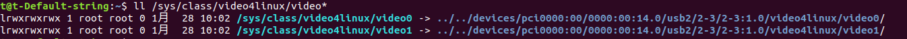

# 第一次课

- [第一次课](#第一次课 )
    - [本节任务](#本节任务 )
  - [1 Apollo系统的基础介绍](#1-apollo系统的基础介绍 )
    - [1.1 Apollo 的容器建立、进入和编译(基础)](#11-apollo-的容器建立-进入和编译基础 )
      - [1.1.1 使用Apollo镜像建立一个容器](#111-使用apollo镜像建立一个容器 )
      - [1.1.2 启动/进入/关闭/重启容器](#112-启动进入关闭重启容器 )
      - [1.1.3 编译Apollo系统](#113-编译apollo系统 )
    - [1.2 DreamView启动方式](#12-dreamview启动方式 )
    - [1.3 启动cyber monitor](#13-启动cyber-monitor )
    - [1.4 各个模块的启动顺序(重要)](#14-各个模块的启动顺序重要 )
    - [1.5 硬件连接、用电安全与遥控器控车](#15-硬件连接-用电安全与遥控器控车 )
  - [2 传感器连接与驱动配置](#2-传感器连接与驱动配置 )
    - [2.1 启动 canbus](#21-启动-canbus )
      - [2.1.1 canbus驱动配置](#211-canbus驱动配置 )
      - [2.1.2 Apollo驱动启动](#212-apollo驱动启动 )
      - [2.1.3 实车相关控制与连接测试](#213-实车相关控制与连接测试 )
    - [2.2 启动TF(Transform)模块](#22-启动tftransform模块 )
      - [2.2.1 配置文件的修改](#221-配置文件的修改 )
      - [2.2.2 启动Transform模块](#222-启动transform模块 )
    - [2.3 启动速腾32线激光传感器(robosense rshelios)](#23-启动速腾32线激光传感器robosense-rshelios )
      - [2.3.1 驱动配置](#231-驱动配置 )
      - [2.3.2 Apollo驱动启动](#232-apollo驱动启动 )
    - [2.4 启动工业相机(LI-USB3.0-AR023ZWDR CS-6mm)](#24-启动工业相机li-usb30-ar023zwdr-cs-6mm )
      - [2.4.1 安装所需要的依赖(docker外部)](#241-安装所需要的依赖docker外部 )
      - [2.4.2 驱动配置(docker外部)](#242-驱动配置docker外部 )
      - [2.4.3 Apollo驱动启动(docker内部)](#243-apollo驱动启动docker内部 )
    - [2.5 启动华测组合导航CGI-410](#25-启动华测组合导航cgi-410 )
      - [2.5.1 组合导航系统的组成](#251-组合导航系统的组成 )
      - [2.5.2 驱动配置(学员实操)](#252-驱动配置学员实操 )
      - [2.5.3 Apollo驱动启动](#253-apollo驱动启动 )
      - [2.5.4 GNSS系统时间说明*](#254-gnss系统时间说明 )

### 本节任务

1. 安装工控机、电源、组合惯导、天线、相机、激光雷达、微波雷达等传感器设备，接线；
2. 了解设备用电安全和行车安全常识，掌握遥控器控车；
3. 确认apollo和车辆底盘的通信，完成键盘控车任务；
4. 启动各传感器驱动，配置组合惯导信息，完成设备初始化工作；
5. 检查GPS信号，相机图像，激光雷达点云输出等。

## 1 Apollo系统的基础介绍
*该部分是使用Apollo docker系统的简单介绍，若有相关基础可以直接跳过。*
### 1.1 Apollo 的容器建立、进入和编译(基础)

#### 1.1.1 使用Apollo镜像建立一个容器

+ 在apollo目录下，使用下述命令**在本地shell**可以建立一个名为`apollo_dev_{用户名}`的容器：

  ```bash
  bash docker/scripts/dev_start.sh -l
  ```

  + 指令后`-l`参数，表示启动**本地**镜像对容器进行构建；不带`-l`参数时，系统将对镜像进行更新检查（需要**联网**），然后创建新的容器
  + 本课程操作中一般带参数`-l`

#### 1.1.2 启动/进入/关闭/重启容器

创建容器后，每次开关机将默认关闭。因此需要首先开启容器。容器开启有两种方式：

1. 继承上次启动的容器。**本地shell**的操作指令为：

   ```bash
   docker start apollo_dev_{用户名} # 继承上次使用的容器

   bash docker/scripts/dev_into.sh # 进入容器
   ```
   类似地，如果遇到某些问题需要关闭或重启docker，可以执行下面的命令：
   ```bash
   docker stop apollo_dev_{用户名} # 关闭容器

   docker restart apollo_dev_{用户名} # 关闭并重启容器
   ```
2. 直接生成一个纯净的新容器，避免之前的操作对系统进行污染，**本地shell**的操作指令为：

   ```bash
   bash docker/scripts/dev_start.sh -l # 从本地镜像生成一个新的容器对原先容器进行覆盖

   bash docker/scripts/dev_into.sh # 进入容器
   ```

考虑运行时间及稳定性等因素，在调试中第一种方式更加常用。

#### 1.1.3 编译Apollo系统

Apollo系统具有多种编译方式，考虑到运行效率，将优先推荐使用`build_opt`操作：

```bash
# apollo docker内部
bash apollo.sh build_opt
```

此外，如果只修改了单个模块，对单个模块进行编译即可：

```bash
bash apollo.sh build_opt localization
```
当编译因为某些原因进行重新处理时，可以删除隐藏文件夹`.cache`；如果不想重新下载库文件，则可以只删除`.cache/build`文件夹。

### 1.2 DreamView启动方式

DreamView是Apollo系统中用于可视化和交互界面模块。进入容器后，可通过以下命令进入DreamView：
```bash
# apollo docker内部
bash scripts/bootstrap.sh
```
待执行完毕后ctrl + 单击终端中显示的 http://localhost:8888 即可打开DreamView。进入DreamView后要在上方选择调试模式、车型和地图，本课程中调试模式选择dev_kit_debug，车型选择dev_kit_pix_hooke。

*附加说明A：由于依靠`Dreamview`的可视化界面上通过点击按钮的方式进行各个传感器启动时，报错和警告信息并不能直观的打印出来，以方便输出调试。因此在车辆调试完成前，每个模块推荐采用launch或者dag直接启动的方式进行。*

*附加说明B：Apollo系统具有如下机制：*

1. 每次启动dreamview并选择车型后，系统自动将`calibration/data/<对应车型名称>`中的参数文件覆盖掉模块中的相对应的文件，如：`~/apollo/modules/calibration/data/dev_kit_pix_hooke/gnss_conf/gnss_conf.pb.txt`会覆盖位于`~/apollo/modules/drivers/gnss/conf/gnss_conf.pb.txt`的文件。因此，推荐在`calibration/data`进行参数的修改。

2. 每次启动dreamview并选择调试模式后，系统自动将按键与对应的dag相关联，其设置可以在`/apollo/modules/dreamview/conf/hmi_modes/xxxx.pb.txt`中进行修改。其中`xxxx`对应不同的debug模式，在本课程中推荐使用`dev_kit_debug.pb.txt`，`key`对应按键的名称，`dag_files`表示对应的启动文件。

3. 按键配置文件被修改后需重启dreamview：`bash scripts/bootstrap.sh restart`
4. 此外，还有相应的停止命令：`bash scripts/bootstrap.sh stop`

### 1.3 启动cyber monitor
在Apollo docker内部输入`cyber_monitor`即可进入cyber_monitor。
利用cyber monitor，我们可以便捷地检查各模块是否处于开启状态、工作状态是否正常等，方便调试。

### 1.4 各个模块的启动顺序(重要)

本文档将以record数据包及线下课程实际传感器输出作为测试数据，指导对各个模块的启动。**各个模块的启动存在依赖关系**，启动顺序应当为：

1. **启动各个传感器部件和控制模块**：包括`Transform`、`lidar`、`GPS`、`camera`、`canbus`等。**注意，播放cyber包时可以跳过该步骤**。
2. **启动定位模块**(`Loclization`)：包括三种算法（基于RTK的定位，基于NDT的定位，基于MSF的定位），启动后两种需要额外制作地图。，主要功能是实现车辆在地图中的定位。
3. **启动感知模块**(`<Sensor> Perception`)：分为给予视觉感知、激光感知、雷达感知和融合感知多个部分，取决于传感器输入。主要功能是获得视野范围内目标物的各种运动和属性信息。
4. **启动预测模块**(`Prediction`)：依赖与定位模块、感知模块，主要功能是对行人、车辆的运动轨迹进行预测。
5. **启动Routing、Planning模块**：依赖于定位、感知和预测模块、虚拟车道线或者地图。主要功能是设置一个目标点，并规划一条到达目标点和合适路径。
6. **启动Control模块**：和底盘进行通讯，并控制车辆运动。执行该模块需要对车辆进行放权（进入自动驾驶模式）。

如果启动顺序不正确，很可能会造成下游模块无法正常开启，以致需要关闭全部模块重开甚至重启docker。

### 1.5 硬件连接、用电安全与遥控器控车

请在**助教指导下完成传感器检查，了解用电安全规范，学习遥控器控车**。

## 2 传感器连接与驱动配置

该模块将展示Canbus，Transform，速腾32线雷达(REHELIOS)、工业相机、组合导航模块等多个驱动模块的运行方式。**请务必安装顺序完成**。

在使用驱动之前，请需要完成以下任务：

+ 行车安全教育和用电安全教育
+ 能够使用遥控器控制车辆行进
+ 传感器硬件连接和Apollo软件学习

### 2.1 启动 canbus

该部分在室内完成，完成后可将车辆开至空旷室外场地进行下一步操作。

#### 2.1.1 canbus驱动配置

1. 物理连线

   分别连接工控机与can线（连接can0口），车底盘接口与can线。

#### 2.1.2 Apollo驱动启动

1. Apollo启动并检查通讯：

   + 进入docker后启动`cyber_monitor`
   + 在另一个终端中同样进入docker，执行`bash /apollo/scripts/canbus.sh`
   + 检查`cyber_monitor`中以下两个通道输出是否正常：
     + `/apollo/canbus/chassis`
     + `/apollo/canbus/chassis_detail `

2. 注意事项：

   + `/apollo/canbus/chassis`通道中`driving_mode`表示车辆状态，当处于`EMERGENCY_MODE`时需要检查是否存在故障等问题：
     + 通常重启`canbus`模块即可消除`EMERGENCY_MODE`；
     + 如果反复重启`canbus`模块而`EMERGENCY_MODE`依然存在，应查看遥控器是否有警告标志，例如可能会出现`FL failure`，表明左前轮出现了问题，问题原因尚不清楚，将车断电重启就能修复。

         
         
         
3. 对can通讯进行测试

   在**本地shell**输入`candump can0`，观察结果：

   + 如果只有`10x`或只有`50x`的返回值，则证明can没有成功连接，请再次检查
   + 如果有`10x`和`50x`的返回值，则证明can通讯正常。


#### 2.1.3 实车相关控制与连接测试

1. 将车辆的四个轮子使用千斤顶抬起，**使车轮悬空**，便于观察控制情形；

   

2. 将遥控器的手柄切换至**自动驾驶模式**；

3. 进入Apollo系统，（docker内）执行：

   ```bash
   bash scripts/canbus.sh  # 启动canbus模块，如果已经启动了则跳过

   bash scripts/canbus_teleop.sh # 启动键盘控制界面
   ```
4. 对应的指令如下，注意此时轻按，**避免一次性加太多**：

   ```yaml
   m+0: 重启 # 依次输入m和0，不输入加号，启动和挂挡同理
   m+1: 启动
   g+1: 挂前进挡 
   a: 车轮左转 # 按几次a，看看车轮是否转动
   d: 车轮右转 # 按几次d，看看车轮是否转动
   w: 油门增加一档 # 按几次w，看车辆是否前进
   s: 刹车增加一档 # 按几次s，看车辆是否停下来
   ```

   + **注意**：在低速模式下，各车轮转速并不相同，这属于正常现象。
   + 完成Canbus驱动调试后，将车辆驾驶至空阔室外场地进行接下来的操作。

### 2.2 启动TF(Transform)模块

#### 2.2.1 配置文件的修改

TF模块以`/tf_static`话题进行发布，维系着整个系统的TF树（参考ros）。启动该模块之前，需要明确：

+ lidar对应的坐标系名称，如`lidar32`；
+ camera对应的坐标系名称，如`front_6mm`；
+ gnss对应的坐标系名称，如`novatel`；

以及多个外参文件的位置，包括：

+ `lidar32_novatel_extrinsics.yaml`
+ `novatel_localization_extrinsics.yaml`
+ `front_6mm_extrinsics.yaml`

上述文件的修改在`modules/transform/conf/static_transform_conf.pb.txt`中。为了方便起见，也可以直接创建/修改`modules/calibration/data/dev_kit_pix_hooke/`中对应的数据。以下是样例的示范：

```yaml
# 这里的frame_id是指parent frame id
# lidar 相对GNSS(novatel)的位姿
extrinsic_file {
    frame_id: "novatel"
    child_frame_id: "lidar32"
    file_path: "/apollo/modules/calibration/data/dev_kit_pix_hooke/lidar_params/lidar32_novatel_extrinsics.yaml"
    enable: true
}

# GNSS (novatel)相对localization的位姿
extrinsic_file {
    frame_id: "localization"
    child_frame_id: "novatel"
    file_path: "/apollo/modules/localization/msf/params/novatel_localization_extrinsics.yaml"
    enable: true
}

# 前端相机(front_6mm)相对lidar的位姿
extrinsic_file {
    frame_id: "lidar32"
    child_frame_id: "front_6mm"
    file_path: "/apollo/modules/perception/data/params/front_6mm_extrinsics.yaml"
    enable: true
}
```

#### 2.2.2 启动Transform模块

直接启动launch文件即可：

```bash
cyber_launch start modules/transform/launch/static_transform.launch
# 用dag启动与之等效，建议牢记
# mainboard -d modules/transform/launch/static_transform.dag
```

### 2.3 启动速腾32线激光传感器(robosense rshelios)

#### 2.3.1 驱动配置

1. 组合并连线。

2. 修改本地IP和端口。

   + 修改本地静态 IP 为`192.168.1.102`，修改完毕后**开关网络**使其生效。修改IP的目的是本机和传感设备保持在同一个IP段下

   + 检查：可以通过新建终端，输入`ifconfig -a`，查看当前 IP 是否变化。

3. 【进阶】*Lidar的同步线制作与固件刷新*

   为了和组合惯导进行时间同步，需要对雷达固件进行一定的调整，这部分详见：`同步线制作.pdf`

#### 2.3.2 Apollo驱动启动

雷达选型不同导致最终的文件有一定差异，这里仅以速腾32线激光雷达为例进行讲解。

1. 创建/修改配置文档*

   + 激光驱动配置文档：`modules/drivers/lidar/conf/rshelios.pb.txt`。注意，这里**是否启动雷达自身时钟**与时间同步问题有关，将会在后面详细说明。

     ```yaml
     model: "RSHELIOS"     # 32线激光雷达模型 
     frame_id: "lidar32"   # lidar所发出的frame_id
     ip: "192.168.1.200"   # 雷达默认的ip
     msop_port: 6699       # 雷达默认的两个端口号1
     difop_port: 7788      # 雷达默认的两个端口号2
     echo_mode: 1
     start_angle: 0
     end_angle: 360
     min_distance: 0
     max_distance: 200
     cut_angle: 0
     pointcloud_channel: "/apollo/sensor/lidar32/PointCloud2" # 点云通道名称
     scan_channel: "/apollo/sensor/lidar32/Scan"              # 点云通道名称
     use_lidar_clock: false                                   # 是否使用雷达自身的时钟
     ```

   + 补偿点云配置文档：`modules/drivers/lidar/conf/rshelios_compensator.pb.txt`

     ```yaml
     world_frame_id: "world"                                          # tf树查询名称
     transform_query_timeout: 0.02                                    # 查询容许延时
     output_channel: "/apollo/sensor/lidar32/compensator/PointCloud2" # 输入点云名称
     ```

2. 启动雷达驱动命令：

   + 创建/修改dag文件：`modules/drivers/lidar/dag/lidar.dag`。需要注意`config_file_path`路径和名称是否和自身环境一致。

     ```yaml
     module_config {
         module_library : "/apollo/bazel-bin/modules/drivers/lidar/robosense/librobosense_driver_component.so"
         components {
             class_name : "RobosenseComponent"
             config {
               name : "RSHELIOS_Driver"
               config_file_path : "/apollo/modules/drivers/lidar/conf/rshelios.pb.txt"
             }
         }
     }
     
     module_config {
         module_library : "/apollo/bazel-bin/modules/drivers/lidar/velodyne/compensator/libvelodyne_compensator_component.so"
         components {
           class_name : "CompensatorComponent"
           config {
             name : "RSHELIOS_Compensator"
             config_file_path : "/apollo/modules/drivers/lidar/conf/rshelios_compensator.pb.txt"
             readers {channel: "/apollo/sensor/lidar32/PointCloud2"}
           }
         }
     }
     ```

   + 创建/修改launch文件：`modules/drivers/lidar/launch/driver.launch`

     将`velodyne_lidar.dag`修改为`lidar.dag`

     ```xml
     <cyber>
         <module>
             <name>lidar_driver</name>
            <dag_conf>/apollo/modules/drivers/lidar/dag/lidar.dag</dag_conf>
             <process_name>lidar_driver</process_name>
         </module>
     </cyber>
     ```

   + **启动launch文件**：

     ```bash
     cyber_launch start modules/drivers/lidar/launch/driver.launch
     ```
     **或者启动dag文件**：（两种方式等价，选择任一均可）
     ```bash
     mainboard -d modules/drivers/lidar/dag/lidar.dag
     ```

3. **验证雷达驱动是否成功**

   + 终端(docker内部)输入：`cyber_monitor`，查看是否存在以下三个通道：

     ```bash
     /apollo/sensor/lidar32/PointCloud2                      10.00
     /apollo/sensor/lidar32/Scan                             10.00
     /apollo/sensor/lidar32/compensator/PointCloud2          10.00 
     ```

     各通道的含义如下：

     + `Scan`：对应ROS中的`sensor_msgs/LaserScan`类型，表示扫描点到雷达中心的距离，Apollo系统中不使用该通道。
     + `PointCloud2`：对应ROS中的`std_msgs/PointCloud2`类型，表示采集后未经过任何处理的点云信息，一般也不会被直接当做系统输入。
     + `compensator/PointCloud2`：原始数据经过**运动去畸变**后矫正的点云数据，一般Apollo使用该通道作为输入。**该点云的发布依赖gnss或者定位的tf树信息**（提供运动信息），因此如果仅启动雷达时该通道没有输出属于正常现象。

   + 终端输入：`cyber_visualizer`，订阅`/apollo/sensor/lidar32/compensator/PointCloud2`话题，点击`Play`按钮后窗口出现点云成像。

### 2.4 启动工业相机(LI-USB3.0-AR023ZWDR CS-6mm)

#### 2.4.1 安装所需要的依赖(docker外部)

*此部分仅需在车辆初次安装时配置，后续使用和学习可跳过。*
```bash
sudo apt update

sudo apt install v4l-utils
```

#### 2.4.2 驱动配置(docker外部)

*此部分仅需在车辆初次安装时配置，后续使用和学习可跳过。如果相机启动失败或相机感知模块开启失败，可排查本部分*

1. *记录相机接入端口*

   当相机接入我们的电脑中，在`/dev`这个目录下会显示我们接入的相机设备，作为我们访问外部设备的端口。首先确定外接相机对应的端口：

   ```bash
   v4l2-ctl --list-devices
   ```

   通过`v4l2-ctl`指令能罗列出所有camera设备。出现如下界面时正确：（其中`AR023ZWDR`为自带相机，多余的相机可以忽略）

   

2. *建立软连接*

   界面显示`AR023ZWDR`相机设备端口为`/dev/video0`和`/dev/video1`。 apollo 在程序中的设定相机的端口名称为`/dev/camera/6mm`，因此需要通过建立规则文件配置的方法将这两者建立软连接，方法如下：

   + 查看摄像头所连接的USB端口对应的端口号：

     ```bash
     ll /sys/class/video4linux/video* 
     ```



     记录相机的端口号【诸如`2-3:1.0`的字段】。注意：后续操作每次要插入相同的USB口才能保持生效。

   + 编辑相机规则文件：

     ```bash
     sudo vim /etc/udev/rules.d/99-webcam.rules 
     ```

     在文件中添加以下内容：（注意`KERNELS`对应上一个步骤的字段）

     ```bash
     SUBSYSTEM=="video4linux", SUBSYSTEMS=="usb", KERNELS=="2-3:1.0", ATTR{index}=="0", MODE="0666", SYMLINK+="camera/front_6mm", OWNER="apollo", GROUP="apollo"
     ```

   + 执行如下命令，使配置的规则文件在本地系统生效：

     ```bash
     bash ~/apollo/docker/setup_host/setup_host.sh  # 根据apollo位置确定对应的目录及文件

     sudo reboot  # 重启工控机
     ```

   + 开机后检查规则文件是否生效：

     ```bash
      ls /dev/camera*
     ```

     出现`front_6mm`，我们已经将`/dev/camera/front_6mm`链接到`/dev/video0`下了。

#### 2.4.3 Apollo驱动启动(docker内部)

Apollo支持针孔、鱼眼相机等相机模型，支持多相机进行搭配。相机配置文件位于`modules/drivers/camera/conf/camera_front_6mm.pb.txt`中，包含对相机自动曝光，自动对焦、白平衡等一系列参数。由于我们使用的相机和官方配置一致，因此不需要做过多的修改。

1. *启动camera驱动*

   ```bash
   # camera.dag
   cyber_launch start modules/drivers/camera/launch/camera.launch
   ```

   **注意**：仅使用一个相机时会出现`Cannot identify '/dev/camera/front_12mm': 2, No such file or directory`的错误，但是不影响正常使用。

2. *对Apollo输出通道进行检查*

   + 启动`cyber_visualizer`，点击`Add Image`并订阅相关话题，观测效果图像或者数据信息

   + 启动`cyber_monitor`：查看是否存在以下两个个通道：

     ```bash
     /apollo/sensor/camera/front_6mm/image                   15.00
     /apollo/sensor/camera/front_6mm/image/compressed        15.00
     ```

### 2.5 启动华测组合导航CGI-410 

#### 2.5.1 组合导航系统的组成

由于篇幅限制，这里仅仅介绍关键组件，更多详细部分参考华测组合导航CGI-410[说明书]。

1. **蘑菇头天线及天线转接线**：分为主天线（又称为*定位天线*，由`GNSS1`接出）、第二天线（又称*定向天线*，由`GNSS2`接出）。*定位天线位于车辆后方，定向天线位于车辆的前方*。
2. **4G信号天线**：用于接受、发布4G信号；
3. **组合惯导处理主机**：接收RTK或者GNSS信号，并与IMU数据进行融合与矫正。四个指示灯代表的含义如下：红灯-电源灯，常亮表示**已接通电源**；蓝灯-卫星灯，每隔5s闪烁1次或N次分别代表**正在搜星**/**搜到N颗卫星**；橙灯-差分灯，闪烁表示**有差分数据或WIFI连接**，常亮代表**卫星固定状态**；绿灯-状态灯，常亮表示**标定、初始化已完成**。
4. **19Pin航空接插线**：包括网口线x1（与上位机进行通讯的），2A电源线x1，RS232串口线x3（时间同步、轮速计输入、串口调试使用）， PPS授时线（时间同步）等。

#### 2.5.2 驱动配置(学员实操)

1. *拼装组合并连线*。

   + 航空接插线中（与COM口相连）连线时必要连接为：**电源线**【12V，2A，与车载相连接】、网口线【与工控机相连接】和**授时线**【可选，与激光相连接】；其余相关线为串口调试使用，可以不连接。
   + 组合惯导处理主机需要放置SIM卡，便于和基站进行通讯。
   + 安装时需要注意：GNSS1引出的定位天线位于车辆后方，GNSS2引出的定向天线位于车辆的前方，否则不能正确定位。

2. *配置组合导航系统相关参数*

   1). 修改本地静态 IP 为`192.168.33.103`，**修改完毕后开关网络使其生效**。

   2). 登录配置网页：

      + 打开电脑 WiFi， 搜索名为 `GNSS-XXXXXXX`的无线网络。其中 XXXXXXX 代表你的接收器的 SN 号。SN 号位于处理主机标签上，**在多辆车同时存在的情况下一定要多加核查**，以免产生干扰。
      + 建立WiFi连接，默认密码是`12345678`。
      +  打开浏览器，在地址栏输入 `192.168.200.1`， 弹出华测登录界面， 账号： `admin`， 密码：` password`；

   3). **配置IO输出**：IO设置决定着组合惯导对外输出的信息、格式及通讯协议。

      + RTK信息：当前订阅的RTK服务使用精度为亚厘米级，课程中给出账户和密码供大家测试。

        <!--TODO：后续加上截图-->
        
      + 组合惯导信息：在`TCP Serve/NTRIP Caster4`配置输出 Novatel 协议数据， 端口`9904`；具体细节详见下图：

        

      + 时间同步信息：在`串口A`配置中设置波特率为9600 bps，输出协议为GPRMC，输出频率为1 Hz，RTK转发为自动。这是为了后续便于时间同步所使用的。

        <!--TODO：后续加上截图-->

   4). **设置输出IP**：由于我们计划把本地对应的IP字段修改为了`192.168.33.103`，因此，为了保证数据收发位于同一频段内，需要调整组合惯导所在的IP。在CGI-410的`网络设置`-`有线网络`中把组合导航 IP 地址静态更改为 `192.168.33.110`。

   5). **开启移动网络**：点击`模块设置 -> WIFI 设置`， 可以开启Internet， 连接接收机 WiFi 的载体就可以使用接收机的网络进行上网， 可以关闭 Internet 以免流量用超；

   6). **修改组合输出中心**：在`惯导 -> 惯导配置 -> 融合数据设置`中，将输出参考点位从`天线相位中心`调整为`IMU中心`。这里表示以IMU本身的位置作为惯导数据输出的参考点。

   7). **惯导设置**：参考说明书3.2，杆臂值表示定位天线到IMU的距离。以惯导主机为坐标系原点（右前上），
   使用直尺测量定位天线与惯导主机的距离$[x,y,z]$并填入`惯导到GNSS定位天线的杆臂`这一项。
   修改为`使用天线数`为双天线，`差分`为RTK，`工作模式`为低速车辆，轮距分别为左右轮距和前后轮距（即轴距），点击保存对修改进行记录。

   8). **重启接收机**：上述操作步骤后，需要重启接收机。在`接收机配置-重启接收机`中确定

    重启接收机后需要断电重启，关闭工控机，关闭整车电源。

3. *组合惯导的初始化*

   进行参数配置之后，需要进行初始化操作。首先需要检查`惯导-惯导状态`中的数据状态，可能出现如下情况：此时组合信息和INS中没有出现IMU系统，GNSS中也没有出现定位、定向信息。

   启动车辆，控制其绕8字运动，并加入加速、减速进行激励。观察此时IMU被激励成功，进入初始化模式；

   再控制小车绕圈5-10分钟左右，初始化完毕，INS模式调整为组合导航，此时初始化完毕。

4. *激光授时线连接*

   详见附录：**A 时序同步**

#### 2.5.3 Apollo驱动启动

1. 修改gnss配置

   配置文件为：`modules/drivers/gnss/gnss_conf.pb.txt`。当选择车型为`dev_kit_pix_hooke`时，还需要修改`modules/calibration/data/dev_kit_pix_hooke/gnss_conf/gnss_conf.pb.txt`，以保证每次启动后都会生效。

   ```yaml
   data {
       format: NOVATEL_BINARY # gnss 协议类型
       tcp {
           address: "192.168.33.110"   # gnss ip
           port: 9904   # gnss 端口号
       }
   }
   
   rtk_solution_type: RTK_RECEIVER_SOLUTION  # 接受RTK求解或者软件求解RTK
   imu_type: CPT_XW5651 # IMU型号，支持类型见novatel_messages.h
   proj4_text: "+proj=utm +zone=50 +ellps=WGS84 +towgs84=0,0,0,0,0,0,0 +units=m +no_defs" # proj4库相关字符串
   
   tf {
       frame_id: "world"
       child_frame_id: "novatel"
   }  # gnss所发布的tf树
   
   
   # If given, the driver will send velocity info into novatel one time per second
   wheel_parameters: "SETWHEELPARAMETERS 100 1 1\r\n"
   
   gpsbin_folder: "/apollo/data/gpsbin"
   ```

   关于文件地理坐标系的解析详见附录B：Apollo中的各个坐标系。

2. 启动与监控

   + 启动`cyber_monitor`。启动`GPS`模块：

     ```bash
     cyber_launch start modules/drivers/gnss/launch/gnss.launch
     ```

   + 检查如下`channel`：

     ```bash
     # 原始IMU数据
     /apollo/sensor/gnss/raw_imu          100.00
     # 大地坐标系下的GNSS定位信息
     /apollo/sensor/gnss/best_pose         10.00
     # ENU坐标系下的矫正IMU信息，是IMU去除重力因素和bias后的值
     /apollo/sensor/gnss/corrected_imu    100.00 
     # ENU坐标系下的GNSS里程计信息，表示东北天坐标系下IMU坐标系（右前上）的位姿和速度
     /apollo/sensor/gnss/odometry         100.00
     # 惯性惯导状态
     /apollo/sensor/gnss/ins_status        10.00
     # 车辆定位状态
     /apollo/sensor/gnss/ins_stat          10.00
     ```

3. **验证GNSS质量**（重要）
   
   + `/apollo/sensor/gnss/best_pose`中`sol_type: NARROW_INT`，表示GNSS达到为窄巷固定解，即为可用的厘米级定位。
   + `/apollo/sensor/gnss/ins_stat` 中 `pos_type：56` ，表示进入了良好的定位状态 (RTK_FIXED)，可以用于定位。
   + `/apollo/sensor/gnss/ins_status`中 `type: GOOD`，表示惯性导航状态良好，可用于定位。

#### 2.5.4 GNSS系统时间说明*

1. 关于`header.timestamp`与`measurement_time`：

   `measurement_time`表示gps测量的时间，`header.timestamp`表示gps信息达到系统的时间。可以看出测量时间的打头为`13xxxx`，但是系统时间却是`16xxxxx`打头，这是因为测量时间是采用了gps时间，系统时间采用了北京当地的`UTC`时间。

2. 关于`/apollo/sensor/gnss/odometry`的时间戳：

   尽管该通道下的`header.timestamp`也是`16xxxxx`开头，但是该时间戳实际上是由gps测量时间转换到北京当地`UTC`时间后得到的，因此每次运行时需要检查该时间是否与系统时间存在差异。当存在差异时，则可能是系统时间没有矫正，或者gnss未完成同步。
