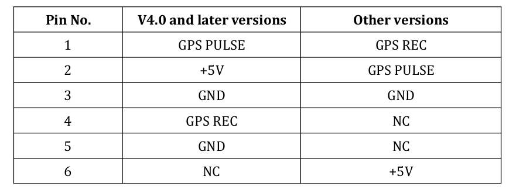
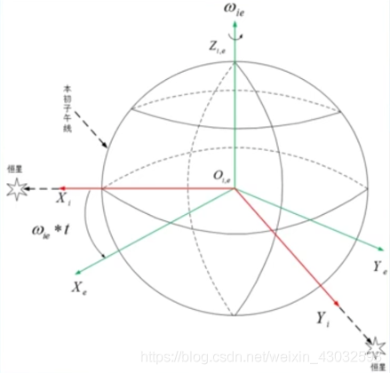
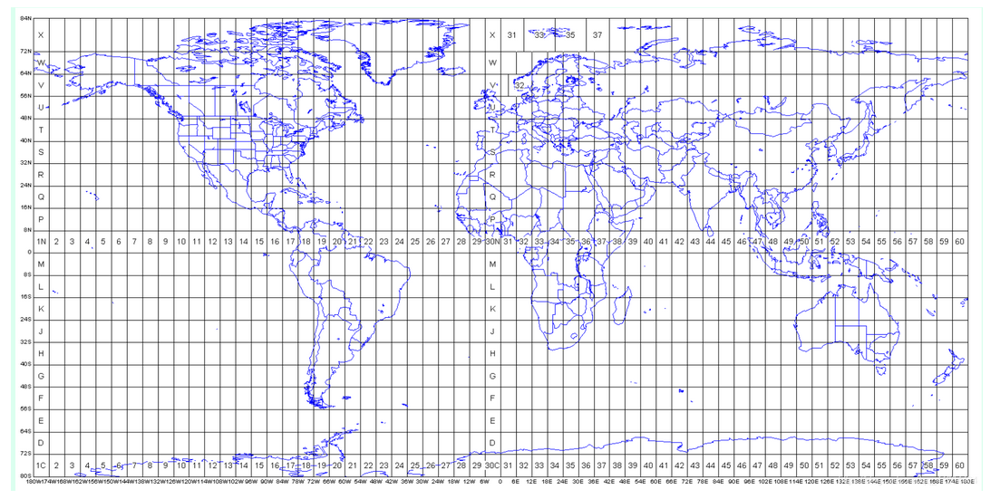
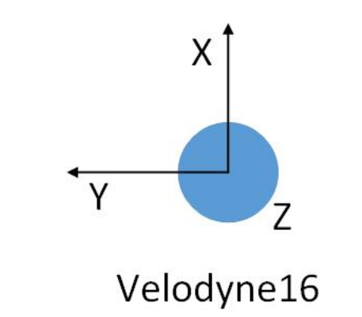
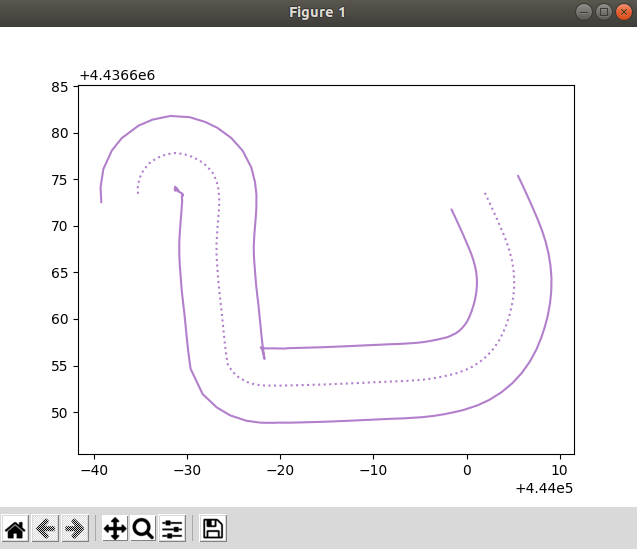
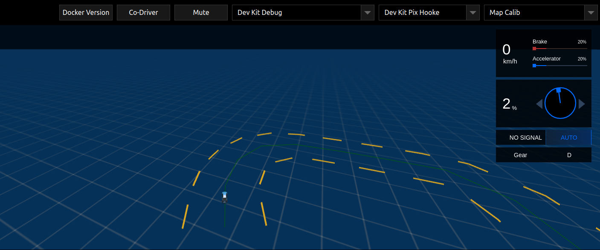
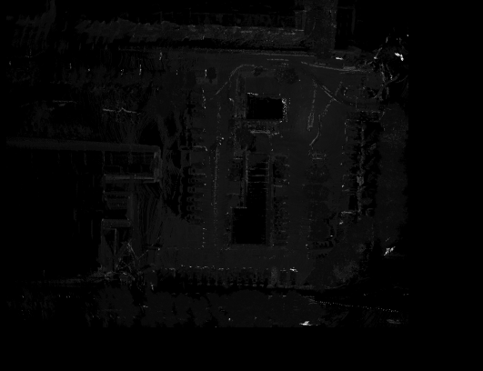

## Apollo补充文字说明

[TOC]

### 1 时序同步

#### 1.1 为什么需要进行需要时序同步

以相机为例：

+ 第一，**统一时钟源**，并保证采用同一种计时标准。
+ 第二，**存在时间延时误差**。相机在曝光时间会输出一个时间戳 $ts$，但是由于时钟不同步的原因，传到本地系统时无法匹配，因此会将 $ts$ 修正为系统接受时刻的时间戳 $ts^{'}$。这中间的差距就是相机的时间延迟误差，**通常在几ms到几十ms之间**。高速情景下，存在几十ms延时时就能对系统造成明显的影响。
+ 第二，**各传感器成像的时间不一致**。这导致了成像结果之间无法有效对齐，无法进行有效的融合。

#### 1.2 什么是时序同步

时序是指：具有统一时钟源和计时标准；闭环是指：进行循环检测保证时序高精度运行。在自动驾驶系统中，时间误差不能超过**微秒级**，相机、点云等设备**成像同步**。

#### 1.3 常见的时间标准及转换

1. 常见的时间标准及时间戳表示

   + **GMT**，即格林尼治标准时间，也就是世界时。GMT的正午是指当太阳横穿格林尼治子午线（本初子午线）时的时间。但由于地球自转不均匀不规则，导致GMT不精确，**现在已经不再作为世界标准时间使用。**
   + **UTC**，即协调世界时。UTC是以原子时秒长为基础，在时刻上尽量接近于GMT的一种时间计量系统。为确保UTC与GMT相差不会超过0.9秒，在有需要的情况下会在UTC内加上正或负闰秒（**leap second**）。**UTC现在作为世界标准时间使用。**
   + **TAI**，即**国际原子时钟**。1967年第13届国际度量衡会议上通过一项决议，定义 1s 为铯-133原子基态两个超精细能级间跃迁辐射9,192,631,770周所持续的时间，这是利用铯原子振荡周期极为规律的特性。
   + **LT**，即本地时间。东区是加相应的时区差，西区是减时区差。如北京是东八区，则北京时间=UTC+8。
   + **Unix timestamp**：计算机记录UTC时间以Unix timestamp形式存储。定义为从格林威治时间1970年01月01日00时00分00秒起至现在的总秒数，**不考虑闰秒**。
   + **GPS timestamp**：即GPS原子时。它的时间基准是1980年1月6日0点与世界协调时刻相一致，以后按原子时秒长累积计时（**考虑闰秒**）。

2. **GPS timestamp 与 Unix timestamp 的相互转换**：

   + 不考虑闰秒情况下，两者的时间差异为：
     + 以世界时间计算：$315964800 = 315993600 - 28800$
     + 以北京时间计算：$315993600$

   + 闰秒插入时间表：

     ```
      Current TAI - UTC  = 37. (mean that: 2017 - 1970/01/01 = 37 seconds)
      Current GPS - UNIX = 18. (mean that: 2017 - 1980/01/06 = 18 seconds)
      +======+========+========+======+========+========+
      | Year | Jun 30 | Dec 31 | Year | Jun 30 | Dec 31 |
      +======+========+========+======+========+========+
      | 1980 | (already +19)   | 1994 | +1     | 0      |
      +------+--------+--------+------+--------+--------+
      | 1981 | +1     | 0      | 1995 | 0      | +1     |
      +------+--------+--------+------+--------+--------+
      | 1982 | +1     | 0      | 1997 | +1     | 0      |
      +------+--------+--------+------+--------+--------+
      | 1983 | +1     | 0      | 1998 | 0      | +1     |
      +------+--------+--------+------+--------+--------+
      | 1985 | +1     | 0      | 2005 | 0      | +1     |
      +------+--------+--------+------+--------+--------+
      | 1987 | 0      | +1     | 2008 | 0      | +1     |
      +------+--------+--------+------+--------+--------+
      | 1989 | 0      | +1     | 2012 | +1     | 0      |
      +------+--------+--------+------+--------+--------+
      | 1990 | 0      | +1     | 2015 | +1     | 0      |
      +------+--------+--------+------+--------+--------+
      | 1992 | +1     | 0      | 2016 | 0      | +1     |
      +------+--------+--------+------+--------+--------+
      | 1993 | +1     | 0      | 2017 | 0      | 0      |
      +------+--------+--------+------+--------+--------+
     ```

   + 代码展示：详见`modules/drivers/gnss/util/time_conversion.h`

3. 各传感器输出信息时间戳

   + lidar点云信息（`/apollo/sensor/lidar16/PointCloud2`）

     ```yaml
     header:
     	timestamp: 1645954490.276059151
     measurement_time: 1645925689.300303936
     point: [0]
       x: 5.998190
       y: -0.836586
       z: -1.611391
       intensity: 27
       timestamp: 1645925689201644032
     ```

     + 该点云信息在与gnss时钟同步后，Apollo驱动中开启了使用激光时钟选项。可以看出`measurement_time`与`header.timestamp`相差了至少8小时，即28800。这是由于后者采用了北京时间而前者采用了UTC标准时间。

     + 其中，`header.timestamp`表示系统到达的时间，代码为`cyber::Time().Now().ToSecond()` 

       `measurement_time` 表示点云的测量时间，取点云序列中最后一个点的时间戳（严格来说是点云最后一个点的测量时间除以1e9）作为整体的测量时间。

     + 由于激光为慢速测量设备，因此需要记录**每个点的时间戳**，便于后续的运动畸变矫正。

   + 相机信息：

     ```yaml
     header:
     	timestamp: 1644554764.430842638
     measurement_time: 1644554764.399139166
     ```

     + 相机情况需要分类讨论：对于**卷帘门相机**而言，实际曝光是一行一行进行的，每一行CMOS曝光后将信息传给行寄存器，再由行寄存器进行输出。最终时间戳会确定在**图像中间进行曝光时**；而对于**全局相机**而言，每个CMOS都有一个对应的寄存器，因此可以同时进行曝光，**时间戳位于同时曝光时**。但是全局相机价格高昂，同时工艺复杂，由于寄存器位置的限制，也很难做出大底的相机，因此卷帘门相机更加实用。
     + 非定制相机模组**不支持时钟同步**，定制相机可选择支持。以卷帘门相机为例，需要和厂家进行沟通，在输出相机图像时把每一行的时间戳也发送出来，根据相应的算法进行补偿处理。

#### 1.4 时间同步方法

1. **Apollo内部时间同步机制**：

   + *系统同步*：

     采用**NTP网络同步**。以1s为周期，根据时钟偏差调整client时钟，可将时钟误差稳定控制在微秒级别。

     + 执行命令：

       ```bash
       bash docker/scripts/dev_into.sh
       sudo apt-get -y update && sudo apt-get -y install ntpdate
       bash scripts/time_sync.sh cn
       ```

   + *LiDAR设备同步*：

     + LiDAR设备**支持两种时钟同步**方式：

       + IEEE 1588-2008(PTPv2)：**以太网接口同步**；
       + **PPS脉冲信号+NMEA消息**（GPS），由于设备原因，采用第二种方式进行时钟同步；

     + PPS脉冲信号+NMEA消息（GPS）配置演示

       + **GPS配置**。打开CGI-410 配置界面（网页输入：`192.168.200.1`， 账号： `admin`， 密码： `password`）在` io 设置`内的`串口A`配置中设置波特率为9600 bps，输出协议为GPRMC，输出频率为1 Hz（最大）。

       + **同步模式**：速腾16线雷达支持3种PPS同步模式，本车采用`Mode 2`：取最后一个GPRMC，Lidar端PPS下降沿触发同步，对应PPS上升沿。注意：如果采用`Mode 0`，则可能会出现1秒左右的延迟，此时需要下载上位机软件，**更改同步模式后刷新固件**。

         

       + **物理连接**。RS-LiDAR-16 电源盒上面的 GPS_REC 接口规格为` SH1.0-6P `母座, 引脚定义如图所示：

         
       
         该接口支持采用`RS232`协议进行通讯与GPS端相连接。**由于没有固定连接线，因此需要手动制作**。其中：`GND`和`TXD`由CGI-410中的`A_RS232`口提供（详见DB9口定义），分别对应激光的`GND`和`GPS REC`，CGI-410中的PPS授时线连接激光的`GPS PULSE`接口，其余部分悬空即可。
       
         **同步线的制作详见文档：**
         
         | Pin口 | CGI-410端      | Lidar端   |
         | ----- | -------------- | --------- |
         | 1     | PPS授时端口    | GPS PULSE |
         | 2     | 悬空           | 悬空      |
         | 3     | A_RS232中的GND | GND       |
         | 4     | A_RS232中的TXD | GPS REC   |
         | 5     | 悬空           | 悬空      |
         | 6     | 悬空           | 悬空      |
         
       + **同步模式选择**：
         
         速腾Lidar的时钟同步具有三种授时模式：**这里我们将采用Mode2的方式进行同步**。
         
         【 Mode0】：取 PPS 脉冲前一个 GPRMC， LiDAR 端 PPS 上升沿触发同步（对应源 PPS 下降沿）， 需要保证源 PPS 下降沿的稳定性——周期波动满足 1s±100us。 最终同步后的时间满足： RS + 1s + PPS 脉宽 = V（新固件之前的时间同
         步机制）
         
         
         
         【 Mode1】： 取 PPS 脉冲前一个 GPRMC， LiDAR 端 PPS 下降沿触发同步（对应源 PPS 上升沿）， 需要保证源 PPS 上升沿稳定性——周期波动满足 1s±100us。 最终同步后的时间满足： RS + 1s = V。同时此模式下 V4.0 以上 16 线/V2.0以上 32 线表现的同步效果和 V3.3 以下 16 线/V1.7 以下 32 线保持一致。
         
         
         
         【 Mode2】： 取后一个 GPRMC， LiDAR 端 PPS 下降沿触发同步（对应源 PPS 上升沿）， 需要保证源 PPS 上升沿稳定性——周期波动满足 1s±100us。 最终同步后的时间满足： RS = V。
         
         

2. **工业级别的同步方式：硬件同步**

   自动驾驶系统中，几乎每个测量设备都有一个自己的时钟源，因此必须统一时钟源，以保证各个设备的时间戳是对齐的。考虑到原子钟的精确性，系统一般选择GNSS作为主时钟源，并对其他设备进行时间同步。注意，这里的时间同步并不是说仅仅同步一次就好，因为钟漂的存在，时间戳必须不断进行矫正。

   考虑到在部分信号不好的地段，如隧道等场景下，GNSS信号会丢失进而无法矫正时间，自动驾驶系统会指定一个晶振频率最高的设备（一般是专门的设备，如果imu或者lidar晶振很高也可能被选择）作为主时钟源，然后根据主时钟进行推断。

   利用硬件同步方案，可以构造一个**触发装置**，在指定的时刻，发送触发信号，让所有的传感器触发成像，减少成像时刻误差。

   + 连接GPS信号和NTP server，确保时钟实现微秒级同步；

   + 设置触发逻辑（如LiDAR正前方的成像相位），同时触发LiDAR和Camera成像；

   + 支持多LiDAR和多Camera，暂不支持Radar和超声波雷达

   + 系统精度更高，可将系统**同步精度控制在5 ms以内**；缺点是丢失一些系统的灵活度和高频数据，camera成像频率原本可以更高的。

     

3. **Camera设备的同步**：

   + 与IMU的同步，常见于VIO系统中：
     + imu、相机使用同一个时钟晶振：这样做的好处是不用考虑太多额外的因素，但是要求IMU和相机距离足够接近（这在自动驾驶场景下是不现实的），没有其他干扰，也不需要其他设备进行同步。
     + 常见的硬件同步解决方案：以IMU时钟触发Camera曝光
     + 软同步方法：具体内容详见`VIO的第八讲`


   + 与点云进行同步：

     + 常见的硬件同步解决方案：触发装置同时触发成像和曝光。

     + 常见的软件同步解决方案：由于lidar有成熟的硬件同步机制，可以将lidar与系统进行硬件同步，并将lidar点云逐步投影到相机中来，当某一帧能够对齐时候完成补偿。之后，分别在驱动中减去时间戳补偿，可以将这种时间误差补偿到10 ms以下。（详见`多传感器融合感知第一章节`）

### 2 Apollo中的各个坐标系

在惯性导航中，一般将坐标系分为两类：**惯性坐标系**、**非惯性坐标系**。惯性坐标系包括：日心惯性系、地心惯性系。非惯性坐标系包括：地球坐标系、地理坐标系、机体坐标系等。

#### 2.1 惯性坐标系统

惯性坐标系是指坐标轴指向保持不变的坐标系，例如，**eci地心惯性坐标系**，它是一个非常固定的坐标系，**IMU测量得到的加速度，角速度都是相对于这个坐标系的**。由于和导航系统关联不大，这里不再详细表述。

#### 2.2 地球坐标系统。==// TODO:补充缩写==

+ 表示形式为：*O-XeYeZe*，角标常用*e(earth)*表示。

+ 地球中心为坐标原点*o*，*oz*轴沿地球自转轴方向，*ox*轴是赤道平面和本初子午面的交线（注意本初子午面只有一个），*oy*轴沿右手规则确定。

+ **地球坐标系是和地球固连的，它与地球一起相对惯性坐标系以地球的自转角速度进行转动。**

#### 2.3 全球地理坐标系统（大地坐标系）

1. **WGS84坐标系**。Apollo采用的是WGS84（World Geodetic System 1984）作为标准坐标系来表示物体的纬度，经度和高度（LLT）。

   + 表示形式：通过使用该标准坐标系统，我们可以使用2个数字：x坐标和y坐标来唯一的确定地球表面上除北极点之外的所有点，**其中x坐标表示经度（longitude），y坐标表示纬度（latitude）**。

   + WGS84坐标系的坐标原点位于地球的质心，Z轴指向BIHl984.0定义的协议地球极方向[ 指向格林威治子午线（本初子午线）]，X轴指向BIHl984.0的起始子午面和赤道的交点, 在**地球赤道平面内**相互垂直。

   + 经度0.00001度（十万分之一度,0°0'0.036'）,在赤道上对应的地球表面距离约为1米稍多,但在南北极极点上,则是0米.纬度0.00001度在地球表面任意地方对应的地球表面距离都是大约1米稍多。**WGS84椭球体**也经常在转换中被使用。

     

2. **UTM坐标系**。

   + 将**球面经纬度坐标经过投影算法转换成的平面坐标**，即通常所说的XY坐标，单位为**米制**。UTM相当于是**把世界分成了若干个ENU坐标系，每个zone对应一个ENU**。

   + 表示形式：坐标$(x,y)$加上投影带号就能表示地球上的一点。例如，`11U 358657mE 5885532mN`：

     + `11U` 表示位于经度11区，位于纬度U区
     + `358657mE` 表示东向位置为358657 m
     + `5885532mN` 表示北向位置为5885532 m

   + UTM投影坐标使用”等角横轴切割圆柱“模型划分，基于网格的方法进行表示：

     +  经度分区：编号1-60，其中58个区的东西跨度为 6°
     +  纬度分区：编号C-X (不含I,O,共20个区)，每个区的南北跨度为 8°
     + A，B，Y，Z覆盖南极和北极区
     + N为第一个北纬带，N之后的字母均为北纬带，N之前的字母均为南纬带

   + 坐标系方向：UTM坐标系原点跟id有关。一个id对应一个原点。以正东方向为x轴正方向（UTM Easting），正北方向为y轴正方向（UTM Northing）。

   + **“WGS84”坐标系的墨卡托投影分度带（UTM ZONE）选择方法**:

     + UTM是由美国制定，因此起始分带并不在本初子午线，而是在180度，因而所有美国本土都处于0－30带内。北京地区位于50带内；
     + 北半球地区，选择最后字母为“N”的带； 
     + 可根据公式计算，`带数=（经度整数位/6）的整数部分+31` 如：江西省南昌新建县某调查单元经度范围`115°35′20″—115°36′00″`， 带数为`115/6+31=50`，选`50N`，即`WGS84 UTM ZONE 50N`。

     

#### 2.4 局部地理坐标系统（导航坐标系统，N系）

局部地理坐标系通常使用的有 “东北天”坐标系和“北东地”坐标系。在Apollo系统中，局部坐标系的定义为：东北天坐标系（East-North-Up， ENU）。在惯导和组合导航中，导航坐标系通常选用地理坐标系，两者保持一致。

1. **“东北天”坐标系**：z轴 – 指向上方（和重力线成一条直线）；y轴 – 指向北面；x轴 – 指向东面。在该坐标系下，标准重力表示为：$[0, 0, -9.81]$，静止的物体表示为$[0,0,9.81]$。ENU一般采用三维直角坐标系来描述地球表面，实际应用较为困难，因此一般使用**简化后的二维投影坐标系来描述**（即UTM坐标系）。

   

2. **使用`Proj.4`库完成坐标转换**：

   + `Proj.4`库介绍：Proj.4 是开源 GIS 最著名的地图投影库，功能主要有经纬度坐标与地理坐标的转换，坐标系的转换，包括基准变换等。百度Apollo系统中采用了该库作为转换工具。

   + `Proj.4`库常用的几种参数：

     ```c++
     +proj      投影名
     +zone      UTM区域
     +ellps     椭球体名
     +towgs84   3或7参数基准面转换
     +units     m(米)，us-ft（美国测量英尺）
     +no_defs   不要使用/usr/share/proj/proj_def.dat缺省文件
     
     +datum     基准面名
     +lat_0     维度起点
     +lon_0     中央经线
     +k_0       比例因子
     +south     表示南半球UTM区域
     ```

   + 常用`proj-strings`：

     ```c++
     const char *UTM_TEXT = 
     	"+proj=utm +zone=50 +ellps=WGS84 +towgs84=0,0,0,0,0,0,0 +units=m +no_defs";
     const char *WGS84_TEXT = "+proj=latlong +ellps=WGS84";
     ```

     + `+proj=latlong`：表示在WGS84坐标系下
     + `+proj=utm`：表示在utm坐标系下
     + `+ellps=WGS84`：地球模型采用WGS84椭球体
     + `+towgs84=0,0,0,0,0,0,0`：基准面变换可以使用3参数空间变换(地心空间直角坐标系)，或7参数变换(平移 + 旋转 + 缩放)。WGS84与UTM基准一致，无需没有额外变换。
     + `+no_defs`：基准网格转换文件`/usr/local/share/proj/ntv1_can.dat`不会被加载

   + 完成从WGS84到UTM坐标系的转换

     ```c++
     #define ACCEPT_USE_OF_DEPRECATED_PROJ_API_H
     #include <proj_api.h>
     constexpr double DEG_TO_RAD_LOCAL = M_PI / 180.0;
     
     projPJ wgs84pj_source_ = pj_init_plus(WGS84_TEXT);
     projPJ utm_target_ = pj_init_plus(UTM_TEXT);
     double x = ins->position().lon();
     double y = ins->position().lat();
     x *= DEG_TO_RAD_LOCAL;
     y *= DEG_TO_RAD_LOCAL;
     pj_transform(wgs84pj_source_, utm_target_, 1, 1, &x, &y, NULL);
     pj_free(wgs84pj_source_);
     pj_free(utm_target_);
     ```

==//TODO：从utm坐标系到enu坐标系==

#### 2.5 载体坐标系统

1. **车辆坐标系（B系）**：**右-前-上**（Right-Forward-Up **RFU**）。车辆坐标系的原点在车辆**后轮轴的中心**。z轴 – 通过车顶垂直于地面指向上方；y轴 – 在行驶的方向上指向车辆前方；x轴 – 面向前方时，指向车辆右侧。

   

2. **IMU坐标系**：Apollo中，imu坐标系和载体坐标系一致。和载体固定连在一起，和n系有一个旋转关系。IMU坐标系也是各个传感器的父坐标系。

   

3. **激光坐标系**：Apollo中采用**前-左-上**坐标系（**FLU**）

   

#### 2.6 内外参文件的解析

以`lidar16_novatel_extrinsics.yaml`为例：

```yaml
header:
  stamp:
    secs: 1570694831
    nsecs: 0
  seq: 0
  frame_id: novatel
child_frame_id: lidar16
transform:
  rotation:
    x: 0.0
    y: 0.0
    z: 0.7071
    w: 0.7071
  translation:
    x: 0.0
    y: 0.414
    z: 0.897
```

这里的`header.frame_id`类似于ROS系统中的`parent frame` ，`child_frame_id`中类似于ROS系统中`child frame`，他们的关系如下：

+ 从坐标系变换的角度：parent是原坐标系，child是变换后的坐标系，因此存在一个变换矩阵$T^{\text{parent}}_{\text{child}}$。
+ 从坐标系的角度：可以看做child坐标系在parent坐标系下的描述。

### 3 Apollo中的各种地图

#### 3.1 地图类型介绍

1. **base_map**：`base_map`是最**完整的地图**，包含所有道路和车道几何形状和标识。其他版本的地图均基于`base_map`生成。
2. **routing_map**：`routing_map`包含`base_map`中**车道的拓扑结构**
3. **sim_map**：`sim_map`是一个适用于`Dreamview`**视觉可视化**，基于`base_map`的轻量版本。减少了数据密度，以获得更好的运行时性能。
4. **ndt map**：`ndt_map`在使用**NDT定位**时才会被使用的地图，可通过工具生成ndt地图。
5. **local map**：`local map`是进行**定位可视化**以及**MSF定位**时使用的地图，可以通过工具本地生成。
6. **HD map**：`HD map`即常说的**高精度地图**。格式采用（`XML`）文件格式的数据组织方式，是基于国际通用的`OpenDrive`规范，并根据百度自动驾驶业务需求拓展修改而成。百度Apollo中的map模块没有提供高精度地图的制作功能，而是作为一种商业产品进行出售，因此这里并不做过多介绍。
   + 参考阅读：[apollo高精地图标准与opendrive标准的差异](https://zhuanlan.zhihu.com/p/60734196)，[Apollo的map模块介绍](https://zhuanlan.zhihu.com/p/58491204)

#### 3.2 地图格式介绍 

一般而言，地图具有`.xml`，`.bin`，`.txt`等格式，加载顺序依次为：`.xml`->`.bin`->`.txt`。

```bash
x.xml  # An OpenDrive formatted map.
x.bin  # A binary pb map.
x.txt  # A text pb map.
```

#### 3.3 车道地图制作

1. 从CyberRT包中提取位置路径文件：

   ```bash
   ./bazel-bin/modules/tools/map_gen/extract_path ./path.txt data/bag/202211_local/*
   ```

2. 生成地图文件，其中1表示冗余区域大小为1

   ```bash
   ./bazel-bin/modules/tools/map_gen/map_gen_single_lane ./path.txt ./base_map.txt 1
   ```

   + 该文件同时也可以调节车道线宽度，**修正`LANE_WIDTH`可以调整车道线宽度**。

3. 【可选】为该文件增加header(可视化使用)，举例如下：

   ```yaml
   header {
     version: "03/10/17_22.46.20"
     date: "20161124"
     projection {
       proj: "+proj=tmerc +lat_0={26.57} +lon_0={-122.013332} +k={0.9999999996} +ellps=WGS84 +no_defs"
     }
   }
   ```

4. 建立地图文件夹（如`base_map_self`，可以修改为自己地图名称），并生成.bin文件

   ```bash
   mkdir modules/map/data/base_map_self
   cp base_map.txt modules/map/data/base_map_self/
   
   # base_map.bin
   ./bazel-bin/modules/tools/create_map/convert_map_txt2bin -i /apollo/modules/map/data/base_map_self/base_map.txt -o /apollo/modules/map/data/base_map_self/base_map.bin
   ```

5. 建立`routing_map`

   ```bash
   bash scripts/generate_routing_topo_graph.sh --map_dir /apollo/modules/map/data/base_map_self
   ```

6. 建立`sim_map`

   ```
   ./bazel-bin/modules/map/tools/sim_map_generator --map_dir=/apollo/modules/map/data/base_map_self --output_dir=/apollo/modules/map/data/base_map_self
   ```

7. 【可选】可视化车道线：

   + 修复软件源：

     ```bash
     sudo vim /etc/apt/sources.list
     ```

     在文件中修改：（将`https`修改为`http`）

     ```bash
     deb http://mirrors.tuna.tsinghua.edu.cn/ubuntu/ bionic main restricted universe multiverse
     # deb-src https://mirrors.tuna.tsinghua.edu.cn/ubuntu/ bionic main restricted universe multiverse
     deb http://mirrors.tuna.tsinghua.edu.cn/ubuntu/ bionic-updates main restricted universe multiverse
     # deb-src https://mirrors.tuna.tsinghua.edu.cn/ubuntu/ bionic-updates main restricted universe multiverse
     deb http://mirrors.tuna.tsinghua.edu.cn/ubuntu/ bionic-backports main restricted universe multiverse
     # deb-src https://mirrors.tuna.tsinghua.edu.cn/ubuntu/ bionic-backports main restricted universe multiverse
     deb http://mirrors.tuna.tsinghua.edu.cn/ubuntu/ bionic-security main restricted universe multiverse
     # deb-src https://mirrors.tuna.tsinghua.edu.cn/ubuntu/ bionic-security main restricted universe multiverse
     ```

   + 更新并安装缺少的依赖库

     ```bash
     sudo apt update
     sudo apt-get install tcl-dev tk-dev python3-tk
     ```

     **注意**：上述修改涉及Apollo系统，因此使用`dev_start.sh`时会重建一个`docker`容器，此时对系统的修改会全部失效，需要重新换源操作；但是`docker start + 容器id`的方式并不会重建容器，而是会继续使用之前容器，因此可以不用重新换源。

   + Python可视化

     ```bash
      ./bazel-bin/modules/tools/mapshow/mapshow -m /apollo/modules/map/data/base_map_self/base_map.txt
     ```

     

     dreamview中地图显示：

     

#### 3.4 NDT定位地图

1. 进行定位地图前需要准备以下工作：

   + **使用`build_opt`进行重新编译，其速度比使用`build`要快速很多**；
   + 完成标定任务，将**lidar到imu的外参**存放在相应的矫正文件下；
   + 所使用的数据集中**至少**需要保证该数据集有`/apollo/localization/pose` 或者`/apollo/sensor/gnss/odometry`两个通道；当两个`channel`中仅有一个存在时，**两者可以相互替换**。
   + 定位通道的时间戳需要和激光点云中测量时间的**时间戳接近**。这意味着当使用激光自身时间戳时候，需要补偿点云的

2. 确定下列信息准备完毕：

   + 待生成地图的名称（以`map_test`为例）
   + 所用数据集所在的文件夹（以`data/bag/202211_local`为例）
   + 数据集生产地区的`zone_id`（以北京地区的`50`为例）
   + 激光点云名称（以`lidar16`为例）
   + 外参文件存放位置（以`/apollo/modules/calibration/data/dev_kit_pix_hooke/lidar_params/lidar16_novatel_extrinsics.yaml`为例）

3. 拷贝`scripts/msf_simple_map_creator.sh`文件，重命名为`ndt_simple_map_creator.sh`，并对文件做出以下修改：

   ```shell
   ## 将下面这个函数替换掉function create_lossless_map()
   function create_ndt_map() {
     /apollo/bazel-bin/modules/localization/ndt/map_creation/ndt_map_creator \
       --pcd_folders $1 \
       --pose_files $2 \
       --resolution_type single \
       --resolution 1 \
       --resolution_z 1 \
       --map_folder $OUT_MAP_FOLDER \
       --zone_id $ZONE_ID
   }
   
   ## 将create_lossless_map替换为create_ndt_map
   # create_lossless_map "${DIR_NAME}/pcd" "${DIR_NAME}/pcd/corrected_poses.txt"
   create_ndt_map  "${DIR_NAME}/pcd" "${DIR_NAME}/pcd/corrected_poses.txt"
   
   ## 注释掉lossy_map
   # create_lossy_map
   ```

   + 注意：resolution表示地图分辨率。对于ndt算法而言，并不需要过于精细的分辨率，一般而言，**选择分辨率为1是一个相对比较好的选择**。

4. 运行代码生成：新的地图将在`modules/map/data/map_test`下存储

   ```bash
   bash /apollo/scripts/ndt_simple_map_creator.sh \
       data/bag/202211_local \
       /apollo/modules/calibration/data/dev_kit_pix_hooke/lidar_params/lidar16_novatel_extrinsics.yaml \
       50 \
       /apollo/modules/map/data/map_test/ndt_map \
       lidar16
   ```

5. 代码分析：核心思路包括以下几个步骤

   + 数据包解压生成pcd文件以及对应的位姿（`cyber_record_parser`）
   + 位姿插值（`poses_interpolator`）
   + 创建`ndt mapping `（`ndt_map_creator`）

#### 3.5 MSF定位地图

1. 进行定位地图前需要准备以下工作：

   + **使用`build_opt`进行重新编译，其速度比使用`build`要快速很多**；
   + 完成标定任务，将**lidar到imu的外参**存放在相应的矫正文件下；
   + 所使用的数据集中**至少**需要保证该数据集有`/apollo/localization/pose` 或者`/apollo/sensor/gnss/odometry`两个通道；当两个`channel`中仅有一个存在时，**两者可以相互替换**。
   + 定位通道的时间戳需要和激光点云中测量时间的**时间戳接近**。这意味着当使用激光自身时间戳时候，需要补偿点云的

2. 确定下列信息准备完毕：

   + 待生成地图的名称（以`map_test`为例）
   + 所用数据集所在的文件夹（以`data/bag/202211_local`为例）
   + 数据集生产地区的`zone_id`（以北京地区的`50`为例）
   + 激光点云名称（以`lidar16`为例）
   + 外参文件存放位置（以`/apollo/modules/calibration/data/dev_kit_pix_hooke/lidar_params/lidar16_novatel_extrinsics.yaml`为例）

3. 修改`scripts/msf_simple_map_creator.sh`文件如下：

   ```shell
   ## 注释掉删除解析文件和lossless_map部分
   # rm -fr $OUT_MAP_FOLDER/lossless_map
   # rm -fr $OUT_MAP_FOLDER/parsed_data
   ```

   + 注意：对于msf算法而言，**选择分辨率默认分辨率，即分辨率为0.125是一个比较好的选择**。

4. 运行代码生成：新的地图将在`modules/map/data/map_test`下存储

   ```bash
   bash /apollo/scripts/msf_simple_map_creator.sh \
       data/bag/202211_local \
       /apollo/modules/calibration/data/dev_kit_pix_hooke/lidar_params/lidar16_novatel_extrinsics.yaml \
       50 \
       /apollo/modules/map/data/map_test \
       lidar16
   ```

5. 代码分析：核心思路包括以下几个步骤

   + 数据包解压生成pcd文件以及对应的位姿（`cyber_record_parser`）
   + 位姿插值（`poses_interpolator`）
   + 创建`msf mapping `（`create_lossless_map`）
   + 创建`lossy_map`（`lossless_map_to_lossy_map`）

6. 验证：查看`/modules/map/data/map_test/lossless_map/image`中的图像

   

