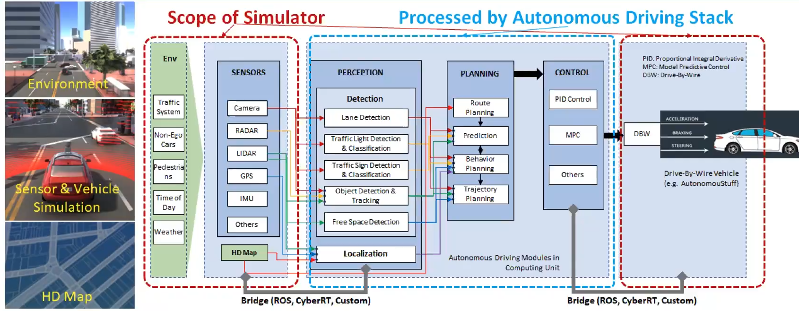
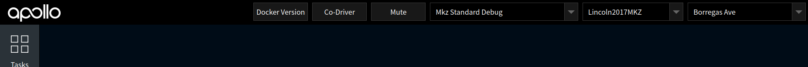
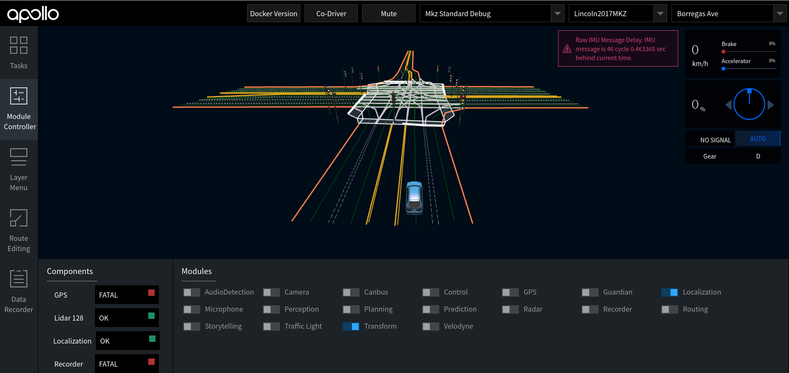
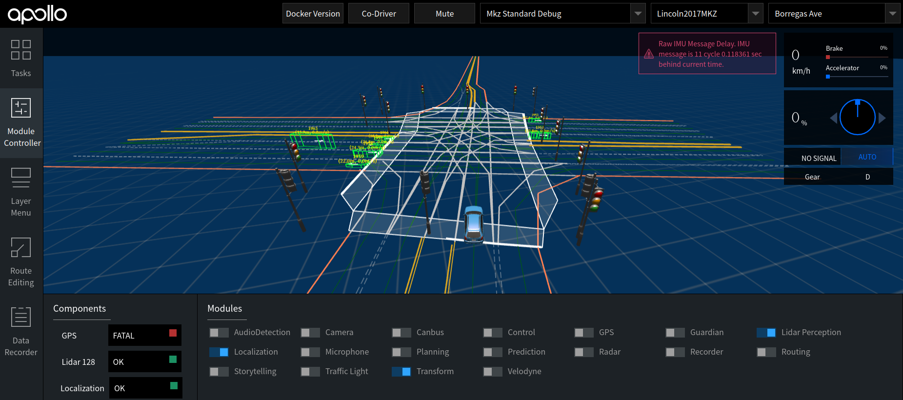
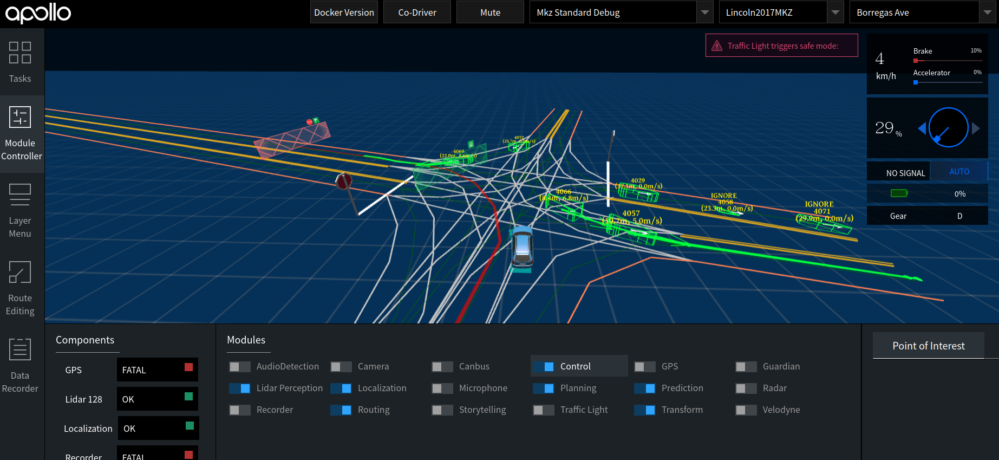

# Apollo&SVL联合仿真 （一）

[TOC]

## 1 简介

`SVL simulator`作为自动驾驶的汽车仿真平台，在定制化场景中，利用车载传感器对环境信息的捕获，以桥接的形式将数据信息传送至Apollo,来进行自动驾驶的定位、感知、规划、决策，并将控制信息传至仿真环境中实现对汽车的控制。



## 2 设备硬件配置

SVL在进行仿真期间需要耗费大量GPU的资源来进行渲染，单独运行SVL就至少需要耗费大约1.5G显存。`Apollo6.0`运行感知模需要大约5个多G的显存。为保证仿真期间系统的流畅，建议SVL和Apollo在两台电脑上分别进行，通过网络桥接的方式来进行数据的传输。

建议配置：Apollo端PC显存6G，SVL仿真端PC显存4G

> Note:在DreamViewer下运行感知模块一直起不开，其中的原因可能就是你的显存崩了导致的。

## 3 SVL仿真环境搭建

官网：https://www.svlsimulator.com/

参考文档1： https://www.svlsimulator.com/docs/getting-started/getting-started/
参考文档2：https://blog.csdn.net/zhanghm1995/article/details/106454958
参考视频：https://www.bilibili.com/video/BV1wV41127sV?spm_id_from=333.999.0.0

> Note: SVL 仿真器国内的小伙伴需要开网络代理才能访问，如在Linux系统下需输入`proxychains ./simulator`

在我们的仓库中，`SVL`默认存在已经配置好的车辆`Lincoln2017MKZ`，且适配Apollo系统。我们以该车型为例,参考B站视频进行仿真环境搭建，地图选用`BorregasAve`。后期可以根据自己的需求进行更改。

### 3.1 仿真环境准备

> 注 实操线下课程中，已为工控机器配置完备，同学可跳过3.1&3.2

在https://github.com/shenlan2017/ShenLanSVL 下再深蓝学院发布的适配Apollo对仿真器，这里以Linux为例进行简要说明。

1. install dependency 

   ```bash
   sudo apt install libvulkan1
   ```

2. 在软件文档目录内打开终端，输入`./simulator` 启动仿真器。

   .assets/2022-04-06%2021-53-08%20%E7%9A%84%E5%B1%8F%E5%B9%95%E6%88%AA%E5%9B%BE.png)

3. 点击`LINK TO CLOUD` 进入账号注册与登录界面。

   .assets/2022-04-06%2021-49-43%20%E7%9A%84%E5%B1%8F%E5%B9%95%E6%88%AA%E5%9B%BE.png)

   .assets/2022-04-06%2021-51-58%20%E7%9A%84%E5%B1%8F%E5%B9%95%E6%88%AA%E5%9B%BE.png)

3. 登入后，在网页端创建当前电脑端的用户

   .assets/2022-04-06%2021-55-18%20%E7%9A%84%E5%B1%8F%E5%B9%95%E6%88%AA%E5%9B%BE.png)

4. 创建成功后，在网页端浏览Store、Library、Clusters、Simulations、Test Results。 在Maps选择地图`BorregasAve`， Vehicles中选择车辆`Lincoln2017MKZ`加入到我们的Library中。

### 3.2 仿真环境创建

点击Simulation右上角`Add simulation`在进行创建Simulation时，分为四个部分`General->Test case->Autopilot->Pulish`

1. **General**
   设定仿真名称、标签以及归属的群组。勾选`Create test report和 Interactive mode`。

2. **Test case**

   `Running template`选择`Random Traffic`,这个模板最为方便;`Map`选择`BorregasAve`; `Sensor Configuration`选择`Apollo5.0`(传感器配置齐全);`Date and weather`内容任选; `Traffic`中勾选`Random Traffic、Random Pedestrians、Random Bicyclists`。

3. **Autopilot**

   `Autopilot`选择`Apollo 6.0`; `Bridge Connection`作为我们的桥接地址，我们需要在运行`Apollo`的电脑终端上输入`ifconfig -a`查询电脑的ip地址，将`ip`地址+端口号`9090`输入至`Bridge Connection`, 如`192.168.1.1:9090` 。

4.  **Publish**

   点击`Publish`即可完成仿真环境的设定。

### 3.3 仿真环境运行

点击`Start Simulation`,即可启动我们刚刚建立的仿真环境，在我们的SVL软件中可看到正在下载仿真的环境及传感器下载外后效果图如下图所示，点击启动，系统开始仿真。

.assets/2022-04-06%2021-57-05%20%E7%9A%84%E5%B1%8F%E5%B9%95%E6%88%AA%E5%9B%BE.png)

为验证信息是否发送至Apollo端，我们可以启动Apollo查看

```bash
bash docker/scripts/dev_start.sh -l   #启动本地apollo docker
bash docker/scripts/dev_into.sh	      #进入容器
bash scripts/bridge.sh                #启动桥接
```

新建终端，进入docker环境中后，启动`cyber_monitor`查看信息如下图则表示信息传输成功。


## 4 Apollo地图载入

在高精地图中，不仅包含道路信息，同时还提供了车道信息、交通标志以及道路的位置信息。在仿真器`SVL`中提供了针对`Apollo`的高精地图`basemap.bin`,里面包含完整的道路、车道线、标识牌等信息。在apollo系统中通过对`basemap.bin`进行下采样之后生成`simmap.bin`地图用在`Dreamviewer`的可视化中。

1. 在`Libray/Maps`中，选择要下载的地图，在`HD maps`中点击 `apollo50`，将矢量地图`bash.bin`下载至apollo下的`/moudules/map/data/BorregasAve` 。

2. 利用`apollo`地图生成工具，将`basemap.bin`生成`simap.bin`地图文件，主要作用为对`basemap`进行下采样，并可在`dreamviewer`中显示。

   ```bash
   ./bazel-bin/modules/map/tools/sim_map_generator --map_dir /apollo/modules/map/data/BorregasAve/ -output_dir=/apollo/modules/map/data/BorregasAve
   ```
   
3. 利用`apollo`地图生成工具，将`basemap.bin`生成`routingmap.bin`地图文件

   ```bash
   bash scripts/generate_routing_topo_graph.sh --map_dir /apollo/modules/map/data/BorregasAve
   ```

至此我们基于RTK定位模式下所用的三种地图均已生成。对于`MSF`和`NDK`定位模式，除了上述的高精地图，我们还需要单独建立定位地图，在下一章接我们会讲解如何利用SVL中的`Lidar`和`GNSS`数据来进行建图。	

## 5 Apollo汽车载入

Apollo系统中将林肯车辆作为其默认车辆，在`/apollo/modules/calibration/data/`下将`mkz_example` 文件拷贝被重命名`Lincoln2017MKZ`, 运行`Dreamviewer`即可看到我们新添加的车型。由于我们仿真环境中的车辆配置不同，需要对车辆文件进行重新配置。为了实现任意车型自由切换，无需每次因车型的切换导致系统的参数的重调，我们将有关车型相关的参数均放置 `/apollo/modules/calibration/data/Lincoln2017MKZ` 文件下的车型了。车型选择后，系统会自动调用该车型下的参数来覆盖系统默认参数。



### 5.1 DreamViewer单元模块运行模式更改

在`DreamViewer`的模式选择栏中我们选择`Mkz Standard Debug`调试模式，针对系统默认的`Mkz Standard Debug`,我们需要根据我们车辆的传感器配置，对`/apollo/modules/dreamview/conf/hmi_modes/mkz_standard_debug.pb.txt`文件内容进行更改。

1. 设定系统定位模式为RTK定位

   定位至41行改为`"dag_files:/apollo/modules/localization/dag/dag_streaming_rtk_localization.dag"`，如后期我们需要更换定位模式，可以再将其更改成MSF或NDT.因为这两种模式涉及到激光建图部分，我们将在下一章进行介绍。

2. 感知单元设定为Lidar感知
   定位至`perception`,讲dag文件指向Lidar_segmentation: ` dag_files: "/apollo/modules/perception/production/dag/dag_streaming_perception_lidar_segmentation.dag"`

### 5.2 Transform变换树配置

`/apollo/modules/calibration/data/Lincoln2017MKZ` 下新建`transform_conf`文件夹，并将`modules/transform/conf/static_transform_conf.pb.txt` 复制到该文件夹下，依据我们汽车camera 、lidar、GPS的变换关系对其进行修改

```bash
extrinsic_file {
    frame_id: "novatel"
    child_frame_id: "velodyne128"
    file_path: "/apollo/modules/drivers/lidar/velodyne/params/velodyne128_novatel_extrinsics.yaml"
    enable: true
}
extrinsic_file {
    frame_id: "localization"
    child_frame_id: "novatel"
    file_path: "/apollo/modules/localization/msf/params/novatel_localization_extrinsics.yaml"
    enable: true
}
extrinsic_file {
    frame_id: "velodyne128"
    child_frame_id: "front_6mm"
    file_path: "/apollo/modules/perception/data/params/front_6mm_extrinsics.yaml"
    enable: true
}
```

### 5.3 localization环境配置 

新建`localization_conf`文件夹，`modules/localization/conf/localization.conf`拷贝到当前文件夹下，并做如下更改

```bash
--lidar_height_default=1.91
--lidar_topic=/apollo/sensor/lidar128/compensator/PointCloud2
--lidar_extrinsics_file=/apollo/modules/localization/msf/params/velodyne_params/velodyne128_novatel_extrinsics.yaml
```

 到目前为止，我们在`/modules/calibration/data/Lincoln2017MKZ`文件夹下，通过对以上的修改，可以实现RTK定位，为确保无误，每添加一个功能单元，我们就在 `Dreamviewer`中进行测试:

在终端中依次启动`dreamviewer`和`bridge`,使用`cyber_moniter`查看仿真器的仿真数据是否传入。数据传输正常后，在`dreamviewer` 中选择模式`Mkz Standard Debug`、车辆`Lincoln2017MKZ`、地图`Borregas AVE`,在`Module Controller`中启动`Transform`和`Localization`模块，页面加载出的高精地图以及汽车如下图所示，键盘控制仿真器小车运动查看`Dreamviewer`中汽车的变化

```bash
bash scripts/bootstrap_lgsvl.sh
bash scripts/bridge.sh
```



### 5.4 Perception环境配置

apollo默认的感知lidar为`"velodyne128"`,跟我们仿真的所用的传感器相同，顾可跳过当前感知配置。保险期间我们进行单独配置，车型选择后，我们配置的文件会覆盖掉系统的原配置。我们的主要操作是针对`modules/perception/production/conf/perception/`文件下中有关激光雷达的参数进行配置、

1. 在车型文件夹下新建`perception_conf`文件夹，拷贝`fusion_component_conf.pb`.txt, `mlf_engine.conf`, `perception_common.flag`, , `recognition_conf.pb.txt`，`velodyne128_segmentation_conf.pb`至其中，将有关`lidar`名称的全部更换为`velodyne128`,如下图所示。

   ```bash
   fusion_method: "ProbabilisticFusion"
   fusion_main_sensors: "velodyne128"
   object_in_roi_check: true
   radius_for_roi_object_check: 120
   output_obstacles_channel_name: "/apollo/perception/obstacles"
   output_viz_fused_content_channel_name: "/perception/inner/visualization/FusedObjects"
   ```

2. 新建`perception_dag`文件夹，将`dag_streaming_perception_lidar_segmentation.dag`拷贝至当前文件夹下,将`SegmentationComponent`改为如下内容。

   ```bash
    components {
       class_name : "SegmentationComponent"
       config {
         name: "Velodyne128Segmentation"
         config_file_path: "/apollo/modules/perception/production/conf/perception/lidar/velodyne128_segmentation_conf.pb.txt"
         flag_file_path: "/apollo/modules/perception/production/conf/perception/perception_common.flag"
         readers {
           channel: "/apollo/sensor/lidar128/compensator/PointCloud2"
         }
       }
     }
   ```

运行`Dreamviewer`，在启动完`transform`和 `localization`之后，点击`perception`,该模块启动大约需要一分钟多，在此期间可以新建终端，输入`watch -n 1 nvidia-smi`观察自己GPU的使用情况，模块启动成功后，Dreamviewer如下图所示。



### 5.5 Planning&Prediction&Routing&Control模块

这几个模块的跟我们的车载传感器型号并不存在直接关系，我们直接运行即可。


