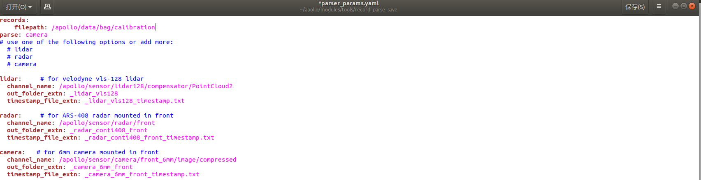
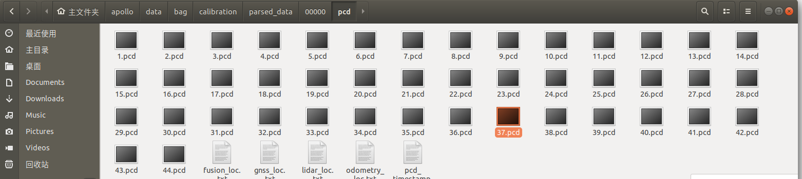
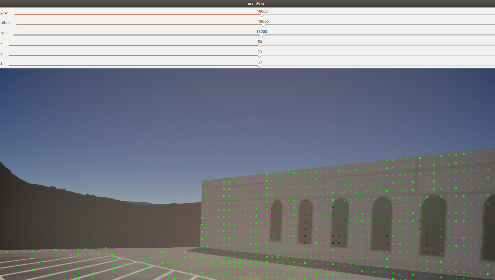
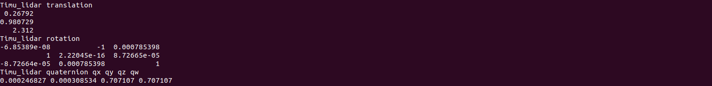

## Apollo&SVL联合仿真（二）标定

### 简介

在实车中，由于安装误差以及传感器各自的参数不同导致这些传感器参数均需要我们通过标定来获取，构建出一个符合汽车自身的TF树。相机的内参标定包含畸变系数以及焦距大小，以深蓝学院的小车为例，传感器之间的外参包含Lidar-Imu,Camera到Lidar之间的变换。拿到这些外参后，方便我们后续的定位建图以及感知融合等功能的实现。在实车操作之前我们先在仿真环境中进行Lidar-Imu,Lidar-Camera和油门刹车的标定。

**由于相机的标定需要标定板数据采集，这个步骤在仿真中无法进行操作，我们将在实车的实践中进行。**

## 1 Lidar-Camera标定

### 1.1   传感器数据收集

- 参照文档（一）启动apollo和svl_simulator在cyber_visualizer下检查数据接受是否正常

  

- 寻找标定场地，将汽车开至有墙角的建筑物附近来进行标定，如下图所示

  

- 录制数据包，录制几秒钟后`Ctrl+C`结束，`*. record.*`文件将保存在`apollo`根目录下

  ```
  cyber_recorder record -a
  ```

  在`\apollo\data\bag`目录下新建`calibration`文件夹，将录制好的bag包文件粘贴进来。

### 1.2 数据解析

#### 1.2.1 图像数据解析

数据解析用到了`apollo`自带的解析程序，将我们的录制包中的`image`保存成`jpeg`格式的图片

- 修改数据解析的参数配置文件，在`/apollo/modules/tools/record_parse_save`文件目录下，打开`parser_params.yaml`文件
  - `filepath:` 改为我们存放数据包的文件夹`/apollo/data/bag/calbration`
  - `parse:` 选为`camera`
  - `camera`的`channel_name`: 选为我们实际压缩图像的`topic`名，如`/apollo/sensor/camera/front_6mm/image/compressed`



- 执行数据解析程序 

  ```
  ./bazel-bin/modules/tools/record_parse_save/record_parse_save
  ```

  解析完成后，会将图像保存在我们数据包的上一级目录下文件夹下`data_camera_6mm_front`。

#### 1.2.2 Lidar数据解析

lidar的数据解析需要借助MSF下的数据解析程序，由于仿真数据发过来的数据跟其消息的大小不一致，我们需要对apollo内部程序稍作更改即可

- 打开`/apollo/modules/localization/msf/local_tool/data_extraction/pcd_exporter.cc`,在程序的第61行`void PCDExporter::WritePcdFile(const std::string &filename, const drivers::PointCloud &msg) `函数内，将`    cloud.width，cloud.height `做如下改写。

  ```c++
  pcl::PointCloud<velodyne::PointXYZIT> cloud;
  //cloud.width = msg.width();
  //cloud.height = msg.height();
  // -- 以下为新增内容 --
  bool bsimulator = true;
  if(bsimulator == true)
  {
      std::cout << "msg.size: "<< msg.point_size() << "msg.width() "<< msg.width()<< " msg.height() "<<msg.height()<< std::endl;
      cloud.width = msg.point_size();
      cloud.height = 1;
  }
  else{
      cloud.width = msg.width();
      cloud.height = msg.height();
  }
  // -- 新增内容完毕 --
  ```

  重新编译apollo程序

  ```bash
  ./apollo.sh build_opt localization
  ```

- 添加数据解析脚本

  在/apollo/sripts文件夹下新建`lidar_parse.sh`脚本文件，copy以下程序

  ```bash
  #! /bin/bash
  if [ $# -lt 3 ]; then
    echo "Usage: msf_simple_map_creator.sh [records folder][output folder]  [extrinsic_file] [lidar_type]"
    exit 1
  fi
  
  DIR="$(cd "$(dirname "${BASH_SOURCE[0]}")" && pwd)"
  cd "${DIR}/.."
  
  source "${DIR}/apollo_base.sh"
  
  GNSS_LOC_TOPIC="/apollo/localization/msf_gnss"
  LIDAR_LOC_TOPIC="/apollo/localization/msf_lidar"
  FUSION_LOC_TOPIC="/apollo/localization/pose"
  ODOMETRY_LOC_TOPIC="/apollo/sensor/gnss/odometry"
  
  GNSS_LOC_FILE="gnss_loc.txt"
  LIDAR_LOC_FILE="lidar_loc.txt"
  FUSION_LOC_FILE="fusion_loc.txt"
  ODOMETRY_LOC_FILE="odometry_loc.txt"
  
  IN_FOLDER=$1
  OUT_MAP_FOLDER=$2
  EXTRINSIC_FILE=$3
  LIDAR_TYPE=${4:-lidar128}
  
  PARSED_DATA_FOLDER="$OUT_MAP_FOLDER/parsed_data"
  CLOUD_TOPIC="/apollo/sensor/lidar128/compensator/PointCloud2"
  
  function data_exporter() {
    local BAG_FILE=$1
    local OUT_FOLDER=$2
    /apollo/bazel-bin/modules/localization/msf/local_tool/data_extraction/cyber_record_parser \
      --bag_file $BAG_FILE \
      --out_folder $OUT_FOLDER \
      --cloud_topic $CLOUD_TOPIC \
      --gnss_loc_topic $GNSS_LOC_TOPIC \
      --lidar_loc_topic $LIDAR_LOC_TOPIC \
      --fusion_loc_topic $FUSION_LOC_TOPIC \
      --odometry_loc_topic $ODOMETRY_LOC_TOPIC
  }
  function poses_interpolation() {
    local INPUT_POSES_PATH=$1
    local REF_TIMESTAMPS_PATH=$2
    local EXTRINSIC_PATH=$3
    local OUTPUT_POSES_PATH=$4
    /apollo/bazel-bin/modules/localization/msf/local_tool/map_creation/poses_interpolator \
      --input_poses_path $INPUT_POSES_PATH \
      --ref_timestamps_path $REF_TIMESTAMPS_PATH \
      --extrinsic_path $EXTRINSIC_PATH \
      --output_poses_path $OUTPUT_POSES_PATH
  }
  
  cd $IN_FOLDER
  mkdir -p $OUT_MAP_FOLDER
  mkdir -p $PARSED_DATA_FOLDER
  for item in $(ls -l *.record* | awk '{print $9}'); do
    SEGMENTS=$(echo $item | awk -F'.' '{print NF}')
    DIR_NAME=$(echo $item | cut -d . -f ${SEGMENTS})
    DIR_NAME="${PARSED_DATA_FOLDER}/${DIR_NAME}"
    mkdir -p ${DIR_NAME}
  
    data_exporter "${item}" "${DIR_NAME}"
    poses_interpolation "${DIR_NAME}/pcd/${ODOMETRY_LOC_FILE}" "${DIR_NAME}/pcd/pcd_timestamp.txt" "${EXTRINSIC_FILE}" "${DIR_NAME}/pcd/corrected_poses.txt"
  
  done
  
  echo "Done."
  ```

- 运行数据解析脚本文件

  ```bash
  bash scripts/lidar_parse.sh /apollo/data/bag/calibration /apollo/data/bag/calibration /apollo/modules/calibration/data/Lincoln2017MKZ/velodyne_params/velodyne128_novatel_extrinsics_example.yaml  lidar128
  ```

 在`calibration`文件夹下会生成`parsed_data`，里面存放了Lidar 点云的pcd文件，用于进行标定。



在apollo的docker容器内运行pcl_viewer对点云数据进行查看

```bash
  pcl_viewer data/bag/calibration/parsed_data/00000/pcd/1.pcd
```


#### 1.2.3 lidar-camera标定

1. 任选一帧采集数据，拷贝至标定工具下的`test`文件夹下，并重命名为`1.jpeg`和`1.pcd`

2. 将`modules/calibration/data/dev_kit_pix_hooke/camera_params/`下的相机参数（`front_6mm_extrinsics.yaml, front_6mm_intrinsics.yaml`）拷贝到`test`文件夹下。这两个文件分别对应相机-雷达外参的初始值（其中平移由直尺测量获得），和相机的内参（经过标定矫正后的）。

3. 在标定工具中运行`run_lidar2camera`，参数依次为 相机的图像地址 激光雷达点云的pcd文件地址 图像的内参文件 图像与激光雷达之间外参的初值文件。

​	运行方式示例为：

```c++
./run_lidar2camera ../demo/1.jpeg ../demo/1.pcd ../demo/front_6mm_intrinsics.yaml ../demo/front_6mm_extrinsics.yaml
```



如图所示，Lidar的点云强度到墙的边为止，我们可以拿墙的边界和窗户在作为他们之间的参考，来进行对选旋转的`yaw、pitch、row`以及平移`x、y、z`进行调节，最纵标定结果会在终端进行打印。


## 2 Lidar-Gnss标定

Lidar到Ins的标定，同样可以理解为点云拼接的过程，我们将代码写在`/apollo/modules/localization/msf/local_tool/map_creation/`目录下，大约200行的一个程序`lidar_camera_calib.cc`

### 2.1 传感器数据收集

- 参照文档（一）启动apollo和svl_simulator在cyber_visualizer下检查数据接受是否正常

- 寻找标定场地，将汽车开至有墙角的建筑物附近来进行标定，如下图所示

- 绕建筑物墙体周围转一圈，进行数据采集

  ```bash
  cyber_recorder record -a -k /apollo/sensor/camera/front_12mm/image/compressed /apollo/sensor/camera/front_6mm/image/compressed -i 600
  ```

  <video src="Apollo&amp;SVL联合仿真（二）标定.assets/lidar_gnss.mp4"></video>

### 2.2 数据解析

- 在`/apollo/data/bag/`目录下下新建`lidar_ins_calibration`文件夹，将录制的数据包粘贴进去。

- 采用2.3.2的lidar数据解析的脚本文件进行数据解析来获取点云的pcd文件已经通过插值来获得对应的位姿。

```bash
bash scripts/lidar_parse.sh /apollo/data/bag/calibration /apollo/data/bag/lidar_ins_calibration lidar128
```

### 2.3 Lidar-Ins标定

进入`Desktop/lidar2ins`文件夹中，编译标定算法的工程：

```shell
# 如果是第一次运行，请先安装编译所依赖的三方库，并对工程进行编译
sudo apt-get install libglm-dev libglfw3-dev
sudo apt-get install ros-melodic-geodesy ros-melodic-pcl-ros ros-melodic-nmea-msgs ros-melodic-libg2o

catkin_make -j4
```

外参标定的第一步，使用采集得到的点云数据运行一个基于点云的SLAM得到点云坐标系下的轨迹，我们使用floam作为我们实践课的SLAM系统。

```shell
cd ~/Desktop/lidar2ins
source devel/setup.bash
roslaunch floam floam_velodyne.launch pcd_path:=/home/t/apollo/data/bag/calib_lidar2ins/parsed_data/00000/pcd
```

运行结束后，激光雷达的轨迹会保存在pcd文件所在的文件夹中。

通过rviz，我们可以观察激光SLAM的轨迹和点云地图的质量。


通过观察点云的质量，判断是否采用本次采集得到的轨迹用于下一个步骤中进行轨迹对齐。

外参标定第二步，轨迹对齐。

轨迹对齐的过程是基于手眼标定的算法进行开发的。

```shell
cd ~/Desktop/pose_align/build
./pose_align /home/t/apollo/data/bag/calib_lidar2ins/parsed_data/00000/pcd
```


对齐的结果将在命令行中显示出来


得到初始的对齐结果之后，我们将使用手动工具对标定结果进行微调。

```bash
roscore
# 新建一个终端
cd /home/t/Desktop/lidar2Ins
catkin_make && source devel/setup.bash
rosrun interactive_slam odometry2graph
```

在标定过程中，建议大家最好是绕着一堵墙进行旋转，目的就是在进行标定过程中，将墙体作为参照物，尽可能的将墙体的点云拼的越薄越好，成一条线。在实车测试中我们可以通过尺子进行测量来他们之间的平移变换，在标定工具中来对旋转进行标定，主要是yaw角。

选择导入，Apollo数据类型，选择上一步中生成的pcd文件所在的文件夹（`data/bag/calib_lidar2ins/parsed_data/00000/pcd`）


标定完成后，结果会在终端进行显示。



最后，将该外参数据放入下述文件中：

`/apollo/modules/calibration/data/Lincoln2017MKZ/velodyne_params/velodyne128_novatel_extrinsics_example.yaml`

## 3 油门标定

车辆在某一速度基础上，需要通过车辆的油门和刹车来获得期望加速度。汽车在不同的行驶速度下，想要获取相同的加速度，则其油门和刹车的大小也会不同。我们需要获取汽车速度和加速度之间的关系来更好的实现对车辆的控制，本节内容利用apollo的标定工具来实现汽车的油门刹车标定表。

#### 3.1 油门数据采集

1. 启动SVL， 建立仿真车辆同apollo的通信，在cyber_monitor中查看汽车发来的数据

2. 在docker容器中，启动apollo系统 

   ```
   bash bash scripts/bootstrap_lgsvl.sh
   ```

   在`DreamViewer`下运行 选择 车型`MkzExample`,模式·`Mkz Standard Debug`,地图`Borregas Ave`,打开`Transform`、`Localization`单元,DreamView会加载出车辆及高精地图。

3. 选择标定场地，手动控制汽车至具有一段较长的公路上

   

4. apollo的容器中缺少我们运行标定工具所需的依赖环境吗，需要运行我们的脚本文件对其进行安装

   ```bash
   bash supplement/update_docker.sh
   ```

5. 数据收集

   > note1：在进行油门标定的过程中我们需要获采集车身的速度以及加速度`corrected_imu`, 在SVL仿真器中存在一个bug，汽车发出来的`corrected_imu`内的消息一直为0,导致无法完成标定。故我们通过采集`imu_raw`和`odometry`信息，通过处理我们自己来发布出一个正确的`corrected_imu`供汽车的油门刹车标定。

   > note2: 通过查阅SVL源码，发现SVL发布的消息`/apollo/sensor/gnss/imu`中IMU的坐标系为前左上，`/apollo/sensor/gnss/odometry`发布的消息中GPS的坐标系为右前上且为`右乘`，基于此我们开始编程生成我们所需要的`corrected_imu`

   ```bash
   ./bazel-bin/modules/tools/vehicle_calibration/data_collector
   ```

   

   根据提示，x,y,z分别为油门、速度、 刹车。我们通过多次尝试来决定汽车的油门死区，在此基础上不断更改这三个变量值。 

   | x    | y    | z    | x    | y    | z    |
   | ---- | ---- | ---- | ---- | ---- | ---- |
   | 6    | 1    | -10  | 10   | 2    | -15  |
   | 6    | 1.5  | -12  | 10   | 3    | -10  |
   | 8    | 1    | -10  | 15   | 3    | -20  |
   | 8    | 1.5  | -10  | 20   | 4    | -19  |
   | 15   | 8    | -30  | 80   | 4    | -30  |
   | 20   | 7    | -60  | 80   | 5    | -80  |

这些采集的数据均保存在`apollo`的根目录下，如`“t6b-10r0_recorded.csv”`,讲这些数据打包，移动至新建文件夹“vehicle_calibration_data”

```bash
   mkdir vehicle_calibration_data && mv *csv ./vehicle_calibration_data
```

6. 数据处理

   ```bash
   bash modules/tools/vehicle_calibration/process_data.sh vehicle_calibration_data
   ```

   在apollo的根目录下，会生成文件`result.csv`

7. 查看标定结果

   ```bash
    ./bazel-bin/modules/tools/vehicle_calibration/plot_results result.csv
   ```

   

8. 生成protobuf标定文件

    ```
   bash modules/tools/vehicle_calibration/result2pb.sh result.csv 
   ```

   在执行终端的目录下会生成`control_conf.pb.txt` 的控制器相关的配置文件，包括横纵向控制器参数及油门刹车标定表，将该文件拷贝至车辆文件中`/apollo/modules/calibration/data/Lincoln2017MKZ`，在`DreamViewer`中每次重新选择车辆时，会自动将该文件加载至`/apollo/modules/control/conf`文件夹下。


