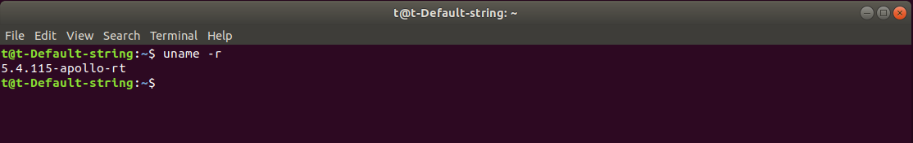
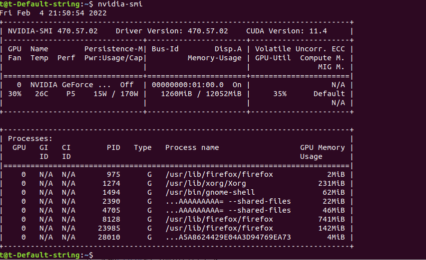
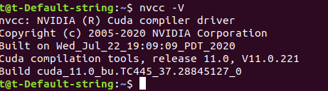
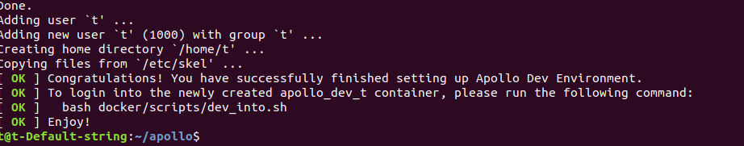
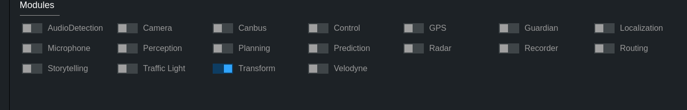
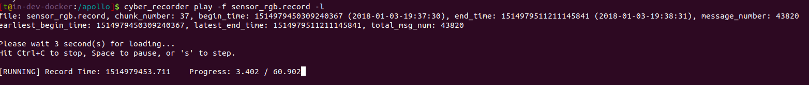
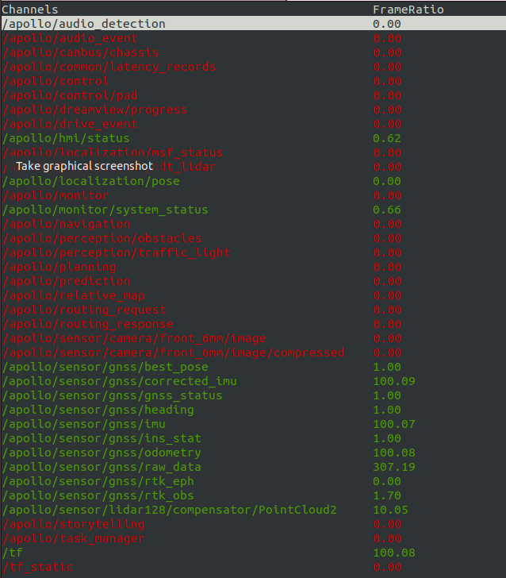
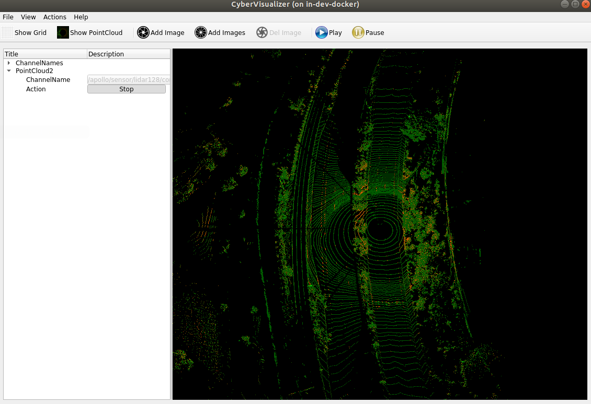

# Apollo系统安装文档

[TOC]

## 0 先修知识检查

1. 了解并会使用**Git/GitHub, Markdown,Docker**等相关工具.
   + 能够下载repo，切换分支，查看更改记录；
   + 安装并能够看懂基于Markdown语法的相关文档；
   + 理解`Docker`的基本概念和组织结构，能够安装、启动、关闭、重启`docker`；
2. 熟悉**Modern C++ (11 and above)**
   + 能够理解类、智能指针等相关概念；
   + 能够理解`protobuf`工作流程，能够阅读并理解相关类型的文件含义；
   + 能够看懂如：`Eigen`、`OpenCV`等常用依赖库的操作。
3. **Ubuntu系统**的安装与简单的操作指令
   + 具有独立安装Ubuntu系统的能力；
   + 能够使用常用命令行，完成目录切换、读写文件、安装编译等相关指令；

## 1 安装编译指导

### 1.1 **Ubuntu**开发环境

首先请确保您可以访问**Ubuntu**开发环境. 如果没有**Ubuntu**环境, 请按照[点击链接进入](https://github.com/AlexGeControl/Sensor-Fusion-for-Localization-Courseware/blob/master/ubuntu-setup/README.md)指南, 在本地PC上安装配置**Ubuntu**环境。本文档内容均在18.04和16.04下经过测试。推荐使用Ubuntu 18.04 进行开发。

**注意**：线下课程使用的工控机操作系统为内核为`5.4.115-apollo-rt`的Ubuntu 18.04，repo基于Apollo 6.0版本进行了适配和微调。存在该仓库时，环境已经配置完毕，无需进行额外操作，退出文档即可。可使用`uname -r`指令查看内核：



### 1.2 安装依赖

#### 1.2.1 （可选）安装Apollo实时内核

实时内核确保车辆行驶过程中的稳定性和实时性，在实车运行中是不可缺少的，但是作为个人测试和开发可以选择性的进行安装。下载、安装预编译的内核的步骤如下：

1. 从[linux-kernel-5.4.115-apollo-rt](https://apollo-system.cdn.bcebos.com/release_installer/linux-kernel-5.4.115-apollo-rt.zip)下载发布的Apollo Kernel的预编译的安装包`linux-kernel-5.4.115-apollo-rt.zip`压缩文件。

2. 安装包下载完成后，解压后安装:

   ```bash
   unzip linux-kernel-5.4.115-apollo-rt.zip
   cd linux-kernel-5.4.115-apollo-rt
   sudo dpkg -i ../*.deb
   ```

3. 安装完成后，使用`reboot`命令重新启动计算机。进入系统后，在终端中输入`uname -r`，若输出“5.4.115-apollo-rt”字样，则表示此时系统是以apollo-kernel引导的。 注意：从此以后，每次开机都需要以apollo-kernel来引导系统。

#### 1.2.2 安装 NVIDIA GPU Driver及 CUDA

1. 安装NVIDIA GPU Driver（以`NVIDIA-Linux-x86_64-470.57.02`）为例

   + 下载[NVIDIA GPU Driver](https://www.geforce.cn/drivers)至当前用户的`home`目录下

   + 下载apollo-kernel官网上的脚本[nvidia_driver.sh](https://github.com/ApolloAuto/apollo-kernel/blob/master/linux/install-nvidia.sh)至当前用户的`home`目录下

   + 切换tty界面下(`ctrl+alt+F2`)后，关闭图形化界面`sudo service lightdm stop`

   + 执行命令：

     ```bash
     sudo apt install make gcc g++   
     sudo bash nvidia_driver.sh   
     sudo bash ./NVIDIA-Linux-x86_64-470.57.02.run --no-x-check -a -s --no-kernel-module
     modprobe nvidia
     reboot
     ```

   + 检查命令：`nvidia-smi`

     

2. 安装CUDA（以CUDA-11.0为例）

   + 下载[CUDA](https://developer.nvidia.com/cuda-toolkit-archive)至当前用户目录下

   + 切换tty界面下(`ctrl+alt+F2`)，关闭图形化界面`sudo service lightdm stop`

   + 安装指令

     ```bash
     # 注意不重复安装驱动 
     sudo sh cuda_xx.xx.xxxx_linux.run --no-opengl-libs
     ```

   + 设置环境变量，写入 `/etc/profile`文件：

     在终端中输入：

     ```bash
     sudo gedit /etc/profile
     ```

     在打开的文件末尾，添加以下两行（64位系统为`lib64`，32位系统为`lib`）：

         export PATH=/usr/local/cuda-11.0/bin${PATH:+:${PATH}}
         export LD_LIBRARY_PATH=/usr/local/cuda-11.0/lib64${LD_LIBRARY_PATH:+:${LD_LIBRARY_PATH}}

     保存文件，并重启。因为`source /etc/profile`是临时生效，重启电脑才是永久生效。

   + 验证：`nvcc -V`
   
     

**注意**：当内核更新或者其他原因导致显卡驱动掉落时，开机会出现带有一堆[OK]输出时，此时进入tty界面，重装显卡驱动。

3. 安装docker，参考[文档](https://docs.docker.com/engine/install/ubuntu/#installation-methods)

   安装指令如下：

   ```bash
   sudo apt-get update
   # 安装依赖
   sudo apt-get install ca-certificates curl gnupg lsb-release
   curl -fsSL https://download.docker.com/linux/ubuntu/gpg | sudo gpg --dearmor -o /usr/share/keyrings/docker-archive-keyring.gpg
   echo  "deb [arch=$(dpkg --print-architecture) signed-by=/usr/share/keyrings/docker-archive-keyring.gpg] https://download.docker.com/linux/ubuntu \
     $(lsb_release -cs) stable" | sudo tee /etc/apt/sources.list.d/docker.list > /dev/null
   sudo apt-get update
   sudo apt-get install docker-ce docker-ce-cli containerd.io
   
   #  List the versions available in your repo:
   apt-cache madison docker-ce
   # Install a specific version using the version string from the second column
   sudo apt-get install docker-ce=<VERSION_STRING> docker-ce-cli=<VERSION_STRING> containerd.io
   
   # 将当前用户加入Docker Group.
   sudo usermod -aG docker $USER
   # 为了使上述变更生效，请先Logout，再Login
   
   # 安装Docker-Compose
   sudo curl -L "https://github.com/docker/compose/releases/download/1.29.2/docker-compose-$(uname -s)-$(uname -m)" -o /usr/local/bin/docker-compose
   sudo chmod +x /usr/local/bin/docker-compose
   sudo ln -s /usr/local/bin/docker-compose /usr/bin/docker-compose
   # 验证安装
   docker-compose --version
   ```

4. 安装 NVIDIA Container Toolkit

   ```bash
   distribution=$(. /etc/os-release;echo $ID$VERSION_ID)
   curl -s -L https://nvidia.github.io/nvidia-docker/gpgkey | sudo apt-key add -
   curl -s -L https://nvidia.github.io/nvidia-docker/$distribution/nvidia-docker.list | sudo tee /etc/apt/sources.list.d/nvidia-docker.list
   sudo apt-get -y update
   sudo apt-get install -y nvidia-docker2
   ```

   安装完成后，重启 Docker 以使改动生效。

   ```bash
   sudo systemctl restart docker
   ```

### 1.3 下载并安装Apollo Git Repo

1. 克隆仓库并切换分支

   ```bash
   git clone https://github.com/ApolloAuto/apollo.git
   git checkout -b self origin/v6.0_edu
   ```

2. 拉取docker镜像，构建容器（仅初次进入时使用）

   ```
   bash docker/scripts/dev_start.sh
   ```

   + **注意**：容器构建完毕后，**之后不用联网重新更新**：`bash docker/scripts/dev_start.sh -l`（`-l`为本地镜像，仅开启容器）

   + 成功后界面如下：

     

3. 进入容器

   ```bash
   bash docker/scripts/dev_into.sh
   ```

   

4. 在容器内构建Apollo（`build_opt`**以优化模式进行**，运行速度会更快；`build`则以debug模式进行，会保留一些调试信息）

   ```bash
   bash apollo.sh build_opt
   ## or
   bash apollo.sh build
   ```


**注意**:

+ 编译失败时可以手动清空过程文件：`rm -rf .cache/bazel/ .cache/build/`
+ 部分情况下可能因为网络，无法下载部分依赖文件导致编译失败，可以使用代理解决。
+ 退出docker容器：`exit`

## 2 使用数据集进行简单测试

### 2.1 数据集下载

+ 官方数据集：`wget https://apollo-system.cdn.bcebos.com/dataset/6.0_edu/demo_sensor_data.tar.xz`
+ 本地数据集：`/apollo/data/bag/2022-01-13-18-40-25/20220113184025.record.0000*`等

### 2.2 数据集形式说明

1. 在Apollo3.5版本以后，CyberRT全面替代了ROS框架，数据记录形式也从`.bag`转换为了`.record`形式。官方提供了两者转换的[工具](https://github.com/ApolloAuto/apollo/blob/v6.0_edu/docs/cyber/CyberRT_Developer_Tools.md)`rosbag_to_record`，但是该工具仅支持部分`channel`（等价于ROS原先的`topic`），并且涉及到了`protouf`结构等问题，因此一般直接采用官方的`.record`数据包。

2. 该数据包也可以由用户自身生成，一般采用命令行形式（为了节省数据空间，这里建议用户在docker环境使用命令行录制数据包，**尽量不使用Recorder模块录制**）

   ```bash
   # 按通道记录
   cyber_recorder record -c /channel_name1 /channel_name2
   # 全部记录
   cyber_recorder record -a
   ```

3. 不加命令限制时，为了保证数据包的数据完整性，**系统以固定数量的message为分割**，命名为`xxx.record.0000x`。其中最右侧的x表示该数据包的第几个分包。使用和查看相关数据包时，不必一个个输入名称，可以采用`xxx.record.0000*`简单概括，系统会帮助我们**自动合并**。

### 2.3 `Dreamview`测试

1. 进入docker，启动/关闭Dreamview：`bash scripts/bootstrap.sh`、`bash scripts/bootstrap.sh stop`

2. 浏览器打开本地网页：`http://localhost:8888/`（当重启Dreamview后需要**刷新**）

   

3. 选择**模式、车型、地图**，推荐配置为模式`Dev Kit Debug`，车型为`dev_kit_pix_hooke`，地图为`sunnyvale_loop`。车辆的相关配置文件见`/apollo/modules/calibration/data/dev_kit_pix_compitiion`。
   + **注意**：在Dreamview中选择该车型后，**相关参数会被系统自动复制到相关算法的文件夹中**，因此在后续修改模块相关参数时，**注意同时修改`calibration`中的数据，否则下次启动后记录将会被重置**。
   
4. 根据任务需求打开`Modules Controller`中对应的模块，这部分的详细说明见后续文档。

   

5. 播放数据集。终端内输入：`cyber_recorder play -f sensor_rgb.record -l`，其中`-l`表示循环播放。

   

### 2.4 常用的`CyberRT`工具测试

1. **通讯监听模块**：`rostopic list`  ->  `cyber_monitor`

   + `esc`：退出
   + `PgUp/PgDn`：上下翻页
   + `->/<-`：查看channel的详细信息

   

2. **点云/图像可视化**：`rviz` -> `cyber_visualizer`

   + 与`rviz`不同，该模块大多用于查看图像和点云，自定义可视化类型比较匮乏。

     

   + **注意**：出现类似下面错误时

     ```c++
     ***
     QOpenGLShader::compile(Fragment): 0:17(10): error: GLSL 3.30 is not supported. Supported versions are: 1.10, 1.20, 1.30, 1.40, 1.00 ES, and 3.00 ES
     *** Problematic Fragment shader source code ***
     ```

     在终端输入：`export MESA_GL_VERSION_OVERRIDE=1`即可

3. **其他的CyberRT工具使用**：[指导文档](https://github.com/ApolloAuto/apollo/tree/v6.0_edu/docs/cyber)。在docker内部，也可以使用 ：命令+`-h` 的形式查看参数的具体细节。

## 3 相关指导文档链接

1. https://apollo.auto/index_cn.html
2. https://github.com/ApolloAuto/apollo/tree/master/docs
3. https://cyber-rt.readthedocs.io/en/latest/CyberRT_Quick_Start.html