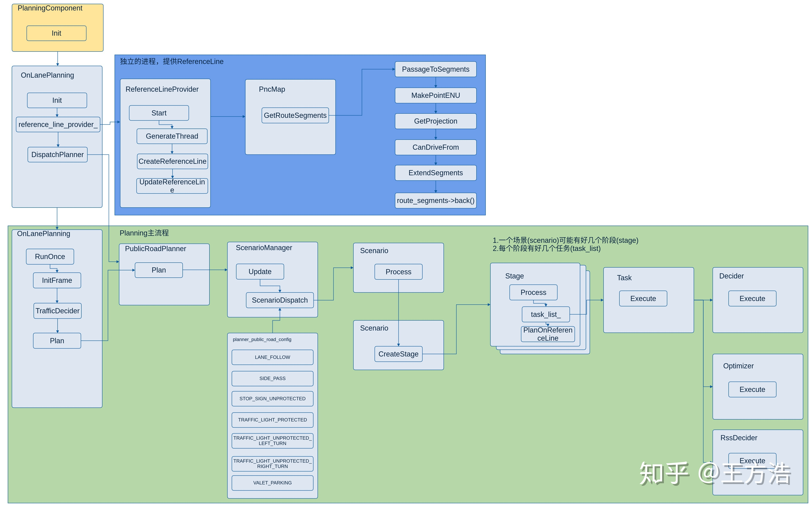
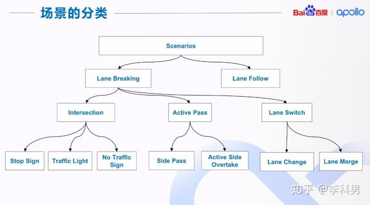
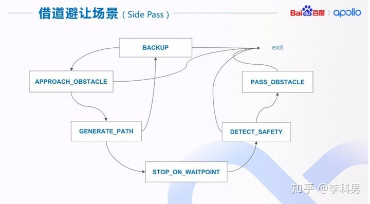
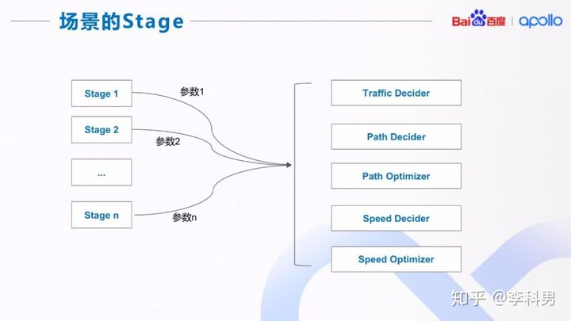
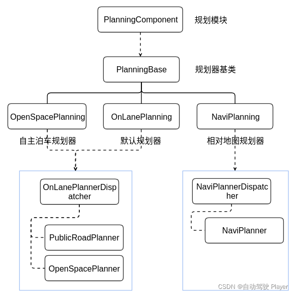
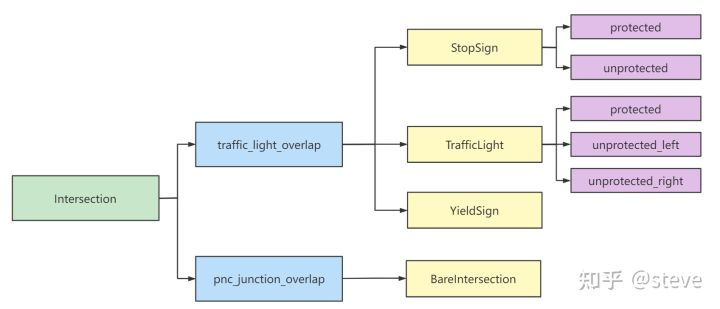

# Planning模块

## 0 Planning模块流程图



依据上面的流程图，我们可以将整个planning模块划分为两个阶段:

1. ReferncelineInfo的生成
2.  scenario->stage->task的调用过程

## 1. RefernceLineInfo的生成

源码位于`planning/common/`目录下。Planning实现中，逻辑计算的基础数据结构，很多操作都会在这个数据结构上进行（例如：交通规则逻辑，障碍物投影，路径优化，速度决策等。ReferenceLine提供的是轨迹信息，而ReferenceLineInfo在ReferenceLine的基础上新添加了决策信息、ST图等。

### 1.1 从PNC模块说起

ReferenceLineInfo是在ReferenceLine的基础上增加了额外的信息，而ReferenceLine的生成,涉及到上游的PNC模块，鉴于该部分的内容网络上已经有了很多很详细的论述和讲解，现给出一篇较为详细的参考博客供读者学习:https://blog.csdn.net/qq_21933647/article/details/104837892 

### 1.2 从RefernceLine到RefernceLineInfo

ReferenceLineInfo是在frame数据结构初始化的同时生成的, ReferenceLineInfo的核心作用

	1. 记录reference_line与当前环境地图中的那些标志有交集，如红绿灯，人行道等标志有交集, 供后续的场景切换使用
	2. 将frame中的obstacles投影到当前的reference_line上, 构建对应障碍物的S-L和S-T图，供后续使用


```c++
Status Frame::Init() {
  ...
    // 创建reference_line_info
  if (!CreateReferenceLineInfo(reference_lines, segments)) {
    const std::string msg = "Failed to init reference line info.";
    AERROR << msg;
    return Status(ErrorCode::PLANNING_ERROR, msg);
  }
  future_route_waypoints_ = future_route_waypoints;
  return Status::OK();
}
    
bool Frame::CreateReferenceLineInfo(const std::list<ReferenceLine> &reference_lines,
    								const std::list<hdmap::RouteSegments> &segments) {
  reference_line_info_.clear();
  auto ref_line_iter = reference_lines.begin();
  auto segments_iter = segments.begin();
  // 将之前获得的reference_line, vehicle_state_, planning_start_point_等压入reference_line_info中
  while (ref_line_iter != reference_lines.end()) {
    if (segments_iter->StopForDestination()) {
      is_near_destination_ = true;
    }
    reference_line_info_.emplace_back(vehicle_state_, planning_start_point_,
                                      *ref_line_iter, *segments_iter);
    ++ref_line_iter;
    ++segments_iter;
  }
  ...

  bool has_valid_reference_line = false;
  for (auto &ref_info : reference_line_info_) {
    if (!ref_info.Init(obstacles())) {	// 将当前frame中感知到的obstacle中压入对应的reference_line_info中
      AERROR << "Failed to init reference line";
    } else {
      has_valid_reference_line = true;
    }
  }
  return has_valid_reference_line;
}

// 将障碍物等信息加入进reference_line_info
bool ReferenceLineInfo::Init(const std::vector<const Obstacle*>& obstacles) {
	...
  // 找到当前对应的reference_line和地图上标志的重叠, 如crosswalk, pnc_junction
  InitFirstOverlaps();
    
	...
  // 判断adc是否在当前的reference_line上
  is_on_reference_line_ = reference_line_.IsOnLane(adc_sl_boundary_);
  // 给当前的reference_line_info增加障碍物信息
  if (!AddObstacles(obstacles)) {
    AERROR << "Failed to add obstacles to reference line";
    return false;
  }
 ...

  return true;
}

// 如果当前参考线和地图上的一些特定场景的标志有交集，就把对应的标志位记录下来，用于后续切换场景使用
void ReferenceLineInfo::InitFirstOverlaps() {
  const auto& map_path = reference_line_.map_path();
  ...

  // pnc_junction
  hdmap::PathOverlap pnc_junction_overlap;
  if (GetFirstOverlap(map_path.pnc_junction_overlaps(),
                      &pnc_junction_overlap)) {
    first_encounter_overlaps_.emplace_back(PNC_JUNCTION, pnc_junction_overlap);
  }

 ...
  // stop_sign
  hdmap::PathOverlap stop_sign_overlap;
  if (GetFirstOverlap(map_path.stop_sign_overlaps(), &stop_sign_overlap)) {
    first_encounter_overlaps_.emplace_back(STOP_SIGN, stop_sign_overlap);
  }

  // yield_sign
  hdmap::PathOverlap yield_sign_overlap;
  if (GetFirstOverlap(map_path.yield_sign_overlaps(), &yield_sign_overlap)) {
    first_encounter_overlaps_.emplace_back(YIELD_SIGN, yield_sign_overlap);
  }

  // sort by start_s
  // 根据场景标志的顺序排序
  if (!first_encounter_overlaps_.empty()) {
    std::sort(first_encounter_overlaps_.begin(),
              first_encounter_overlaps_.end(),
              [](const std::pair<OverlapType, hdmap::PathOverlap>& a,
                 const std::pair<OverlapType, hdmap::PathOverlap>& b) {
                return a.second.start_s < b.second.start_s;
              });
  }
}

// 加入障碍物信息
bool ReferenceLineInfo::AddObstacles(
    const std::vector<const Obstacle*>& obstacles) {
  if (FLAGS_use_multi_thread_to_add_obstacles) {    // false
    ...
  } else {
    for (const auto* obstacle : obstacles) {
      if (!AddObstacle(obstacle)) {
        AERROR << "Failed to add obstacle " << obstacle->Id();
        return false;
      }
    }
  }
  return true;
}

Obstacle* ReferenceLineInfo::AddObstacle(const Obstacle* obstacle) {
  ...
  // 在reference_ine_info的path_decision中添加障碍物
  auto* mutable_obstacle = path_decision_.AddObstacle(*obstacle); {
      // 此处为我自己添加用来更加清楚的表示reference_line_info中的数据结构而添加的代码
   	    private:
      	...
  			ReferenceLine reference_line_;
		...
  			PathDecision path_decision_;

  }
  ...

  SLBoundary perception_sl;
  if (!reference_line_.GetSLBoundary(obstacle->PerceptionBoundingBox(),
                                     &perception_sl)) {
    AERROR << "Failed to get sl boundary for obstacle: " << obstacle->Id();
    return mutable_obstacle;
  }
    
 ...
	
  // 如果添加的障碍物可以忽略，给该障碍物打上ignore标签
  if (IsIrrelevantObstacle(*mutable_obstacle)) {
    ObjectDecisionType ignore;
    ignore.mutable_ignore();
    path_decision_.AddLateralDecision("reference_line_filter", obstacle->Id(),
                                      ignore);
    path_decision_.AddLongitudinalDecision("reference_line_filter",
                                           obstacle->Id(), ignore);
    ADEBUG << "NO build reference line st boundary. id:" << obstacle->Id();
  } else {	// 否则根据当前的动态障碍物的轨迹为当前的reference_line构建S-T图
    ADEBUG << "build reference line st boundary. id:" << obstacle->Id();
    mutable_obstacle->BuildReferenceLineStBoundary(reference_line_,
                                                   adc_sl_boundary_.start_s());
	...
  }
  return mutable_obstacle;
}

void Obstacle::BuildReferenceLineStBoundary(const ReferenceLine& reference_line,
                                            const double adc_start_s) {
  ...
  if (is_static_ || trajectory_.trajectory_point().empty()) {   // 如果是静态障碍物
    std::vector<std::pair<STPoint, STPoint>> point_pairs;
    double start_s = sl_boundary_.start_s();
    double end_s = sl_boundary_.end_s();
    if (end_s - start_s < kStBoundaryDeltaS) {
      end_s = start_s + kStBoundaryDeltaS;
    }
    // 如果该参考线没有堵住道路，就没有建立S-T图的必要
    if (!reference_line.IsBlockRoad(perception_bounding_box_, adc_width)) {
      return;
    }
    // 如果堵住了道路，就建立S-T图
    point_pairs.emplace_back(STPoint(start_s - adc_start_s, 0.0),
                             STPoint(end_s - adc_start_s, 0.0));
    point_pairs.emplace_back(STPoint(start_s - adc_start_s, FLAGS_st_max_t),
                             STPoint(end_s - adc_start_s, FLAGS_st_max_t));
    reference_line_st_boundary_ = STBoundary(point_pairs);
  } else {  // 如果是动态障碍物, 就建立每时刻的粗糙的S-L和S-T图
    if (BuildTrajectoryStBoundary(reference_line, adc_start_s,
                                  &reference_line_st_boundary_)) {
      ADEBUG << "Found st_boundary for obstacle " << id_;
      ADEBUG << "st_boundary: min_t = " << reference_line_st_boundary_.min_t()
             << ", max_t = " << reference_line_st_boundary_.max_t()
             << ", min_s = " << reference_line_st_boundary_.min_s()
             << ", max_s = " << reference_line_st_boundary_.max_s();
    } else {
      ADEBUG << "No st_boundary for obstacle " << id_;
    }
  }
}


```


## 2. Scenario->stage->task的调用过程

### 2.1 明确概念

(注: 本小节说明的内容选取来自于 apollo公开课，只是为了说明概念，其内容并非为对应的 apollo6.0版本)

**Scenario**: 场景既可以是地图中的一个静态路段， 比如十字路口；也可以是无人车想要完成的一个动态目标，比如借道避让(Side Pass)。 依据场景来做决策和规划有以下两个优点：1)场景之间互不干扰，有利于并行开发和独立调参； 2)在一个场景里我们可以实现一系列的有时序或者依赖关系的复杂任务。场景分类如下图所示。




Lane Follow: Lane Follow场景下主车沿一条车道驾驶，该车道前方一定距离内没有其他车道与其交汇或 者穿越;并且主车也没有切换到其他车道的意图

Lane Breaking: 非 Lane follow 的其他场景被分类为 Lane Breaking

Intersection: 所有的路口场景

Active Pass : 包括了所有临时借道的场景

Lane Switch : 包括了所有换道的场景(包括车道合并) 


**Stage:** 一个场景的完整执行分为不同的阶段(stage),  用借道避让场景的一个实现，来说明场景是如何实现的,如图:



 在每一个 Stage(阶段)中，都要实现上图中的功能，包括交规决策、路径决策、路径优化、 速度决策、速度优化。 我们把每个功能定义为一个或者几个基本的 Task(任务)，每个 Stage(阶段)或者直接调 用(使用默认参数)，或者修改参数，或者修改输入值。这样的实现可以极大的提高场景之 间的代码复用。



Task: Task 是 apollo 中具体执行不同任务的部分, 可分为三类, deciders (决策)，optimizers（规划），learningModel, 针对这部分的具体内容，我们将会以LaneFollw 场景为例，具体介绍 apollo 中不同的典型Task


### 2.2 调用过程

#### 2.2.1、规划算法的初始化

规划算法初始化流程图: 



程序流程: 

```C++
// /modules/planning/planning_component.cc
bool PlanningComponent::Init() {
    ...
        // 查询/modules/common/configs/config_gflags.cc, 确定FLAGS_use_navigation_mode 为false	
        if (FLAGS_use_navigation_mode) {　　　// false
    		planning_base_ = std::make_unique<NaviPlanning>(injector_);
  		} else {
    		planning_base_ = std::make_unique<OnLanePlanning>(injector_);
  		}
     	
    	planning_base_->Init(config_);   // 这里的planning_base_已经是OnLanePlanning了
}

...
// /modules/planning/on_lane_planning.cc
Status OnLanePlanning::Init(const PlanningConfig& config) {
    PlanningBase::Init(config_); {
		...	
            // /modules/planning/planning_base.cc
    		Status PlanningBase::Init(const PlanningConfig& config) {
  					injector_->planning_context()->Init();
  					TaskFactory::Init(config, injector_);   // 注册配置文件中的task
  					return Status::OK();
			}
    }
  	planner_dispatcher_->Init(); {
    	...
            // /modules/planning/planner/planner_dispatcher.h
        virtual common::Status Init() {
    			RegisterPlanners();			// 注册规划器包括RTK, PUBLIC_ROAD, LATTICE, NAVI
    			return common::Status::OK();
  			}
    }
    ...
    // 根据modules/planning/conf/planning_config.pb.txt选择对应的规划器，默认是PUBLIC_ROAD
    planner_ = planner_dispatcher_->DispatchPlanner(config_, injector_);
    
    // 根据配置文件配置好对应的规划器
    return planner_->Init(config_); {
        ...
            // modules/planning/planner/public_road/public_road_planner.cc
            Status PublicRoadPlanner::Init(const PlanningConfig& config) {
            	config_ = config;
  				scenario_manager_.Init(config);		// 初始化并注册场景
  				return Status::OK();
        }
    }
    
}

// 其中, (config_/config)为/modules/planning/conf/planning_config.pb.txt
```

#### 2.1.2、规划算法的运行

```C++
bool PlanningComponent::Proc() {
    ...
        planning_base_->RunOnce(local_view_, &adc_trajectory_pb);
    ...
}

void OnLanePlanning::RunOnce(const LocalView& local_view, ADCTrajectory* const ptr_trajectory_pb)
```


​	1. 规划模块的入口函数是PlanningComponent的Proc()

​    2. 以规划模式OnLanePlanning，执行RunOnce。在RunOnce中**先执行交通规则**，再规划轨迹。规划轨迹的函数是Plan。

```C++
// /modules/planning/planning_component.cc
bool PlanningComponent::Proc( const std::shared_ptr<prediction::PredictionObstacles>& prediction_obstacles,	
    						  const std::shared_ptr<canbus::Chassis>& chassis,
                              const std::shared_ptr<localization::LocalizationEstimate>&localization_estimate) {
    ... 
    planning_base_->RunOnce(local_view_, &adc_trajectory_pb); {
        ...
            // /modules/planning/on_lane_planning.cc
            void OnLanePlanning::RunOnce(const LocalView& local_view, ADCTrajectory* const ptr_trajectory_pb) {
            	// 开始规划
            	status = Plan(start_timestamp, stitching_trajectory, ptr_trajectory_pb);
        	}
    }
}

// /modules/planning/on_lane_planning.cc
Status OnLanePlanning::Plan( const double current_time_stamp, const std::vector<TrajectoryPoint>& stitching_trajectory,
    						 ADCTrajectory* const ptr_trajectory_pb) {
    auto status = planner_->Plan(stitching_trajectory.back(), frame_.get(), ptr_trajectory_pb); {
        ...
        // /modules/planning/planner/public_road/public_road_planner.cc
        Status PublicRoadPlanner::Plan(const TrajectoryPoint& planning_start_point, Frame* frame,
       								   ADCTrajectory* ptr_computed_trajectory) {
            		scenario_manager_.Update(planning_start_point, *frame);		// 更新场景
  					scenario_ = scenario_manager_.mutable_scenario();			// 场景变量赋值
  					auto result = scenario_->Process(planning_start_point, frame);	// 进入具体的场景处理规划任务
        }
    }
}
```

#### 2.1.3、初始化场景

ScenarioManager会实例化一个全局的scenario_manager_对象来进行场景管理，在PublicRoadPlanner初始化时会调用配置文件里的参数来建立这个对象。

```c++
Status PublicRoadPlanner::Init(const PlanningConfig& config) {
      config_ = config;
      scenario_manager_.Init(config);	// 初始化scenario_manager_
      return Status::OK();
}

...
bool ScenarioManager::Init(const PlanningConfig& planning_config) {
  	  planning_config_.CopyFrom(planning_config);
  	  RegisterScenarios();	 // 注册场景
  	  default_scenario_type_ = ScenarioConfig::LANE_FOLLOW;		// 默认场景设置为LANE_FOLLOW
  	  current_scenario_ = CreateScenario(default_scenario_type_);	// 创建场景
   	  return true;
}

...
// 该函数的作用就是加载/apollo/modules/planning/conf/scenario中的配置文件，　同时构建map的映射关系供后续加载不同场景的配置文件使用
void ScenarioManager::RegisterScenarios() {
     // lane_follow
  if (planning_config_.learning_mode() == PlanningConfig::HYBRID ||
      planning_config_.learning_mode() == PlanningConfig::HYBRID_TEST) {
    // HYBRID or HYBRID_TEST
    ACHECK(Scenario::LoadConfig(FLAGS_scenario_lane_follow_hybrid_config_file,
                                &config_map_[ScenarioConfig::LANE_FOLLOW]));
  } else {
    // 以该语句为例, 判断scenario_lane_follow_config_file是否存在于/apollo/modules/planning/conf/scenario文件夹中,
    // 如果存在，就构建一个map映射ScenarioConfig::LANE_FOLLOW和文件之间的关系，便于后续创建场景时能够找到该场景的配置文件
    ACHECK(Scenario::LoadConfig(FLAGS_scenario_lane_follow_config_file,
                                &config_map_[ScenarioConfig::LANE_FOLLOW]));
  }

  // bare_intersection
  ACHECK(Scenario::LoadConfig(
      FLAGS_scenario_bare_intersection_unprotected_config_file,
      &config_map_[ScenarioConfig::BARE_INTERSECTION_UNPROTECTED]));

  // emergency_pull_over
  ACHECK(
      Scenario::LoadConfig(FLAGS_scenario_emergency_pull_over_config_file,
                           &config_map_[ScenarioConfig::EMERGENCY_PULL_OVER]));
 ....
}
```

```c++
// 创建和初始化对应的场景
std::unique_ptr<Scenario> ScenarioManager::CreateScenario(ScenarioConfig::ScenarioType scenario_type) {
    std::unique_ptr<Scenario> ptr;		// 指向场景的指针
    
    switch (scenario_type) {
            case ScenarioConfig::BARE_INTERSECTION_UNPROTECTED:
      			ptr.reset(new scenario::bare_intersection::BareIntersectionUnprotectedScenario(
              				config_map_[scenario_type], &scenario_context_, injector_));
      			break;
    		case ScenarioConfig::EMERGENCY_PULL_OVER:
      			ptr.reset(new emergency_pull_over::EmergencyPullOverScenario(
          					config_map_[scenario_type], &scenario_context_, injector_));
      			break;
    		case ScenarioConfig::EMERGENCY_STOP:
      			ptr.reset(new emergency_stop::EmergencyStopScenario(
          		config_map_[scenario_type], &scenario_context_, injector_));
      			break;
    		case ScenarioConfig::LANE_FOLLOW:
      			ptr.reset(new lane_follow::LaneFollowScenario(
          		config_map_[scenario_type], &scenario_context_, injector_));
      			break;
            ...
    }
    if (ptr != nullptr) {
    	ptr->Init();		// 初始化对应场景
  	}
  	return ptr;
}

// 初始化场景, 并返回对应的stage(阶段)
void Scenario::Init() {
  ACHECK(!config_.stage_type().empty());

  // set scenario_type in PlanningContext
  auto* scenario = injector_->planning_context()->mutable_planning_status()->mutable_scenario();
  scenario->Clear();
  scenario->set_scenario_type(scenario_type());
	
  // 加载对应的配置文件中stage
  for (const auto& stage_config : config_.stage_config()) {
    stage_config_map_[stage_config.stage_type()] = &stage_config;
  }
  for (int i = 0; i < config_.stage_type_size(); ++i) {
    auto stage_type = config_.stage_type(i);
    ACHECK(common::util::ContainsKey(stage_config_map_, stage_type))
        << "stage type : " << ScenarioConfig::StageType_Name(stage_type) << " has no config";
  }
  ADEBUG << "init stage " << ScenarioConfig::StageType_Name(config_.stage_type(0));
  current_stage_ = CreateStage(*stage_config_map_[config_.stage_type(0)], injector_);   // 初始化对应的stage
}
```


#### 2.1.4、场景更新和切换

```c++
Status PublicRoadPlanner::Plan(const TrajectoryPoint& planning_start_point,
                               Frame* frame,
                               ADCTrajectory* ptr_computed_trajectory) {
  scenario_manager_.Update(planning_start_point, *frame);		// 根据frame信息更新场景
  scenario_ = scenario_manager_.mutable_scenario();				
  auto result = scenario_->Process(planning_start_point, frame);	// 进入特定的场景执行stage和task

	...
  
  if (result == scenario::Scenario::STATUS_DONE) {		// 如果当前场景执行完成
    // only updates scenario manager when previous scenario's status is
    // STATUS_DONE
    scenario_manager_.Update(planning_start_point, *frame);			// 更新场景
  } else if (result == scenario::Scenario::STATUS_UNKNOWN) {	// 否则报错
    return Status(common::PLANNING_ERROR, "scenario returned unknown");
  }
  return Status::OK();
}

void ScenarioManager::Update(const common::TrajectoryPoint& ego_point,
                             const Frame& frame) {
  ACHECK(!frame.reference_line_info().empty());

  Observe(frame);		// 根据frame信息初始化对应的标志位

  ScenarioDispatch(frame);	// 选择场景
}

// 该函数的作用是结合参考线信息和frame信息来获得当前场景中的一些特点，从而判断当前是什么场景
void ScenarioManager::Observe(const Frame& frame) {
  // init first_encountered_overlap_map_
  first_encountered_overlap_map_.clear();
  const auto& reference_line_info = frame.reference_line_info().front();
  const auto& first_encountered_overlaps =
      reference_line_info.FirstEncounteredOverlaps();		// // 车辆沿着参考线行驶首次遇到的道路连接的键值对，key表示道路连接类型
  for (const auto& overlap : first_encountered_overlaps) {
    if (overlap.first == ReferenceLineInfo::PNC_JUNCTION ||   // //交叉路口
        overlap.first == ReferenceLineInfo::SIGNAL ||         //  交通灯
        overlap.first == ReferenceLineInfo::STOP_SIGN ||      // 停止标志
        overlap.first == ReferenceLineInfo::YIELD_SIGN) {     // 让行标志
      first_encountered_overlap_map_[overlap.first] = overlap.second;
    }
  }
}

// 根据observe得到的信息判断当前是什么场景
void ScenarioManager::ScenarioDispatch(const Frame& frame) {
...
	if ((planning_config_.learning_mode() == PlanningConfig::E2E ||
       	planning_config_.learning_mode() == PlanningConfig::E2E_TEST) &&
      	history_points_len >= FLAGS_min_past_history_points_len) {
    	scenario_type = ScenarioDispatchLearning();
  	} else {
    	scenario_type = ScenarioDispatchNonLearning(frame);
  	}    
	
    ...
    // update PlanningContext
  UpdatePlanningContext(frame, scenario_type);

  if (current_scenario_->scenario_type() != scenario_type) {	// 如果现在的scenario_type和之前不同, 就新创建一个对应的场景返回
      current_scenario_ = CreateScenario(scenario_type);
  }
}


...
// 根据frame信息选择不同的场景
ScenarioConfig::ScenarioType ScenarioManager::ScenarioDispatchNonLearning(const Frame& frame) {
   ... 
    // ParkAndGo / starting scenario
  if (scenario_type == default_scenario_type_) {
    if (FLAGS_enable_scenario_park_and_go && !reach_target_pose_) {
      scenario_type = SelectParkAndGoScenario(frame);
    }
  }

  ////////////////////////////////////////
  // intersection scenarios
  if (scenario_type == default_scenario_type_) {
    scenario_type = SelectInterceptionScenario(frame);
  }

  ////////////////////////////////////////
  // pull-over scenario
  if (scenario_type == default_scenario_type_) {
    if (FLAGS_enable_scenario_pull_over) {
      scenario_type = SelectPullOverScenario(frame);
    }
  }

  ////////////////////////////////////////
  // VALET_PARKING scenario
  if (scenario_type == default_scenario_type_) {
    scenario_type = SelectValetParkingScenario(frame);
  }
  ////////////////////////////////////////
  // dead end
  if (scenario_type == default_scenario_type_) {
    scenario_type = SelectDeadEndScenario(frame);
  }
  ////////////////////////////////////////
  return scenario_type;
}
```

下面对一些典型场景的准入条件做一个说明

#### 1. ParkAndGo

该场景的准入条件是enable_scenario_park_and_go为true且未到达终点, 同时车辆当前是静止状态, 距离终点10m以上，并且当前车辆已经off_lane或者不在城市道路上

```c++
// ParkAndGo / starting scenario
ScenarioConfig::ScenarioType ScenarioManager::SelectParkAndGoScenario(const Frame& frame) {  
	if (scenario_type == default_scenario_type_) {
    	if (FLAGS_enable_scenario_park_and_go && !reach_target_pose_) {
      	scenario_type = SelectParkAndGoScenario(frame);
    	}
  	}

...
 	if (std::fabs(adc_speed) < max_abs_speed_when_stopped &&
      	adc_distance_to_dest > scenario_config.min_dist_to_dest() &&
      	(HDMapUtil::BaseMap().GetNearestLaneWithHeading(
           	adc_point, 2.0, vehicle_state.heading(), M_PI / 3.0, &lane, &s,
           	&l) != 0 ||
       	lane->lane().type() != hdmap::Lane::CITY_DRIVING)) {
    	park_and_go = true;
  }
}
```

#### 2. Intersection

在该场景下，又可细分四个场景。首先，根据先前计算的地图中第一个遇到的overlap来确定大类型，是包含交通标识的交叉口，还是其他交叉口。其次，若是包含交通标识的交叉口，还细分为stop_sign、traffic_light以及yield_sign，具体结构图如下所示。




```c++
ScenarioConfig::ScenarioType ScenarioManager::SelectInterceptionScenario(
    const Frame& frame) {
  ScenarioConfig::ScenarioType scenario_type = default_scenario_type_;

  hdmap::PathOverlap* traffic_sign_overlap = nullptr;
  hdmap::PathOverlap* pnc_junction_overlap = nullptr;
  ReferenceLineInfo::OverlapType overlap_type;

  const auto& reference_line_info = frame.reference_line_info().front();
  const auto& first_encountered_overlaps =
      reference_line_info.FirstEncounteredOverlaps();
  // note: first_encountered_overlaps already sorted
  for (const auto& overlap : first_encountered_overlaps) {
    if (overlap.first == ReferenceLineInfo::SIGNAL ||
        overlap.first == ReferenceLineInfo::STOP_SIGN ||
        overlap.first == ReferenceLineInfo::YIELD_SIGN) {
      overlap_type = overlap.first;		// 只要检测到有交通灯标志就退出，可见交通灯的优先级更高
      traffic_sign_overlap = const_cast<hdmap::PathOverlap*>(&overlap.second);
      break;
    } else if (overlap.first == ReferenceLineInfo::PNC_JUNCTION) {		// 路口重叠标志
      pnc_junction_overlap = const_cast<hdmap::PathOverlap*>(&overlap.second);
    }
  }

  // pick a closer one between consecutive bare_intersection and traffic_sign
  if (traffic_sign_overlap && pnc_junction_overlap) {		// 如果同时存在两个标志, 选择一个更近的重叠量来定义当前的场景
    static constexpr double kJunctionDelta = 10.0;
    double s_diff = std::fabs(traffic_sign_overlap->start_s -
                              pnc_junction_overlap->start_s);		// 计算交通灯重叠标志和路口重叠标志的距离
    if (s_diff >= kJunctionDelta) {		// 如果这两者的距离足够大，这里是两者的距离超过10m
      if (pnc_junction_overlap->start_s > traffic_sign_overlap->start_s) {
        pnc_junction_overlap = nullptr;	// 如果路口重叠标志在交通灯重叠标志的后面，就将该场景看成是交通灯场景
      } else {
        traffic_sign_overlap = nullptr;	// 反之则是路口标志
      }
    }
  }

  if (traffic_sign_overlap) {	 // 如果两个标志都很近，就把当前场景当成是交通灯场景
    switch (overlap_type) {
      case ReferenceLineInfo::STOP_SIGN:
        if (FLAGS_enable_scenario_stop_sign) {
          scenario_type = SelectStopSignScenario(frame, *traffic_sign_overlap);		// 停止标志场景
        }
        break;
      case ReferenceLineInfo::SIGNAL:
        if (FLAGS_enable_scenario_traffic_light) {
          scenario_type =
              SelectTrafficLightScenario(frame, *traffic_sign_overlap);	// 交通灯场景
        }
        break;
      case ReferenceLineInfo::YIELD_SIGN:
        if (FLAGS_enable_scenario_yield_sign) {
          scenario_type = SelectYieldSignScenario(frame, *traffic_sign_overlap);	// 让行场景
        }
        break;
      default:
        break;
    }
  } else if (pnc_junction_overlap) {  
    // bare intersection
    if (FLAGS_enable_scenario_bare_intersection) {
      scenario_type =
          SelectBareIntersectionScenario(frame, *pnc_junction_overlap);	// 单纯的路口场景
    }
  }

  return scenario_type;
}
```

#### 3. PullOver

PullOver场景即靠边停车，需要满足以下条件才可切换到该场景：

​	1. 不在change_line的时候，即reference_line只有一条

​	2. 当前位置距离终点在一定范围内并且满足pullover可以执行的最短距离

​	3. 地图中能够找到pullover的位置

​	4. 终点的位置不在交叉路口附近

​	5. 能查找到最右边车道的lane_type，并且该车道允许pullover

​	6. 只有从lane_follow场景下才能切换到pullover

```c++
ScenarioConfig::ScenarioType ScenarioManager::SelectPullOverScenario(
    const Frame& frame) {
  const auto& scenario_config =
      config_map_[ScenarioConfig::PULL_OVER].pull_over_config();

  const auto& routing = frame.local_view().routing;
  const auto& routing_end = *(routing->routing_request().waypoint().rbegin());

  common::SLPoint dest_sl;
  const auto& reference_line_info = frame.reference_line_info().front();
  const auto& reference_line = reference_line_info.reference_line();
  reference_line.XYToSL(routing_end.pose(), &dest_sl);
  const double adc_front_edge_s = reference_line_info.AdcSlBoundary().end_s();

  const double adc_distance_to_dest = dest_sl.s() - adc_front_edge_s;   // 距离目的地的距离
  ADEBUG << "adc_distance_to_dest[" << adc_distance_to_dest
         << "] destination_s[" << dest_sl.s() << "] adc_front_edge_s["
         << adc_front_edge_s << "]";

  bool pull_over_scenario = // 不在change_line的时候，即reference_line只有一条
      (frame.reference_line_info().size() == 1 &&  // NO, while changing lane
       adc_distance_to_dest >=
           scenario_config.pull_over_min_distance_buffer() &&   
       adc_distance_to_dest <=
           scenario_config.start_pull_over_scenario_distance());  // 当前位置距离终点在一定范围内并且满足pullover可以执行的最短距离

  // too close to destination + not found pull-over position
  if (pull_over_scenario) {
    const auto& pull_over_status =
        injector_->planning_context()->planning_status().pull_over();
    if (adc_distance_to_dest < scenario_config.max_distance_stop_search() &&  
        !pull_over_status.has_position()) {   // 地图中能够找到pullover的位置
      pull_over_scenario = false;
    }
  }

  // check around junction
  if (pull_over_scenario) {
    static constexpr double kDistanceToAvoidJunction = 8.0;  // meter
    for (const auto& overlap : first_encountered_overlap_map_) {
      if (overlap.first == ReferenceLineInfo::PNC_JUNCTION ||
          overlap.first == ReferenceLineInfo::SIGNAL ||
          overlap.first == ReferenceLineInfo::STOP_SIGN ||
          overlap.first == ReferenceLineInfo::YIELD_SIGN) {
        const double distance_to = overlap.second.start_s - dest_sl.s();
        const double distance_passed = dest_sl.s() - overlap.second.end_s;
        if ((distance_to > 0.0 && distance_to < kDistanceToAvoidJunction) ||    // 距离交叉路口过进
            (distance_passed > 0.0 &&
             distance_passed < kDistanceToAvoidJunction)) {
          pull_over_scenario = false;
          break;
        }
      }
    }
  }

  // check rightmost driving lane along pull-over path
  // 能查找到最右边车道的lane_type，并且该车道允许pullover
  if (pull_over_scenario) {
    double check_s = adc_front_edge_s;
    static constexpr double kDistanceUnit = 5.0;
    while (check_s < dest_sl.s()) {
      check_s += kDistanceUnit;

      std::vector<hdmap::LaneInfoConstPtr> lanes;
      reference_line.GetLaneFromS(check_s, &lanes);
      if (lanes.empty()) {
        ADEBUG << "check_s[" << check_s << "] can't find a lane";
        continue;
      }
      const hdmap::LaneInfoConstPtr lane = lanes[0];
      const std::string lane_id = lane->lane().id().id();
      ADEBUG << "check_s[" << check_s << "] lane[" << lane_id << "]";

      // check neighbor lanes type: NONE/CITY_DRIVING/BIKING/SIDEWALK/PARKING
      bool rightmost_driving_lane = true;
      for (const auto& neighbor_lane_id :
           lane->lane().right_neighbor_forward_lane_id()) {
        const auto hdmap_ptr = HDMapUtil::BaseMapPtr();
        CHECK_NOTNULL(hdmap_ptr);
        const auto neighbor_lane = hdmap_ptr->GetLaneById(neighbor_lane_id);
        if (neighbor_lane == nullptr) {
          ADEBUG << "Failed to find neighbor lane[" << neighbor_lane_id.id()
                 << "]";
          continue;
        }
        const auto& lane_type = neighbor_lane->lane().type();
        if (lane_type == hdmap::Lane::CITY_DRIVING) {
          ADEBUG << "lane[" << lane_id << "]'s right neighbor forward lane["
                 << neighbor_lane_id.id() << "] type["
                 << Lane_LaneType_Name(lane_type) << "] can't pull over";
          rightmost_driving_lane = false;
          break;
        }
      }
      if (!rightmost_driving_lane) {
        pull_over_scenario = false;
        break;
      }
    }
  }

  // 只有从lane_follow场景下才能切换到pullover
  switch (current_scenario_->scenario_type()) {
    case ScenarioConfig::LANE_FOLLOW:
      if (pull_over_scenario) {
        return ScenarioConfig::PULL_OVER;
      }
      break;
    case ScenarioConfig::BARE_INTERSECTION_UNPROTECTED:
    case ScenarioConfig::EMERGENCY_PULL_OVER:
    case ScenarioConfig::PARK_AND_GO:
    case ScenarioConfig::PULL_OVER:
    case ScenarioConfig::STOP_SIGN_PROTECTED:
    case ScenarioConfig::STOP_SIGN_UNPROTECTED:
    case ScenarioConfig::TRAFFIC_LIGHT_PROTECTED:
    case ScenarioConfig::TRAFFIC_LIGHT_UNPROTECTED_LEFT_TURN:
    case ScenarioConfig::TRAFFIC_LIGHT_UNPROTECTED_RIGHT_TURN:
    case ScenarioConfig::VALET_PARKING:
    case ScenarioConfig::DEADEND_TURNAROUND:
    case ScenarioConfig::YIELD_SIGN:
      if (current_scenario_->GetStatus() !=
          Scenario::ScenarioStatus::STATUS_DONE) {
        return current_scenario_->scenario_type();
      }
      break;
    default:
      break;
  }

  return default_scenario_type_;
}

```

#### 2.1.5、Scenario->Stage执行

以默认场景  lane follow为例:

查看对应的配置文件

```
/modules/planning/conf/scenario/lane_follow_config.pb.txt
scenario_type: LANE_FOLLOW
stage_type: LANE_FOLLOW_DEFAULT_STAGE	// 加载对应的stage
stage_config: {
  stage_type: LANE_FOLLOW_DEFAULT_STAGE
  enabled: true
  task_type: LANE_CHANGE_DECIDER
  ...
}
```

```c++
// 初始化场景, 并返回对应的stage(阶段)
void Scenario::Init() {
  // 加载对应的配置文件中stage
  for (const auto& stage_config : config_.stage_config()) {
    stage_config_map_[stage_config.stage_type()] = &stage_config;
  }

  for (int i = 0; i < config_.stage_type_size(); ++i) {
    auto stage_type = config_.stage_type(i);
    ACHECK(common::util::ContainsKey(stage_config_map_, stage_type))
        << "stage type : " << ScenarioConfig::StageType_Name(stage_type) << " has no config";
  }
  ADEBUG << "init stage " << ScenarioConfig::StageType_Name(config_.stage_type(0));
  current_stage_ = CreateStage(*stage_config_map_[config_.stage_type(0)], injector_);   // 初始化对应的stage
}
```

```c++
// 返回config文件中对应的stage
// /modules/planning/scenarios/lane_follow/lane_follow_scenario.cc
std::unique_ptr<Stage> LaneFollowScenario::CreateStage(
    const ScenarioConfig::StageConfig& stage_config,
    const std::shared_ptr<DependencyInjector>& injector) {
  if (stage_config.stage_type() != ScenarioConfig::LANE_FOLLOW_DEFAULT_STAGE) {
    AERROR << "Follow lane does not support stage type: "
           << ScenarioConfig::StageType_Name(stage_config.stage_type());
    return nullptr;
  }
  return std::unique_ptr<Stage>(new LaneFollowStage(stage_config, injector));
}
```

scenario->stage

```c++
Status PublicRoadPlanner::Plan(const TrajectoryPoint& planning_start_point,
                               Frame* frame,
                               ADCTrajectory* ptr_computed_trajectory) {
  	scenario_manager_.Update(planning_start_point, *frame);
  	scenario_ = scenario_manager_.mutable_scenario();
  	auto result = scenario_->Process(planning_start_point, frame);
    ...
}

// /apollo/modules/planning/scenarios/scenario.cc
Scenario::ScenarioStatus Scenario::Process(
    const common::TrajectoryPoint& planning_init_point, Frame* frame) {
 ...
  // 进入到对应的stage中处理任务
  auto ret = current_stage_->Process(planning_init_point, frame);
    
  switch (ret) {
    ...
    case Stage::FINISHED: {		// 对应阶段执行完毕, 寻找下一个阶段继续执行
      auto next_stage = current_stage_->NextStage();
      if (next_stage != current_stage_->stage_type()) {
        AINFO << "switch stage from " << current_stage_->Name() << " to "
              << ScenarioConfig::StageType_Name(next_stage);
        if (next_stage == ScenarioConfig::NO_STAGE) {
          scenario_status_ = STATUS_DONE;
          return scenario_status_;
        }
        if (stage_config_map_.find(next_stage) == stage_config_map_.end()) {
          AERROR << "Failed to find config for stage: " << next_stage;
          scenario_status_ = STATUS_UNKNOWN;
          return scenario_status_;
        }
        current_stage_ = CreateStage(*stage_config_map_[next_stage], injector_);
        if (current_stage_ == nullptr) {
          AWARN << "Current stage is a null pointer.";
          return STATUS_UNKNOWN;
        }
      }
      if (current_stage_ != nullptr &&
          current_stage_->stage_type() != ScenarioConfig::NO_STAGE) {
        scenario_status_ = STATUS_PROCESSING;
      } else {
        scenario_status_ = STATUS_DONE;
      }
      break;
    }
    default: {
      AWARN << "Unexpected Stage return value: " << ret;
      scenario_status_ = STATUS_UNKNOWN;
    }
  }
  return scenario_status_;
}
```

执行对应的lanefollow阶段

```c++
Stage::StageStatus LaneFollowStage::Process(const TrajectoryPoint& planning_start_point, Frame* frame) {
    ...
        auto cur_status = PlanOnReferenceLine(planning_start_point, frame, &reference_line_info);
    ...
}

Status LaneFollowStage::PlanOnReferenceLine(const TrajectoryPoint& planning_start_point, Frame* frame,
    										ReferenceLineInfo* reference_line_info) {
    ...
    for (auto* task : task_list_) {
    	const double start_timestamp = Clock::NowInSeconds();

    	ret = task->Execute(frame, reference_line_info);

    	const double end_timestamp = Clock::NowInSeconds();
    	const double time_diff_ms = (end_timestamp - start_timestamp) * 1000;
    	ADEBUG << "after task[" << task->Name() << "]:" << reference_line_info->PathSpeedDebugString();
    	ADEBUG << task->Name() << " time spend: " << time_diff_ms << " ms.";
    	RecordDebugInfo(reference_line_info, task->Name(), time_diff_ms);

    	if (!ret.ok()) {
      		AERROR << "Failed to run tasks[" << task->Name() << "], Error message: " << ret.error_message();
      		break;
    	}
  	}
	...
}
```

#### 2.1.6、Stage->Task执行

```
task_type: LANE_CHANGE_DECIDER
  task_type: PATH_REUSE_DECIDER
  task_type: PATH_LANE_BORROW_DECIDER
  task_type: PATH_BOUNDS_DECIDER
  task_type: PIECEWISE_JERK_PATH_OPTIMIZER
  task_type: PATH_ASSESSMENT_DECIDER
  task_type: PATH_DECIDER
  task_type: RULE_BASED_STOP_DECIDER
  task_type: ST_BOUNDS_DECIDER
  task_type: SPEED_BOUNDS_PRIORI_DECIDER
  task_type: SPEED_HEURISTIC_OPTIMIZER
  task_type: SPEED_DECIDER
  task_type: SPEED_BOUNDS_FINAL_DECIDER
  # task_type: PIECEWISE_JERK_SPEED_OPTIMIZER
  task_type: PIECEWISE_JERK_NONLINEAR_SPEED_OPTIMIZER
  task_type: RSS_DECIDER

  task_config: {
    task_type: LANE_CHANGE_DECIDER
    lane_change_decider_config {
      enable_lane_change_urgency_check: true
    }
  }
  ...
```

加载task_list_

```c++
std::unique_ptr<Stage> LaneFollowScenario::CreateStage(
    ...
  return std::unique_ptr<Stage>(new LaneFollowStage(stage_config, injector));
}
    
LaneFollowStage::LaneFollowStage( const ScenarioConfig::StageConfig& config,
    							  const std::shared_ptr<DependencyInjector>& injector) : Stage(config, injector) {}
 
Stage::Stage(const ScenarioConfig::StageConfig& config,
             const std::shared_ptr<DependencyInjector>& injector)
    : config_(config), injector_(injector) {
  // set stage_type in PlanningContext
  injector->planning_context()
      ->mutable_planning_status()
      ->mutable_scenario()
      ->set_stage_type(stage_type());

  name_ = ScenarioConfig::StageType_Name(config_.stage_type());
  next_stage_ = config_.stage_type();
  std::unordered_map<TaskConfig::TaskType, const TaskConfig*, std::hash<int>>
      config_map;
  for (const auto& task_config : config_.task_config()) {
    config_map[task_config.task_type()] = &task_config;
  }
  for (int i = 0; i < config_.task_type_size(); ++i) {
    auto task_type = config_.task_type(i);
    ACHECK(config_map.find(task_type) != config_map.end())
        << "Task: " << TaskConfig::TaskType_Name(task_type)
        << " used but not configured";
    auto iter = tasks_.find(task_type);
    if (iter == tasks_.end()) {
      auto ptr = TaskFactory::CreateTask(*config_map[task_type], injector_);
      task_list_.push_back(ptr.get());
      tasks_[task_type] = std::move(ptr);
    } else {
      task_list_.push_back(iter->second.get());
    }
  }
}
```

执行task_list_中的一系列任务

```c++
Status LaneFollowStage::PlanOnReferenceLine(const TrajectoryPoint& planning_start_point, Frame* frame,
    										ReferenceLineInfo* reference_line_info) {
    ...
    for (auto* task : task_list_) {
		... 
    	ret = task->Execute(frame, reference_line_info);
		...
  	}
	...
}
```

task_list_如下所示:

```
# 路径规划
task_type: LANE_CHANGE_DECIDER	# 换道决策器
task_type: PATH_REUSE_DECIDER	 # 轨迹复用决策器(如果横纵向跟踪偏差较小，则根据上一时刻的轨迹生成当前周期的轨迹，以尽量保持轨迹的一致性)
task_type: PATH_LANE_BORROW_DECIDER	# 借道决策器(在换道时, 已处于借道场景下判断是否退出避让, 未处于借道场景下判断是否具备借道能力)
task_type: PATH_BOUNDS_DECIDER　# # 道路限制器(根据借道信息、道路宽度生成、障碍物边界生成路径的边界范围,作用在于决策路径范围)
task_type: PIECEWISE_JERK_PATH_OPTIMIZER # # 轨迹规划器(基于osqp进行路径曲线的数值优化计算，得出最优曲线.)
task_type: PATH_ASSESSMENT_DECIDER # # 路径评估器(对多条路径的成本进行评估和排序) (决策器)
task_type: PATH_DECIDER # 该决策器根据当前路线中静态障碍物与车辆的位置，作出Ignore、Stop、左绕行(Left nudge)和右绕行(Right nudge)等决策
task_type: RULE_BASED_STOP_DECIDER # 基于规则的停止决策器

# 针对已经生成的路径进行速度的分配
task_type: ST_BOUNDS_DECIDER	# 对动态以及最近的一个静态且阻塞当前引导路径的障碍物进行st图构建,对不影响纵向规划的障碍物设置IGNORE属性,并按照设定									 轨迹给出每一个障碍物boundary的最优决策(overtake/yield),最终决策出最优的Drivable_st_boundary;
task_type: SPEED_BOUNDS_PRIORI_DECIDER # 将障碍物的轨迹映射到s-t graph，随后计算出障碍物的轨迹（prior过程，障碍物在速度方面不存在decision，											因此此次计算轨迹是withoutdecision），并将其放置boundaries集合中，随后设置速度最大限制（沿规划好路径）											最后,st_graph_data保存boundaries,speed_limit等.
task_type: SPEED_HEURISTIC_OPTIMIZER	#  利用动态规划&回溯的方法在ST图中搜索出一系列可行的速度点集
task_type: SPEED_DECIDER	# 该决策器根据当前路线中障碍物与车辆的位置，作出跟随(Follow)、避让(Yield)、超车(Overtake)、停车(Stop)等决策 
task_type: SPEED_BOUNDS_FINAL_DECIDER	# 重新计算障碍物stboundary，然后根据障碍物的decision，确定速度的边界；
task_type: PIECEWISE_JERK_SPEED_OPTIMIZER	速度曲线规划器(基于osqp进行速度曲线的数值优化计算，得出最优曲线)
task_type: RSS_DECIDER

```

