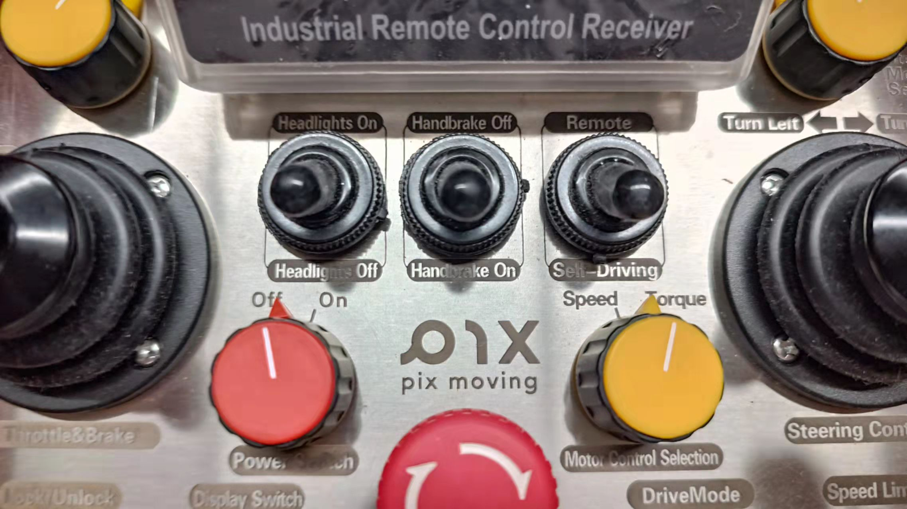

# 规划模块操作实践

1. 启动基本配置

```
// 启动canbus驱动
cd /home/EMUC_B202_SocketCAN_driver_v3.2_utility_v3.1_20210302/
sudo ./start.sh

// 进入apollo空间和dreamviewer
docker start apollo_dev_t
cd apollo
bash docker/scripts/dev_into.sh
bash scripts/dreamviewer.sh
// 然后进入对应的dreamviewer网页端界面进行操作配置
```

​	将遥控器的remote<---->self-driving档位切换为self-driving



2. 在dreamviewer界面中选择对应的车辆和地图.

   车辆选择 Dev Kit Hooke

   Map选择创建的你自己创建好的单车道地图

   依次启动Transform->lidar->Camera->GPS->Canbus->localization->perception->prediction, planning->control模块， 在启动期间perception模块启动会相对较慢，需要等待.(最后的效果如下图)

   .png)

3. 切换到routing界面,点击point of interesting,在地图上点击，此时便会生成对应的全局路径

   .png)

   .png)

4. 点击auto-start, 开始自动规划并运动

   
