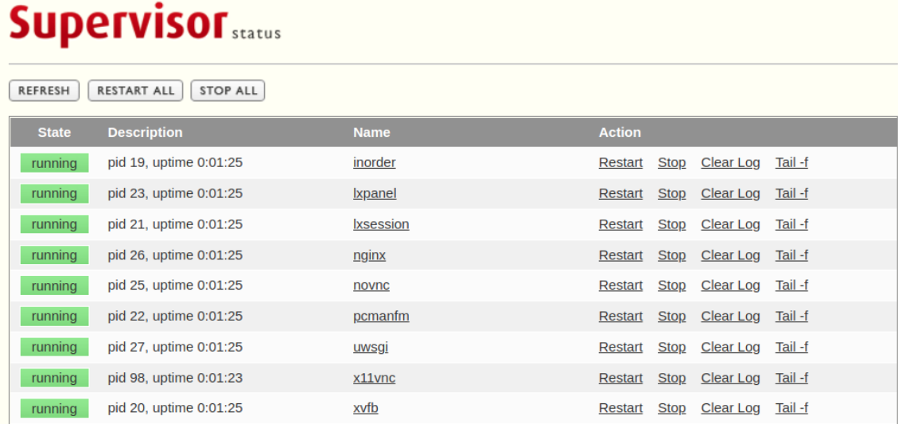
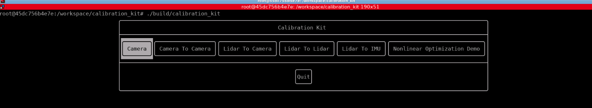
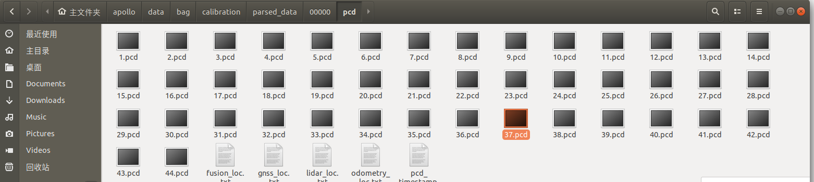
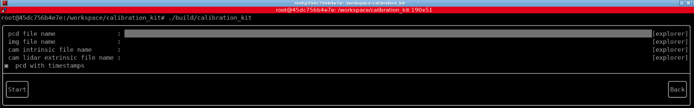

# 实车标定实践

[TOC]

## 0 标定任务说明

在实际环境中，由于安装误差，传感器各自的坐标系不同等因素，需要通过标定获取各个传感器的连接关系，构建出以载体自身为基坐标系的TF树。考虑到环境限制和课程难度，本次实践包含以下内容：

1. 相机内参标定：使用ros程序采集数据，并放入calibration_kit工具箱自动标定
2. Lidar-INS外参标定：使用apollo采集和解析数据，手动进行对齐标定；
3. Lidar-Camera外参标定：使用apollo采集和解析数据，放入calibration_kit工具箱，手动进行标定；
4. 油门刹车标定：使用Apollo提供的数据采集和分析工具完成标定；
5. 【可选】INS-载体坐标系标定；

经过内参，外参标定，可以将所有传感器输出统一到基础坐标中进行表达：

<!--TODO：这里加一个转换关系图-->

注：理论上，定位模块需要将所有运动转换到载体坐标系下进行输出，但是Apollo定位模块中并没有直接将载体坐标系作为基坐标系，而是将IMU（INS）作为了基坐标系。为了方便期间，我们将在后续工作中遵从这一做法。

## 1 标定工具箱：calibration_kit

深蓝学院公布的开源标定工具[calibration_kit](https://github.com/calibtoolkit/calibration_kit)，其所需要的配置环境可能与自身电脑并不十分匹配，导致需要额外的环境配置问题，这里通过Docker将标定工具所需的环境进行打包，在Docker建立的容器中即可运行标定工具。

#### 1.1 安装Docker

请参考[Docker官方文档](https://docs.docker.com/engine/install/ubuntu/)完成`Docker`环境的安装

**安装完成后, 请务必进行如下操作**, 以保证可以后续文档正常:

**将当前用户加入Docker Group**

为了能在非`sudo`模式下使用`Docker`, 需要将当前用户加入`Docker Group`.

执行命令:

```shell
sudo usermod -aG docker $USER
```

#### 1.2 安装Docker-Compose

`Docker-Compose`是基于Docker解决方案的Orchestrator.

请参考[Docker Compose官方文档](https://docs.docker.com/compose/install/)完成`Docker-Compose`环境的安装

#### 1.3 获取镜像

<!--TODO：轻量化docker并上传-->

在安装完成`Docker`以及`Docker-Compose`之后，需要拉取所需镜像.

**注意**: 执行第1条命令时，需要输入密码：

```shell
# 1. login to Docker registry
docker login --username=Jiahao031008 
# 2. then download images:
docker pull jiahao031008/calib-tools:v0
```

#### 1.4 克隆项目

```shell
git clone https://github.com/calibtoolkit/calibration_kit.git
cd calibration_kit
```

#### 1.5 启动实例

在当前Repo根目录下(即`docker-compose.yml`所在的那个文件夹), 启动Terminal, 执行命令, 启动Docker Workspace:

```shell
docker-compose down && docker-compose up
```

#### 1.6 Service Health Check

然后打开`Chrome`浏览器, 访问URL`http://localhost:49001/`, 默认账号/密码为`sensorfusion/sensorfusion`, 确保所有服务成功启动.

若**所有服务成功启动**, 系统状态如下图所示:



#### 1.6 访问工作空间

接着在`Chrome`浏览器中, 访问URLhttp://localhost:40081/vnc.html?autoconnect=1&autoscale=1&quality=16, 默认登录密码为`shenlan`, 访问Docker Workspace

#### 1.7 编译标定程序

在容器中打开终端

```shell
cd /worksapce/calibration_kit/
cmake -S . -B build -DCMAKE_BUILD_TYPE=Debug 
cmake --build build --parallel 4
```

#### 1.8 运行标定工具

```shell
./build/calibration_kit
```



## 2 Camera内参标定

#### 2.1 图像采集

采集人员分为两组，一组使用ROS程序进行采集；另一组手持棋盘格，在图像视野范围内进行操作和移动。示例使用的标定板为7×6_50×50大小的标准棋盘格进行。


1. 手持棋盘格要求：

   + 每次采集尽量保持稳定，最终成像光线适中，图像清晰；
   + 手持棋盘格时不能对棋盘格进行遮挡，不能离开相机视野范围内；
   + 采集图像类型需要丰富多样，包含：近距离图像、中距离图像、远距离图像、左右倾斜图像、上下倾斜图像、轻微旋转图像、较大旋转图像、相机靠近左视野边缘图像、相机靠近右视野边缘图像等；
   + 采集有效图像的数量在15-35张左右；

2. 使用ROS程序确定采集：

   + 启动camera

     ```shell
     cd /workspace/catkin_ws && catkin_make
     roslaunch usb_cam usb_cam.launch
     ```

   + 运行图像采集程序

     ```shell
     # 新建终端
     roslaunch cam_collect cam_collect.launch
     ```

     按`空格`键即可将当前帧图像（`.png`格式存储）按顺序保存在`data/camera_0`文件夹下

#### 2.2 开始标定

（在完成编译的前提下）进入标定工具箱，执行标定程序：

```shell
cd /workspace/calibration_kit
./build/calibration_kit
```

选择相机内参标定模块；

根据窗口提示，确定

1. `Input_directory`：存在图像的文件夹
2. ``file-extension`：图像的后缀（如：png）
3. `camera_name`：相机名称
4. `width:7`，`height:6`，`square_szie:50`：标定板长宽方向上格子的数量，每个格子对应的大小；
5. `pinhole`，`Use OpenCV`：选择针孔相机模型，使用opencv，
6. `View Result`，`verbose`：展示结果，并把中间过程展示出来；

点击`start`开始进行标定


## 3 Lidar-INS 标定

### 3.1 数据采集

1. 启动Apollo中的`Transform`，`Lidar`，`GPS`，`Localization`模块，检查GNSS和惯导的状态：

   + `/apollo/sensor/gnss/ins_stat` 中 `pos_type：56` 
   + `/apollo/sensor/gnss/ins_status`中 `type: GOOD`
   + `/apollo/sensor/gnss/best_pose`中`sol_type: NARROW_INT`

   检查`/apollo/sensor/gnss/odometry`中时间戳和系统时间保持一致；

2. 将车辆调整到低速的手动驾驶模式，保证车辆位于在空旷、较少动态障碍物、并且周围有标准几何形状的建筑物周围。开启cyber_recorder对数据进行记录：

   ```
   cyber_recorder record -a -i 600 -o calib_lidar2ins.record 
   ```

   + `-a`：表示对所有数据的channel进行记录；
   + `-i`：表示记录600s为一个数据包，这是为了保证尽量所有数据都在一个包内
   + `-o`：指定输出文件的名称

3. 控制车辆绕一个较大的8字，如果空间较小，可用绕0型代替。运动结束后停止cyber_recorder记录，并将数据包放置于`data/bag/calib_lidar2ins`文件夹内。

   

### 3.2 数据解析

1. 添加数据解析脚本

    在`/apollo/sripts`文件夹下新建`lidar_parse.sh`脚本文件，复制以下程序

     ```bash
   #! /bin/bash
   if [ $# -lt 3 ]; then
     echo "Usage: msf_simple_map_creator.sh [records folder][output folder]  [extrinsic_file] [lidar_type]"
     exit 1
   fi
   
   DIR="$(cd "$(dirname "${BASH_SOURCE[0]}")" && pwd)"
   cd "${DIR}/.."
   
   source "${DIR}/apollo_base.sh"
   
   GNSS_LOC_TOPIC="/apollo/localization/msf_gnss"
   LIDAR_LOC_TOPIC="/apollo/localization/msf_lidar"
   FUSION_LOC_TOPIC="/apollo/localization/pose"
   ODOMETRY_LOC_TOPIC="/apollo/sensor/gnss/odometry"
   
   GNSS_LOC_FILE="gnss_loc.txt"
   LIDAR_LOC_FILE="lidar_loc.txt"
   FUSION_LOC_FILE="fusion_loc.txt"
   ODOMETRY_LOC_FILE="odometry_loc.txt"
   
   IN_FOLDER=$1
   OUT_MAP_FOLDER=$2
   EXTRINSIC_FILE=$3
   LIDAR_TYPE=${4:-lidar16}
   
   PARSED_DATA_FOLDER="$OUT_MAP_FOLDER/parsed_data"
   CLOUD_TOPIC="/apollo/sensor/lidar16/compensator/PointCloud2"
   
   function data_exporter() {
     local BAG_FILE=$1
     local OUT_FOLDER=$2
     /apollo/bazel-bin/modules/localization/msf/local_tool/data_extraction/cyber_record_parser \
       --bag_file $BAG_FILE \
       --out_folder $OUT_FOLDER \
       --cloud_topic $CLOUD_TOPIC \
       --gnss_loc_topic $GNSS_LOC_TOPIC \
       --lidar_loc_topic $LIDAR_LOC_TOPIC \
       --fusion_loc_topic $FUSION_LOC_TOPIC \
       --odometry_loc_topic $ODOMETRY_LOC_TOPIC
   }
   function poses_interpolation() {
     local INPUT_POSES_PATH=$1
     local REF_TIMESTAMPS_PATH=$2
     local EXTRINSIC_PATH=$3
     local OUTPUT_POSES_PATH=$4
     /apollo/bazel-bin/modules/localization/msf/local_tool/map_creation/poses_interpolator \
       --input_poses_path $INPUT_POSES_PATH \
       --ref_timestamps_path $REF_TIMESTAMPS_PATH \
       --extrinsic_path $EXTRINSIC_PATH \
       --output_poses_path $OUTPUT_POSES_PATH
   }
   
   cd $IN_FOLDER
   mkdir -p $OUT_MAP_FOLDER
   mkdir -p $PARSED_DATA_FOLDER
   for item in $(ls -l *.record* | awk '{print $9}'); do
     SEGMENTS=$(echo $item | awk -F'.' '{print NF}')
     DIR_NAME=$(echo $item | cut -d . -f ${SEGMENTS})
     DIR_NAME="${PARSED_DATA_FOLDER}/${DIR_NAME}"
     mkdir -p ${DIR_NAME}
   
     data_exporter "${item}" "${DIR_NAME}"
     poses_interpolation "${DIR_NAME}/pcd/${ODOMETRY_LOC_FILE}" "${DIR_NAME}/pcd/pcd_timestamp.txt" "${EXTRINSIC_FILE}" "${DIR_NAME}/pcd/corrected_poses.txt"
   
   done
   
   echo "Done."
     ```

   - 运行数据解析脚本文件

     ```shell
     bash scripts/lidar_parse.sh /apollo/data/bag/calib_lidar2ins \
     /apollo/data/bag/calib_lidar2ins \
     /apollo/modules/calibration/data/dev_kit_pix_hooke/lidar_params/lidar16_novatel_extrinsics.yaml \
     lidar16
     ```

     在`calibration`文件夹下会生成`parsed_data`，里面存放了Lidar 点云的pcd文件，用于进行标定。

     

     在apollo的docker容器内运行`pcl_viewer`对点云数据进行查看

     ```bash
     pcl_viewer data/bag/calib_lidar2ins/parsed_data/00000/pcd/1.pcd
     ```

     

### 3.3 标定外参

<!--生成标定的二进制文件-->

执行标定文件：

```shell

```

选择导入，Apollo数据类型，选择上一步中生成的pcd文件所在的文件夹（`data/bag/calib_lidar2ins/parsed_data/00000/pcd`）


将墙体作为参照物，通过调整对应的yaw角和平移量（主要是yaw角，平移通过直尺进行测量），尽可能的将墙体的点云拼的越薄越好。

## 4 Lidar-Camera标定

### 4.1 数据采集

启动Apollo中的`Transform`，`Lidar`，`Camera`模块，将车辆静止在一处有明显阶梯处建筑或者建筑物角落附近。为了方便对齐，最好使某一束激光打到建筑物的上边缘处。启动`cyber_recorder`，记录1s左右的数据包，并保存在`data/bag/calib_ildar2camera`文件目录下。

### 4.2 数据解析

#### 4.2.1 激光数据解析

1. 同`Lidar-INS 标定`部分。

#### 4.2.2 图像数据解析

该部分的目标是将的录制包中的`image`保存成`jpeg`格式的图片；

1. 修正解析文件：

   在`modules/tools/record_parse_save/parse_camera.py`中将第39行修改为：

   ```python
   	msg_camera.ParseFromString(msg)
   	# msg_camera.ParseFromString(str(msg))
   ```

2. 修改配置文件：

   在`/apollo/modules/tools/record_parse_save`文件目录下，打开`parser_params.yaml`文件：

   - `filepath:` 改为我们存放数据包的文件夹`/apollo/data/bag/calib_ildar2camera`

   - `parse:` 选为`camera`

   - `camera`的`channel_name`: 选为我们实际压缩图像的`topic`名，如`/apollo/sensor/camera/front_6mm/image/compressed`

     

   - 执行数据解析程序 

     ```
     ./bazel-bin/modules/tools/record_parse_save/record_parse_save
     ```

     解析完成后，会将图像保存在我们数据包的上一级目录下文件夹下`data_camera_6mm_front`。

### 4.3 外参标定

1. 任选一帧采集数据，拷贝至标定工具下的`test`文件夹下，并重命名为`1.jpeg`和`1.pcd`

2. 将`modules/calibration/data/dev_kit_pix_hooke/camera_params/`下的相机参数（`front_6mm_extrinsics.yaml`）拷贝到`test`文件夹下

3. 在标定工具窗口点击`Lidar To Camera`后，如下图：

   

   通过点击`explorer`确定lidar和image的相关文件地址后，点击start

   

   调整拖动条，使点云强度和建筑物重合，即可得到较为准确的外参标定结果。最终结果将在终端上进行打印。

## 5 油门刹车标定

<!--TODO：油门刹车标定-->

