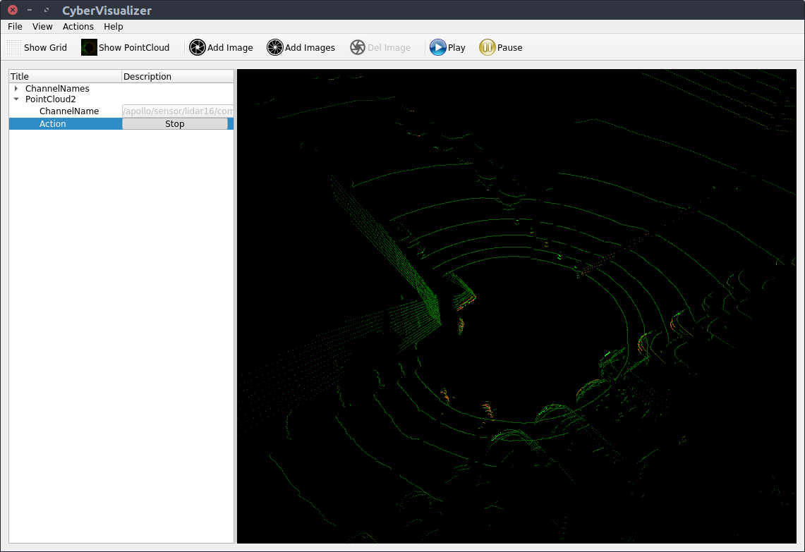
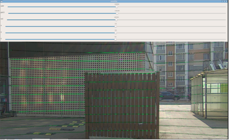

# 实车标定实践

[TOC]

## 0 标定任务说明

在实际环境中，由于安装误差，传感器各自的坐标系不同等因素，需要通过标定获取各个传感器的连接关系，构建出以载体自身为基坐标系的TF树。考虑到环境限制和课程难度，本次实践包含以下内容：

1. 相机内参标定：使用ros程序采集数据，并放入calibration_kit工具箱自动标定
2. Lidar-INS外参标定：使用apollo采集和解析数据，手动进行对齐标定；
3. Lidar-Camera外参标定：使用apollo采集和解析数据，放入calibration_kit工具箱，手动进行标定；
4. 油门刹车标定：使用Apollo提供的数据采集和分析工具完成标定；
5. 【可选】INS-载体坐标系标定；

经过内参，外参标定，可以将所有传感器输出统一到基础坐标中进行表达：


注：理论上，定位模块需要将所有运动转换到载体坐标系下进行输出，但是Apollo定位模块中并没有直接将载体坐标系作为基坐标系，而是将IMU（INS）作为了基坐标系。为了方便期间，我们将在后续工作中遵从这一做法。

## 1 Camera内参标定

使用ROS-UsbCam节点驱动相机并进行标定

### 1.1 使用ROS usb_cam驱动相机

```
sudo apt-get install ros-melodic-usb-cam
```

### 1.2 修改launch文件

进入目录：

```
roscd usb_cam
cd launch
sudo gedit usb_cam-test.launch 
```

目前主要修改device和width两个参数，可以使用`ls /dev/video*`查看系统视频设备。

```
<launch>
  <node name="usb_cam" pkg="usb_cam" type="usb_cam_node" output="screen" >
    <!-- modify the video device to your device -->
    <param name="video_device" value="/dev/video0" />
    <!-- modify the size of your device -->
    <param name="image_width" value="1920" />
    <param name="image_height" value="1080" />
    <param name="pixel_format" value="yuyv" />
    <param name="camera_frame_id" value="usb_cam" />
    <param name="io_method" value="mmap"/>
  </node>
  <node name="image_view" pkg="image_view" type="image_view" respawn="false" ou$
    <remap from="image" to="/usb_cam/image_raw"/>
    <param name="autosize" value="true" />
  </node>
</launch>
```

### 1.3 启动相机

### 2 使用ROS进行相机标定

### 2.1 运行标定程序

开启摄像机：

```
roslaunch usb_cam usb_cam-test.launch
```
启动有warning例如提示校准配置文件`head_camera.yaml not found`，这个是正常的，我们标定完后才会生成这个配置文件。

根据你的棋盘格修改参数

- 一个是size参数为棋盘格角点数量比如8x9=72个格子的棋盘格，角点个数为7x8=63个，size参数就要写7x8
- 另外一个参数为square，传入的参数为棋盘格一个小格子的宽度（注意单位为m）
- `image:=/usb_cam/image_raw` 标定当前订阅图像来源自名为/usb_cam/image_raw的topic
- `camera:=/usb_cam` 为摄像机名

```
rosrun camera_calibration cameracalibrator.py --size 7x6 --square 0.05 image:=/usb_cam/image_raw camera:=/usb_cam
```

### 2.2 图像采集

采集人员分为两组，一组使用ROS程序进行采集；另一组手持棋盘格，在图像视野范围内进行操作和移动。
示例使用的标定板为7×6_50×50大小的标准棋盘格进行。


1. 手持棋盘格要求：

   + 每次采集尽量保持稳定，最终成像光线适中，图像清晰；
   + 手持棋盘格时不能对棋盘格进行遮挡，不能离开相机视野范围内；
   + 采集图像类型需要丰富多样，包含：近距离图像、中距离图像、远距离图像、左右倾斜图像、上下倾斜图像、轻微旋转图像、较大旋转图像、相机靠近左视野边缘图像、相机靠近右视野边缘图像等；
   + 采集有效图像的数量在15-35张左右；

### 2.3 生成标定文件

界面中的

x：表示标定板在视野中的左右位置。

y：表示标定板在视野中的上下位置。

size：标定板在占视野的尺寸大小，也可以理解为标定板离摄像头的远近。

skew：标定板在视野中的倾斜位置

通过不停的移动标定板：直到X、Y、Size、Skew四个都变成绿色，然后就可以看到CALIBRATE这个按钮变成青色，表明以采到足够多的
图片数据进行标定了。 点击CALCULATE进行标定会稍微有点卡顿，不要担心后台正在进行标定，标定完成后观察当前的相机界面，
如果相机成像完全正常了，则说明标定成功了，点击界面右下面的SAVE和COMMIT按钮， 
可保存标定完成后的文件到路径 `/home/USERNAME/.ros/camera_info/head_camera.yaml`。
另外在原来的terminal
界面也会有对应的参数`D K R P`。

一些重要参数：

distortion_model指定了畸变模型

D：distortion_coefficients指定畸变模型的系数

K：camera_matrix规定了摄像头的内部参数矩阵

R：rectification_matrix为矫正矩阵，一般为单位阵

P：projection_matrix为外部世界坐标到像平面的投影矩阵


### 3 更改apollo中的配置文件

将标定获得的内参数`D K R P`复制进入
`modules/calibration/data/dev_kit_pix_hooke/camera_params/front_camera_intrinsics.yaml`对应的行中，
注意参数后面是接冒号 `:`

```
header:
    seq: 0
    stamp:
        secs: 0
        nsecs: 0
    frame_id: white_mkz_onsemi_obstacle
height: 1080
width: 1920
distortion_model: plumb_bob
D: [-0.54336, 0.26653, -0.00099, -0.00170, 0.00000]
K: [2033.39968, 0.0, 929.01881, 0.0, 2046.55356, 572.81049, 0.0, 0.0, 1.0]
R: [1.0, 0.0, 0.0, 0.0, 1.0, 0.0, 0.0, 0.0, 1.0]
P: [1729.4515380859375, 0.0, 997.0791139046996, 0.0, 0.0, 1926.0577392578125, 571.4609883012963, 0.0, 0.0, 0.0, 1.0, 0.0]
binning_x: 0
binning_y: 0
roi:
  x_offset: 0
  y_offset: 0
  height: 0
  width: 0
  do_rectify: False
```


## 3 Lidar-INS 标定

这里我们采用手动标定的方法标定Lidar和INS的转换位姿，

### 3.1 数据采集

1. 启动Apollo中的`Transform`，`Lidar`，`GPS`，`Localization`模块，检查GNSS、惯导以及lidar的状态：

   + `/apollo/sensor/gnss/ins_stat` 中 `pos_type：56` 
   + `/apollo/sensor/gnss/ins_status`中 `type: GOOD`
   + `/apollo/sensor/gnss/best_pose`中`sol_type: NARROW_INT`
   + `/apollo/sensor/lidar32/compensator/PointCloud2`查看补偿点云是否开启，如果没有，溜一下车再观测

   检查`/apollo/sensor/gnss/odometry`中时间戳和系统时间保持一致；


3. 将车辆调整到低速的手动驾驶模式，保证车辆位于在空旷、较少动态障碍物、并且周围有标准几何形状的建筑物周围。再次检查上述各传感器器的状态是否正常，
开启cyber_recorder对数据进行记录：

   ```
   cyber_recorder record -a -i 600 -o calib_lidar2ins.record 
   ```

   + `-a`：表示对所有数据的channel进行记录；
   + `-i`：表示记录600s为一个数据包，这是为了保证尽量所有数据都在一个包内
   + `-o`：指定输出文件的名称


5. 控制车辆绕一个较大的8字，如果空间较小，可用绕0型代替。运动结束后停止cyber_recorder记录，录制的calib_lidar2ins.record会保存在apollo的目录下，带有后缀 `.0000`等，
   并将数据包剪切到`data/bag/calib_lidar2ins`文件夹内：

   ```shell
      mv calib_lidar2ins.record.* data/bag/calib_lidar2ins/
   ```

   

### 3.2 数据解析

1. 添加数据解析脚本

    在`/apollo/sripts`文件夹下新建`lidar_parse.sh`脚本文件，复制以下程序

     ```bash
   #! /bin/bash
   if [ $# -lt 3 ]; then
     echo "Usage: msf_simple_map_creator.sh [records folder][output folder]  [extrinsic_file] [lidar_type]"
     exit 1
   fi
   
   DIR="$(cd "$(dirname "${BASH_SOURCE[0]}")" && pwd)"
   cd "${DIR}/.."
   
   source "${DIR}/apollo_base.sh"
   
   GNSS_LOC_TOPIC="/apollo/localization/msf_gnss"
   LIDAR_LOC_TOPIC="/apollo/localization/msf_lidar"
   FUSION_LOC_TOPIC="/apollo/localization/pose"
   ODOMETRY_LOC_TOPIC="/apollo/sensor/gnss/odometry"
   
   GNSS_LOC_FILE="gnss_loc.txt"
   LIDAR_LOC_FILE="lidar_loc.txt"
   FUSION_LOC_FILE="fusion_loc.txt"
   ODOMETRY_LOC_FILE="odometry_loc.txt"
   
   IN_FOLDER=$1
   OUT_MAP_FOLDER=$2
   EXTRINSIC_FILE=$3
   LIDAR_TYPE=${4:-lidar32}
   
   PARSED_DATA_FOLDER="$OUT_MAP_FOLDER/parsed_data"
   CLOUD_TOPIC="/apollo/sensor/$LIDAR_TYPE/compensator/PointCloud2"
   
   function data_exporter() {
     local BAG_FILE=$1
     local OUT_FOLDER=$2
     /apollo/bazel-bin/modules/localization/msf/local_tool/data_extraction/cyber_record_parser \
       --bag_file $BAG_FILE \
       --out_folder $OUT_FOLDER \
       --cloud_topic $CLOUD_TOPIC \
       --gnss_loc_topic $GNSS_LOC_TOPIC \
       --lidar_loc_topic $LIDAR_LOC_TOPIC \
       --fusion_loc_topic $FUSION_LOC_TOPIC \
       --odometry_loc_topic $ODOMETRY_LOC_TOPIC
   }
   function poses_interpolation() {
     local INPUT_POSES_PATH=$1
     local REF_TIMESTAMPS_PATH=$2
     local EXTRINSIC_PATH=$3
     local OUTPUT_POSES_PATH=$4
     /apollo/bazel-bin/modules/localization/msf/local_tool/map_creation/poses_interpolator \
       --input_poses_path $INPUT_POSES_PATH \
       --ref_timestamps_path $REF_TIMESTAMPS_PATH \
       --extrinsic_path $EXTRINSIC_PATH \
       --output_poses_path $OUTPUT_POSES_PATH
   }
   
   cd $IN_FOLDER
   mkdir -p $OUT_MAP_FOLDER
   mkdir -p $PARSED_DATA_FOLDER
   for item in $(ls -l *.record* | awk '{print $9}'); do
     SEGMENTS=$(echo $item | awk -F'.' '{print NF}')
     DIR_NAME=$(echo $item | cut -d . -f ${SEGMENTS})
     DIR_NAME="${PARSED_DATA_FOLDER}/${DIR_NAME}"
     mkdir -p ${DIR_NAME}
   
     data_exporter "${item}" "${DIR_NAME}" # 导出数据
     poses_interpolation "${DIR_NAME}/pcd/${ODOMETRY_LOC_FILE}" "${DIR_NAME}/pcd/pcd_timestamp.txt" "${EXTRINSIC_FILE}" "${DIR_NAME}/pcd/corrected_poses.txt" # 位姿插值
   
   done
   
   echo "Done."
    ```

   - 运行数据解析脚本文件

     ```shell
     bash scripts/lidar_parse.sh /apollo/data/bag/calib_lidar2ins \
     /apollo/data/bag/calib_lidar2ins \
     /apollo/modules/calibration/data/dev_kit_pix_hooke/lidar_params/lidar32_novatel_extrinsics.yaml \
     lidar32
     ```
     
     如果解析没成功或者重新解析，请一定要删掉`calib_lidar2ins`文件夹下生成`parsed_data`文件夹，因为文件夹里面的txt文件不会被覆盖掉，
      新的数据会在txt文本末端不断累加写入，造成后续解析不成功。

     在`calib_lidar2ins`文件夹下会生成`parsed_data`（位置：`data/bag/calib_lidar2ins/parsed_data`），里面存放了Lidar 点云的pcd文件，用于进行标定。

     

     在apollo的docker容器内运行`pcl_viewer`对点云数据进行查看
   

     ```bash
     pcl_viewer data/bag/calib_lidar2ins/parsed_data/00000/pcd/1.pcd
     ```
     或者开启`cyber_visualizer`，关闭车上所有的传感器(可直接在dreamview上切换车型就能关闭整车传感器)，播放录制好的包：
      ```bash
     cyber_recorder play -f data/bag/calib_lidar2ins/*.record.* -l
     ```
     首先你会在`cyber_monitor`上查看录制包里面的所有通道信息，然后在`cyber_visualizer`选择点云通道，查看点云。
   


     

### 3.3 标定外参

执行标定文件：

这里需要用到interactive slam包，可以让我们手动对齐点云，具体内容参考[Github](https://github.com/SMRT-AIST/interactive_slam)

```shell
# 安装依赖
sudo apt-get install libglm-dev libglfw3-dev
sudo apt-get install ros-melodic-geodesy ros-melodic-pcl-ros ros-melodic-nmea-msgs ros-melodic-libg2o

# interactive slam包已经下载好在 /apollo/catkin_ws
cd /apollo/catkin_ws
catkin_make -j4
roscore

# 新建一个终端
cd /apollo/catkin_ws
source devel/setup.bash
rosrun interactive_slam odometry2graph
```

选择导入，Apollo数据类型，选择上一步中生成的pcd文件所在的文件夹（`data/bag/calib_lidar2ins/parsed_data/00000/pcd`）


将墙体作为参照物，通过调整对应的yaw角和平移量（主要是yaw角，平移通过直尺进行测量），尽可能的将墙体的点云拼的越薄越好。

### 3.4 外参标定输出

调整外参完毕后，记录屏幕中输出的平移量和旋转四元数。

==TODO：让王文把截图放在这==

最后，将该外参数据放入下述文件中：

`modules/calibration/data/dev_kit_pix_hooke/lidar_params/lidar32_novatel_extrinsics.yaml`


## 4 Lidar-Camera标定

### 4.1 数据采集

启动Apollo中的`Transform`，`Lidar`，`Camera`模块，将车辆静止在一处有明显阶梯处建筑或者建筑物角落附近。为了方便对齐，最好使某一束激光打到建筑物的上边缘处。启动`cyber_recorder`，记录1s左右的数据包，并保存在`data/bag/calib_lidar2camera`文件目录下。

### 4.2 数据解析

#### 4.2.1 图像数据解析

该部分的目标是将的录制包中的`image`保存成`jpeg`格式的图片；

1. 修正解析文件：

   在`modules/tools/record_parse_save/parse_camera.py`中将第39行修改为：

   ```python
   	msg_camera.ParseFromString(msg)
   	# msg_camera.ParseFromString(str(msg))
   ```

2. 修改配置文件：

   在`/apollo/modules/tools/record_parse_save`文件目录下，打开`parser_params.yaml`文件：

   - `filepath:` 改为我们存放数据包的文件夹`/apollo/data/bag/calib_ildar2camera/`

   - `parse:` 选为`camera`

   - `camera`的`channel_name`: 选为我们实际压缩图像的`topic`名，如`/apollo/sensor/camera/front_6mm/image/compressed`

     

   - 执行数据解析程序 

     ```
     ./bazel-bin/modules/tools/record_parse_save/record_parse_save
     ```

     解析完成后，会将图像保存在我们数据包的上一级目录下文件夹下`data_camera_6mm_front`。

#### 4.2.2 激光数据解析

1. 同`Lidar-INS 标定`部分，注意这里我们没有打开GNSS，那么激光雷达是没有去畸变的，也就是没有运动补偿，
通道`/apollo/sensor/lidar32/compensator/PointCloud2`是没有数据的，这个没关系的，因为标定过程中小车也是静止的。数据解析只能用到原始的激光雷达数据，也就是
通道`/apollo/sensor/lidar32/PointCloud2`，修改`/apollo/sripts/lidar_parse.sh`脚本文件的`CLOUD_TOPIC`：

```shell
#   CLOUD_TOPIC="/apollo/sensor/$LIDAR_TYPE/compensator/PointCloud2"
  CLOUD_TOPIC="/apollo/sensor/$LIDAR_TYPE/PointCloud2"
```

### 4.3 外参标定

我们把calibration_kit里面的lidar-camera标定工具单独拿了出来，在路径 `/apollo/lidar_camera_calib`下，编译：

```shell
cd /apollo/lidar_camera_calib
mkdir build
cd build
cmake ..
make -j4
```

1. 任选一帧采集数据，拷贝至标定工具下的`/apollo/lidar_camera_calib/test`文件夹下，并重命名为`1.jpeg`和`1.pcd`

2. 将`modules/calibration/data/dev_kit_pix_hooke/camera_params/`下的
相机参数（`front_6mm_extrinsics.yaml, front_6mm_intrinsics.yaml`）拷贝到`test`文件夹下。
3. 这两个文件分别对应相机-雷达外参的初始值（其中平移由直尺测量获得），和相机的内参（经过标定矫正后的）。


### 4.4 外参标定输出

在/apollo/lidar_camera_calib/build文件下运行：

```shell
./lidar_camera_calib_tool
```

+ 如果图像大小无法缩放，可在`lidar_camera_calib/lidar_camera_calib.cc`中第149行（`LidarCameraCalib::Project`函数末尾）添加：

  ```c++
  cv::resizeWindow("mainWin", test_image.cols, test_image.rows);
  ```

  并进行重新编译。

调整拖动条，使点云强度和建筑物重合，即可得到较为准确的外参标定结果。最终结果将在终端上进行打印。




调整外参完毕后，记录屏幕中输出的平移量（translation）和旋转四元数（quaternion）。


最后，将该外参数据放入下述文件中：

`modules/calibration/data/dev_kit_pix_hooke/camera_params/front_6mm_extrinsics.yaml`

### 4.5 如何判断标定的结果是准确的？

可以小车换一个地方或者方向录一个数据包，参照前面的4.1-4.3.1步骤，把我们刚才标定好的外参结果
`front_6mm_extrinsics.yaml`以及原有的相机内参`front_6mm_intrinsics.yaml`拷贝到`test`文件夹下。

在/apollo/lidar_camera_calib/build文件下运行：

```shell
./lidar_camera_calib_tool
```

观测此时新的激光点云是否和相机图片是否一致，如果一致，说明标定的结果是对的。

## 5 油门刹车标定

车辆在某一速度基础上，需要通过车辆的油门和刹车来获得期望加速度。汽车在不同的行驶速度下，想要获取相同的加速度，则其油门和刹车的大小也会不同。需要获取汽车速度和加速度之间的关系来更好的实现对车辆的控制，本节内容利用apollo的标定工具来实现汽车的油门刹车标定表。

#### 5.1 油门数据采集

1. **启动依赖模块**：启动`Transform`，`GPS`，`Canbus`，`Control`模块；检查GNSS和惯导的状态：

   + `/apollo/sensor/gnss/ins_stat` 中 `pos_type：56` 
   + `/apollo/sensor/gnss/ins_status`中 `type: GOOD`
   + `/apollo/sensor/gnss/best_pose`中`sol_type: NARROW_INT`

   检查`/apollo/sensor/gnss/odometry`中时间戳和`/apollo/sensor/gnss/best_pose`时间戳保持一致；

2. **选择标定场地**：手动控制汽车至具有一段较长的公路上。标定场地及操作要求如下：

   + 标定场地必须包含一段较长的直线道路；
   + 由于涉及到自动行驶，因此请选择周围行人较小或无行人环境；
   + 时刻注意按急停按钮，不允许采用切换模式的方式替代急停。

3. **修复软件源并安装缺失的依赖**：

   首先修改软件源

   ```bash
   sudo vim /etc/apt/sources.list
   ```

   在文件中修改：（将`https`修改为`http`）

   ```bash
   deb http://mirrors.tuna.tsinghua.edu.cn/ubuntu/ bionic main restricted universe multiverse
   # deb-src https://mirrors.tuna.tsinghua.edu.cn/ubuntu/ bionic main restricted universe multiverse
   deb http://mirrors.tuna.tsinghua.edu.cn/ubuntu/ bionic-updates main restricted universe multiverse
   # deb-src https://mirrors.tuna.tsinghua.edu.cn/ubuntu/ bionic-updates main restricted universe multiverse
   deb http://mirrors.tuna.tsinghua.edu.cn/ubuntu/ bionic-backports main restricted universe multiverse
   # deb-src https://mirrors.tuna.tsinghua.edu.cn/ubuntu/ bionic-backports main restricted universe multiverse
   deb http://mirrors.tuna.tsinghua.edu.cn/ubuntu/ bionic-security main restricted universe multiverse
   # deb-src https://mirrors.tuna.tsinghua.edu.cn/ubuntu/ bionic-security main restricted universe multiverse
   ```

   更新并安装缺少的依赖库

   ```bash
   sudo apt update
   sudo apt-get install tcl-dev tk-dev python3-tk
   ```

   **注意**：上述修改涉及Apollo系统，因此使用`dev_start.sh`时会重建一个`docker`容器，此时对系统的修改会全部失效，需要重新换源操作；但是`docker start + 容器id/tag`的方式并不会重建容器，而是会继续使用之前容器，因此可以不用重新换源。

4. **执行数据收集程序**


   执行脚本文件:

   ```
   // 进入apollo环境
   docker start apollo_dev_t
   cd apollo
   bash docker/scripts/dev_into.sh
   
   // 手动挂挡
   bash scripts/canbus_teleop.sh
   ```
   
   
   
   // to-do 手动挂挡程序的图片
   
   启动手动挂挡的程序后，分别按次序按下,m0, m1, g1,然后在该终端下按下ctrl+c, 暂停该程序的运行(这一步非常重要!!),防止后续我们输入的油门刹车指令和该程序冲突。
   
   
   
   ```bash
   // 输入油门刹车指令

   ./bazel-bin/modules/tools/vehicle_calibration/data_collector
   ```

   

   根据提示，x，y，z分别为油门、速度、 刹车。我们通过多次尝试来决定汽车的油门死区，在此基础上不断更改这三个变量值。 如输入：

   | x    | y    | z    |
   | ---- | ---- | ---- |
   | 6    | 1    | -10  |
   | 6    | 1.5  | -12  |
   | 8    | 1    | -10  |
   | 8    | 1.5  | -10  |
   | 7    | 1.25 | -8   |
   | 7    | 1    | -6   |

   
   每次输入后，车辆将会按照该油门（x值大小）不断加速，直到到达指定速度（y值，单位为m/s）。然后不断踩刹车（z值，一定为负值），直到车辆停止结束。
   
   **注意：由于刹车油门尚未标定，因此该过程比较危险，请时刻注意控制急停！**
   
   车辆停止后，如果对当次数据不满意，可以按`x`键清除本次缓存。继续输入`x y z`值可以继续进行数据采集，获取足够数据后（一般5组以上），按`q`键则结束数据采集。
   
   这些采集的数据均保存在`apollo`的根目录下，如`“t6b-10r0_recorded.csv”`。将上述数据打包，拷贝至新建文件夹`vehicle_calibration_data`
   
   ```shell
   mkdir vehicle_calibration_data && mv *csv ./vehicle_calibration_data
   ```

#### 5.2 油门刹车标定

1. **数据处理**

   执行下述命令将每次采集数据合并为单个数据文件，最终会在apollo的根目录下，会生成结果文件`result.csv`：

   ```shell
   bash modules/tools/vehicle_calibration/process_data.sh vehicle_calibration_data
   ```

2. 查看标定结果

   ```bash
    ./bazel-bin/modules/tools/vehicle_calibration/plot_results result.csv
   ```

   

3. **生成标定文件表**

   ```shell
   bash modules/tools/vehicle_calibration/result2pb.sh result.csv 
   ```

   在执行终端的目录下会生成`control_conf.pb.txt` 的控制器相关的配置文件，包括横纵向控制器参数及油门刹车标定表，其中`lon_controller_conf`中`calibration_table`字段即为标定结果。

   + 注意，生成的`control_conf.pb.txt` 文件配置是基于`modules/control/conf/control_conf.pb.txt`原始文件生成的，请确保该文件内容正确。

   将该文件拷贝至车辆校正文件`/apollo/modules/calibration/data/<对应车型>`中，在`DreamViewer`中每次重新选择车辆时，会自动将该文件加载至`/apollo/modules/control/conf`文件夹下。
