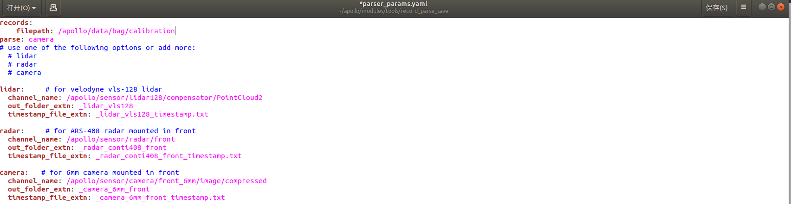
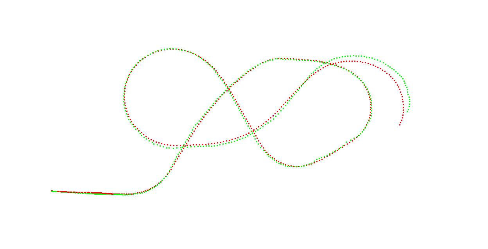

# 实车标定实践

[TOC]

## 0 标定实践说明

在实际环境中，由于安装误差，传感器各自的坐标系不同等因素，需要通过标定获取各个传感器之间的连接关系，构建出以载体自身为基坐标系的TF树。考虑到环境限制和课程难度，本次实践包含以下内容：

1. 相机内参标定：使用ros程序采集数据，并放入 camera_calibration 工具自动标定，或者使用ros提供的相机标定工具进行手动标定；
2. Lidar-Camera 外参标定：使用 Apollo 采集和解析数据，使用手动对齐工具进行标定；
3. Lidar-INS外参标定：使用 Apollo 采集和解析数据，使用自动化标定工具进行标定，后续导入手动对齐工具进行微调；
4. 油门刹车标定：使用 Apollo 提供的数据采集和分析工具完成标定；
5. 【可选】INS-载体坐标系标定；

经过内参，外参标定，可以将所有传感器输出统一到基础坐标中进行表达：


注：理论上，定位模块需要将所有运动转换到载体坐标系下进行输出，但是Apollo定位模块中并没有直接将载体坐标系作为基坐标系，而是将IMU（INS）作为了基坐标系。为了方便期间，我们将在后续工作中遵从这一做法。


## 1 Camera内参标定

### 1.1 图像采集

相机数据采集的过程需要分为两组互相配合，一组使用ROS程序进行采集；另一组手持棋盘格，在图像视野范围内进行操作和移动。示例使用的标定板为7×6_50×50大小的标准棋盘格进行。注意，这里的7×6指的是有横向7个**角点**（而非格子）与纵向6个角点。


1. 手持棋盘格要求：

   + 每次采集尽量保持稳定，最终成像光线适中，图像清晰；
   + 手持棋盘格时不能对棋盘格进行遮挡，不能离开相机视野范围内；
   + 采集图像类型需要丰富多样，包含：近距离图像、中距离图像、远距离图像、左右倾斜图像、上下倾斜图像、轻微旋转图像、较大旋转图像、相机靠近左视野边缘图像、相机靠近右视野边缘图像等；
   + 采集有效图像的数量在15-35张左右；

2. 使用ROS程序确定采集：

   + 在**本地shell中**启动camera

     ```shell
     cd ~/Desktop/image_collect && catkin_make
     source devel/setup.bash
     roslaunch usb_cam usb_cam.launch
     ```
   
   + 在**本地shell中**运行图像采集程序
   
        ```shell
        # 新建终端
        roslaunch cam_collect cam_collect.launch
        ```
   
         按空格键即可将当前帧图像（`.png`格式存储）按顺序保存在`data/camera_0`文件夹下。完成所有数据采集后，需要将该文件夹复制到标定工具箱对应的`test_data/`目录下。

### 1.2 开始标定

（在完成编译的前提下）进入标定工具箱，执行标定程序：

```shell
cd /workspace/calibration_kit
./build/calibration_kit
```

选择相机内参标定模块；

根据窗口提示，确定

1. `Input_directory`：存在图像的文件夹
2. `file-extension`：图像的后缀（如：png）
3. `camera_name`：相机名称
4. `width:7`，`height:6`，`square_szie:50`：标定板长宽方向上格子的数量，每个格子对应的大小；由于棋盘的不同，参数会有所差异；
5. `pinhole`，`Use OpenCV`：选择针孔相机模型，使用opencv，
6. `View Result`，`verbose`：展示结果，并把中间过程展示出来；

点击`start`开始进行标定


### 1.3 内参标定输出

调整外参完毕后，记录屏幕中输出的内参（K，Projection Parameter）， 矫正系数（D，Distortion）等。


重投影误差（图中 `Final reprojection error`）应小于 1.0 pixels。小于 0.7 pixels 认为标定良好，小于 0.5 pixels 认为标定优秀。最后，将该内参数据放入下述文件中：

`modules/calibration/data/dev_kit_pix_hooke/camera_params/front_6mm_intrinsics.yaml`。其中，D向量对应于Distortion Parameter

## 2 Lidar-Camera标定

### 2.1 数据采集

启动Apollo中的`Transform`，`Lidar`，`Camera`模块，将车辆静止在一处有明显阶梯处建筑或者建筑物角落附近。为了方便对齐，最好使某一束激光打到建筑物的上边缘处。启动`cyber_recorder`，记录1s左右的数据包，并保存在`data/bag/calib_lidar2camera`文件目录下（该目录下不应该存在其他文件）。

### 2.2 数据解析

#### 2.2.1 激光数据解析

1. 修改数据解析脚本

   如果是第一次运行数据解析的功能，在`/apollo/sripts`文件夹下新建`lidar_parse.sh`脚本文件，复制以下程序

     ```bash
   #! /bin/bash
   if [ $# -lt 3 ]; then
     echo "Usage: msf_simple_map_creator.sh [records folder][output folder]  [extrinsic_file] [lidar_type]"
     exit 1
   fi
   
   DIR="$(cd "$(dirname "${BASH_SOURCE[0]}")" && pwd)"
   cd "${DIR}/.."
   
   source "${DIR}/apollo_base.sh"
   
   GNSS_LOC_TOPIC="/apollo/localization/msf_gnss"
   LIDAR_LOC_TOPIC="/apollo/localization/msf_lidar"
   FUSION_LOC_TOPIC="/apollo/localization/pose"
   ODOMETRY_LOC_TOPIC="/apollo/sensor/gnss/odometry"
   
   GNSS_LOC_FILE="gnss_loc.txt"
   LIDAR_LOC_FILE="lidar_loc.txt"
   FUSION_LOC_FILE="fusion_loc.txt"
   ODOMETRY_LOC_FILE="odometry_loc.txt"
   
   IN_FOLDER=$1
   OUT_MAP_FOLDER=$2
   EXTRINSIC_FILE=$3
   LIDAR_TYPE=${4:-lidar16}
   
   PARSED_DATA_FOLDER="$OUT_MAP_FOLDER/parsed_data"
   CLOUD_TOPIC="/apollo/sensor/lidar16/compensator/PointCloud2"
   
   function data_exporter() {
     local BAG_FILE=$1
     local OUT_FOLDER=$2
     /apollo/bazel-bin/modules/localization/msf/local_tool/data_extraction/cyber_record_parser \
       --bag_file $BAG_FILE \
       --out_folder $OUT_FOLDER \
       --cloud_topic $CLOUD_TOPIC \
       --gnss_loc_topic $GNSS_LOC_TOPIC \
       --lidar_loc_topic $LIDAR_LOC_TOPIC \
       --fusion_loc_topic $FUSION_LOC_TOPIC \
       --odometry_loc_topic $ODOMETRY_LOC_TOPIC
   }
   function poses_interpolation() {
     local INPUT_POSES_PATH=$1
     local REF_TIMESTAMPS_PATH=$2
     local EXTRINSIC_PATH=$3
     local OUTPUT_POSES_PATH=$4
     /apollo/bazel-bin/modules/localization/msf/local_tool/map_creation/poses_interpolator \
       --input_poses_path $INPUT_POSES_PATH \
       --ref_timestamps_path $REF_TIMESTAMPS_PATH \
       --extrinsic_path $EXTRINSIC_PATH \
       --output_poses_path $OUTPUT_POSES_PATH
   }
   
   cd $IN_FOLDER
   mkdir -p $OUT_MAP_FOLDER
   mkdir -p $PARSED_DATA_FOLDER
   for item in $(ls -l *.record* | awk '{print $9}'); do
     SEGMENTS=$(echo $item | awk -F'.' '{print NF}')
     DIR_NAME=$(echo $item | cut -d . -f ${SEGMENTS})
     DIR_NAME="${PARSED_DATA_FOLDER}/${DIR_NAME}"
     mkdir -p ${DIR_NAME}
   
     data_exporter "${item}" "${DIR_NAME}"
     poses_interpolation "${DIR_NAME}/pcd/${ODOMETRY_LOC_FILE}" "${DIR_NAME}/pcd/pcd_timestamp.txt" "${EXTRINSIC_FILE}" "${DIR_NAME}/pcd/corrected_poses.txt"
   
   done
   
   echo "Done."
     ```

   数据解析的脚本提供的是一个数据解析运行的模板，后续的针对不同类型的数据解析，需要根据消息类型等信息及时修改此脚本。

2. 执行数据解析

   - 运行数据解析脚本文件

     ```shell
     bash scripts/lidar_parse.sh /apollo/data/bag/calib_lidar2camera \
     /apollo/data/bag/calib_lidar2camera \
     /apollo/modules/calibration/data/dev_kit_pix_hooke/lidar_params/lidar16_novatel_extrinsics.yaml \
     lidar16
     ```

     在`calibration`文件夹下会生成`parsed_data`（位置：`data/bag/calib_lidar2camera/parsed_data`），里面存放了Lidar 点云的pcd文件，用于之后标定流程。

     

     在apollo的docker容器内运行`pcl_viewer`对点云数据进行查看

     ```bash
     pcl_viewer data/bag/calib_lidar2ins/parsed_data/00000/pcd/1.pcd
     ```

     

注意，如果在室内标定，由于没有gps信号、无运动，所以需要将点云的topic改为原始的激光topic（`/apollo/sensor/lidar16/PointCloud2`）。

#### 2.2.2 图像数据解析

该部分的目标是将的录制包中的`image`保存成`jpeg`格式的图片；

1. 修正解析文件：

   在`modules/tools/record_parse_save/parse_camera.py`中将第39行修改为：

   ```python
   msg_camera.ParseFromString(msg)
   # msg_camera.ParseFromString(str(msg))
   ```

2. 修改配置文件：

   在`/apollo/modules/tools/record_parse_save`文件目录下，打开`parser_params.yaml`文件：

   - `filepath:` 改为我们存放数据包的文件夹`/apollo/data/bag/calib_ildar2camera`。注意：该文件夹下除了有 record 包外，不允许有其他文件或者文件夹。

   - `parse:` 选为`camera`

   - `camera`的`channel_name`: 选为我们实际压缩图像的`topic`名，如`/apollo/sensor/camera/front_6mm/image/compressed`

     

   - 执行数据解析程序 

     ```
     ./bazel-bin/modules/tools/record_parse_save/record_parse_save
     ```

     解析完成后，会将图像保存在我们数据包的上一级目录下文件夹下`data_camera_6mm_front`。

### 2.3 外参标定

首先，需要粗估计外参（粗略估计的旋转值、尺子量出的平移值）放入`front_6mm_extrinsics.yaml`中，然后用提供的软件细调。**注意，该部分操作在Apollo外部进行。**

1. 任选一帧采集数据，拷贝至标定工具下的`test`文件夹下，并重命名为`1.jpeg`和`1.pcd`

2. 将`modules/calibration/data/dev_kit_pix_hooke/camera_params/`下的相机参数（`front_6mm_extrinsics.yaml, front_6mm_intrinsics.yaml`）拷贝到`test`文件夹下。这两个文件分别对应相机-雷达外参的初始值（其中平移由直尺测量获得），和相机的内参（经过标定矫正后的）。

3. 在标定工具（`Desktop/lidar2camera`）中运行`run_lidar2camera`，参数依次为：相机的图像地址、激光雷达点云的pcd文件地址、图像的内参文件、图像与激光雷达之间外参的初值文件。

   运行方式示例为：

   ```c++
   cd bin/
   ./run_lidar2camera ../demo/1.jpeg ../demo/1.pcd ../demo/front_6mm_intrinsics.yaml ../demo/front_6mm_extrinsics.yaml
   ```

   

   

   调整拖动条，使点云强度或者距离，与建筑物重合，即可得到较为准确的外参标定结果。最终结果将在终端上进行打印。

### 2.4 外参标定输出

调整外参完毕后，记录屏幕中输出的平移量（translation）和旋转四元数（quaternion）。


最后，将该外参数据放入下述文件中：

`modules/calibration/data/dev_kit_pix_hooke/camera_params/front_6mm_extrinsics.yaml`

## 3 Lidar-INS 标定

### 3.1 数据采集

1. 启动Apollo中的`Transform`，`Lidar`，`GPS`，`Localization`模块，检查GNSS和惯导的状态：

   ```yaml
   /apollo/sensor/gnss/ins_stat   中 pos_type: 56
   /apollo/sensor/gnss/ins_status 中 type: GOOD
   /apollo/sensor/gnss/best_pose  中 sol_type: NARROW_INT
   ```

   检查`/apollo/sensor/gnss/odometry`中时间戳和系统时间，例如`/apollo/sensor/gnss/best_pose`时间戳是否保持一致；

2. 将车辆调整到低速的手动驾驶模式，保证车辆位于在空旷、较少动态障碍物、并且周围有标准几何形状的建筑物周围。开启cyber_recorder对数据进行记录：

   ```bash
   cyber_recorder record -a -i 600 -o calib_lidar2ins.record 
   ```

   + `-a`：表示对所有数据的channel进行记录；
   + `-i`：表示记录600s为一个数据包，这是为了保证尽量所有数据都在一个包内
   + `-o`：指定输出文件的名称

3. 控制车辆绕一个较大的8字，如果空间较小，可用绕0型代替。运动结束后停止cyber_recorder记录，并将数据包放置于`data/bag/calib_lidar2ins`文件夹内。

   

### 3.2 数据解析

激光雷达的数据解析与 Lidar-Camera 标定部分相似，除了需要保留解析得到的 pcd 点云之外，还需要保留解析出来的位姿信息。

- 运行数据解析脚本文件

     ```shell
     bash scripts/lidar_parse.sh /apollo/data/bag/calib_lidar2ins \
     /apollo/data/bag/calib_lidar2ins \
     /apollo/modules/calibration/data/dev_kit_pix_hooke/lidar_params/lidar16_novatel_extrinsics.yaml \
     lidar16
     ```

### 3.3 标定外参

**注意，该部分操作在Apollo外部进行。**

进入`Desktop/lidar2ins`文件夹中，编译标定算法的工程：

```shell
# 如果是第一次运行，请先安装编译所依赖的三方库，并对工程进行编译
sudo apt-get install libglm-dev libglfw3-dev
sudo apt-get install ros-melodic-geodesy ros-melodic-pcl-ros ros-melodic-nmea-msgs ros-melodic-libg2o
# 编译代码
catkin_make -j4
```

外参标定的第一步，使用采集得到的点云数据运行一个基于点云的SLAM得到点云坐标系下的轨迹，我们使用floam作为我们实践课的SLAM系统。

```shell
cd ~/Desktop/lidar2ins
source devel/setup.bash
roslaunch floam floam_velodyne.launch \ pcd_path:=/home/t/apollo/calib_lidar2ins/parsed_data/00000/pcd
```

运行结束后，激光雷达的轨迹会保存在pcd文件所在的文件夹中。

通过rviz，我们可以观察激光SLAM的轨迹和点云地图的质量。


通过观察点云的质量，判断是否采用本次采集得到的轨迹用于下一个步骤中进行轨迹对齐。

外参标定第二步，轨迹对齐。

轨迹对齐的过程是基于手眼标定的算法进行开发的。

```shell
cd ~/Desktop/pose_align/build
./pose_align /home/t/apollo/calib_lidar2ins/parsed_data/00000/pcd
```

对齐后，轨迹将会通过可视化的形式显示出来。



对齐的结果将在命令行中显示出来


得到初始的对齐结果之后，我们将使用手动工具对标定结果进行微调。

```shell
roscore
# 新建一个终端
cd ~/Desktop/lidar2ins
source devel/setup.bash
rosrun interactive_slam odometry2graph
```

选择导入，Apollo数据类型，选择上一步中生成的pcd文件所在的文件夹（`data/bag/calib_lidar2ins/parsed_data/00000/pcd`）


先将手动对齐工具中的角度调整到对齐工具输出的结果，平移量可以通过直尺进行测量，之后，将墙体作为参照物，通过调整对应的yaw角和平移量，尽可能的将墙体的点云拼的越薄越好。

### 3.4 外参标定输出

调整外参完毕后，记录屏幕中输出的平移量和旋转四元数。


最后，将该外参数据放入下述文件中：

`modules/calibration/data/dev_kit_pix_hooke/lidar_params/lidar16_novatel_extrinsics.yaml`

## 4 油门刹车标定

车辆在某一速度基础上，需要通过车辆的油门和刹车来获得期望加速度。汽车在不同的行驶速度下，想要获取相同的加速度，则其油门和刹车的大小也会不同。需要获取汽车速度和加速度之间的关系来更好的实现对车辆的控制，本节内容利用apollo的标定工具来实现汽车的油门刹车标定表。

#### 4.1 油门数据采集

1. **启动依赖模块**：启动`Transform`，`GPS`，`Canbus`，`Control`模块；检查GNSS和惯导的状态：

   + `/apollo/sensor/gnss/ins_stat` 中 `pos_type：56` 
   + `/apollo/sensor/gnss/ins_status`中 `type: GOOD`
   + `/apollo/sensor/gnss/best_pose`中`sol_type: NARROW_INT`

   检查`/apollo/sensor/gnss/odometry`中时间戳和系统时间保持一致；

2. **选择标定场地**：手动控制汽车至具有一段较长的公路上。标定场地及操作要求如下：

   + 标定场地必须包含一段较长的直线道路；
   + 由于涉及到自动行驶，因此请选择周围行人较小或无行人环境；
   + 时刻注意按急停按钮，不允许采用切换模式的方式替代急停。

3. **执行数据收集程序**

   数据采集程序默认将采集到的数据

   执行脚本文件：

   ```bash
   # 进入apollo环境
   docker start apollo_dev_t
   cd apollo
   bash docker/scripts/dev_into.sh
   ```

   ```bash
   # 手动挂挡
   bash scripts/canbus_teleop.sh   
   ```

   

   启动手动挂档程序后，效果如上图所示，按下键盘上的m键后，再按下键盘上的0键，将档位控制操作重置；
   
   之后按下键盘上的m键后，再按下键盘上的1键，启动档位控制操作；

   最后按下键盘上的g键后，再按下键盘上的1键，给车辆控制模块前进档位的控制信号；

   然后切换到另外一个shell下进行接下来的操作。

   输入油门刹车数据收集指令：

   ```bash
   ./bazel-bin/modules/tools/vehicle_calibration/data_collector
   ```

   
   
   根据提示，x，y，z分别为油门、速度、 刹车。我们通过多次尝试来决定汽车的油门死区，在此基础上不断更改这三个变量值。相关参数的选择可以参考[知乎](https://zhuanlan.zhihu.com/p/350205427)。在这里，我们以下列输入为例进行展示：
   
   | x    | y    | z    |
   | ---- | ---- | ---- |
   | 6    | 1    | -10  |
   | 6    | 1.5  | -12  |
   | 8    | 1    | -10  |
   | 8    | 1.5  | -10  |
   | 7    | 1.25 | -8   |
   | 7    | 1    | -6   |
   
   **注意：不同车辆的油门刹车启动阈值不同**，如001车需要至少$x>20$才可以正常工作。
   
   每次输入后，车辆将会按照该油门（x值大小）不断加速，直到到达指定速度（y值，单位为m/s）。然后不断踩刹车（z值，一定为负值），直到车辆停止结束。
   
   **注意：由于刹车油门尚未标定，因此该过程比较危险，请时刻注意控制急停！**
   
   车辆停止后，如果对当次数据不满意，可以按`x`键清除本次缓存。继续输入`x y z`值可以继续进行数据采集，获取足够数据后（一般5组以上），按`q`键则结束数据采集。
   
   这些采集的数据均保存在`apollo`的根目录下，如`“t6b-10r0_recorded.csv”`。将上述数据打包，拷贝至新建文件夹`vehicle_calibration_data`
   
   ```bash
   mkdir vehicle_calibration_data && mv *csv ./vehicle_calibration_data
   ```

   **注意事项：** 
   
   **1、每次标定前，需要检查apollo根目录下，是否已经存在csv文件，如果存在上次标定留下来的csv文件，请先将这些文件删除，以免干扰本次的标定结果**
   
   **2、如果车辆在标定过程中，出现达到标定场边缘，但是数据没有采集完的情况，请先让车停下来，切换到手动模式，关闭手动挂档工具和采集工具，将车开到合适的位置后，再重新进行挂档和数据采集**

   **3、如果出现按提供的油门刹车标定表的数值输入控制命令，但是车不动的情况，请清除本次采集的缓存，然后加大油门开度**

#### 4.2 油门刹车标定

1. **数据处理**

   修改文件`modules/tools/vehicle_calibration/process_data.sh`：

   ```shell
   DIR="$( cd "$( dirname "${BASH_SOURCE[0]}"  )" && pwd  )"
   rm $DIR/result.csv
   for f in `ls ${1}/*_recorded.csv`
   do
       echo "Processing $f"
       ./bazel-bin/modules/tools/vehicle_calibration/process_data $f
   done
   ```

   执行下述命令将每次采集数据合并为单个数据文件，最终会在apollo的根目录下，会生成结果文件`result.csv`：

   ```shell
   bash modules/tools/vehicle_calibration/process_data.sh vehicle_calibration_data
   ```

2. 查看标定结果

   ```bash
    ./bazel-bin/modules/tools/vehicle_calibration/plot_results result.csv
   ```

   

3. **生成标定文件表**

   ```shell
   bash modules/tools/vehicle_calibration/result2pb.sh result.csv 
   ```

   在执行终端的目录下会生成`control_conf.pb.txt` 的控制器相关的配置文件，包括横纵向控制器参数及油门刹车标定表，其中`lon_controller_conf`中`calibration_table`字段即为标定结果。

   + 注意，生成的`control_conf.pb.txt` 文件配置是基于`modules/control/conf/control_conf.pb.txt`原始文件生成的，请确保该文件内容正确。

   将该文件拷贝至车辆校正文件`/apollo/modules/calibration/data/<对应车型>`中，在`DreamViewer`中每次重新选择车辆时，会自动将该文件加载至`/apollo/modules/control/conf`文件夹下。
