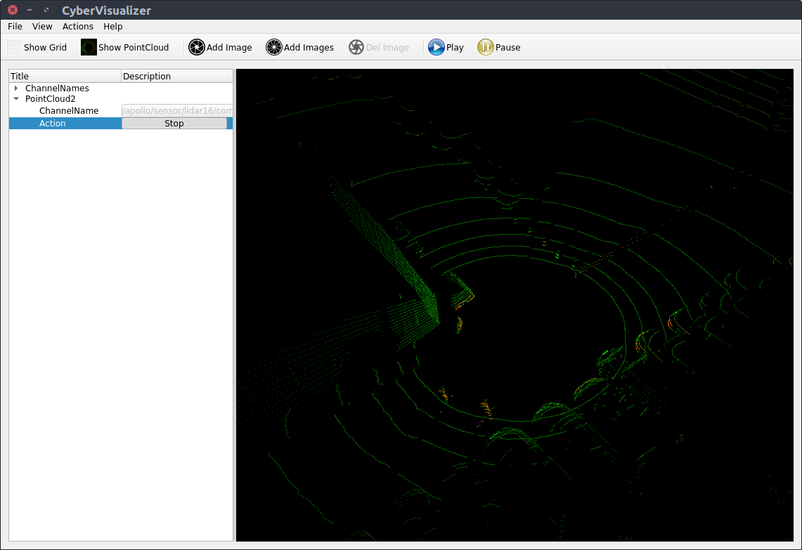
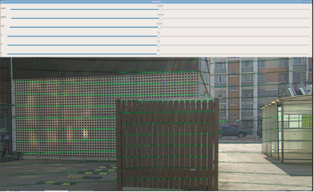

# 第二次课

[toc]

## 本节任务

1. 相机内参标定；
2. 激光雷达-组合惯导外参标定；
3. 激光雷达-相机标定；
4. 了解汽车动力学标定方法（制作油门刹车加速度表）。

### 为什么要进行标定，如何标定

在实际环境中，由于安装误差，传感器各自的坐标系不同等因素，需要通过标定获取各个传感器的连接关系，构建出以载体自身为基坐标系的TF树。考虑到环境限制和课程难度，本次实践包含以下内容：

1. 相机内参标定：使用ros程序采集数据，并放入calibration_kit工具箱自动标定
2. Lidar-INS外参标定：使用apollo采集和解析数据，手动进行对齐标定；
3. Lidar-Camera外参标定：使用apollo采集和解析数据，放入calibration_kit工具箱，手动进行标定；
4. 油门刹车标定：使用Apollo提供的数据采集和分析工具完成标定；

经过内参，外参标定，可以将所有传感器输出统一到基础坐标中进行表达：


注：理论上，定位模块需要将所有运动转换到载体坐标系下进行输出，但是Apollo定位模块中并没有直接将载体坐标系作为基坐标系，而是将IMU（INS）作为了基坐标系。方便起见，我们将在后续工作中遵从这一做法。

## 1 Camera内参标定

使用ROS-UsbCam节点驱动相机并进行标定

### 1.1 使用ROS usb_cam驱动相机

```bash
sudo apt-get install ros-melodic-usb-cam
```

### 1.2 修改launch文件

进入目录：

```bash
roscd usb_cam

cd launch

sudo gedit usb_cam-test.launch 
```

目前主要修改device和width两个参数，可以使用`ls /dev/video*`查看系统视频设备。

```xml
<launch>
  <node name="usb_cam" pkg="usb_cam" type="usb_cam_node" output="screen" >
    <!-- modify the video device to your device -->
    <param name="video_device" value="/dev/video0" />
    <!-- modify the size of your device -->
    <param name="image_width" value="1920" />
    <param name="image_height" value="1080" />
    <param name="pixel_format" value="yuyv" />
    <param name="camera_frame_id" value="usb_cam" />
    <param name="io_method" value="mmap"/>
  </node>
  <node name="image_view" pkg="image_view" type="image_view" respawn="false" ou$
    <remap from="image" to="/usb_cam/image_raw"/>
    <param name="autosize" value="true" />
  </node>
</launch>
```

### 1.3 启动相机

### 2 使用ROS进行相机标定

### 2.1 运行标定程序

开启摄像机：

```bash
roslaunch usb_cam usb_cam-test.launch
```
启动有warning例如提示校准配置文件`head_camera.yaml not found`，这个是正常的，我们标定完后才会生成这个配置文件。

根据你的棋盘格修改参数

- 一个是size参数为棋盘格角点数量比如8x9=72个格子的棋盘格，角点个数为7x8=63个，size参数就要写7x8
- 另外一个参数为square，传入的参数为棋盘格一个小格子的宽度（注意单位为m）
- `image:=/usb_cam/image_raw` 标定当前订阅图像来源自名为/usb_cam/image_raw的topic
- `camera:=/usb_cam` 为摄像机名

```bash
rosrun camera_calibration cameracalibrator.py --size 7x6 --square 0.05 image:=/usb_cam/image_raw camera:=/usb_cam
```

### 2.2 图像采集

采集人员分为两组，一组使用ROS程序进行采集；另一组手持棋盘格，在图像视野范围内进行操作和移动。
示例使用的标定板为7×6_50×50大小的标准棋盘格进行。


1. 手持棋盘格要求：

   + 每次采集尽量保持稳定，最终成像光线适中，图像清晰；
   + 手持棋盘格时不能对棋盘格进行遮挡，不能离开相机视野范围内；
   + 采集图像类型需要丰富多样，包含：近距离图像、中距离图像、远距离图像、左右倾斜图像、上下倾斜图像、轻微旋转图像、较大旋转图像、相机靠近左视野边缘图像、相机靠近右视野边缘图像等；
   + 采集有效图像的数量在15-35张左右；
2. 界面中的 `X`,`Y`,`size`,`skew`的含义：

    `X`：表示标定板在视野中的左右位置。

    `Y`：表示标定板在视野中的上下位置。

    `size`：标定板在占视野的尺寸大小，也可以理解为标定板离摄像头的远近。

    `skew`：标定板在视野中的倾斜位置

3. 标定实操技巧：在相机视野范围内且能识别棋盘格的前提下，左右、上下和前后移动范围尽可能大一些，将有助于更快地满足`X`,`Y`,`Size`的要求；边移动边扭转标定板，可以更快完成`Skew`。当X、Y、Size、Skew四个都变成绿色，然后就可以看到CALIBRATE这个按钮变成青色，表明已经采到足够多的图片数据可供标定了。 

### 2.3 生成标定文件

点击CALCULATE进行标定会稍微有点卡顿，不要担心后台正在进行标定，标定完成后观察当前的相机界面，
如果相机成像完全正常了，则说明标定成功了，点击界面右下面的SAVE和COMMIT按钮， 
可保存标定完成后的文件到路径 `/home/USERNAME/.ros/camera_info/head_camera.yaml`。
另外**在原来的terminal界面也会有对应的参数**`D K R P`。

参数说明 *

distortion_model指定了畸变模型

D：distortion_coefficients指定畸变模型的系数

K：camera_matrix规定了摄像头的内部参数矩阵

R：rectification_matrix为矫正矩阵，一般为单位阵

P：projection_matrix为外部世界坐标到像平面的投影矩阵


### 3 更改apollo中的配置文件

**在原来的terminal中**找到标定获得的内参数`D K R P`，用其替换
`modules/calibration/data/dev_kit_pix_hooke/camera_params/front_camera_intrinsics.yaml`对应参数并保存，即完成相机内参标定。
*注意参数后面是接冒号 `:`  示例如下*

```yaml
header:
    seq: 0
    stamp:
        secs: 0
        nsecs: 0
    frame_id: white_mkz_onsemi_obstacle
height: 1080
width: 1920
distortion_model: plumb_bob
D: [-0.54336, 0.26653, -0.00099, -0.00170, 0.00000]
K: [2033.39968, 0.0, 929.01881, 0.0, 2046.55356, 572.81049, 0.0, 0.0, 1.0]
R: [1.0, 0.0, 0.0, 0.0, 1.0, 0.0, 0.0, 0.0, 1.0]
P: [1729.4515380859375, 0.0, 997.0791139046996, 0.0, 0.0, 1926.0577392578125, 571.4609883012963, 0.0, 0.0, 0.0, 1.0, 0.0]
binning_x: 0
binning_y: 0
roi:
  x_offset: 0
  y_offset: 0
  height: 0
  width: 0
  do_rectify: False
```


## 3 Lidar-INS 标定

这里我们采用手动标定的方法标定Lidar和INS的转换位姿。

### 3.1 相对位置粗测

1. 用直尺测量激光雷达相对INS在x，y，z三个方向上偏移的距离（以INS的坐标系为基准），并填入Lidar外参文件的对应位置：
`modules/calibration/data/dev_kit_pix_hooke/lidar_params/lidar32_novatel_extrinsics.yaml`

### 3.2 数据采集

1. 采集地点的选取。由于需要用到GNSS，Lidar-INS标定需要在室外进行；为了方便点云的标定，选择的地点附近需要有一块面积较大的平整墙体。

2. 检查传感器状态是否正常。将车辆调整到低速的手动驾驶模式，保证车辆位于在空旷、较少动态障碍物、并且周围有标准几何形状的建筑物周围。启动Apollo中的`Transform`，`Lidar`，`GPS`，`Localization`模块，检查GNSS、惯导以及lidar的状态：

   + `/apollo/sensor/gnss/ins_stat` 中 `pos_type：56` 为正常
   + `/apollo/sensor/gnss/ins_status`中 `type: GOOD`为正常
   + `/apollo/sensor/gnss/best_pose`中`sol_type: NARROW_INT`为正常
   + 若三者为`pos_type：55`，`INVALID`，`NARROW_FLOAT`等状态，通常开车跑动一圈就可以达到正常状态；若处于更差状态，则需排查是否有障碍物遮挡以及RTK账号是否正常运行等因素
   + `/apollo/sensor/lidar32/compensator/PointCloud2`查看补偿点云是否开启，如果没有，遛一下车再观测

   + 检查`/apollo/sensor/gnss/odometry`中时间戳和系统时间保持一致；


3. 开启cyber_recorder对数据进行记录：

   ```bash
   cyber_recorder record -a -i 600 -o calib_lidar2ins.record 
   ```

   + `-a`：表示对所有数据的channel进行记录
   + `-i`：表示记录600s为一个数据包，这是为了保证尽量所有数据都在一个包内
   + `-o`：指定输出文件的名称


4. 采集开始后，控制车辆运行15～30米，运动结束后按下组合键`ctrl + c`停止cyber_recorder记录。录制的calib_lidar2ins.record会保存在apollo的目录下，带有后缀 `.0000`等，然后将数据包移动到`data/bag/calib_lidar2ins`目录下

   ```bash
   mkdir data/bag/calib_lidar2ins/

   mv calib_lidar2ins.record.* data/bag/calib_lidar2ins/
   ```

### 3.3 数据解析

1. 修改数据解析脚本

    在`/apollo/sripts`文件夹下添加`lidar_parse.sh`脚本文件，标定需要打开GNSS，此时激光雷达是去运动畸变的，也就是有运动补偿，通道`/apollo/sensor/lidar32/compensator/PointCloud2`是有数据的，因此应注意`/apollo/sripts/lidar_parse.sh`脚本文件的`CLOUD_TOPIC`是否正确：

   ```bash
   CLOUD_TOPIC="/apollo/sensor/$LIDAR_TYPE/compensator/PointCloud2"
   #CLOUD_TOPIC="/apollo/sensor/$LIDAR_TYPE/PointCloud2"
   ```

2. 运行数据解析脚本文件

   ```bash
   bash scripts/lidar_parse.sh \
   /apollo/data/bag/calib_lidar2ins \
   /apollo/data/bag/calib_lidar2ins \
   /apollo/modules/calibration/data/dev_kit_pix_hooke/lidar_params/lidar32_novatel_extrinsics.yaml \
   lidar32
   ```
     
     + 如果解析没成功或者重新解析，请**一定要删掉**`calib_lidar2ins`文件夹下生成`parsed_data`文件夹，因为文件夹里面的txt文件不会被覆盖掉，新的数据会在txt文本末端不断累加写入，造成后续解析不成功。

3. 查看点云数据

    数据解析完成后会在`calib_lidar2ins`文件夹下生成`parsed_data`，里面存放了Lidar 点云的pcd文件，用于进行标定。

    + 在apollo的docker容器内运行`pcl_viewer`，对点云数据进行查看

   ```bash
   pcl_viewer data/bag/calib_lidar2ins/parsed_data/00000/pcd/1.pcd
   #查看第1帧的点云
   ```
    + 也可以开启`cyber_visualizer`，关闭车上所有的传感器(可直接在dreamview上切换车型就能关闭整车传感器)，播放录制好的包：

   ```bash
   cyber_recorder play -f data/bag/calib_lidar2ins/*.record.* -l
   ```
    + 首先在`cyber_monitor`上查看录制包里面的所有通道信息，然后在`cyber_visualizer`选择点云通道，查看点云。
   


### 3.4 标定外参

执行标定文件：

这里需要用到interactive slam包，可以让我们手动对齐点云。

   ```bash
   # 以下命令均在docker外执行
   # 安装依赖，若已安装请跳过
   sudo apt-get install libglm-dev libglfw3-dev
   
   sudo apt-get install ros-melodic-geodesy ros-melodic-pcl-ros 
   
   ros-melodic-nmea-msgs ros-melodic-libg2o

   # interactive slam包已经下载好在 /apollo/catkin_ws
   cd /apollo/catkin_ws

   catkin_make -j4

   roscore

   # 新建一个终端
   cd /apollo/catkin_ws

   source devel/setup.bash

   rosrun interactive_slam odometry2graph
   ```

选择导入，Apollo数据类型，选择上一步中生成的pcd文件所在的文件夹（`data/bag/calib_lidar2ins/parsed_data/00000/pcd`）


将平整的墙体作为参照物，通过调整对应的yaw角和平移量（主要是yaw角，平移通过直尺进行测量），尽可能将墙体的点云调整到最薄。

### 3.5 外参标定输出

调整外参完毕后，记录屏幕中输出的**平移量**和**旋转四元数**，并将该外参数据放入下述文件中：

`modules/calibration/data/dev_kit_pix_hooke/lidar_params/lidar32_novatel_extrinsics.yaml`


## 4 Lidar-Camera标定

### 4.1 数据采集

启动Apollo中的`Transform`，`Lidar`，`Camera`模块，将车辆静止在一处**有明显阶梯**处建筑或者建筑物**角落**附近。
为了方便对齐，最好使某一束激光打到建筑物的上边缘处。启动`cyber_recorder`，记录1s左右的数据包，
并保存在`data/bag/calib_lidar2camera`文件目录下。

   ```bash
    mkdir data/bag/calib_lidar2camera

    cyber_recorder record -a -i 600 -o data/bag/calib_lidar2camera/calib_lidar2camera.record
   ```

### 4.2 数据解析

#### 4.2.1 图像数据解析

该部分的目标是将的录制包中的`image`保存成`jpeg`格式的图片；

1. 修正解析文件：

   在`modules/tools/record_parse_save/parse_camera.py`中将第39行修改为：

   ```python
   msg_camera.ParseFromString(msg)
   # msg_camera.ParseFromString(str(msg))
   ```

2. 修改配置文件：

   在`/apollo/modules/tools/record_parse_save`文件目录下，打开`parser_params.yaml`文件：

   - `filepath:` 改为我们存放数据包的文件夹`/apollo/data/bag/calib_lidar2camera/`

   - `parse:` 选为`camera`

   - `camera`的`channel_name`: 选为我们实际压缩图像的`topic`名，如`/apollo/sensor/camera/front_6mm/image/compressed`

    

   - 执行数据解析程序 

     ```bash
     ./bazel-bin/modules/tools/record_parse_save/record_parse_save
     ```

     解析完成后，会将图像保存在我们**数据包的上一级目录下文件夹下**`data_camera_6mm_front`。

#### 4.2.2 激光数据解析

此处操作与`Lidar-INS 标定`部分相同，但这里我们没有打开GNSS，那么激光雷达是没有去畸变的，也就是没有运动补偿，通道`/apollo/sensor/lidar32/compensator/PointCloud2`是没有数据的，这个没关系，因为标定过程中小车也是静止的。数据解析只能用到原始的激光雷达数据，也就是通道`/apollo/sensor/lidar32/PointCloud2`，因此应先修改`/apollo/sripts/lidar_parse.sh`脚本文件的`CLOUD_TOPIC`：

   ```bash
   #CLOUD_TOPIC="/apollo/sensor/$LIDAR_TYPE/compensator/PointCloud2"
   CLOUD_TOPIC="/apollo/sensor/$LIDAR_TYPE/PointCloud2"
   ```
然后再执行解析命令：

   ```bash
   bash scripts/lidar_parse.sh \
   /apollo/data/bag/calib_lidar2camera \
   /apollo/data/bag/calib_lidar2camera \
   /apollo/modules/calibration/data/dev_kit_pix_hooke/lidar_params/lidar32_novatel_extrinsics.yaml \
   lidar32
   ```


### 4.3 外参标定

我们把calibration_kit里面的lidar-camera标定工具单独拿了出来，在路径 `/apollo/lidar_camera_calib`下，编译：

   ```bash
   cd /apollo/lidar_camera_calib

   mkdir build

   cd build

   cmake ..

   make -j4
   ```

1. 任选一帧采集数据(一般习惯选择第一帧)，拷贝至标定工具下的`/apollo/lidar_camera_calib/test`文件夹下，并重命名为`1.jpeg`和`1.pcd`。（数据位置：camera数据位置参考4.2.1末尾，激光数据位于`/apollo/data/bag/calib_lidar2camera`的下级目录中）

2. 执行以下命令，将`modules/calibration/data/dev_kit_pix_hooke/camera_params/`下的
相机内外参文件（`front_6mm_intrinsics.yaml, front_6mm_extrinsics.yaml`）拷贝到`test`文件夹下。

   ```bash
   cd /apollo/lidar_camera_calib

   mkdir test

   cp modules/calibration/data/dev_kit_pix_hooke/camera_params/front_6mm_extrinsics.yaml /apollo/lidar_camera_calib/test/

   cp modules/calibration/data/dev_kit_pix_hooke/camera_params/front_6mm_intrinsics.yaml /apollo/lidar_camera_calib/test/
   ```

注：这两个文件分别对应相机的内参（经过标定矫正后的），和相机-雷达外参的初始值（其中平移由直尺测量获得）。


### 4.4 外参标定输出

在`/apollo/lidar_camera_calib/build`文件下运行：

   ```bash
   ./lidar_camera_calib_tool
   ```

+ 如果图像大小无法缩放，可在`lidar_camera_calib/lidar_camera_calib.cc`中第149行（`LidarCameraCalib::Project`函数末尾）添加：

   ```c++
   cv::resizeWindow("mainWin", test_image.cols, test_image.rows);
   ```

  并进行重新编译。

调整拖动条，使点云强度和建筑物重合(绿色的深浅分别代表建筑物颜色的深浅程度)，即可得到较为准确的外参标定结果。最终结果将在终端上进行打印。




调整外参完毕后，记录屏幕中输出的平移量（translation）和旋转四元数（quaternion）。


最后，将该外参数据放入下述文件中：

`modules/calibration/data/dev_kit_pix_hooke/camera_params/front_6mm_extrinsics.yaml`

### 4.5 如何判断标定的结果是准确的？

可以小车换一个地方或者方向录一个数据包，参照前面的4.1-4.3.1步骤，把我们刚才标定好的外参结果
`front_6mm_extrinsics.yaml`以及原有的相机内参`front_6mm_intrinsics.yaml`拷贝到`test`文件夹下。

在/apollo/lidar_camera_calib/build文件下运行：

   ```bash
   ./lidar_camera_calib_tool
   ```

观测此时新的激光点云是否和相机图片是否一致，如果一致，说明标定的结果是对的。

## 5 了解油门刹车标定方法

车辆在某一速度基础上，需要通过车辆的油门和刹车来获得期望加速度。汽车在不同的行驶速度下，想要获取相同的加速度，则其油门和刹车的大小也会不同。基于汽车速度和加速度之间的关系，可以更好的实现对车辆的控制，本节内容利用apollo的标定工具来学习汽车的油门刹车标定表的制作过程。

#### 5.1 油门数据采集

1. **启动依赖模块**：启动`Transform`，`GPS`，`Canbus`，`Control`模块；检查GNSS和惯导的状态：

   + `/apollo/sensor/gnss/ins_stat` 中 `pos_type：56` 
   + `/apollo/sensor/gnss/ins_status`中 `type: GOOD`
   + `/apollo/sensor/gnss/best_pose`中`sol_type: NARROW_INT`

   检查`/apollo/sensor/gnss/odometry`中时间戳和`/apollo/sensor/gnss/best_pose`时间戳保持一致；

2. **选择标定场地**：手动控制汽车至具有一段较长的公路上。标定场地及操作要求如下：

   + 标定场地必须包含一段较长的直线道路；
   + 由于涉及到自动行驶，因此请选择周围行人较少或无行人环境；
   + 时刻注意按急停按钮，不允许采用切换模式的方式替代急停。

3. **修复软件源并安装缺失的依赖(docker内执行)**：

   首先修改软件源

   ```bash
   sudo vim /etc/apt/sources.list
   ```

   在文件中修改：（将`https`修改为`http`）

   ```bash
   deb http://mirrors.tuna.tsinghua.edu.cn/ubuntu/ bionic main restricted universe multiverse
   # deb-src https://mirrors.tuna.tsinghua.edu.cn/ubuntu/ bionic main restricted universe multiverse
   deb http://mirrors.tuna.tsinghua.edu.cn/ubuntu/ bionic-updates main restricted universe multiverse
   # deb-src https://mirrors.tuna.tsinghua.edu.cn/ubuntu/ bionic-updates main restricted universe multiverse
   deb http://mirrors.tuna.tsinghua.edu.cn/ubuntu/ bionic-backports main restricted universe multiverse
   # deb-src https://mirrors.tuna.tsinghua.edu.cn/ubuntu/ bionic-backports main restricted universe multiverse
   deb http://mirrors.tuna.tsinghua.edu.cn/ubuntu/ bionic-security main restricted universe multiverse
   # deb-src https://mirrors.tuna.tsinghua.edu.cn/ubuntu/ bionic-security main restricted universe multiverse
   ```

   更新并安装缺少的依赖库

   ```bash
   sudo apt update

   sudo apt-get install tcl-dev tk-dev python3-tk
   ```

   **注意**：上述修改涉及Apollo系统，因此使用`dev_start.sh`时会重建一个`docker`容器，此时对系统的修改会全部失效，需要重新换源操作；但是`docker start + 容器id/tag`的方式并不会重建容器，而是会继续使用之前容器，因此可以不用重新换源。

4. **执行数据收集程序**


   在docker内执行以下命令:

   ```bash
   // 手动挂挡
   bash scripts/canbus_teleop.sh
   ```  

   启动手动挂挡的程序后，分别按次序按下,m0, m1, g1,然后在该终端下按下`ctrl+c`, 暂停该程序的运行(这一步非常重要!!),防止后续我们输入的油门刹车指令和该程序冲突。

   接下来，修正`modules/tools/vehicle_calibration/data_collector.py`文件：
   
   ```python
   print('Send Reset Command.')
   self.controlcmd.header.module_name = "control"
   self.controlcmd.header.sequence_num = self.sequence_num
   self.sequence_num = self.sequence_num + 1
   self.controlcmd.header.timestamp_sec = cyber_time.Time.now().to_sec()
   self.controlcmd.pad_msg.action = 2
   # 屏蔽下述一行代码：
   # self.control_pub.write(self.controlcmd)
   ```

   输入油门刹车数据收集指令： 
   ```bash
   // 执行数据收集程
   ./bazel-bin/modules/tools/vehicle_calibration/data_collector
   ```

    


   根据提示，x，y，z分别为油门、速度、 刹车。我们通过多次尝试来决定汽车的油门死区，在死区基础上不断提高这三个变量值。 如输入：

   | x    | y    | z    |
   | ---- | ---- | ---- |
   | 6    | 1    | -8   |
   | 7    | 1.1  | -10  |
   | 8    | 1.2  | -12  |
   | 10   | 1.2  | -15  |
   | 15   | 1.4  | -20  |
   | 20   | 1.4  | -25  |

   
   每次输入后，车辆将会按照该油门（x值大小）不断加速，直到到达指定速度（y值，单位为m/s）。然后不断踩刹车（z值，一定为负值），直到车辆停止结束。
   
   **注意：若刹车油门尚未标定，该过程比较危险，需要时刻注意控制急停！**
   
   车辆停止后，如果对当次数据不满意，可以按`x`键清除本次缓存。继续输入`x y z`值可以继续进行数据采集，获取足够数据后（一般5组以上），按`q`键则结束数据采集。
   
   这些采集的数据均保存在`apollo`的根目录下，如`“t6b-10r0_recorded.csv”`。将上述数据打包，拷贝至新建文件夹`vehicle_calibration_data`
   
   ```bash
   mkdir vehicle_calibration_data

   mv *csv ./vehicle_calibration_data
   ```

#### 5.2 油门刹车标定

1. **数据处理**

   修改文件`modules/tools/vehicle_calibration/process_data.sh`：

   ```bash
   DIR="$( cd "$( dirname "${BASH_SOURCE[0]}"  )" && pwd  )"
   rm $DIR/result.csv
   for f in `ls ${1}/*_recorded.csv`
   do
       echo "Processing $f"
       //修改为如下代码
       ./bazel-bin/modules/tools/vehicle_calibration/process_data $f
   done
   ```
   
   执行下述命令将每次采集数据合并为单个数据文件，最终会在apollo的根目录下，会生成结果文件`result.csv`：

   ```bash
   bash modules/tools/vehicle_calibration/process_data.sh vehicle_calibration_data
   ```

2. **查看标定结果**

   ```bash
   ./bazel-bin/modules/tools/vehicle_calibration/plot_results result.csv
   ```

   

3. **生成标定文件表**

   ```bash
   bash modules/tools/vehicle_calibration/result2pb.sh result.csv 
   ```

   在执行终端的目录下会生成`control_conf.pb.txt` 的控制器相关的配置文件，包括横纵向控制器参数及油门刹车标定表，其中`lon_controller_conf`中`calibration_table`字段即为标定结果。

   + 注意，生成的`control_conf.pb.txt` 文件配置是基于`modules/control/conf/control_conf.pb.txt`原始文件生成的，请确保该文件内容正确。

   + 用该文件中的`calibration_table`部分替换至车辆校正文件`/apollo/modules/calibration/data/<对应车型>`中`control_conf.pb.txt`的对应部分，即可完成该车型的油门刹车标定。但是**由于pix底盘在出厂时已做过标定，我们在实践课中不必完成最终的替换**，学习整个油门刹车标定过程和方法即可。
