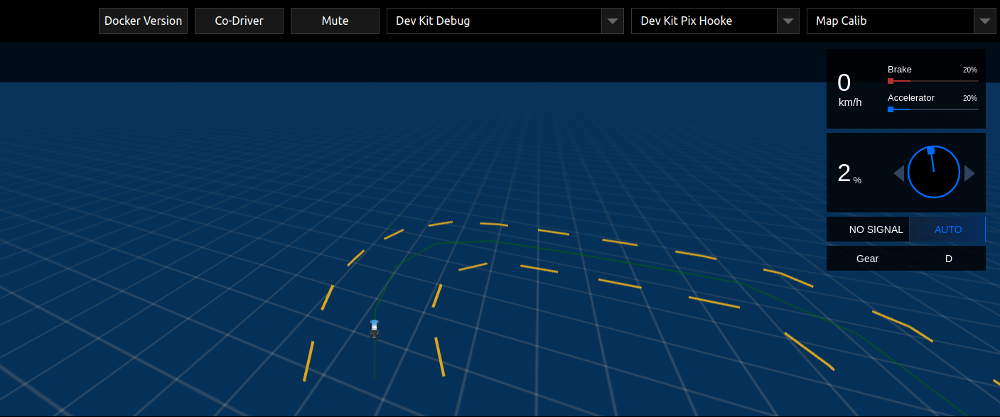
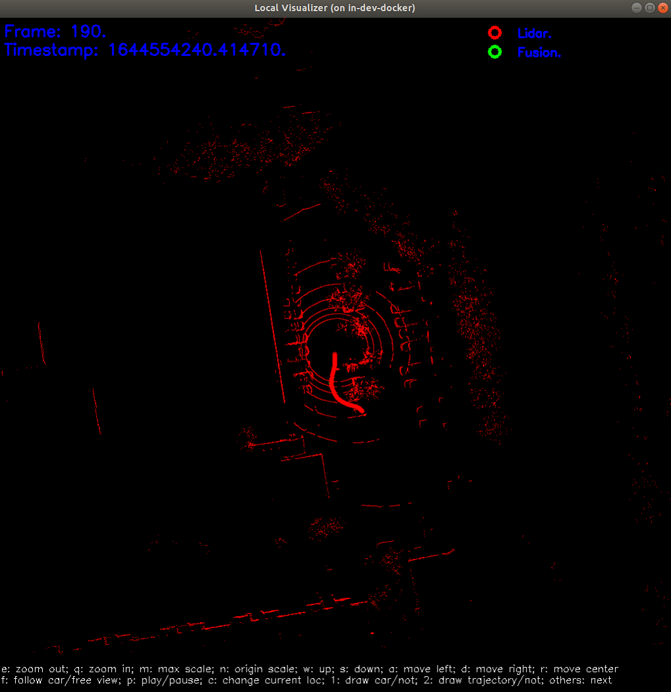

# 第三次课

### 本节任务

1. 采集真实场景的数据，离线进行数据包解析，构建NDT地图、MSF地图；
2. 基于所建地图，完成RTK，NDT算法验证。


## 0 Apollo中的地图总结*

### 0.1 地图类型介绍

1. **base_map**：`base_map`是最**完整的地图**，包含所有道路和车道几何形状和标识。其他版本的地图均基于`base_map`生成。
2. **routing_map**：`routing_map`包含`base_map`中**车道的拓扑结构**
3. **sim_map**：`sim_map`是一个适用于`Dreamview`**视觉可视化**，基于`base_map`的轻量版本。减少了数据密度，以获得更好的运行时性能。
4. **ndt map**：`ndt_map`在使用**NDT定位**时才会被使用的地图，可通过工具生成ndt地图。
5. **local map**：`local map`是进行**定位可视化**以及**MSF定位**时使用的地图，可以通过工具本地生成。
6. **HD map**：`HD map`即常说的**高精度地图**。格式采用（`XML`）文件格式的数据组织方式，是基于国际通用的`OpenDrive`规范，并根据百度自动驾驶业务需求拓展修改而成。百度Apollo中的map模块没有提供高精度地图的制作功能，而是作为一种商业产品进行出售，因此这里并不做过多介绍。

### 0.2 地图格式介绍*

一般而言，地图具有`.xml`，`.bin`，`.txt`等格式，加载顺序依次为：`.xml`->`.bin`->`.txt`。

```bash
x.xml  # An OpenDrive formatted map.
x.bin  # A binary pb map.
x.txt  # A text pb map.
```

对于ndt和msf地图，Apollo采用二进制文件进行存储，其制作步骤见后续章节。

## 1 测试数据集与地图创建

### 1.1 现场录制数据集

1. 启动并进入apollo docker，启动dreamview，开启cyber_monitor。在dreamview中**依次**开启`Transform`，`Lidar`，`GPS`，`Localization`模块，并使用`cyber_monitor`监控各个信息通道，确保所有模块开启正常。

2. 创建`data/bag/localization`文件夹，用于存放数据包，操作如下：
新建终端，在docker外输入以下指令，该文件夹不存在则创建，如果存在且有数据则需要提前清除：

```shell
cd /apollo
mkdir -p data/bag/localization -v
rm -rf data/bag/localization/*
```

3. 在遥控器控制模式下，开启`cyber_recorder`记录数据，并驱动车辆绕较大的0字或者8字轨迹。开启记录的命令如下：

```shell
cyber_recorder record -a -i 600 -o data/bag/localization/loc.record
```

结束记录后，会在`data/bag/localization`目录下生成一个`loc.record.00000`的文件或者多个文件例如`loc.record.00000 loc.record.00001`。

### 1.2 车道线地图与定位地图创建

#### 1.2.1 虚拟车道地图制作

由于正规车道线地图制作的原理较为复杂，因此我们采用虚拟车道线的方式进行车道线的制作。虚拟车道线的核心思想是记录车辆行驶的轨迹，以此为中心向左右各扩展若干距离。制作过程如下：

1. 从CyberRT包中提取位置路径文件：

   ```bash
   ./bazel-bin/modules/tools/map_gen/extract_path \
   	./path.txt \
   	data/bag/localization/*
   ```

2. 生成地图文件(`base_map.txt`)，其中1表示冗余区域大小为1

   ```bash
   ./bazel-bin/modules/tools/map_gen/map_gen_single_lane \
   	./path.txt \
   	./base_map.txt \
   	1
   ```

   + 调节车道线宽度：**修正`map_gen_single_lane.py`脚本中的`LANE_WIDTH`参数可以调整车道线宽度**。本次实践中，推荐设置宽度为5。

3. 【可选】*为该文件增加header(可视化使用)，举例如下

   ```yaml
   header {
     version: "0326"
     date: "20220326"
     projection {
       proj: "+proj=tmerc +lat_0={39.52} +lon_0={116.28} +k={-48.9} +ellps=WGS84 +no_defs"
     }
   }
   ```

4. 建立地图文件夹（如`map_test`，可以修改为自己地图名称），并生成.bin文件

   ```bash
   mkdir modules/map/data/map_test
   rm -rf path.txt
   mv base_map.txt modules/map/data/map_test/base_map.txt
   
   # base_map.bin
   ./bazel-bin/modules/tools/create_map/convert_map_txt2bin \
   	-i /apollo/modules/map/data/map_test/base_map.txt \
   	-o /apollo/modules/map/data/map_test/base_map.bin
   ```

5. 建立`routing_map`

   ```bash
   bash scripts/generate_routing_topo_graph.sh \
   	--map_dir /apollo/modules/map/data/map_test
   ```

   + 第一次运行可能会提示报错：

     ```css
     E0406 15:11:07.321321 10341 hdmap_util.cc:40] [map]No existing file found in /apollo/modules/map/data/map_test/routing_map.bin|routing_map.txt. Fallback to first candidate as default result
     ```

     属于正常现象，继续即可。

6. 建立`sim_map`

   ```
   ./bazel-bin/modules/map/tools/sim_map_generator \
   	--map_dir=/apollo/modules/map/data/map_test \
   	--output_dir=/apollo/modules/map/data/map_test
   ```

7. 可视化车道线：

   + dreamview中地图显示（需要重启dreamview）：

     

#### 1.2.2 NDT定位地图

1. 准备工作

   + 已完成Lidar-INS标定任务；
   + 所使用的数据集中**至少**需要保证该数据集有`/apollo/localization/pose` 或者`/apollo/sensor/gnss/odometry`两个通道；当两个`channel`中仅有一个存在时，**两者可以相互替换**。
   + 确定下列信息准备完毕：

      + 待生成地图的名称（以`map_test`为例）
      + 所用数据集所在的文件夹（以`data/bag/localization`为例）
      + 数据集生产地区的`zone_id`（以湖州地区的`51`为例）
      + 激光点云名称（以`lidar32`为例）
      + 外参文件存放位置（以`/apollo/modules/calibration/data/dev_kit_pix_hooke/lidar_params/lidar32_novatel_extrinsics.yaml`为例）

2. 拷贝`scripts/msf_simple_map_creator.sh`文件，重命名为`ndt_simple_map_creator.sh`

   ```shell
   cd /apollo
   cp scripts/msf_simple_map_creator.sh scripts/ndt_simple_map_creator.sh
   ```

   并对文件做出以下修改：

   ```shell
   ## 用下面这个函数替换掉function create_lossless_map()
   function create_ndt_map() {
     /apollo/bazel-bin/modules/localization/ndt/map_creation/ndt_map_creator \
       --pcd_folders $1 \
       --pose_files $2 \
       --resolution_type single \
       --resolution 1 \
       --resolution_z 1 \
       --map_folder $OUT_MAP_FOLDER \
       --zone_id $ZONE_ID
   }
   
   ## 把create_lossless_map替换为create_ndt_map
   # create_lossless_map "${DIR_NAME}/pcd" "${DIR_NAME}/pcd/corrected_poses.txt"
   create_ndt_map  "${DIR_NAME}/pcd" "${DIR_NAME}/pcd/corrected_poses.txt"
   
   ## 注释掉lossy_map
   # create_lossy_map
   ```

   + 注意：resolution表示地图分辨率。对于ndt算法而言，并不需要过于精细的分辨率，一般而言，**选择分辨率为1是一个相对比较好的选择**。

3. 运行代码生成：新的地图将在`modules/map/data/map_test`下存储

   ```bash
   bash /apollo/scripts/ndt_simple_map_creator.sh \
       data/bag/localization \
       /apollo/modules/calibration/data/dev_kit_pix_hooke/lidar_params/lidar32_novatel_extrinsics.yaml \
       50 \
       /apollo/modules/map/data/map_test/ndt_map \
       lidar32
   ```

4. 代码分析：核心思路包括以下几个步骤

   + 数据包解压生成pcd文件以及对应的位姿（`cyber_record_parser`）
   + 位姿插值（`poses_interpolator`）
   + 创建`ndt mapping `（`ndt_map_creator`）

5. 调整地图目录：

   ```bash
   mkdir -p /apollo/modules/map/data/map_test/ndt_map/local_map
   mv /apollo/modules/map/data/map_test/ndt_map/map /apollo/modules/map/data/map_test/ndt_map/local_map/map
   mv /apollo/modules/map/data/map_test/ndt_map/config.xml /apollo/modules/map/data/map_test/ndt_map/local_map/config.xml
   ```

#### 1.2.3 MSF简易定位地图

1. 准备工作

   + 已完成Lidar-INS标定任务；
   + 所使用的数据集中**至少**需要保证该数据集有`/apollo/localization/pose` 或者`/apollo/sensor/gnss/odometry`两个通道；当两个`channel`中仅有一个存在时，**两者可以相互替换**。
   + 确定下列信息准备完毕：

      + 待生成地图的名称（以`map_test`为例）
      + 所用数据集所在的文件夹（以`data/bag/localization`为例）
      + 数据集生产地区的`zone_id`（以湖州地区的`51`为例）
      + 激光点云名称（以`lidar32`为例）
      + 外参文件存放位置（以`/apollo/modules/calibration/data/dev_kit_pix_hooke/lidar_params/lidar32_novatel_extrinsics.yaml`为例）

2. 修改`scripts/msf_simple_map_creator.sh`文件如下：

   ```shell
   ## 注释掉删除解析文件和lossless_map部分
   # rm -fr $OUT_MAP_FOLDER/lossless_map
   # rm -fr $OUT_MAP_FOLDER/parsed_data
   ```

   + 注意：对于msf算法而言，**选择分辨率默认分辨率，即分辨率为0.125是一个比较好的选择**。
      在`msf_simple_map_creator.sh`里面的函数`function create_lossless_map()`添加`--resolution 0.125 \`。

3. 运行代码生成：新的地图将在`modules/map/data/map_test`下存储

   ```bash
   bash /apollo/scripts/msf_simple_map_creator.sh \
       data/bag/localization \
   /apollo/modules/calibration/data/dev_kit_pix_hooke/lidar_params/lidar32_novatel_extrinsics.yaml \
       51 \
       /apollo/modules/map/data/map_test \
       lidar32
   ```

4. 代码分析：核心思路包括以下几个步骤

   + 数据包解压生成pcd文件以及对应的位姿（`cyber_record_parser`）
   + 位姿插值（`poses_interpolator`）
   + 创建`msf mapping `（`create_lossless_map`）
   + 创建`lossy_map`（`lossless_map_to_lossy_map`）

5. 验证：查看`/modules/map/data/map_test/lossless_map/image`中的图像

   


## 2 基于RTK定位模块

### 2.0 通道与启动文件简介*

#### 2.0.1 输入与输出

RTK算法原理较为简单，仅仅是将组合惯导的数据做一些处理后进行封装，其中，输入包含以下几个通道：

+ `/apollo/sensor/gnss/corrected_imu`：校正IMU，即原始IMU数据去除了重力和bias；
+ `/apollo/sensor/gnss/ins_stat`：组合惯导的定位状态，决定最终定位的状态；
+ `/apollo/sensor/gnss/odometry`：组合惯导的位姿和线速度；

输出包含：

+ `/apollo/localization/pose`：最终定位的结果。包含utm坐标系下的位置，朝向（四元数形式），线速度，线加速度，角速度，heading角，载体坐标系下的线加速度、角速度、欧拉角。
+ `/apollo/localization/msf_status`：最终的定位状态；
+ `/tf`：增加了基坐标为`world`，子坐标为`localization`的坐标变换。

### 2.0.2 dag文件解析

文件地址为：`modules/localization/dag/dag_streaming_rtk_localization.dag`

```yaml
# Define all coms in DAG streaming.
module_config {
   module_library : "/apollo/bazel-bin/modules/localization/rtk/librtk_localization_component.so"
   components {
      class_name : "RTKLocalizationComponent"
      config {
         name : "rtk_localization"
         config_file_path : "/apollo/modules/localization/conf/rtk_localization.pb.txt"
         readers: [
            {
            channel: "/apollo/sensor/gnss/odometry"
            qos_profile: {
              depth : 10
            }
            pending_queue_size: 50
            }
         ]
      }
   }
}
```

+ `module_library`：启动文件对应的动态链接库
+ `components.class_name`：实例所属的类名（class name）
+ `components.config.name`：配置的名称定义
+ `components.config.config_file_path`：对应的参数配置文件，以`gflags`形式进行处理
+ `components.config.readers.channel`：组件读取的channel名称。`RTKLocalizationComponent`类会继承`cyber::Component<localization::Gps>`（即通道所读取的channel对应的类别）。每次通道中有数据传入时，会调用一次`Proc`函数。
+ `components.config.readers.qos_profile`：处理后的消息被保留的数量
+ `components.config.readers.pending_queue_size`：未及时处理消息的缓存队列长度

### 2.1 启动RTK定位

```yaml
cyber_launch start modules/localization/launch/rtk_localization.launch
```

+ **注意**：受限于法律法规等相关问题，部分数据包**不提供`/apollo/sensor/gnss/odometry`、`/apollo/sensor/gnss/ins_stat`这两个`channel`**，而直接提供`/apollo/localization/pose`数据。此时需要借助`/apollo/modules/tools/sensor_calibration/`下的两个脚本工具（本质上是py脚本，但是在Apollo 6.0后也被统一编译成了可执行文件）。

  开启两个不同终端进入docker后在/apollo根目录下分别执行：

  ```bash
  ./bazel-bin/modules/tools/sensor_calibration/ins_stat_publisher
  ./bazel-bin/modules/tools/sensor_calibration/odom_publisher
  ```

  这两个脚本便可以产生 `/apollo/sensor/gnss/ins_stat`、`/apollo/sensor/gnss/odometry`这两个`channel`，之后用`cyber_recorder`工具重新生成一个数据包。如果上述任一脚本找不到，请执行`./apollo.sh build_opt tools`来生成它们。

## 3 基于NDT定位

### 3.0 输入与输出*

NDT算法依赖NDT地图，将组合惯导的数据和激光雷达数据进行平滑滤波后输出，其中，输入包含以下通道：

+ `/apollo/sensor/lidar32/compensator/PointCloud2`：去畸变后的补偿点云；
+ `/apollo/sensor/gnss/ins_stat`：组合惯导的定位状态；
+ `/apollo/sensor/gnss/odometry`：组合惯导的位姿和线速度；

输出包含：

+ `/apollo/localization/pose`：融合定位的结果。包含utm坐标系下的位置，朝向（四元数形式），线速度，heading角；
+ `/apollo/localization/ndt_lidar`：激光里程计定位的结果；
+ `/apollo/localization/msf_status`：最终的定位状态；
+ `/tf`：增加了基坐标为`world`，子坐标为`localization`的坐标变换。

**注意，NDT算法由于没有加入IMU，因此没有加速度信息，无法应用于后续控制和规划算法。**

### 3.1 代码优化

把`/apollo/apollo_supplement/补充代码/ndt/`文件夹下的`ndt_localization.cc`和`ndt_localization.h`拷贝到
`/apollo/modules/localization/ndt/`，覆盖原来的文件

并重新编译localization模块

```bash
bash apollo.sh build_opt localization
```

### 3.2 修改配置文件

修改配置文件：`modules/localization/conf/localization.conf`

```bash
# 5行
--map_dir=/apollo/modules/map/data/map_test # 指定地图位置
# 115行
--local_utm_zone_id=51 # zone id，湖州地区为51
# 130行
--lidar_topic=/apollo/sensor/lidar32/compensator/PointCloud2 # 点云话题的名称
# 135行
--lidar_extrinsics_file=/apollo/modules/calibration/data/dev_kit_pix_hooke/lidar_params/lidar32_novatel_extrinsics.yaml # 外参文件，确保已经完成外参校正
```

+ 补充说明：zone id的计算方法
   可根据公式计算，`带数=（经度整数位/6）的整数部分+31` 如：江西省南昌新建县某调查单元经度范围`115°35′20″—115°36′00″`， 带数为`115/6+31=50`，选`50N`，即`WGS84 UTM ZONE 50N`。

### 3.3 启动定位模块

启动程序，确保没有任何报错产生：

  ```bash
  cyber_launch start modules/localization/launch/ndt_localization.launch
  ```

### 3.4 可视化结果展示

启动可视化程序：

  ```bash
  cyber_launch start modules/localization/launch/msf_visualizer.launch
  ```

此时，按c键可以在Lidar和Fusion定位中进行切换


+ 启动`cyber_monitor`，当出现`/apollo/localization/ndt_lidar`时认为ndt启动成功：

+ 观察可视化界面，分析雷达里程计轨迹和融合轨迹是否一致，并观察点云与地图匹配程度，当点云和实际匹配较差时，认为定位失败：
  
  

+ 如果出现下图所示的地图不可显示的情况，删除缓存文件：`rm -rf cyber/data/map_visual`后重新启动

  


+ 注意：尽管可视化程序在名称上归属于msf，但是它在所有定位方式中均可以使用。使用时需要确认：

  1. 检查`dag_streaming_msf_visualizer.dag`的`channel`，**保证lidar名称正确**；

  2. 定位方式的地图依赖于msf地图，**需要预先建立msf的`local map`地图**；

  3. 定位策略依赖于`localization.conf`文件的配置，特别是地图所在位置，需要仔细审查。