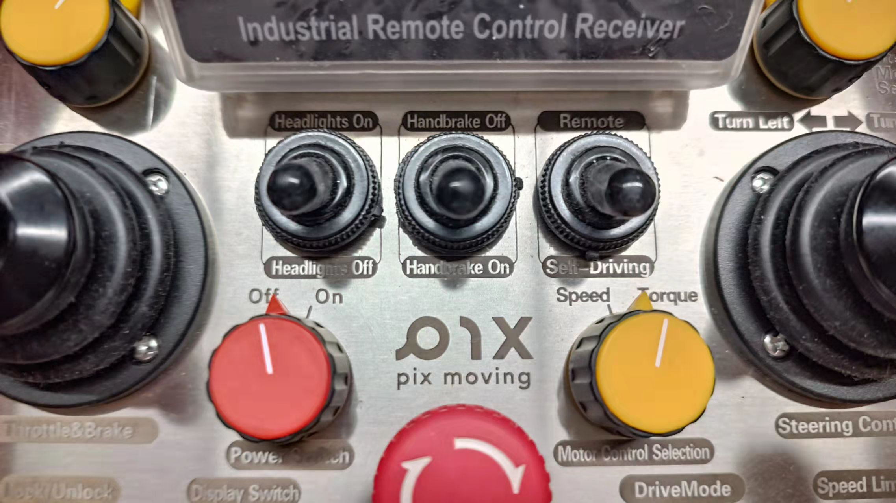

# 第五次课

### 本节任务

1. 实车上实现车辆循迹，了解PID、LQR车辆横纵向控制参数调试方法；
2. 实车上实现基于车道线地图的自主导航与AEB功能；
3. 在Apollo-LGSVL联合仿真环境中实现车辆路线规划与控制（可选）

## 1 控制器参数调试

### 1.0 写在前面

#### 1.0.1 控制模块的功能和目的

控制模块的功能是通过与底盘通讯实现控制车辆运动，目标是使车辆实际纵向和横向位置、速度、加速度、加加速度（jerk）等状态量尽可能精准地跟踪规划模块给出的目标值，使车辆在运动过程中的各种误差最小化。

#### 1.0.2 什么是纵向控制、横向控制

+ 想象你坐在驾驶舱内，我们把车头方向称为车辆的**纵向**，垂直于车头向你两侧的方向称为**横向**，垂直于水平地表的上下方向称为**垂向**；

+ 把车辆看作在平面上移动的物体，即不考虑垂向，可以将车辆运动划分为**纵向运动**和**横向运动**。其中，纵向运动是可以独立存在的，而横向运动受限于转向的机械结构，必须同纵向运动耦合在一起（*这一点可以很直观地理解：车辆必须具有向前或向后的速度才能向左、向右运动，停在原地再怎么转动方向盘也是无法让车直接向左、向右开的*）；

+ 不过，基于一定的理想假设所建立的车辆动力学模型可以将车辆横纵向运动**解耦**进行研究。以此为基础，我们可以设计**PID控制器**用于车辆**纵向**运动的控制，比如让车速误差最小化，使得车辆能够精准地按我们给定的车速前进；设计LQR控制器用于车辆**横向**运动控制，比如让横向位置误差最小化，使得车辆转弯的轨迹跟踪理想轨迹更加精准；

+ 前面提到的误差最小化仅代表了精度，但一个好的控制器要考虑的远不止这一点，还要兼顾响应速度、鲁棒性等因素。

### 1.1 控制器参数调试的总体流程

1. 在进行控制器参数调试前，请确认车辆**已经完成油门刹车标定**工作

2. 启动apollo docker并进入，启动`dreamview`和`cyber monitor`，进入dreamview并依次启动`Transform`, `GPS`, `Canbus`, `Localization`, `Control`模块，并在`cyber_monitor`中检查各模块是否已正常开启

3. 手动挂挡

    ```
    bash scripts/canbus_teleop.sh
    ```

4. 根据需要录制一段轨迹

    将遥控器的remote<---->self-driving档位切换为remote
    

    启动RTK轨迹录制所需要的所有模块

    ```bash
    bash scripts/rtk_recorder.sh setup	
    ```
    
    输入以下命令，启动recorder
    ```bash
    bash scripts/rtk_recorder.sh start	
    ```

    接着遥控汽车移动一段距离后停止
    
    + 如果是用于纵向控制器调参，建议选择较长的平直路面，录制一段直线轨迹
    + 如果是用于横向控制器调参，必须调至**前轮转向模式**，录制一段曲率适中的圆弧轨迹

    遥控完毕后，按`ctrl+c`终止录制轨迹


5. 启动RTK循迹

   将遥控器的remote<---->self-driving档位切换为self-driving
    

    ```
    bash scripts/rtk_player.sh setup	// 启动RTK循迹所需要的所有模块
    bash scripts/rtk_player.sh start	// 输入该命令后，汽车自动跟随轨迹
    ```

 6. 调节对应的控制参数（具体方法在本节1.2和1.3中详述）
 
    在`dreamview`界面中，将左侧栏切换至`task`，可以打开`PNC monitor`，如图所示

    
    
    `PNC monior`显示了Planning和Control模块的状态信息，选择cotrol模块可以查看速度、加速度、曲率、横向偏差、航向偏差等状态量随时间的变化的图线，我们的控制目标就是使实际的速度曲线能够在跟随过程中尽可能贴合目标轨迹的曲线。

    + PID参数调节:
    
    纵向误差调节(主要调节速度误差)
    
    .png)
    
    横向误差调节(主要调节lateral_err和heading_err)

    .png)


### 1.2 控制器参数表*

我们所使用的dev_kit_pix_hooke车型的的控制器参数表位于`~/apollo/modules/calibration/data/dev_kit_pix_hooke/control_conf.pb.txt`，
apollo默认的控制器参数表位于`~/apollo/modules/control/conf/control_conf.pb.txt`，
每当我们在dreamview中选择车型，系统都会用该车型的配置文件替换掉默认的配置文件。

控制器参数表的包含了前30行左右的总体配置，以及横向控制参数表、纵向控制参数表和MPC控制器参数表，总计可达上万行。以下是折叠后的结构：

```
control_test_duration: -1
enable_csv_debug: true
enable_speed_station_preview: false
is_control_test_mode: false
use_preview_speed_for_table: false
enable_input_timestamp_check: false
max_localization_miss_num : 20
max_planning_miss_num: 20
max_acceleration_when_stopped: 1.0
max_path_remain_when_stopped: 0.3
steer_angle_rate: 100
enable_gain_scheduler: true
set_steer_limit: true
enable_slope_offset: false

control_period: 0.01
trajectory_period: 0.1
chassis_period: 0.01
localization_period: 0.01
max_status_interval_sec: 0.1
max_planning_interval_sec: 0.2
max_planning_delay_threshold: 4.0
action: STOP
soft_estop_brake: 50.0
active_controllers: LAT_CONTROLLER
active_controllers: LON_CONTROLLER  # 此处可以修改使用的控制器
max_steering_percentage_allowed: 100
minimum_speed_resolution: 0.2
query_relative_time: 0.8
minimum_speed_protection: 0.1
lat_controller_conf{...
}
lon_controller_conf{...
}
mpc_controller_conf{...
}
```

+ 其中，纵向控制器参数表结构如下

    ```
    lon_controller_conf {
    ts: 0.01			# 控制模块的运行周期
    brake_minimum_action: 0.0  # 百分数, 后续通过取max(brake_minimum_action, vehicle_param_.brake_deadzone()) 确定刹车动作的下边界 
    throttle_minimum_action: 0.0 # 百分数, 后续通过取max(vehicle_param_.throttle_deadzone, throttle_minimum_action)确定油门动作的下边界
    speed_controller_input_limit: 0.8		# 速度控制器的最大输入(m/s)
    station_error_limit: 2.0			# 位置控制器的最大输入(m), 纵向位置误差的最大值
    preview_window: 20.0		# preview_time(预览时间)=preview_window*采样时间ts
    standstill_acceleration: -0.3	# 在倒挡时确定当前汽车的减加速度, max(acceleration_cmd,-lon_controller_conf.standstill_acceleration())
    enable_reverse_leadlag_compensation: false	# 是否允许使用超前/滞后补偿控制器
    station_pid_conf {	# 位置PID控制器参数配置
        integrator_enable: false	# 是否允许打开积分控制器，这里是false,　因此默认位置控制器是P控制器
        integrator_saturation_level: 0.3
        kp: 0.2
        ki: 0.0
        kd: 0.0
    }
    low_speed_pid_conf {	# 低速PID控制器配置
        integrator_enable: true  
        integrator_saturation_level: 0.3  # 积分饱和上限
        kp: 2.0
        ki: 0.3
        kd: 0.0
    }
    high_speed_pid_conf {	# 高速PID控制器配置
        integrator_enable: true
        integrator_saturation_level: 0.3
        kp: 1.0
        ki: 0.3
        kd: 0.0
    }
    switch_speed: 3.0		# 控制算法根据当前的行驶速度来决定选择低速或是高速PID
    switch_speed_window: 1.0	# 没有用到
    reverse_station_pid_conf {	# 倒车档的位置PID配置
        integrator_enable: true
        integrator_saturation_level: 0.5
        kp: 0.4
        ki: 0.1
        kd: 0.0
    }
    reverse_speed_pid_conf {		# 倒车档的速度PID配置
        integrator_enable: true
        integrator_saturation_level: 0.5	# 内部饱和状态界限(上下界)
        kp: 0.8
        ki: 0.3
        kd: 0.0
    }
    reverse_station_leadlag_conf {	# 倒车档的位置超前/滞后补偿器配置
        innerstate_saturation_level: 1000	
        alpha: 1.0	# 滞后系数
        beta: 1.0 # 超前系数
        tau: 0.0 # 时间系数
    }
    reverse_speed_leadlag_conf {		# 倒车档的速度超前/滞后补偿器配置
        innerstate_saturation_level: 1000
        alpha: 1.0
        beta: 1.0
        tau: 0.0
    }
    pitch_angle_filter_conf {		# 数字滤波器的配置
        cutoff_freq: 5	# 截止频率
    }
    calibration_table {	#　该部分是油门刹车标定表的配置，已折叠
        calibration {
        speed: 0.0	# 速度
        acceleration: -1.43 # 加速度
        command: -35.0  # 控制指令
        }
        ...
    }
    }
    ```

+ 横向控制器参数表

    ```
    lat_controller_conf {
    ts: 0.01			# 控制器运行周期
    preview_window: 0	# preview_time(预览时间)=preview_window*采样时间ts
    cf: 155494.663	#  前轮侧偏刚度，左右轮之和
    cr: 155494.663	#  后轮侧偏刚度，左右轮之和
    mass_fl: 520		#  左前悬的质量
    mass_fr: 520		#  右前悬的质量
    mass_rl: 520		#  左后悬的质量
    mass_rr: 520		#  右后悬的质量
    eps: 0.01			#  LQR迭代求解精度
    matrix_q: 0.05	#  Q矩阵是LQR中目标函数中各个状态量(X=[e1 e1' e2 e2'])平方和的权重系数
    matrix_q: 0.0
    matrix_q: 1.0
    matrix_q: 0.0
    reverse_matrix_q: 0.05	# 倒车档时,目标函数中各个状态量(X=[e1 e1' e2 e2'])平方和的权重系数
    reverse_matrix_q: 0.0
    reverse_matrix_q: 1.0
    reverse_matrix_q: 0.0
    cutoff_freq: 10		# 截止频率, 用于后续计算得到滤波器的传递函数分子和分母
    mean_filter_window_size: 10	# 均值滤波窗口大小
    max_iteration: 150		# LQR问题求解的最大迭代次数
    max_lateral_acceleration: 5.0		# 最大允许的横向加速度
    enable_reverse_leadlag_compensation: true  # 使能横向控制中的超前滞后控制器, 用于改善闭环反馈系统的响应速度
    enable_steer_mrac_control: false	# 使能mrac模型参考自适应控制
    enable_look_ahead_back_control: true # 使能前进倒车时的预瞄控制
    lookahead_station: 1.4224	# 前进档时汽车控制的预瞄距离
    lookback_station: 2.8448	#　倒车档时汽车控制的预瞄距离
    lookahead_station_high_speed: 1.4224	  #  高速前进预瞄距离，针对非R档
    lookback_station_high_speed: 2.8448	  #  高速前进预瞄距离，针对R档
    lat_err_gain_scheduler {	# 横向误差增益调度表, 在不同速度下, 在不同的速度下为测定的横向误差乘上一个比例系数
        scheduler {
        speed: 4.0	# 速度
        ratio: 1.0	# 比例系数
        }
        scheduler {
        speed: 8.0
        ratio: 0.6
        }
        scheduler {
        speed: 12.0
        ratio: 0.2
        }
        scheduler {
        speed: 20.0
        ratio: 0.1
        }
        scheduler {
        speed: 25.0
        ratio: 0.05
        }
    }
    heading_err_gain_scheduler {	# 朝向误差增益调度表, 在不同速度下, 在不同的速度下为测定的朝向误差乘上一个比例系数
        scheduler {
        speed: 4.0
        ratio: 1.0
        }
        scheduler {
        speed: 8.0
        ratio: 0.6
        }
        scheduler {
        speed: 12.0
        ratio: 0.4
        }
        scheduler {
        speed: 20.0
        ratio: 0.2
        }
        scheduler {
        speed: 25.0
        ratio: 0.1
        }
    }
    reverse_leadlag_conf {	# 倒车档的leg/lag补偿器配置
        innerstate_saturation_level: 3000  # 内部饱和状态界限(上下界)
        alpha: 1.0
        beta: 1.0
        tau: 0.0
    }
    steer_mrac_conf {  		# flase 跳过
        mrac_model_order: 1
        reference_time_constant: 0.09
        reference_natural_frequency: 10
        reference_damping_ratio: 0.9
        adaption_state_gain: 0.0001
        adaption_desired_gain: 0.0001
        adaption_nonlinear_gain: 0.0001
        adaption_matrix_p: 1.0
        mrac_saturation_level: 1.0
        anti_windup_compensation_gain: 0.0001
        clamping_time_constant: 0.08
    }
    }
    ```

### 1.3 纵向PID控制器参数调试方法

纵向PID参数调试一般是基于速度控制器->位置控制器的顺序。在汽车纵向的运动过程中, 如果速度控制器能够较为良好的响应, 那么一般情况下位置控制器的响应效果也不会太差

#### 1.3.1 速度控制器的调谐

速度控制器一般是 `PI` 控制器(比例积分控制器)

```
speed_pid_conf {
  integrator_enable: true
  integrator_saturation_level: 0.3
  kp: 1.0
  ki: 0.3
  kd: 0.0
}
```

1. 首先将 `kp` , `ki` 和 `kd` 的值设为0.
2. 先增加 `kp` 的值, `ki` 和 `kd` 的值不变，直到输出的速度曲线出现了震荡即可
3. 将 `kp` 的值变为原先的 `1/2` ,再慢慢调节 `ki` 的值, 减少速度曲线的稳态误差

最终得到的速度pid控制曲线应该是一条单调上升的曲线

#### 1.3.2 位置控制器的调谐

```
station_pid_conf {
  integrator_enable: true
  integrator_saturation_level: 0.3
  kp: 0.5
  ki: 0.3
  kd: 0.0
}
```

位置控制器一般是 `P` 控制器(比例控制器)

1. 首先将 `kp` , `ki` 和 `kd` 的值设为0
2. 逐渐增加 `kp` 的值，找到震荡曲线和单调曲线之间的临节点
3. 如果稳态误差太大且无法消除, 则可适当增加 `ki` 的值

最终得到的位置pid控制曲线也应该是一条单调上升的曲线.


#### 1.3.3 横向LQR控制器参数调试方法

LQR横向控制器的参数调节是针对权重矩阵`Q`的各元素进行调试，使车辆达到最佳的横向跟踪效果。以**前轮转向模式**控制车辆录制好圆弧轨迹后，执行以下步骤：

1. 将`matrix_q` 中所有元素设置为零.

2. 增加`matrix_q`中的第三个元素，它定义了航向误差加权，以最小化航向误差

3. 增加`matrix_q`的第一个元素，它定义横向误差加权以最小化横向误差

4. 循环执行第2和第3步，直到横向误差和航向误差达到要求

## 2 基于车道线地图的自主行驶

+ 启动并进入`dreamview`，选择车辆`dev_kit_pix_hooke`，地图为事先录制好的车道线地图
+ 依次开启`Transform` `Canbus` `Lidar` `GPS` `Camera` `Localization` `Perception` `Prediction` `Routing` `Planning` `Control` 模块，并在`cyber monitor`中检查是否正常开启
+ 将遥控器上的驾驶模式调至`自动驾驶`
+ 在`dreamview`左侧栏中选择`Routing`，发送路线请求，点击`Start Auto`，小车即可在车道内自主行驶，遇障主动刹车

## 3 在Apollo-LGSVL联合仿真环境中实现车辆路线规划与控制（可选）

见仿真系列文档