## 附录

[TOC]

### A 时序同步

#### A.1 时序同步与时间矫正的意义

时序同步：

+ **统一时钟源**，并保证采用同一种计时标准。
+ **保证各传感器成像的时间不一致**。这导致了成像结果之间无法有效对齐，无法进行有效的融合。

时间矫正：

+ **消除时间延时误差**。传感器会输出一个时间戳 $ts$，但是由于时钟不同步的原因，传到本地系统时无法匹配，因此会将 $ts$ 修正为系统接受时刻的时间戳 $ts^{'}$。这中间的差距就是相机的时间延迟误差，通常在几ms到几十ms之间。高速情景下，存在1 ms延时时就能对系统造成明显的影响。

#### A.2 常见的时间标准及转换

1. 常见的时间标准及时间戳表示

   + **GMT**，即格林尼治标准时间，也就是世界时。GMT的正午是指当太阳横穿格林尼治子午线（本初子午线）时的时间。但由于地球自转不均匀不规则，导致GMT不精确，**现在已经不再作为世界标准时间使用。**
   + **UTC**，即协调世界时。UTC是以原子时秒长为基础，在时刻上尽量接近于GMT的一种时间计量系统。为确保UTC与GMT相差不会超过0.9秒，在有需要的情况下会在UTC内加上正或负闰秒（**leap second**）。**UTC现在作为世界标准时间使用。**
   + **TAI**，即**国际原子时钟**。1967年第13届国际度量衡会议上通过一项决议，定义 1s 为铯-133原子基态两个超精细能级间跃迁辐射9,192,631,770周所持续的时间，这是利用铯原子振荡周期极为规律的特性。
   + **LT**，即本地时间。东区是加相应的时区差，西区是减时区差。如北京是东八区，则北京时间=UTC+8。
   + **Unix timestamp**：计算机记录UTC时间以Unix timestamp形式存储。定义为从格林威治时间1970年01月01日00时00分00秒起至现在的总秒数，**不考虑闰秒**。
   + **GPS timestamp**：即GPS原子时。它的时间基准是1980年1月6日0点与世界协调时刻相一致，以后按原子时秒长累积计时（**考虑闰秒**）。

2. **GPS timestamp 与 Unix timestamp 的相互转换**：

   + 不考虑闰秒情况下，两者的时间差异为：

     + 以世界时间计算：$315964800 = 315993600 - 28800$
     + 以北京时间计算：$315993600$

   + 闰秒插入时间表：

     ```
      Current TAI - UTC  = 37. (mean that: 2017 - 1970/01/01 = 37 seconds)
      Current GPS - UNIX = 18. (mean that: 2017 - 1980/01/06 = 18 seconds)
      +======+========+========+======+========+========+
      | Year | Jun 30 | Dec 31 | Year | Jun 30 | Dec 31 |
      +======+========+========+======+========+========+
      | 1980 | (already +19)   | 1994 | +1     | 0      |
      +------+--------+--------+------+--------+--------+
      | 1981 | +1     | 0      | 1995 | 0      | +1     |
      +------+--------+--------+------+--------+--------+
      | 1982 | +1     | 0      | 1997 | +1     | 0      |
      +------+--------+--------+------+--------+--------+
      | 1983 | +1     | 0      | 1998 | 0      | +1     |
      +------+--------+--------+------+--------+--------+
      | 1985 | +1     | 0      | 2005 | 0      | +1     |
      +------+--------+--------+------+--------+--------+
      | 1987 | 0      | +1     | 2008 | 0      | +1     |
      +------+--------+--------+------+--------+--------+
      | 1989 | 0      | +1     | 2012 | +1     | 0      |
      +------+--------+--------+------+--------+--------+
      | 1990 | 0      | +1     | 2015 | +1     | 0      |
      +------+--------+--------+------+--------+--------+
      | 1992 | +1     | 0      | 2016 | 0      | +1     |
      +------+--------+--------+------+--------+--------+
      | 1993 | +1     | 0      | 2017 | 0      | 0      |
      +------+--------+--------+------+--------+--------+
     ```

   + 代码展示：详见`modules/drivers/gnss/util/time_conversion.h`

#### A.3 各传感器输出信息时间戳

+ lidar点云信息（`/apollo/sensor/lidar16/PointCloud2`）

  ```yaml
  header:
  	timestamp: 1645954490.276059151
  measurement_time: 1645925689.300303936
  point: [0]
    x: 5.998190
    y: -0.836586
    z: -1.611391
    intensity: 27
    timestamp: 1645925689201644032
  ```

  + 该点云信息在与gnss时钟同步后，Apollo驱动中开启了使用激光时钟选项。可以看出`measurement_time`与`header.timestamp`相差了至少8小时，即28800。这是由于后者采用了北京时间而前者采用了UTC标准时间。

  + 其中，`header.timestamp`表示系统到达的时间，代码为`cyber::Time().Now().ToSecond()` 

    `measurement_time` 表示点云的测量时间，取点云序列中最后一个点的时间戳（严格来说是点云最后一个点的测量时间除以1e9）作为整体的测量时间。

  + 由于激光为慢速测量设备，因此需要记录**每个点的时间戳**，便于后续的运动畸变矫正。

+ 相机信息：

  ```yaml
  header:
  	timestamp: 1644554764.430842638
  measurement_time: 1644554764.399139166
  ```

  + 相机情况需要分类讨论：对于**卷帘门相机**而言，实际曝光是一行一行进行的，每一行CMOS曝光后将信息传给行寄存器，再由行寄存器进行输出。最终时间戳会确定在**图像中间进行曝光时**；而对于**全局相机**而言，每个CMOS都有一个对应的寄存器，因此可以同时进行曝光，**时间戳位于同时曝光时**。但是全局相机价格高昂，同时工艺复杂，由于寄存器位置的限制，也很难做出大底的相机，因此卷帘门相机更加实用。
  + 非定制相机模组**不支持时钟同步**，定制相机可选择支持。以卷帘门相机为例，需要和厂家进行沟通，在输出相机图像时把每一行的时间戳也发送出来，根据相应的算法进行补偿处理。

#### A.4 时间同步方法

1. **Apollo内部时间同步机制**：

   + *系统同步*：

     采用**NTP网络同步**。以1s为周期，根据时钟偏差调整client时钟，可将时钟误差稳定控制在微秒级别。

     + 执行命令：

       ```bash
       bash docker/scripts/dev_into.sh
       sudo apt-get -y update && sudo apt-get -y install ntpdate
       bash scripts/time_sync.sh cn
       ```

   + *LiDAR设备同步*：

     + LiDAR设备**支持两种时钟同步**方式：

       + IEEE 1588-2008(PTPv2)：**以太网接口同步**；
       + **PPS脉冲信号+NMEA消息**（GPS），由于设备原因，采用第二种方式进行时钟同步；

     + PPS脉冲信号+NMEA消息（GPS）配置演示

       + **GPS配置**。打开CGI-410 配置界面（网页输入：`192.168.200.1`， 账号： `admin`， 密码： `password`）在` io 设置`内的`串口A`配置中设置波特率为9600 bps，输出协议为GPRMC，输出频率为1 Hz（最大）。

       + **同步模式**：速腾16线雷达支持3种PPS同步模式，本车采用`Mode 2`：取最后一个GPRMC，Lidar端PPS下降沿触发同步，对应PPS上升沿。注意：如果采用`Mode 0`，则可能会出现1秒左右的延迟，此时需要下载上位机软件，**更改同步模式后刷新固件**。

       + **物理连接**。RS-LiDAR-16 电源盒上面的 GPS_REC 接口规格为` SH1.0-6P `母座, 引脚定义如图所示：

         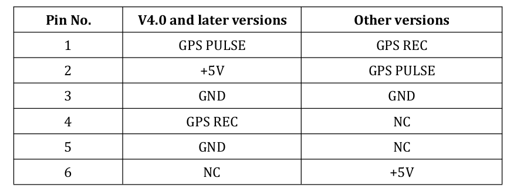

         该接口支持采用`RS232`协议进行通讯与GPS端相连接。**由于没有固定连接线，因此需要手动制作**。其中：`GND`和`TXD`由CGI-410中的`A_RS232`口提供（详见DB9口定义），分别对应激光的`GND`和`GPS REC`，CGI-410中的PPS授时线连接激光的`GPS PULSE`接口，其余部分悬空即可。

         同步线的制作详见附录C。

         | Pin口 | CGI-410端      | Lidar端   |
         | ----- | -------------- | --------- |
         | 1     | PPS授时端口    | GPS PULSE |
         | 2     | 悬空           | 悬空      |
         | 3     | A_RS232中的GND | GND       |
         | 4     | A_RS232中的TXD | GPS REC   |
         | 5     | 悬空           | 悬空      |
         | 6     | 悬空           | 悬空      |

       + **同步模式选择**：

         由于速腾激光雷达默认同步模式无法与华测惯导配合，因此需要对激光雷达的固件进行刷写。（该部分实际操作详见附录C）

         速腾Lidar的时钟同步具有三种授时模式：**这里我们将采用Mode2的方式进行同步**。

         【 Mode 0】：取 PPS 脉冲前一个 GPRMC， LiDAR 端 PPS 上升沿触发同步（对应源 PPS 下降沿）， 需要保证源 PPS 下降沿的稳定性——周期波动满足 1s±100us。 最终同步后的时间满足： RS + 1s + PPS 脉宽 = V（新固件之前的时间同
         步机制）

         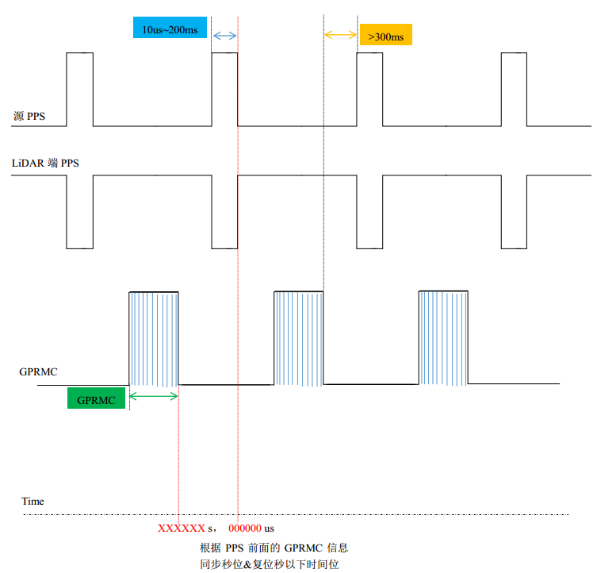

         【 Mode 1】： 取 PPS 脉冲前一个 GPRMC， LiDAR 端 PPS 下降沿触发同步（对应源 PPS 上升沿）， 需要保证源 PPS 上升沿稳定性——周期波动满足 1s±100us。 最终同步后的时间满足： RS + 1s = V。同时此模式下 V4.0 以上 16 线/V2.0以上 32 线表现的同步效果和 V3.3 以下 16 线/V1.7 以下 32 线保持一致。

         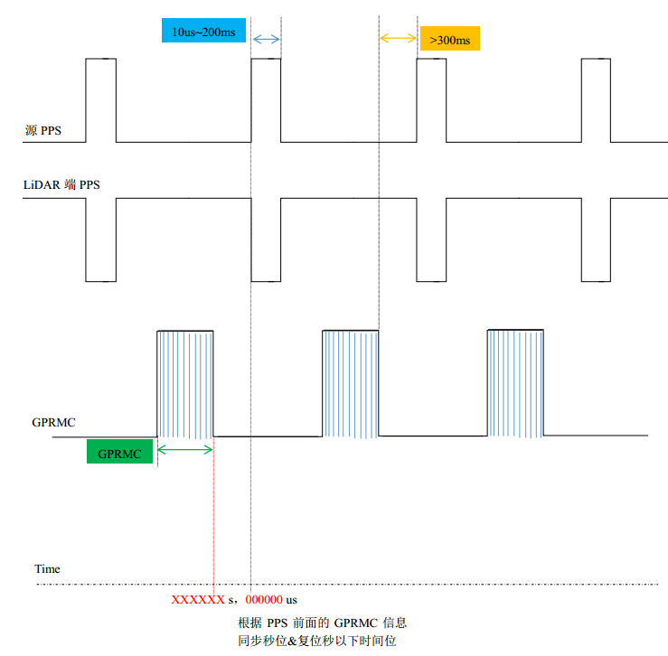

         【 Mode 2】： 取后一个 GPRMC， LiDAR 端 PPS 下降沿触发同步（对应源 PPS 上升沿）， 需要保证源 PPS 上升沿稳定性——周期波动满足 1s±100us。 最终同步后的时间满足： RS = V。

         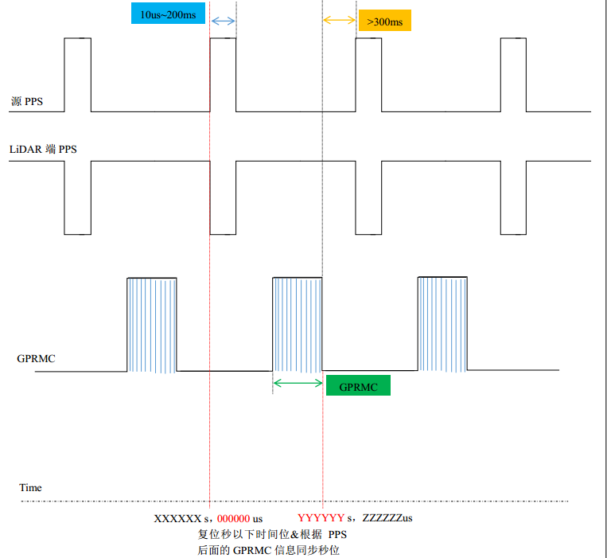

2. **工业级别的同步方式：硬件同步**

   自动驾驶系统中，几乎每个测量设备都有一个自己的时钟源，因此必须统一时钟源，以保证各个设备的时间戳是对齐的。考虑到原子钟的精确性，系统一般选择GNSS作为主时钟源，并对其他设备进行时间同步。注意，这里的时间同步并不是说仅仅同步一次就好，因为钟漂的存在，时间戳必须不断进行矫正。

   考虑到在部分信号不好的地段，如隧道等场景下，GNSS信号会丢失进而无法矫正时间，自动驾驶系统会指定一个晶振频率最高的设备（一般是专门的设备，如果imu或者lidar晶振很高也可能被选择）作为主时钟源，然后根据主时钟进行推断。

   利用硬件同步方案，可以构造一个**触发装置**，在指定的时刻，发送触发信号，让所有的传感器触发成像，减少成像时刻误差。

   + 连接GPS信号和NTP server，确保时钟实现微秒级同步；

   + 设置触发逻辑（如LiDAR正前方的成像相位），同时触发LiDAR和Camera成像；

   + 支持多LiDAR和多Camera，暂不支持Radar和超声波雷达

   + 系统精度更高，可将系统**同步精度控制在5 ms以内**；缺点是丢失一些系统的灵活度和高频数据，camera成像频率原本可以更高的。

     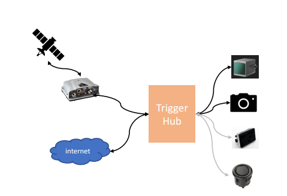

3. **Camera设备的同步**：

   + 与IMU的同步，常见于VIO系统中：
     + imu、相机使用同一个时钟晶振：这样做的好处是不用考虑太多额外的因素，但是要求IMU和相机距离足够接近（这在自动驾驶场景下是不现实的），没有其他干扰，也不需要其他设备进行同步。
     + 常见的硬件同步解决方案：以IMU时钟触发Camera曝光
     + 软同步方法：具体内容详见`VIO的第八讲`
   
   + 与点云进行同步：
     + 常见的硬件同步解决方案：触发装置同时触发成像和曝光。
     + 常见的软件同步解决方案：由于lidar有成熟的硬件同步机制，可以将lidar与系统进行硬件同步，并将lidar点云逐步投影到相机中来，当某一帧能够对齐时候完成补偿。之后，分别在驱动中减去时间戳补偿，可以将这种时间误差补偿到10 ms以下。（详见`多传感器融合感知第一章节`）

### B Apollo中的各个坐标系

在惯性导航中，一般将坐标系分为两类：**惯性坐标系**、**非惯性坐标系**。惯性坐标系包括：日心惯性系、地心惯性系。非惯性坐标系包括：地球坐标系、地理坐标系等。

#### B.1 地心惯性坐标系（i 系， ECI）

惯性坐标系是指坐标轴指向保持不变的坐标系，例如地心惯性坐标系。它具有以下特征：

+ 常用$o_ix_iy_iz_i$表示，原点为地球中心。$o_ix_i$和$o_iy_i$在地球赤道平面内，其中前者指向春分点。$o_iz_i$轴为地球自转轴，指向北极，$o_iy_i$轴沿右手规则确定。（ x，y 轴指向两颗恒星）

+ IMU测量得到的加速度，角速度都是相对于这个坐标系的。

#### B.2 地球坐标系（e系，地心地固坐标系，ECEF）

+ 表示形式为：$o_ex_ey_ez_e$，角标常用*e(earth)*表示。

+ 地球中心为坐标原点*o*，*oz*轴沿地球自转轴方向，*ox*轴是赤道平面和本初子午面的交线（注意本初子午面只有一个），*oy*轴沿右手规则确定。

+ 地球坐标系是和地球固连的，它与地球一起相对惯性坐标系以地球的自转角速度进行转动。

#### B.3 全球地理坐标系统（g系，大地坐标系）

**WGS84坐标系**

Apollo采用的是WGS84（World Geodetic System 1984）作为标准坐标系来表示物体的纬度，经度和高度（LLT）。

+ 表示形式：通过使用该标准坐标系统，我们可以使用2个数字：x坐标和y坐标来唯一的确定地球表面上除北极点之外的所有点，**其中x坐标表示经度（longitude），y坐标表示纬度（latitude）**。

+ WGS84坐标系的坐标原点位于地球的质心，Z轴指向BIHl984.0定义的协议地球极方向[ 指向格林威治子午线（本初子午线）]，X轴指向BIHl984.0的起始子午面和赤道的交点, 在**地球赤道平面内**相互垂直。

+ 经度0.00001度（十万分之一度,0°0'0.036'）,在赤道上对应的地球表面距离约为1米稍多,但在南北极极点上,则是0米.纬度0.00001度在地球表面任意地方对应的地球表面距离都是大约1米稍多。**WGS84椭球体**也经常在转换中被使用。

  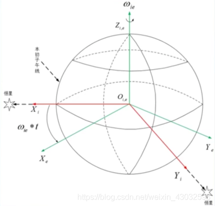

**UTM坐标系**

+ 将**球面经纬度坐标经过投影算法转换成的平面坐标**，即通常所说的XY坐标，单位为**米制**。UTM相当于是**把世界分成了若干个ENU坐标系，每个zone对应一个ENU**。

+ 表示形式：坐标$(x,y)$加上投影带号就能表示地球上的一点。例如，`11U 358657mE 5885532mN`：

  + `11U` 表示位于经度11区，位于纬度U区
  + `358657mE` 表示东向位置为358657 m
  + `5885532mN` 表示北向位置为5885532 m

+ UTM投影坐标使用”等角横轴切割圆柱“模型划分，基于网格的方法进行表示：

  +  经度分区：编号1-60，其中58个区的东西跨度为 6°
  +  纬度分区：编号C-X (不含I,O,共20个区)，每个区的南北跨度为 8°
  +  A，B，Y，Z覆盖南极和北极区
  +  N为第一个北纬带，N之后的字母均为北纬带，N之前的字母均为南纬带

+ 坐标系方向：UTM坐标系原点跟id有关。一个id对应一个原点。以正东方向为x轴正方向（UTM Easting），正北方向为y轴正方向（UTM Northing）。

+ **“WGS84”坐标系的墨卡托投影分度带（UTM ZONE）选择方法**:

  + UTM是由美国制定，因此起始分带并不在本初子午线，而是在180度，因而所有美国本土都处于0－30带内。北京地区位于50带内；
  + 北半球地区，选择最后字母为“N”的带； 
  + 可根据公式计算，`带数=（经度整数位/6）的整数部分+31` 如：江西省南昌新建县某调查单元经度范围`115°35′20″—115°36′00″`， 带数为`115/6+31=50`，选`50N`，即`WGS84 UTM ZONE 50N`。

  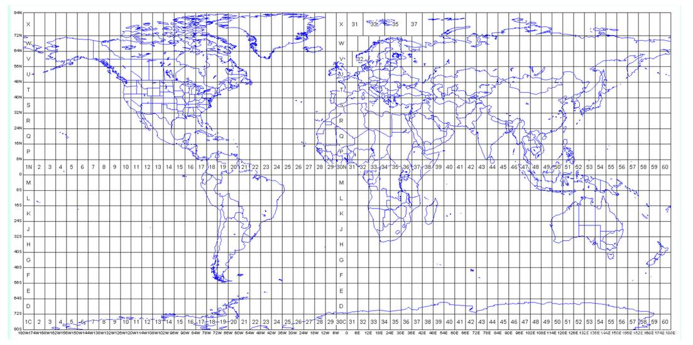

#### B.4 局部地理坐标系统（导航坐标系统，N系）

局部地理坐标系通常使用的有 “东北天”坐标系和“北东地”坐标系。在Apollo系统中，局部坐标系的定义为：东北天坐标系（East-North-Up， ENU）。在惯导和组合导航中，导航坐标系通常选用地理坐标系，两者保持一致。

1. **“东北天”坐标系**：z轴 – 指向上方（和重力线成一条直线）；y轴 – 指向北面；x轴 – 指向东面。在该坐标系下，标准重力表示为：$[0, 0, -9.81]$，静止的物体表示为$[0,0,9.81]$。ENU一般采用三维直角坐标系来描述地球表面，实际应用较为困难，因此一般使用**简化后的二维投影坐标系来描述**（即UTM坐标系）。

   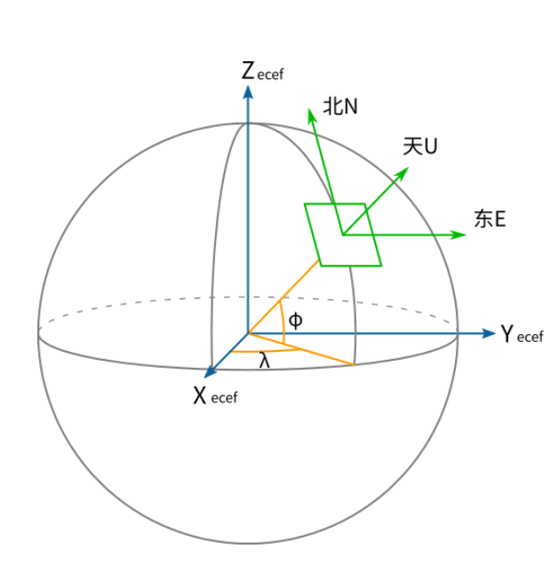

2. **使用`Proj.4`库完成坐标转换**：

   + `Proj.4`库介绍：Proj.4 是开源 GIS 最著名的地图投影库，功能主要有经纬度坐标与地理坐标的转换，坐标系的转换，包括基准变换等。百度Apollo系统中采用了该库作为转换工具。

   + `Proj.4`库常用的几种参数：

     ```c++
     +proj      投影名
     +zone      UTM区域
     +ellps     椭球体名
     +towgs84   3或7参数基准面转换
     +units     m(米)，us-ft（美国测量英尺）
     +no_defs   不要使用/usr/share/proj/proj_def.dat缺省文件
     
     +datum     基准面名
     +lat_0     维度起点
     +lon_0     中央经线
     +k_0       比例因子
     +south     表示南半球UTM区域
     ```

   + 常用`proj-strings`：

     ```c++
     const char *UTM_TEXT = 
     	"+proj=utm +zone=50 +ellps=WGS84 +towgs84=0,0,0,0,0,0,0 +units=m +no_defs";
     const char *WGS84_TEXT = "+proj=latlong +ellps=WGS84";
     ```

     + `+proj=latlong`：表示在WGS84坐标系下
     + `+proj=utm`：表示在utm坐标系下
     + `+ellps=WGS84`：地球模型采用WGS84椭球体
     + `+towgs84=0,0,0,0,0,0,0`：基准面变换可以使用3参数空间变换(地心空间直角坐标系)，或7参数变换(平移 + 旋转 + 缩放)。WGS84与UTM基准一致，无需没有额外变换。
     + `+no_defs`：基准网格转换文件`/usr/local/share/proj/ntv1_can.dat`不会被加载

   + 完成从WGS84到UTM坐标系的转换

     ```c++
     #define ACCEPT_USE_OF_DEPRECATED_PROJ_API_H
     #include <proj_api.h>
     constexpr double DEG_TO_RAD_LOCAL = M_PI / 180.0;
     
     projPJ wgs84pj_source_ = pj_init_plus(WGS84_TEXT);
     projPJ utm_target_ = pj_init_plus(UTM_TEXT);
     double x = ins->position().lon();
     double y = ins->position().lat();
     x *= DEG_TO_RAD_LOCAL;
     y *= DEG_TO_RAD_LOCAL;
     pj_transform(wgs84pj_source_, utm_target_, 1, 1, &x, &y, NULL);
     pj_free(wgs84pj_source_);
     pj_free(utm_target_);
     ```

#### B.5 载体坐标系统

1. **车辆坐标系（B系）**：**右-前-上**（Right-Forward-Up **RFU**）。车辆坐标系的原点在车辆**后轮轴的中心**。z轴 – 通过车顶垂直于地面指向上方；y轴 – 在行驶的方向上指向车辆前方；x轴 – 面向前方时，指向车辆右侧。

   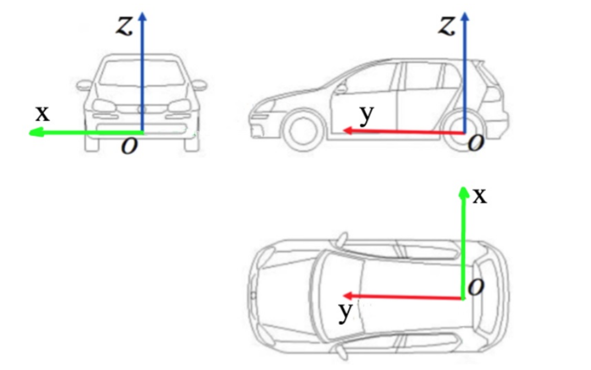

2. **IMU坐标系**：Apollo中，imu坐标系和载体坐标系一致。和载体固定连在一起，和n系有一个旋转关系。IMU坐标系也是各个传感器的父坐标系。

   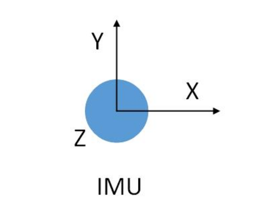

3. **激光坐标系**：Apollo中采用**前-左-上**坐标系（**FLU**）

   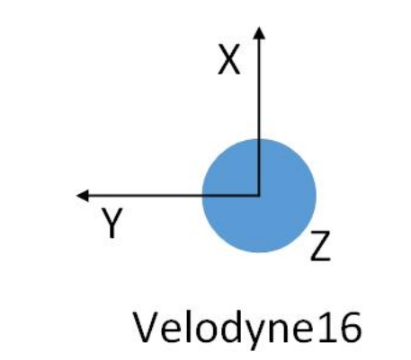

#### B.6 内外参文件的解析

以`lidar16_novatel_extrinsics.yaml`为例：

```yaml
header:
  stamp:
    secs: 1570694831
    nsecs: 0
  seq: 0
  frame_id: novatel
child_frame_id: lidar16
transform:
  rotation:
    x: 0.0
    y: 0.0
    z: 0.7071
    w: 0.7071
  translation:
    x: 0.0
    y: 0.414
    z: 0.897
```

这里的`header.frame_id`类似于ROS系统中的`parent frame` ，`child_frame_id`中类似于ROS系统中`child frame`，他们的关系如下：

+ 从坐标系变换的角度：parent是原坐标系，child是变换后的坐标系，因此存在一个变换矩阵$T^{\text{parent}}_{\text{child}}$。
+ 从坐标系的角度：可以看做child坐标系在parent坐标系下的描述。

### C 同步线制作与固件刷机

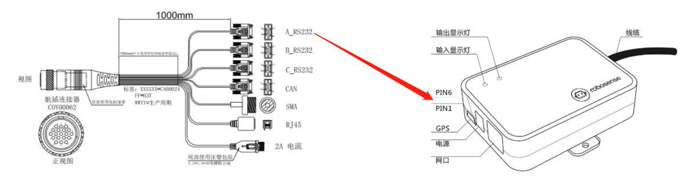

1. **时钟同步方法：**

   组合惯导通过串口A_RS232发布GPRMC数据为Lidar传输GPS时间，串口波特率对应为9600. 

2. **PPS脉冲信号+NMEA消息**: 

   PPS信号以1hz的频率向Lidar发送整秒触发信号，一旦接收到GPS发来的PPS信号，则会对Lidar的时间整秒以下的时间进行清零，整秒及以上则是通过串口A发来的包含时间的GPRMC数据进行幅值来完成对Lidar的授时操作。

3. **制作材料准备：**

   PPS信号线×1，DB9单公头串口线×1, SH1.0-6P接线端子，电烙铁，热缩管，剥线钳，绝缘胶带

4. **接线端口定义：** 

   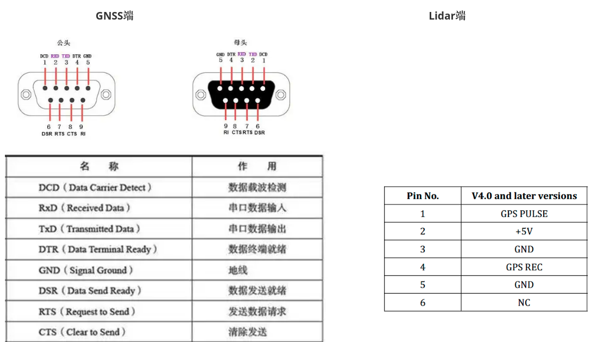

5. **接线操作：**

   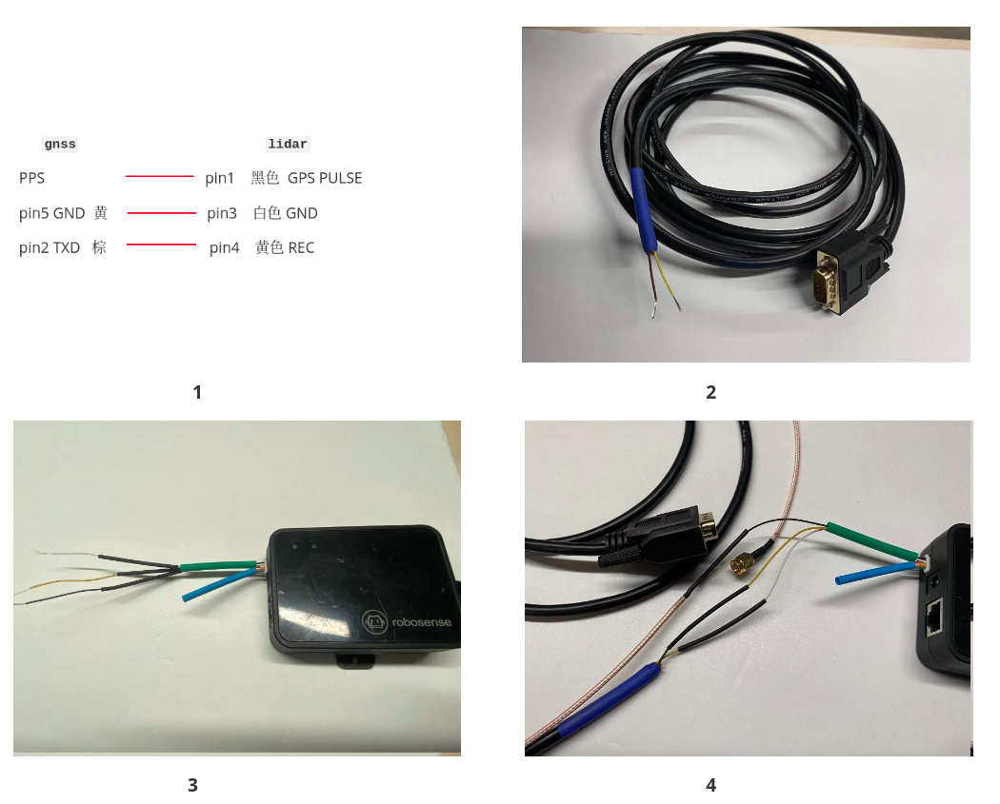

6. **Lidar固件刷机**

     通过固件信息配置的方法，对Lidar的同步模式进行设定，根据速腾雷达的说明手册**`时间同步模式说明`**，需要将Lidar的同步模式设定为模式2,具体操作参考传感器说明书**`手册_速腾16线 ` 附录C**进行对同步模式进行配置。

     
