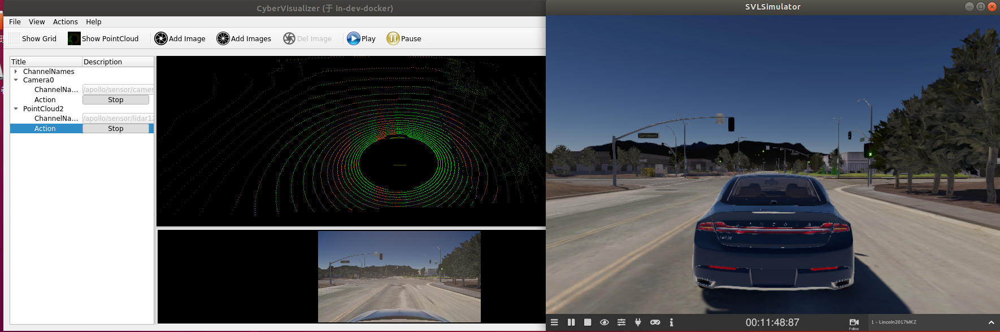
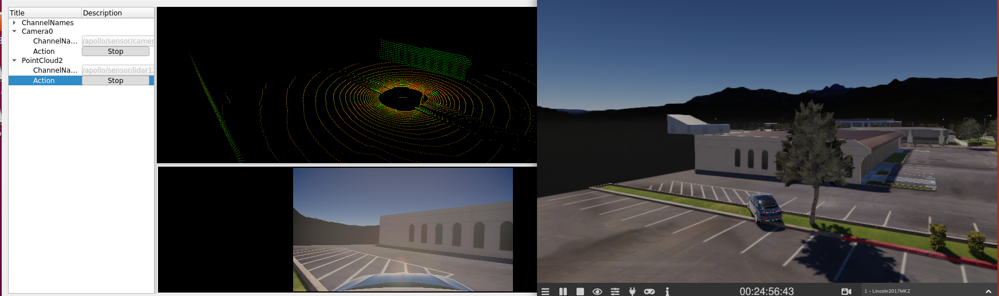
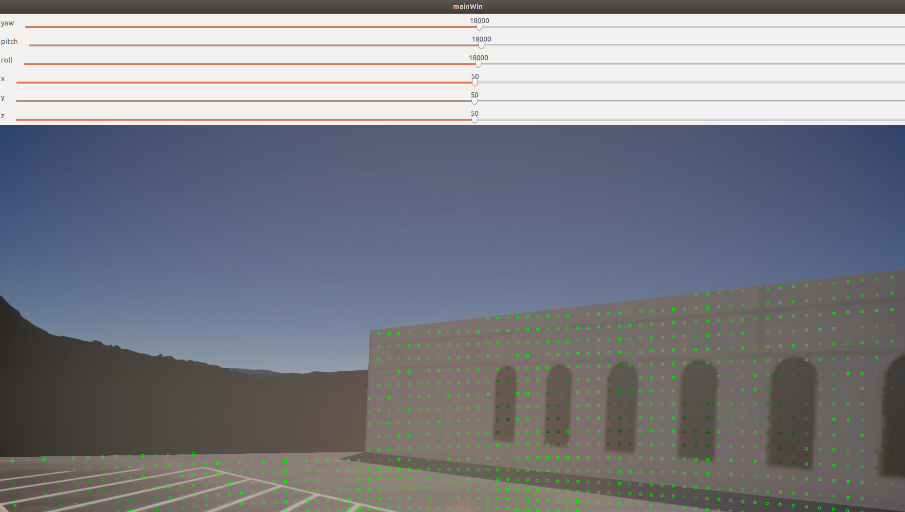
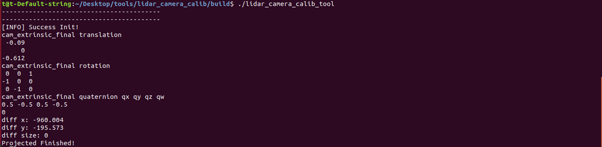

## Apollo&SVL联合仿真（二）标定

### 1 简介

在Apollo系统中，已经默认给出了有关Lincon2017MKZ汽车相关的参数，包括各种传感器的内外参数以及汽车的油门刹车系数表。但在实车中，由于安装误差以及传感器各自的参数不同导致这些参数均需要我们进行标定来获取，构建出一个符合汽车自身的TF树。相机的内参标定包含畸变系数以及焦距大小，以深蓝学院的小车为例，传感器之间的外参包含Lidar-IMU,Camera到Lidar之间的变换。拿到这些外参后，方便我们后续的定位建图以及感知融合等，以下图为例，这是外参好坏所建立的NDT地图的差异，场景-腾讯众创空间A座停车场附近。


## 2 Lidar-Camera标定

### 2.1 程序环境安装

- 在`home`跟目录下，cd至Lib文件夹内，运行build_env.sh，安装所需的依赖。

  ```bash
  bash build_env.sh
  ```

- 在`home`跟目录下，cd至tool文件夹下，对我们的传感器标定程序进行编译。

  ```
  mkdir build && cd build
  cmake ..
  make -j3
  make install
  ```

### 2.2  传感器数据收集

- 参照文档（一）启动apollo和svl_simulator在cyber_visualizer下检查数据接受是否正常

  

- 寻找标定场地，将汽车开至有墙角的建筑物附近来进行标定，如下图所示

  

- 录制数据包，录制几秒钟后`Ctrl+C`结束，`*. record.*`文件将保存在`apollo`根目录下

  ```
  cyber_recorder record -a
  ```

  在`\apollo\data\bag`目录下新建`calibration`文件夹，将录制好的bag包文件粘贴进来。

### 2.3 数据解析

#### 2.3.1 图像数据解析

数据解析用到了`apollo`自带的解析程序，将我们的录制包中的`image`保存成`jpeg`格式的图片

- 修改数据解析的参数配置文件，在`/apollo/modules/tools/record_parse_save`文件目录下，打开`parser_params.yaml`文件
  - `filepath:` 改为我们存放数据包的文件夹`/apollo/data/bag/calbration`
  - `parse:` 选为`camera`
  - `camera`的`channel_name`: 选为我们实际压缩图像的`topic`名，如`/apollo/sensor/camera/front_6mm/image/compressed`


- 执行数据解析程序 

  ```
  ./bazel-bin/modules/tools/record_parse_save/record_parse_save
  ```

  解析完成后，会将图像保存在我们数据包的上一级目录下文件夹下`data_camera_6mm_front`。

#### 2.3.2 Lidar数据解析

lidar的数据解析需要借助MSF下的数据解析程序，由于仿真数据发过来的数据跟其消息的大小不一致，我们需要对apollo内部程序稍作更改即可

- 打开`/apollo/modules/localization/msf/local_tool/data_extraction/pcd_exporter.cc`,在程序的第61行`void PCDExporter::WritePcdFile(const std::string &filename, const drivers::PointCloud &msg) `函数内，将`    cloud.width，cloud.height `做如下改写。

  ```c++
    bool bsimulator = true;
    if(bsimulator == true)
    {
      std::cout << "msg.size: "<< msg.point_size() << "msg.width() "<< msg.width()<< " msg.height() "<<msg.height()<< std::endl;
      cloud.width = msg.point_size();
      cloud.height = 1;
    }
    else{
      cloud.width = msg.width();
      cloud.height = msg.height();
    }
  ```

  重新编译apollo程序

  ```bash
  ./apollo.sh build_opt localization
  ```

- 添加数据解析脚本

  在/apollo/sripts文件夹下新建`lidar_parse.sh`脚本文件，copy以下程序

  ```bash
  #! /bin/bash
  if [ $# -lt 3 ]; then
    echo "Usage: msf_simple_map_creator.sh [records folder][output folder]  [extrinsic_file] [lidar_type]"
    exit 1
  fi
  
  DIR="$(cd "$(dirname "${BASH_SOURCE[0]}")" && pwd)"
  cd "${DIR}/.."
  
  source "${DIR}/apollo_base.sh"
  
  GNSS_LOC_TOPIC="/apollo/localization/msf_gnss"
  LIDAR_LOC_TOPIC="/apollo/localization/msf_lidar"
  FUSION_LOC_TOPIC="/apollo/localization/pose"
  ODOMETRY_LOC_TOPIC="/apollo/sensor/gnss/odometry"
  
  GNSS_LOC_FILE="gnss_loc.txt"
  LIDAR_LOC_FILE="lidar_loc.txt"
  FUSION_LOC_FILE="fusion_loc.txt"
  ODOMETRY_LOC_FILE="odometry_loc.txt"
  
  IN_FOLDER=$1
  OUT_MAP_FOLDER=$2
  EXTRINSIC_FILE=$3
  LIDAR_TYPE=${4:-lidar128}
  
  PARSED_DATA_FOLDER="$OUT_MAP_FOLDER/parsed_data"
  CLOUD_TOPIC="/apollo/sensor/lidar128/compensator/PointCloud2"
  
  function data_exporter() {
    local BAG_FILE=$1
    local OUT_FOLDER=$2
    /apollo/bazel-bin/modules/localization/msf/local_tool/data_extraction/cyber_record_parser \
      --bag_file $BAG_FILE \
      --out_folder $OUT_FOLDER \
      --cloud_topic $CLOUD_TOPIC \
      --gnss_loc_topic $GNSS_LOC_TOPIC \
      --lidar_loc_topic $LIDAR_LOC_TOPIC \
      --fusion_loc_topic $FUSION_LOC_TOPIC \
      --odometry_loc_topic $ODOMETRY_LOC_TOPIC
  }
  function poses_interpolation() {
    local INPUT_POSES_PATH=$1
    local REF_TIMESTAMPS_PATH=$2
    local EXTRINSIC_PATH=$3
    local OUTPUT_POSES_PATH=$4
    /apollo/bazel-bin/modules/localization/msf/local_tool/map_creation/poses_interpolator \
      --input_poses_path $INPUT_POSES_PATH \
      --ref_timestamps_path $REF_TIMESTAMPS_PATH \
      --extrinsic_path $EXTRINSIC_PATH \
      --output_poses_path $OUTPUT_POSES_PATH
  }
  
  cd $IN_FOLDER
  mkdir -p $OUT_MAP_FOLDER
  mkdir -p $PARSED_DATA_FOLDER
  for item in $(ls -l *.record* | awk '{print $9}'); do
    SEGMENTS=$(echo $item | awk -F'.' '{print NF}')
    DIR_NAME=$(echo $item | cut -d . -f ${SEGMENTS})
    DIR_NAME="${PARSED_DATA_FOLDER}/${DIR_NAME}"
    mkdir -p ${DIR_NAME}
  
    data_exporter "${item}" "${DIR_NAME}"
    poses_interpolation "${DIR_NAME}/pcd/${ODOMETRY_LOC_FILE}" "${DIR_NAME}/pcd/pcd_timestamp.txt" "${EXTRINSIC_FILE}" "${DIR_NAME}/pcd/corrected_poses.txt"
  
  done
  
  echo "Done."
  ```

- 运行数据解析脚本文件

  ```bash
  bash scripts/lidar_parse.sh /apollo/data/bag/calibration /apollo/data/bag/calibration /apollo/modules/calibration/data/Lincoln2017MKZ/velodyne_params/velodyne128_novatel_extrinsics_example.yaml  lidar128
  
  ```

   在`calibration`文件夹下会生成`parsed_data`，里面存放了Lidar 点云的pcd文件，用于进行标定。

  

  在apollo的docker容器内运行pcl_viewer对点云数据进行查看

  ```bash
  pcl_viewer data/bag/calibration/parsed_data/00000/pcd/1.pcd
  ```

  

#### 2.3.3 lidar-camera标定

由于数据采集过程中，我们是对着墙角静止采集，故我们从解析的`image`和`lidar_pointcloud`中任选一帧用于标定，标定工具深蓝学院开源的标定工具进行标定，其基本原理为将Lidar采集的点云通过Lidar->Imu之间的外参进行变换后，经camera的内参变换投影至图像上，观察点云与图像之间的匹配度。

- 任选一帧采集数据，拷贝至标定工具下的`test`文件夹下，并重命名为`1.jpeg`和`1.pcd`

- 将`/apollo/modules/calibration/data/Lincoln2017MKZ/camera_params/`下的相机参数拷贝之`test`文件夹下

- 运行标定程序

  ```bash
  ./lidar_camera_calib_tool
  ```

  

  如图所示，Lidar的点云强度到墙的边为止，我们可以拿墙的边界和窗户在作为他们之间的参考，来进行对选旋转的`yaw、pitch、row`以及平移`x、y、z`进行调节，最纵标定结果会在终端进行打印。

  

## 3 Lidar-Gnss标定

Lidar到Ins的标定，同样可以理解为点云拼接的过程，我们将代码写在`/apollo/modules/localization/msf/local_tool/map_creation/`目录下，大约200行的一个程序`lidar_camera_calib.cc`

### 3.1 传感器数据收集

- 参照文档（一）启动apollo和svl_simulator在cyber_visualizer下检查数据接受是否正常

- 寻找标定场地，将汽车开至有墙角的建筑物附近来进行标定，如下图所示

- 绕建筑物墙体周围转一圈，进行数据采集

  ```bash
  cyber_recorder record -a -k /apollo/sensor/camera/front_12mm/image/compressed /apollo/sensor/camera/front_6mm/image/compressed -i 600
  ```

  <video src="Apollo&amp;SVL联合仿真（二）标定.assets/lidar_gnss.mp4"></video>

### 3.2 数据解析

- 在`/apollo/data/bag/`目录下下新建`lidar_ins_calibration`文件夹，将录制的数据包粘贴进去。

- 采用2.3.2的lidar数据解析的脚本文件进行数据解析来获取点云的pcd文件已经通过插值来获得对应的位姿。

```bash
bash scripts/lidar_parse.sh /apollo/data/bag/calibration /apollo/data/bag/lidar_ins_calibration lidar128
```

### 3.3 Lidar-Ins标定

- 在`apollo`的`docker`容器内运行我们的标定工具

```bash
./bazel-bin/modules/localization/msf/local_tool/map_creation/lidar_ins_calib --pcd_folder /apollo/data/bag/lidar_ins_calibration/parsed_data/00000/pcd --pose_file /apollo/data/bag/lidar_ins_calibration/parsed_data/00000/pcd/corrected_poses.txt --extrinsic_path /apollo/modules/calibration/data/Lincoln2017MKZ/velodyne_params/velodyne128_novatel_extrinsics_example.yaml 
```

> note：这里有用到IMU进行插值，IMU发过来的measurement_time存在延迟的情况，不过还好，在进行插值的时候采用的是odometry的时间戳，他的时间戳没有问题，大家放心使用

在标定过程中，建议大家最好是绕着一堵墙进行旋转，目的就是在进行标定过程中，将墙体作为参照物，尽可能的将墙体的点云拼的越薄越好，成一条线。在实车测试中我们可以通过尺子进行测量来他们之间的平移变换，在标定工具中来对旋转进行标定，主要是yaw角。

<video src="Apollo&amp;SVL联合仿真（二）标定.assets/lidar_ins.mp4"></video>

标定完成后，结果会在终端进行显示。


