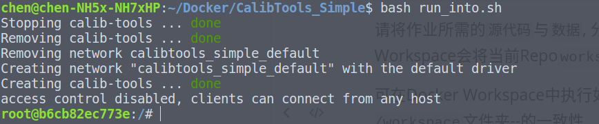
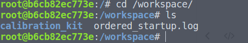

# Docker Environment Build 

## 1 安装配置Docker以及Docker-Compose

在开始使用前，首先需要在本地配置`Docker`以及`Docker-Compose`环境.

### 1.1 安装Docker

请参考[Docker官方文档](https://docs.docker.com/engine/install/ubuntu/)完成`Docker`环境的安装

安装完成后, 还需要进行`如下操作`, 以保证环境的易用性:

#### 1.2 将当前用户加入Docker Group

为了能在非`sudo`模式下使用`Docker`, 需要将当前用户加入`Docker Group`.

* 执行命令:
  
    ```bash
    sudo usermod -aG docker $USER
    ```

* **为了使上述变更生效，请先Logout，再Login**

### 1.3 安装Docker-Compose

`Docker-Compose`是基于Docker解决方案的Orchestrator. 

请参考[Docker Compose官方文档](https://docs.docker.com/compose/install/)完成`Docker-Compose`环境的安装

## 2 获取镜像

在安装完成`Docker`以及`Docker-Compose`之后，需要获得所需镜像.

```bash
# login to Sensor Fusion registry -- default password -- shenlan@2017
docker login --username=shenlanxueyuan
# download images:
docker pull shenlanxueyuan/calib-tools:v0
```

如果有需要对环境进行有修改，可以通过本地编译的方式生成镜像。执行脚本文件：

```bash
bash build_docker.sh
```

## 3 启动实例

运行脚本文件：

```shell
bash run_into.sh
```

注意到终端进入了`root@<id>`则表明成功。



## 4 编译作业

请将作业所需的`源代码`与`数据`, 分别放到当前Repo`workspace`目录下. Docker Workspace会将当前Repo`workspace`文件夹映射到Docker Instance`/workspace`目录下. 

可在Docker Workspace中执行如下命令, 确保两者--`当前Repo workspace文件夹`与`Docker Instance /workspace`文件夹--的一致性

```bash
cd /workspace/
ls
```



------------------------

## 常见问题

1. Docker运行时默认用户为`root`, 运行过程中可能导致`当前Repo workspace文件夹`的User以及Group变更为`root`, 从而使本地文件IO操作因`Permission Denied`失败. 解决方案: 使用chown命令, 变更User-Group:

   ```bash
   sudo chown [CURRENT_USER]:[CURRENT GROUP] workspace
   ```

   
